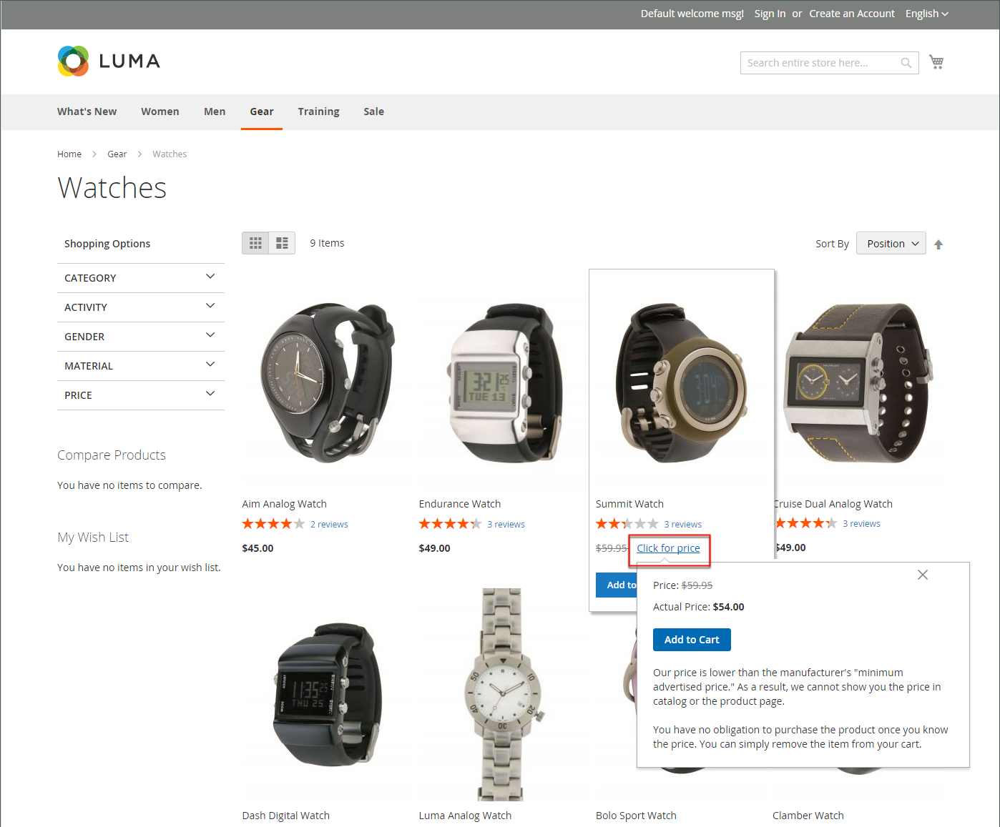
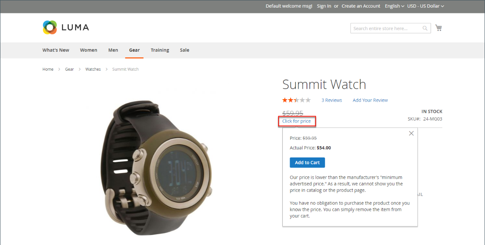
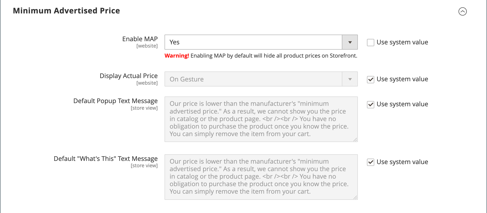
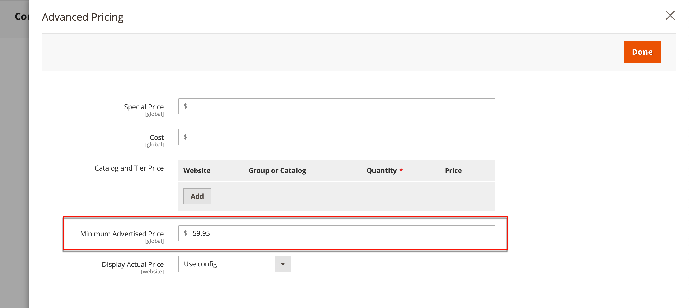

# Minimum Advertised Price

Merchants are sometimes prohibited from displaying a price that is lower than the manufacturer's suggested retail price (MSRP). Minimum Advertised Price (MAP) gives you the ability to remain in compliance with the manufacturer's requirements while offering your customers a better price. Because requirements differ from one manufacturer to another, you can configure your store to prevent the display of your actual price on pages where it is not allowed to appear according to the terms of the manufacturer

The MAP feature adds a dedicated "Click for Price" button instead of the regular product price. Therefore, if the price in your store is below the minimum set price for that product, the price is either not displayed, or the list/market price is displayed with a strikethrough to emphasize that your price is lower. If the buyer clicks the "Click for Price" button, only then does the actual price at which you are selling the product become visible.

Additionally, the MAP feature allows you to suggest some improvements. For example, when a customer adds such a product to their cart, they are not redirected to the cart, and instead there are offers displayed that allow the buyer to:

- Remove an item from the cart (this can be done if the buyer just wants to clarify the price and has not yet made a purchase decision)

- Leave it in their shopping cart and keep shopping

- Proceed to checkout

## MAP logic

For products with prices that depend on a selected option (such as custom options or simple products with their own SKUs and stock management), the following logic is applied, according to the product type and price setting. The actual price is used by order management, customer management tools, and reports.

## Using MAP with product types

|Product type|Description|
|--- |--- |
|[Simple](product-create-simple.md), [Virtual](product-create-virtual.md)|The actual price does not automatically appear on catalog list and product pages, but is included only according to the [!UICONTROL Display Actual Price] setting. Custom option prices appear normally.|
|[Grouped](product-create-grouped.md)|The prices of associated simple products do not automatically appear on catalog list and product pages, but are included only according to the [!UICONTROL Display Actual Price] setting.|
|[Configurable](product-create-configurable.md)|The actual price does not automatically appear on catalog list and product pages, but is included only according to the [!UICONTROL Display Actual Price] setting. Option prices appear normally.|
|[Bundle](product-create-bundle.md) (with fixed price)|The actual price does not automatically appear on catalog pages, but is included only according to the [!UICONTROL Display Actual Price] setting. The prices of bundle items appear normally. MAP is not available for bundle products with dynamic pricing.|
|[Downloadable](product-create-downloadable.md)|The actual price does not automatically appear on  catalog list and product pages, but is included only according to the [!UICONTROL Display Actual Price] setting. The price associated with each download link appears normally.|

{style="table-layout:auto"}

## Using MAP with price settings

| Price setting | Description |
|--- |--- |
| Main Price | When MAP is applied to the main price, the prices of options, bundle items, and associated products (which add or subtract from the main price) appear normally. |
| Associated Product Price | If a product does not have a main price, and its price is derived from the associated product prices (such as in a grouped product), the MAP settings of the associated products are applied. |
| [MSRP](product-price-minimum-advertised.md) | If a product in the cart has the Manufacturer's Suggested Retail Price (MSRP) specified, the price is not crossed-out. |
| [Tier Price](product-price-tier.md) | If tier pricing is set, the tier pricing message is not displayed in the catalog. On the product page a notification is displayed that indicates that the price can be lower when ordering more than a certain quantity, but the discount is displayed in percentages only. For associated products of a grouped product, the discounts are not displayed on the product page. The tier price appears according to the Display Actual Price setting. |
| [Special Price](product-price-special.md) | If the Special price is specified, the special price is displayed according to the Display Actual Price setting. |

## MAP configuration

The Minimum Advertised Price (MAP) feature is not enabled by default. If you want to add this capability to your store, you must enable it and configure the MAP settings for your products. The MAP settings can be applied to all products in your catalog or configured for specific products. When MAP is enabled globally, all product prices in the storefront are hidden from view. There are a variety of configuration options that you can use to remain in compliance with the terms of your agreement with the manufacturer, while still offering your customers a better price.

<!-- zoom -->

On the global level, you can enable or disable MAP, apply it to all products, define how the actual price is displayed, and edit the text of the related messages and information tips that appear in the store.

When MAP is enabled, the product-level MAP settings become available. You can apply MAP to an individual product by entering the MSRP and choosing how you want the actual price to appear in the store. Product-level MAP settings override the global MAP settings.

<!-- zoom -->

### Step 1: Enable MAP for the store view

1. On the _Admin_ sidebar, go to **[!UICONTROL Stores]** > _[!UICONTROL Settings]_ > **[!UICONTROL Configuration]**.

1. If applicable, set **[!UICONTROL Store View]** at the upper-right corner to the view where the configuration applies.

1. In the left panel, expand **[!UICONTROL Sales]** and choose **[!UICONTROL Sales]** underneath.

1. Expand  the _[!UICONTROL Minimum Advertised Price]_ section.

1. If necessary, set **Enable MAP** to `Yes`.

   <!-- zoom -->
   
   For more information about these configuration options, see [_Minimum Advertised Price_](https://docs.magento.com/user-guide/configuration/sales/sales.html#minimum-advertised-price) in the _Configuration Reference_.

### Step 2: Configure the MAP settings

Use one of the following methods to configure the MAP settings:

#### Method 1: Configure MAP for all products

1. To determine when and where you want the actual price to be visible to customers, do the following:

   - To change the default value, deselect the **[!UICONTROL Use system value]** checkbox.

   - Set **Display Actual Price** to one of the following:
      - `In Cart`
      - `Before Order Confirmation`
      - `On Gesture (on click)`

1. Enter the text that you want to appear in the **[!UICONTROL Default Popup Text Message]**.

1. Enter any additional explanation that you want to appear in the **[!UICONTROL Default "What's This" Text Message]**.

1. When complete, click **[!UICONTROL Save Config]**.

#### Method 2: Configure MAP for a single product

1. On the _Admin_ sidebar, go to **[!UICONTROL Catalog]** > **[!UICONTROL Inventory]** > **[!UICONTROL Products]**.

1. Open the product in **[!UICONTROL Edit]** mode.

1. In the left panel, expand **[!UICONTROL Advanced Settings]** and choose **[!UICONTROL Advanced Pricing]**.

   <!-- zoom -->

1. Enter the **[!UICONTROL Manufacturer's Suggested Retail Price]** (MSRP).

   In this example, the product price is $54.00, and the MSRP is 59.95.

1. Set **[!UICONTROL Display Actual Price]** to one of the following:

   - `Use config` - (Default) Applies the MAP configuration setting. |
   - `On Gesture` - Displays the actual product price in a popup when the customer clicks the _Click for price_ or _What's this?_ link.
   - `In Cart` - Displays the actual product price in the shopping cart.
   - `Before Order Confirmation` - Displays the actual product price at the end of the checkout process, just before the order is confirmed.

   >[!NOTE]
   >
   >The [!UICONTROL Manufacturer's Suggested Retail Price] and [!UICONTROL Display Actual Price] fields appear only when [Minimum Advertised Price](https://docs.magento.com/user-guide/configuration/sales/sales.html) is enabled in the configuration.

### Step 3: Save the configuration

When complete, click **[!UICONTROL Done]** and then **[!UICONTROL Save]**.
