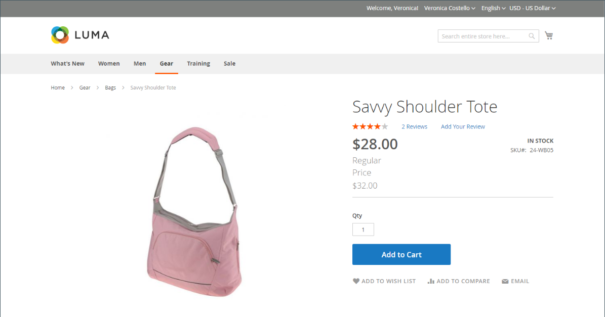
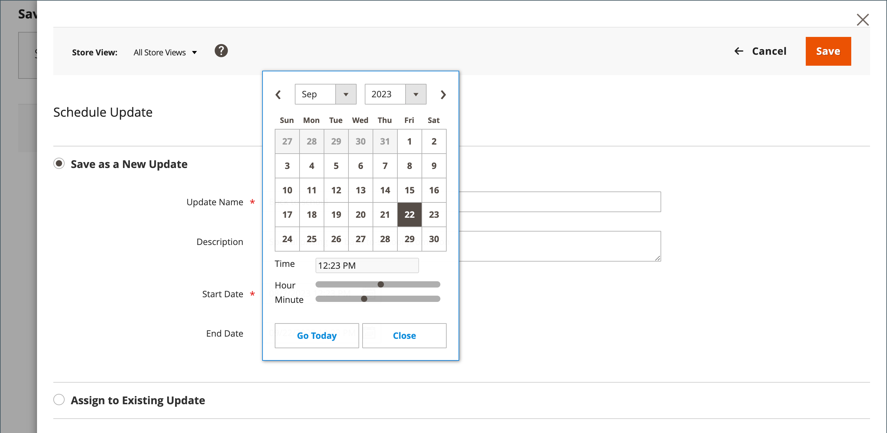
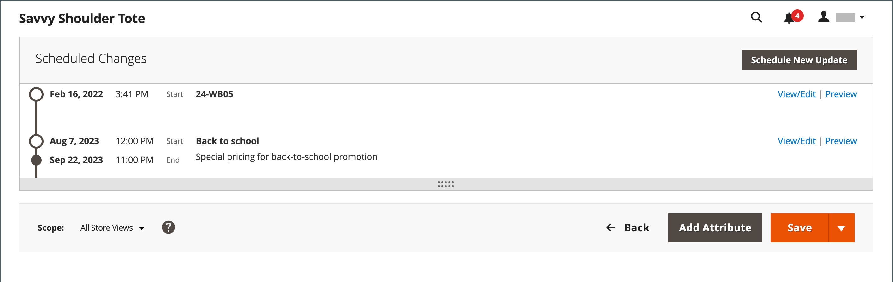
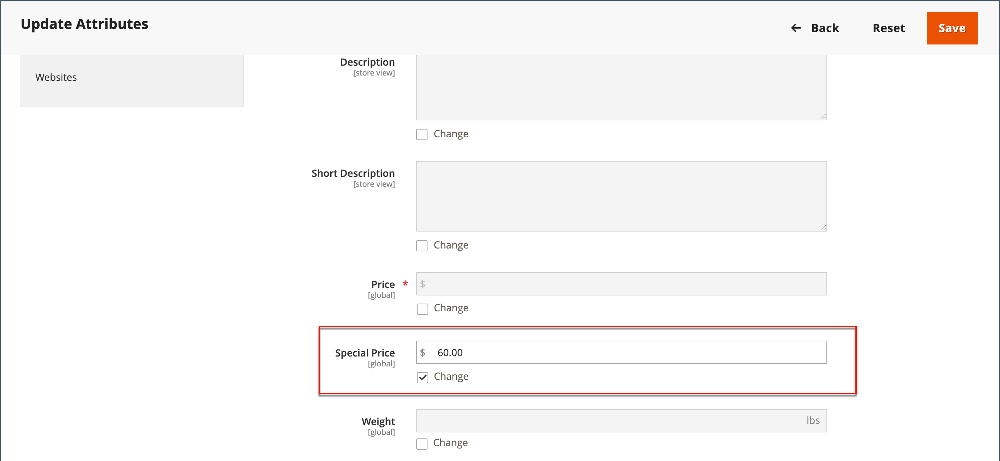
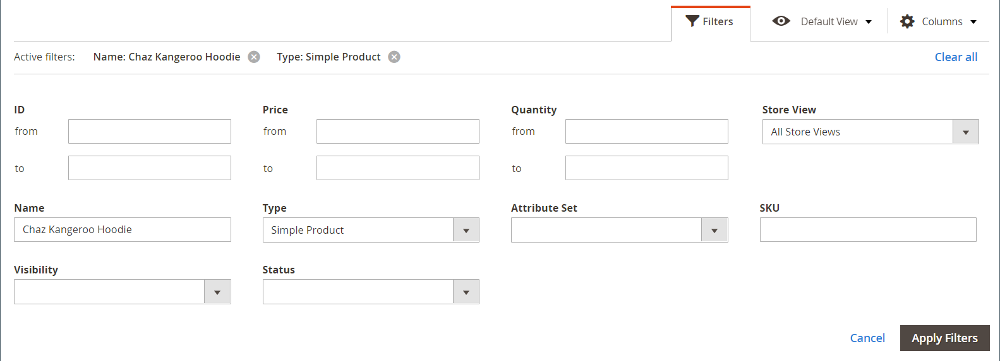
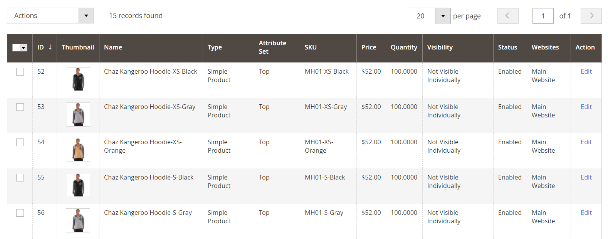
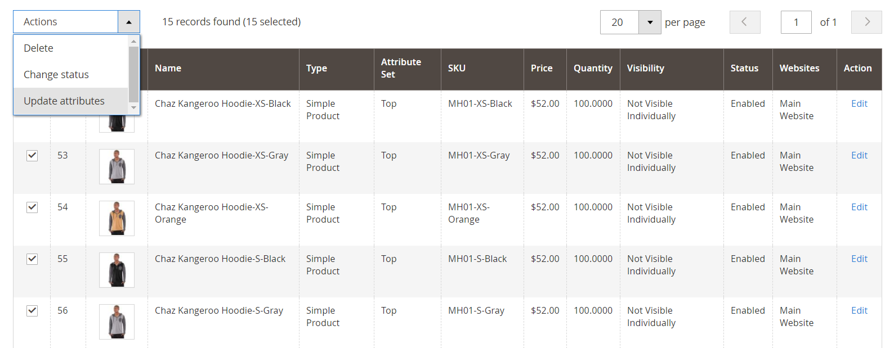
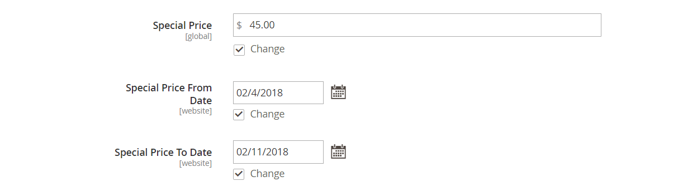
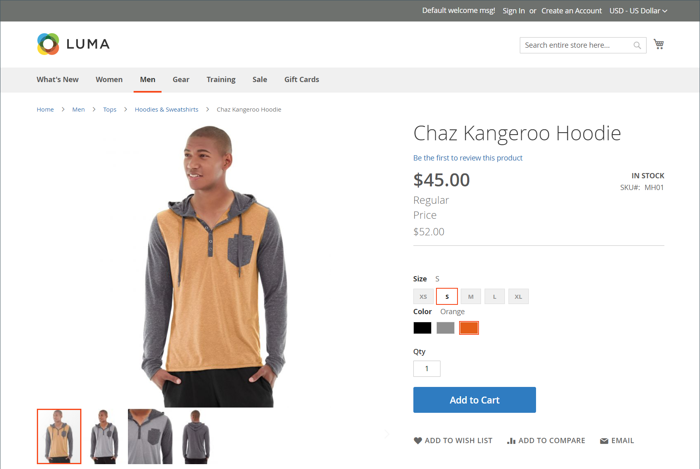

# Special Price

A special price can be offered for a designated time period. During the specified time period, the special price appears instead of the regular price, followed by a notation that shows the regular price.

<!-- zoom -->

## Apply special price to an individual product

You can easily set a special price for a single product in the catalog.

### Use a scheduled update

{{ee-feature}}

Adobe Commerce includes support for [Scheduled Updates](../content-design/content-staging-scheduled-update.md). Use these promotional tools to apply a special price to a specific product for a specified time period.

1. Open the product in edit mode.

1. Click **[!UICONTROL Scheduled Update]**.

1. For **Update Name**, enter a name for the special price promotion.

1. Enter a brief **[!UICONTROL Description]**.

1. Use the **Calendar** (  ) to choose the **[!UICONTROL Start Date]** and **[!UICONTROL End Date]** for the special price promotion.

   You can use the **[!UICONTROL Hour]** and **[!UICONTROL Minute]** sliders to choose the start and end time, as well. Click **[!UICONTROL Close]** when the start and end are set.

   <!-- zoom -->

1. Scroll down to the _Price_ field, click **[!UICONTROL Advanced Pricing]**, and enter the amount of the **[!UICONTROL Special Price]**.

   <!-- zoom -->

1. When complete, click **[!UICONTROL Done]** and then **[!DNL Save]**.

   In the storefront, the special price should appear in both catalog listing and on the product page.

   The _[!UICONTROL Scheduled Change]_ appears at the top of the page.

   <!-- zoom -->

### Use a simple start and end date

{{ce-feature}}

Magento Open Source includes simple start and end date options in the Advanced Pricing options.

1. Open the product in edit mode.

1. Scroll down to the _[!UICONTROL Price]_ field, click **[!UICONTROL Advanced Pricing]**, and enter the **[!UICONTROL Special Price]** amount.

1. Use the _Calendar_ (  ) to choose the **[!UICONTROL Start Date]** and **[!UICONTROL End Date]** for the special price promotion.

   The special price goes into effect immediately after midnight at the beginning of the start date (00:01) and continues until just before midnight (23:59) on the day before the end date.

   <!-- zoom -->

1. When complete, click **[!UICONTROL Done]** and then **[!UICONTROL Save]**.

   In the storefront, the special price should appear in both catalog listing and on the product page.

## Apply a special price to multiple products

You can also assign a special price to multiple products, such as multiple variations of a [configurable product](product-create-configurable.md).

### Set a special price for selected products

{{ee-feature}}

The following example shows how to assign the same special price to multiple product variations of a configurable product in Adobe Commerce.

1. On the _[!UICONTROL Products]_ page, click **[!UICONTROL Filters]** and enter the **[!UICONTROL Name]** of the configurable product.

1. Set **Type** to `Configurable Product` and click **Apply Filters**.

1. If you want to assign the same special price to all products, set the control in the header of the first column to `Select All`.

   As an alternative, you can select the checkbox of each product that you want to include.

1. Set the **Actions** control to `Update attributes`.

1. Scroll down to the _[!UICONTROL Special Price]** field and select the **Change** checkbox below the _[!UICONTROL Special Price]** field and enter the special price that you want to offer.

   <!-- zoom -->

1. When complete, click **[!UICONTROL Save]**.

The special price available in the store appears in catalog listings and on the product page. For a configurable product, the regular price also appears on the product page when the options are chosen.

### Set a special price and date range for selected products

{{ce-feature}}

The following example shows how to assign the same special price to multiple product variations of a configurable product in Magento Open Source.

1. On the _Admin_ sidebar, go to **[!UICONTROL Catalog]** > **[!UICONTROL Products]**.

1. Click **[!UICONTROL Filters]**.

1. Enter the **[!UICONTROL Name]** of the configurable product.

1. Set **[!UICONTROL Type]** to `Simple Product`.

   <!-- zoom -->

1. Click **[!UICONTROL Apply Filters]**.

   The grid lists all simple products that are associated as variations of the configurable product.

   <!-- zoom -->

1. If you want to assign the same special price to all products, set the control in the header of the first column to `Select All`.

   As an alternative, you can select the checkbox of each product that you want to include.

1. Set the **[!UICONTROL Actions]** control to `Update attributes`.

   <!-- zoom -->

1. Scroll down to the _[!UICONTROL Special Price]** field and do the following:

   - Select the **[!UICONTROL Change]** checkbox below the _[!UICONTROL Special Price]** field and enter the special price that you want to offer.

   - Select the **[!UICONTROL Change]** checkbox below the _Special Price From Date_ field, click the _Calendar_ (  ), and choose the first date of the special price promotion.

      The special price goes into effect immediately after midnight at the beginning of the start date (00:01) and continues until just before midnight (23:59) on the day before the end date.

   - Select the **[!UICONTROL Change]** checkbox below the _Special Price To Date_ field, click the _Calendar_ (  ), and choose the last date of the special price promotion.

   <!-- zoom -->

1. When complete, click **[!UICONTROL Save]**.

   A message indicates how many records were updated with the special price.

   The special price becomes available in the store on the date specified, and appears in catalog listings and on the product page. For a configurable product, the regular price also appears on the product page when the options are chosen.

   <!-- zoom -->

## Testing

If the special price does not appear correctly in the storefront on both the catalog listing and product pages, clear your browser cache:

1. On the _Admin_ sidebar, go to **[!UICONTROL System]** > **[!UICONTROL Cache Management]**.

1. Click **[!UICONTROL Flush Magento Cache]**.

>[!NOTE]
>
>The **_final_** product price is calculated as the **_minimum_** relevant price, using the following formula:  `Final Price=Min(Regular(Base) Price, Group(Tier) Price, Special Price, Catalog Price Rule) + Sum(Min Price per each required custom option)`

>[!NOTE]
>
>**_Fixed Price_** product Customizable Options are _not_ affected by Group Price, Tier Price, Special Price, or Catalog Price rules.
