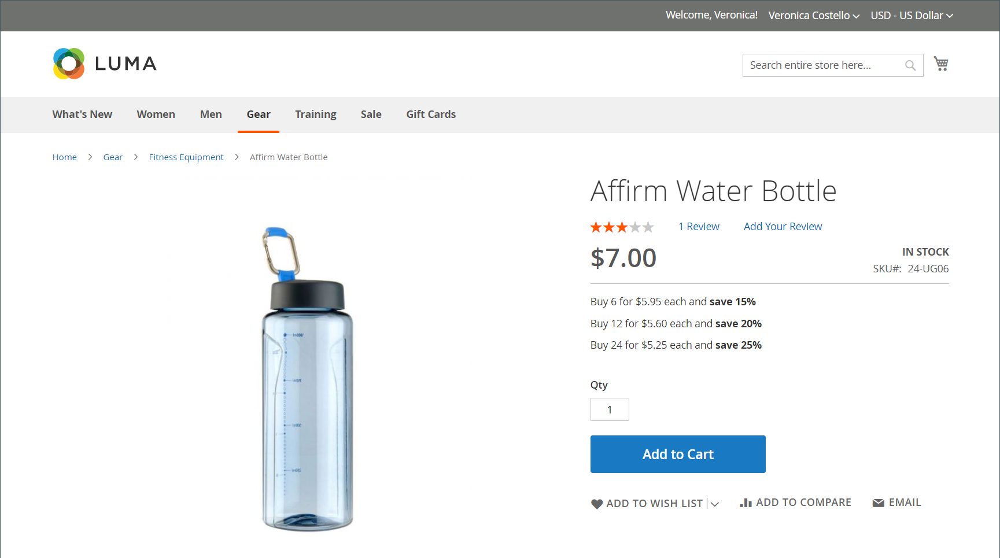
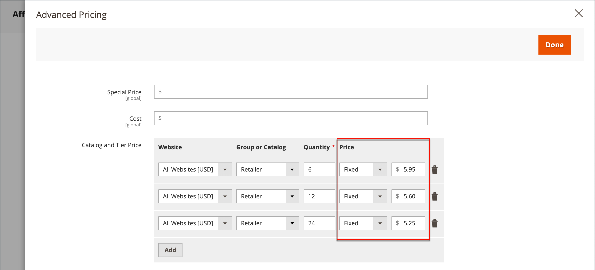
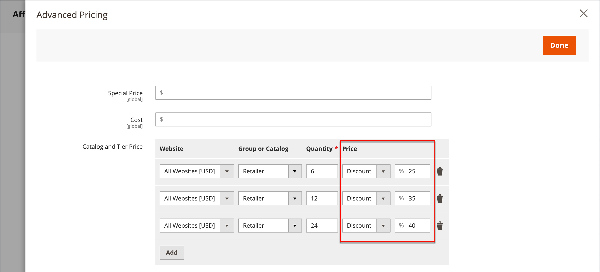

# Tier Price

Tier pricing lets you offer a quantity discount from a product listing or product page in the storefront. The discount can be applied to a specific store view or customer group or shared catalog.

If you have many products to update, it is most efficient to import the tier price changes, rather than enter them individually. For more information, see [Importing Tier Prices](https://docs.magento.com/user-guide/system/data-import-price-tier.html).

<!-- zoom -->

The product page calculates the quantity discount and displays a message such as:

`Buy 6 for $5.95 each and save 15%`

The prices in the storefront take precedence from the highest to the lowest quantity. If you have a tier price for the quantity `5` and one for `10`, and a customer adds five, six, seven, eight, or nine items to the shopping cart, the customer receives the discounted price for the quantity `5` tier. When the customer adds the tenth item, the discounted price specified for the quantity `10` tier supersedes the tier for a quantity of `5`, and discounted price for `10` applies.

## Add a price tier for a product

1. Open the product in edit mode.

1. Below the _[!UICONTROL Price]_ field, click **[!UICONTROL Advanced Pricing]**.

1. In the _[!UICONTROL Tier Price]_ section, click **[!UICONTROL Add]**.

   If you're creating a tier of several prices, click **[!UICONTROL Add]** for each additional level, so you can work all tiers at the same time. Each tier in the group has the same website and customer group or shared catalog assignment, but a different quantity and price.

## Configure the price tier

1. If your store has multiple websites, choose the **[!UICONTROL Website]** for which the tier pricing applies.

1. If necessary, limit the availability of the pricing tier by selecting the **[!UICONTROL Customer Group]** or **[!UICONTROL Shared Catalog]** ( Available with [B2B for Adobe Commerce](./b2b/../introduction.md) only).

1. For **[!UICONTROL Qty]**, enter the quantity that must be ordered to receive the discount.

   - **Method 1: Enter Price as Fixed Amount**

      Set **[!UICONTROL Price]** to `Fixed` and enter the adjusted price for one unit at that tier.

      <!-- zoom -->

   - **Method 2: Enter Price as Percentage**

      Set **[!UICONTROL Price]** to `Discount` and enter the discounted price as a percentage off the base price of the product.

      For example, for a 15 percent discount, enter the number `15`. (The price is saved with two decimal positions, such as `15.00`.)

      >[!NOTE]
      >
      >To get the discounted price, the defined percentage is calculated against the value defined in the _[!UICONTROL Price]_ field, not the _[!UICONTROL Special Price]** field.

   <!-- zoom -->

## Complete the price configuration

1. To add another set of tier pricing for a different website or customer group, repeat the previous steps.

1. When complete, click **[!UICONTROL Done]** and then **[!UICONTROL Save]**.

>[!NOTE]
>
>The **_final_** product price is calculated as the **_minimum_** relevant price, using the following formula:  `Final Price=Min(Regular(Base) Price, Group(Tier) Price, Special Price, Catalog Price Rule) + Sum(Min Price per each required custom option)`

>[!NOTE]
>
>**_Fixed Price_** product Customizable Options are _not_ affected by a Group Price, Tier Price, Special Price or Catalog Price rules.