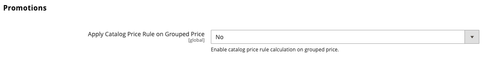

# Tier pricing

Tier pricing lets you offer a quantity discount from a product listing or product page in the storefront. The discount can be applied to a specific store view or customer group or shared catalog.

If you have many products to update, it is most efficient to import the tier price changes, rather than enter them individually. For more information, see [Import tier prices](../systems/data-import-price-tier.md).

{width="700" zoomable="yes"}

The product page calculates the quantity discount and displays a message such as:

`Buy 6 for $5.95 each and save 15%`

The prices in the storefront take precedence from the highest to the lowest quantity. If you have a tier price for the quantity `5` and one for `10`, and a customer adds five, six, seven, eight, or nine items to the shopping cart, the customer receives the discounted price for the quantity `5` tier. When the customer adds the tenth item, the discounted price specified for the quantity `10` tier supersedes the tier for a quantity of `5`, and discounted price for `10` applies.

## Add a price tier for a product

1. Open the product in edit mode.

1. Below the _[!UICONTROL Price]_ field, click **[!UICONTROL Advanced Pricing]**.

1. In the _[!UICONTROL Tier Price]_ section, click **[!UICONTROL Add]**.

   If you're creating a tier of several prices, click **[!UICONTROL Add]** for each additional level, so you can work all tiers at the same time. Each tier in the group has the same website and customer group or shared catalog assignment, but a different quantity and price.

## Configure the price tier

1. If your store has multiple websites, choose the **[!UICONTROL Website]** for which the tier pricing applies.

1. If necessary, limit the availability of the pricing tier by selecting the **[!UICONTROL Customer Group]** or **[!UICONTROL Shared Catalog]** ( Available with [Adobe Commerce B2B](./b2b/../introduction.md) only).

1. For **[!UICONTROL Qty]**, enter the quantity that must be ordered to receive the discount.

   - **Method 1:** Enter price as a fixed amount

      Set **[!UICONTROL Price]** to `Fixed` and enter the adjusted price for one unit at that tier.

      {width="600" zoomable="yes"}

   - **Method 2:** Enter price as a percentage

      Set **[!UICONTROL Price]** to `Discount` and enter the discounted price as a percentage off the base price of the product.

      For example, for a 15 percent discount, enter the number `15`. (The price is saved with two decimal positions, such as `15.00`.)

      >[!NOTE]
      >
      >To get the discounted price, the defined percentage is calculated against the value defined in the _[!UICONTROL Price]_ field, not the _[!UICONTROL Special Price]_ field.

      {width="600" zoomable="yes"}

## Complete the price configuration

1. To add another set of tier pricing for a different website or customer group, repeat the previous steps.

1. When complete, click **[!UICONTROL Done]** and then **[!UICONTROL Save]**.

>[!NOTE]
>
>The **_final_** product price is calculated as the **_minimum_** relevant price, using the following formula:  `Final Price=Min(Regular(Base) Price, Group(Tier) Price, Special Price, Catalog Price Rule) + Sum(Min Price per each required custom option)`

>[!NOTE]
>
>**_Fixed Price_** product Customizable Options are _not_ affected by Group Price, Tier Price, Special Price, or Catalog Price rules.

## Enable tier pricing for catalog price rules

[!BADGE SaaS only]{type=Positive url="https://experienceleague.adobe.com/en/docs/commerce/user-guides/product-solutions" tooltip="Applies to Adobe Commerce as a Cloud Service projects only (Adobe-managed SaaS infrastructure)."}

[!BADGE Sandbox]{type=Caution tooltip="The items listed are currently only available in Sandbox environments. Adobe makes new releases available in Sandbox environments first to provide time for you to test upcoming changes before the release is available on Production environments."}

In previous versions of Commerce, tier pricing could not be used in conjunction with catalog price rules. The catalog rules ignored tier price configuration and calculated discounts only from the original base price. Using Adobe Commerce as a Cloud Service, you can now choose to include tier pricing in the calculation of catalog price rules.

To enable this functionality:

1. Navigate to **[!UICONTROL Stores]** > *[!UICONTROL Settings]* > **[!UICONTROL Configuration]** > **[!UICONTROL Sales]** > **[!UICONTROL Sales]** > **[!UICONTROL Promotions]** and set the **[!UICONTROL Apply Catalog Price Rule on Grouped Price]** field to **[!UICONTROL Yes]**.

   {width="700" zoomable="yes"}

1. Define a tier price with a quantity of `1` for each specific customer group or shared catalog (such as `Wholesale`, `Retail`, or merchant-defined group) that you want to target with catalog price rules. The `ALL GROUPS` customer group and `Default` shared catalog cannot be used for this purpose. Tier pricing is not enabled for any group that does not have a tier price defined with a quantity of `1`.

1. Define additional tier prices with quantities greater than `1` as needed. These additional tier prices will be applied as usual when the customer adds additional quantities of the product to the shopping cart. Catalog price rules will not apply to these additional tier prices.

To illustrate how tier pricing works with catalog price rules when purchasing a single product, consider the following example:

- The standard base price of a product is 100 USD.
- A tier price is defined for the `Wholesale` customer group with a quantity of `1` and a fixed price of 90 USD.
- A catalog price rule provides a 10% discount for the `Wholesale` customer group.

When tier pricing is enabled for catalog price rules, the system uses the following flow to calculate the final price:

1. Before the customer logs in, the product price is displayed as 100 USD (the standard base price).

1. After the customer logs in as a member of the `Wholesale` group, the product price is adjusted to 90 USD (the tier price for the `Wholesale` group).

1. The catalog price rule is applied, providing a 10% discount on the tier price of 90 USD, resulting in a final price of 81 USD.

The following table summarizes price calculations when tier pricing is enabled for catalog price rules and a catalog price rule provides a 10% discount for all customer groups:

Product: Standard Price $100 (Single Item Purchase)

| Customer Group | Tier Price (Qty=1) | New Base Price | Final Price |
|---|---|---|---|
| ALL GROUPS | Not configured | $100 | $100 - 10% = $90 |
| Wholesale | Fixed: $85 | $85 | $85 - 10% = $76.50 |
| Retailer | 20% discount | $80 | $80 - 10% = $72.00 |
| VIP | 15% discount | $85 | $85 - 10% = $76.50 |
