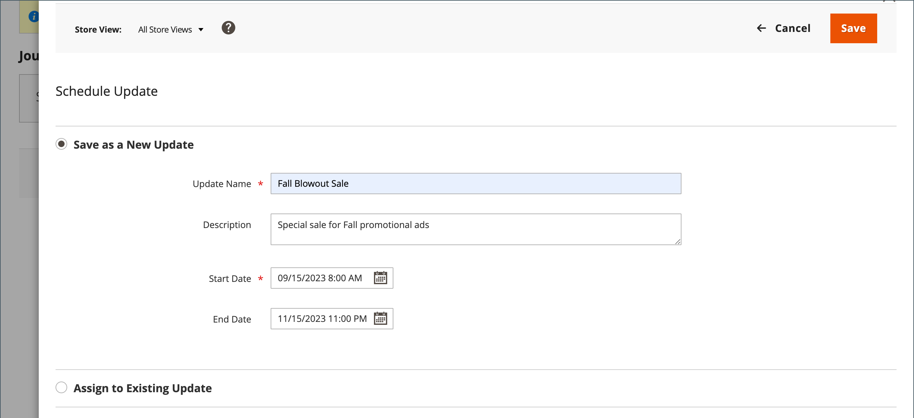
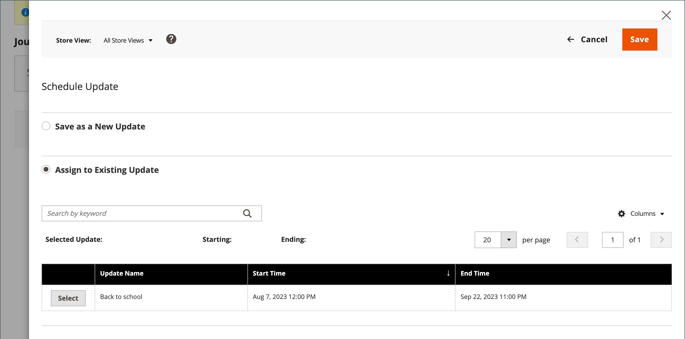
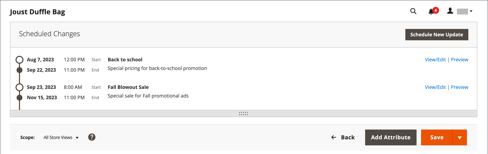
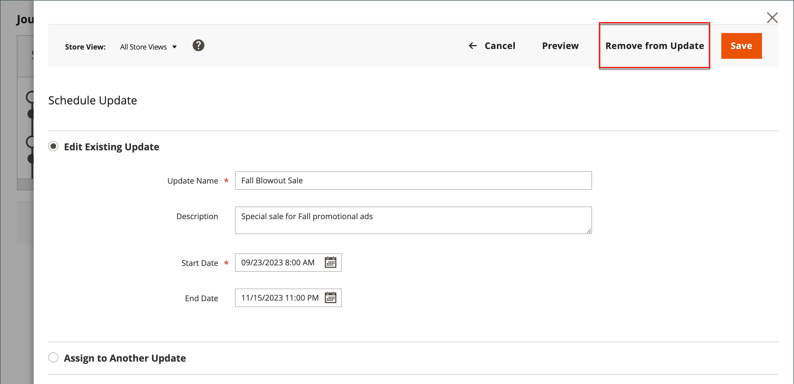
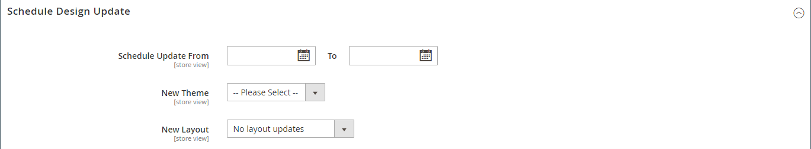

# Schedule product updates

{{ee-feature}}

Product updates can be applied on schedule and grouped with other content changes. You can use [content staging](../content-design/content-staging.md) to create a campaign based on scheduled changes to the product, or apply the changes to an existing campaign.

>[!NOTE]
>
>The [!UICONTROL Set Product as New From] and [!UICONTROL To] fields and [!UICONTROL Schedule Design Update] tab have been removed in  Adobe Commerce and cannot be modified directly on the product. You must create a scheduled update for these activations.

>[!NOTE]
>
>All scheduled updates are applied consecutively, which means that any entity can have only one scheduled update at one time. Any scheduled update is applied to all store views within its time frame. As a result, an entity cannot have different scheduled updates for different store views at the same time. All entity attribute values within all store views, which are not affected by the current scheduled update, are taken from the default values, and not from the previous scheduled update.

>[!NOTE]
>
>A staging preview for a scheduled update always starts from the **default** store view, which emulates the customer's experience of navigating through the staging update campaign.

## Create a scheduled update

1. On the _Admin_ sidebar, go to **[!UICONTROL Catalog]** > **[!UICONTROL Products]**.

1. Select an existing product and click **[!UICONTROL Edit]**.

1. Click **[!UICONTROL Schedule New Update]**.

1. Select **[!UICONTROL Save as a New Update]**.

1. For **[!UICONTROL Update Name]**, enter a name for the new content staging campaign.

1. Enter a brief **[!UICONTROL Description]** of the update and how it is to be used.

1. Use the Calendar () tool to choose the **[!UICONTROL Start Date]** and **[!UICONTROL End Date]** for the campaign.

   >[!NOTE]
   >
   >Campaign **[!UICONTROL Start Date]** and **[!UICONTROL End Date]** must be defined by using the **_default_** Admin time zone, which is converted from the local time zone for each website. For example, with multiple websites in different time zones where you want to start a campaign based on a US time zone, you must schedule a separate update for each local time zone. Set **[!UICONTROL Start Date]** and **[!UICONTROL End Date]** for each, and it is converted from the local website time zone to default Admin time zone.

   {width="600" zoomable="yes"}

1. Scroll down to _[!UICONTROL Price]_ and click **[!UICONTROL Advanced Pricing]**.

1. Enter a **[!UICONTROL Special Price]** for the product during the scheduled campaign and click **[!UICONTROL Done]**.

1. When complete, click **[!UICONTROL Save]**.

## Assign to existing update

1. On the _Admin_ sidebar, go to **[!UICONTROL Catalog]** > **[!UICONTROL Products]**.

1. Select an existing product and click **[!UICONTROL Edit]**.

1. Click **[!UICONTROL Schedule New Update]**.

1. Select **[!UICONTROL Assign to Existing Campaign]**.

1. In the list, select the campaign to be modified.

   {width="600" zoomable="yes"}

1. Expand  **[!UICONTROL Content]**.

1. When complete, click **[!UICONTROL Save]**.

## View the scheduled change

The scheduled change appears at the top of the product page, with the start and end dates of the campaign.

{width="600" zoomable="yes"}

## Edit the scheduled change

1. In the _[!UICONTROL Scheduled Changes]_ box at the top of the page, click **[!UICONTROL View/Edit]**.

1. Make any changes necessary to the scheduled update.

>[!NOTE]
>
>If campaign is linked to more than 1 product, this campaign can be edited from the [Content Staging Dashboard](content-staging-dashboard.md) only.

1. Click **[!UICONTROL Save]**.

## Remove the scheduled change

1. In the _[!UICONTROL Scheduled Changes]_ box at the top of the page, click **[!UICONTROL View/Edit]**.

1. On the top bar, click **[!UICONTROL Remove from Update]**.

   {width="600" zoomable="yes"}
   
1. In the dialog, select **[!UICONTROL Delete the Update]** and click **[!UICONTROL Done]**.

   >[!NOTE]
   >
   >The product is removed from the update and all scheduled changes are lost.

## Schedule a design update

{{ce-feature}}

The _[!UICONTROL Schedule Design Update]_ section gives you the ability to make temporary changes to the appearance of the product page. You can schedule design changes for a season, promotion, or just to make things fresh. Design changes can be scheduled in advance, so they go into effect, or _drip_, on your defined schedule.

{width="600" zoomable="yes"}
   

|Field|Description|
|--- |--- |
|[!UICONTROL Schedule Update From/To]|Determines the range of dates when a custom layout is applied to the product.|
|[!UICONTROL New Theme]|Applies a custom theme to the product.|
|[!UICONTROL New Layout]|Applies a different layout to the product page. Options:  **[!UICONTROL No layout updates]** - By default, layout updates are not available for the product page.  **[!UICONTROL Empty]** - Allows you to define your own layout, such as a 4-column page. (Requires an understanding of XML.)  **[!UICONTROL 1 column]** - Applies a one-column layout to the product page.  **[!UICONTROL 2 columns with left bar]** - Applies a two-column layout with a left sidebar to the product page.  **[!UICONTROL 2 columns with right bar]** - Applies a two-column layout with a right sidebar to the product page.  **[!UICONTROL 3 columns]** - Applies a three-column layout to the product page.|

{style="table-layout:auto"}
