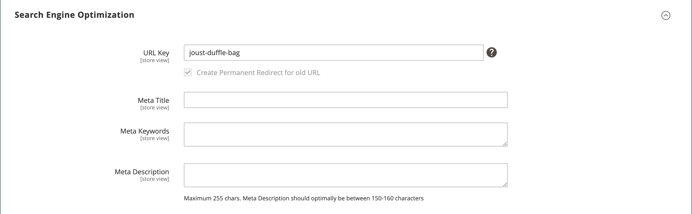

# Product settings - [!UICONTROL Search Engine Optimization]

The _[!UICONTROL Search Engine Optimization]_ section specifies the [URL Key](catalog-urls.md) and [meta data](https://docs.magento.com/user-guide/marketing/meta-data.html) fields that are used by search engines to index the product. Although some search engines ignore meta keywords, other search engines continue to use them. The current [SEO best practice](https://docs.magento.com/user-guide/marketing/seo-best-practices.html) is to incorporate high-value keywords in both the meta title and meta description.

The default value for each meta data field can be auto-generated based on values specified in the configuration. Each field contains a placeholder that is replaced by an actual value. For more information, see [Default Field Values](https://docs.magento.com/user-guide/configuration/catalog/catalog.html).

<!-- zoom -->

## Complete the SEO fields

1. Open the product in edit mode.

1. Scroll down and expand  the _[!UICONTROL Search Engine Optimization]_ section.

1. Enter the **[!UICONTROL URL Key]** (optional).

   The default URL key is based on the product name. You can use the default or change it as needed. For more information, see [Catalog URLs](catalog-urls.md).

1. Enter the **[!UICONTROL Meta Title]** (optional).

   The meta title is the text that appears at the top of the browser window. You can use the default, which is based on the product name, or change it as needed.

1. Add the **[!UICONTROL Meta Keywords]** (optional).

   The meta keywords are used by some search engines more than others. It is a best practice to enter a few high-value key words to help the product gain more visibility.

1. Enter the **[!UICONTROL Meta Description]**.

   The meta description is the text that appears in search results listings. For best results, enter a description that is between 150-160 characters in length.

## Field reference

|Field|[Scope](../getting-started/websites-stores-views.md#scope-settings)| Description |
|--- |--- |------------------|
|[!UICONTROL URL Key]|Store View| Determines the online address of the product. The URL key is added to the base URL of the store and appears in the address bar of a browser. Commerce initially creates a default, _search engine friendly_ URL, that is based on the product name. The URL Key should be all lowercase characters, with non-trailing hyphens between these characters instead of spaces. Do not include a suffix such as `.html` in the URL Key, because  it is managed in the configuration. |
|[!UICONTROL Meta Title]|Store View| The title appears in the title bar and tab of your browser and is also used as the title on a search engine results page (SERP). The meta title should be unique to the page and less than 70 characters in length. Auto-generated value: `{{name}}` |
|[!UICONTROL Meta Keywords]|Store View| Relevant keywords for the product. Consider using keywords that customers might use to find the product. Auto-generated value: `{{name}}` |
|[!UICONTROL Meta Description]|Store View| The meta description provides a brief overview of the page for search results listings. An ideal length is between 150-160 characters in length, with a maximum of  255 characters. Although not visible to the customer, some search engines include the meta description on the search results page. Auto-generated value: `{{name}} {{description}}` |
