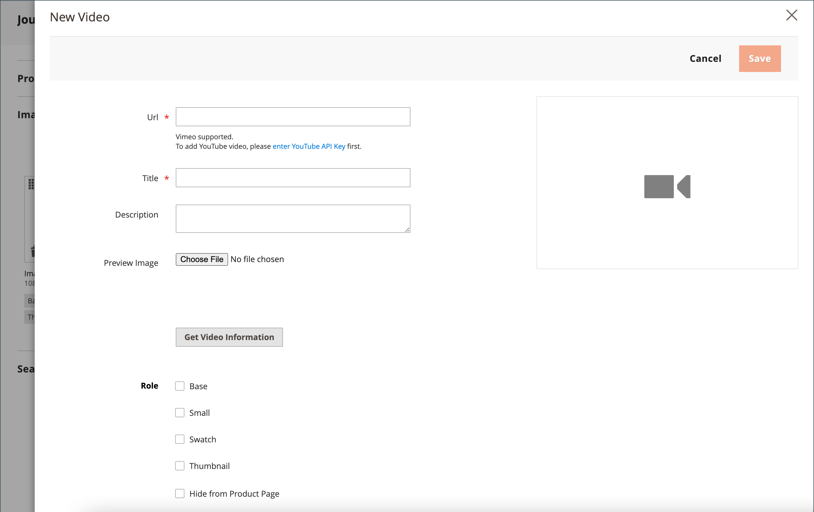
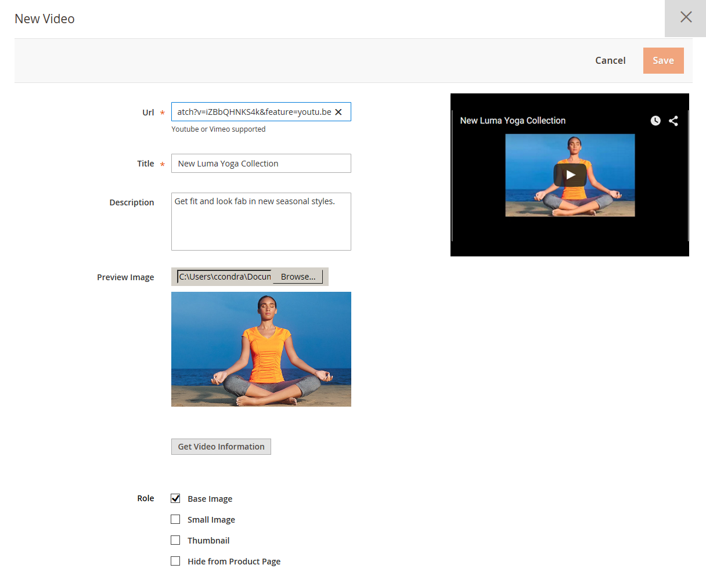

# Add product videos

To add a product video, you must first obtain an API Key from your Google account and enter it in the configuration of your store. Then, you can link to the video from the product.

## Step 1: Get your YouTube API key

1. Log in to your Google account and visit the [Google Developers Console][1].

1. In the Search field at the top, enter `YouTube Data API v3` and click the search icon.

1. When the API page is displayed, make sure it is enabled.

1. In the left panel, choose **[!UICONTROL Credentials]**.

1. Depending on whether you have credentials or not, do one of the following:

   - If you already have the needed credentials, copy the key in the _API keys_ table.

   - If you do not already have credentials for this API, click **[!UICONTROL Create Credentials]**  at the top and follow the prompts to create the needed credentials. Under _Get your credentials_, copy the API key and click **[!UICONTROL Done]**.

1. Copy the API key to the clipboard.

1. Click the Edit icon on the right and set the restrictions to make sure that the API key is limited to the correct referrers.

1. Wait a few moments while the key is generated and then copy the key to the clipboard.

    In the next step, you will paste the key into your store's configuration.

## Step 2: Configure the key in Commerce

1. On the _Admin_ sidebar, go to **[!UICONTROL Stores]** > _[!UICONTROL Settings]_ > **[!UICONTROL Configuration]**.

1. In the left panel, expand **[!UICONTROL Catalog]** and choose **[!UICONTROL Catalog]** underneath.

1. Expand  the _[!UICONTROL Product Video]_ section and paste your **[!UICONTROL YouTube API key]**.

   <!-- zoom -->

1. When complete, click **[!UICONTROL Save Config]**.

1. When prompted, refresh the cache.

## Step 3: Link to the video

1. Open a product in edit mode.

1. In the _[!UICONTROL Images and Videos]_ section, click **[!UICONTROL Add Video]**.

   If you haven't yet configured your YouTube API key, click **[!UICONTROL OK]** to continue. You cannot link to a YouTube video, but you can go through the process.

   <!-- zoom -->

1. Enter the **[!UICONTROL URL]** of the YouTube or Vimeo video.

1. Click outside the field and wait for feedback on the API key or video.

   If everything checks out, YouTube provides base information of the video

1. Enter the **[!UICONTROL Title]** and **[!UICONTROL Description]** of the video.

1. To upload a **[!UICONTROL Preview Image]**, browse to the image and select the file.

1. If you prefer to use the video meta data, click **[!UICONTROL Get Video Information]**.

1. To determine how the video is used in the store, select the checkbox of each **[!UICONTROL Role]** that applies:

   - `Base Image`
   - `Small Image`
   - `Swatch Image`
   - `Thumbnail`
   - `Hide from Product Page`

1. When complete, click **[!UICONTROL Save]**.

   <!-- zoom -->

## Maintain API access

According to the Google developer [Terms and Conditions], YouTube may disable API access for accounts that have been inactive for more than 90 days. This could result in your videos not displaying. To prevent this, use a cron job to ping the API at regular intervals:

```code
30 10 1 * * curl -i -G -e https://yourdomain.com/ -d "part=snippet&maxResults=1&q=test&key=YOUTUBEAPIKEY" https://www.googleapis.com/youtube/v3/search >/dev/null 2>&1
```

## Field reference

|Field|Description|
|--- |--- |
|[!UICONTROL URL]|The URL of the associated video.|
|[!UICONTROL Title]|The video title.|
|[!UICONTROL Description]|The video description.|
|[!UICONTROL Preview Image]|An uploaded image that is used as a preview of the video in your store.|
|[!UICONTROL Get Video Information]|Retrieves the video meta data that is stored on the host server. You can use the original data or update it as needed.|
|[!UICONTROL Role]|Determines how the preview image is used in your store. You can choose any combination of options: `Base Image`, `Small Image`, `Thumbnail`, `Swatch Image`, `Hide from Product Page`|

{style="table-layout:auto"}

[1]: https://console.developers.google.com/
[Terms and Conditions]: https://developers.google.com/youtube/terms/developer-policies#d.-accessing-youtube-api-services
