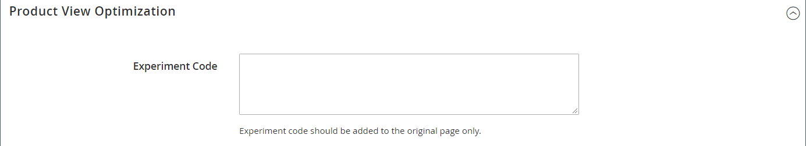

# Product settings - [!UICONTROL Product View Optimization]

After using [Google Content Experiments](../merchandising-promotions/google-content-experiments.md) to set up a series of A/B tests, use the _[!UICONTROL Product View Optimization]_ section to paste the snippet of code from Google into the original product that is to be tested.

This section appears only if **[!UICONTROL Google Content Experiments]** is enabled in the [Google Analytics](../merchandising-promotions/google-analytics.md) Google API configuration.

{width="600" zoomable="yes"}
