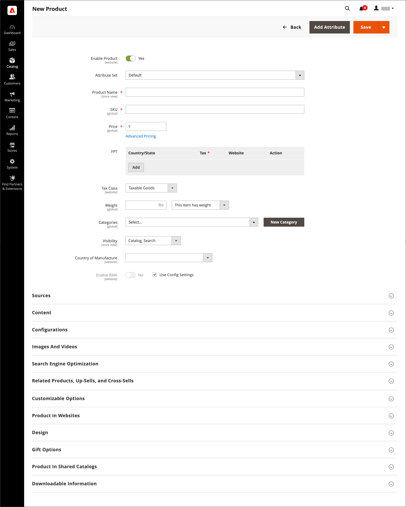
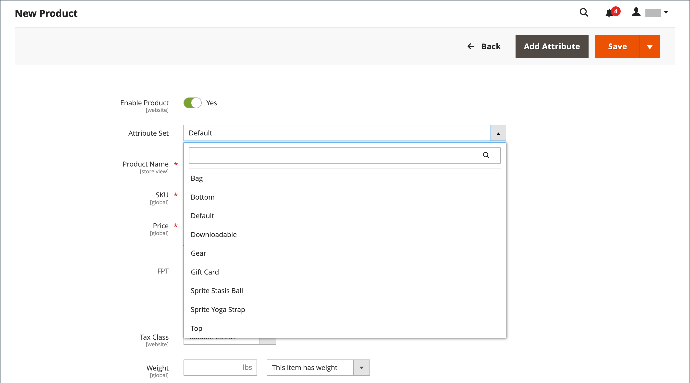
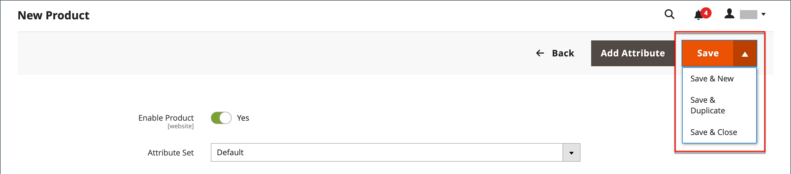

# Product workspace

The product workspace is basically the same for all product types, although the selection of fields changes depending on the attribute set that is used. The product attributes are at the top of the form, followed by expandable sections of product information. When a new product is saved for the first time, the _Store View_ chooser appears at the upper-left of the form.

<!-- zoom -->

## Enable Product setting

The online status of the product is indicated by the switch at the top of the form. To change the online status, set the **Enable Product** switch to `Yes` or `No`.

| Control | Description |
|-------- | ----------- |
|  | Indicates that the product is currently online. |
|  | Indicates that the product is currently offline. |

## Attribute set

The name of the [attribute set](attribute-sets.md) appears in the upper-left corner and determines the fields that appear in the product record. To choose a different attribute set, click the down arrow next to the default attribute set name.

<!-- zoom -->

## Expand/collapse

To expand or collapse a section, click either the expand  or collapse  icon.

## Save menu

The _Save_ menu includes several options that let you save and continue, save and create a new product, save and duplicate the product, or save and close.

<!-- zoom -->

|Command|Description|
|--- |--- |
|Save|Save the current product and continue working.|
|Save & New|Save and close the current product, and begin a new product based on the same product type and template.|
|Save & Duplicate|Save and close the current product, and open a new duplicate copy.|
|Save & Close|Save the current product and return to the Inventory workspace.|

## Default field values

To save time when creating products, the default value of several product fields references values from another field. You can either accept the default value or enter another. The following fields have automatically generated default values:

|Field |Default |
|----- |------- |
|SKU|Based on product Name. |
|Meta Title|Based on product Name. |
|Meta Keywords|Based on product Name. |
|Meta Description|Based on product Name and Description. |

The placeholders that represent the value of another field are enclosed in double-curly braces. Any attribute code that is included in the product [attribute set](attribute-sets.md) can be used as a placeholder.

<!-- zoom -->

See also [Product Fields Auto-Generation](https://docs.magento.com/user-guide/configuration/catalog/catalog.html)

### Edit the placeholder value

1. On the _Admin_ sidebar, go to **Stores** > _Settings_ > **Configuration**.

1. In the left panel, expand **Catalog** and choose **Catalog** underneath.

1. Expand  the **Product Fields Auto-Generation** section and make any changes needed to the placeholder values.

   For example, if there's a specific keyword that you want to include for every product or a phrase that you want to include in every meta description, you can type the value directly into the appropriate field.

   >[!NOTE]
   >
   >If you want to keep the existing placeholder values, preserve the double curly braces that enclose each markup tag.

1. When complete, click **Save Config**.

### Common placeholders

- `{{color}}`
- `{{country_of_manufacture}}`
- `{{description}}`
- `{{gender}}`
- `{{material}}`
- `{{name}}`
- `{{short_description}}`
- `{{size}}`
- `{{sku}}`

