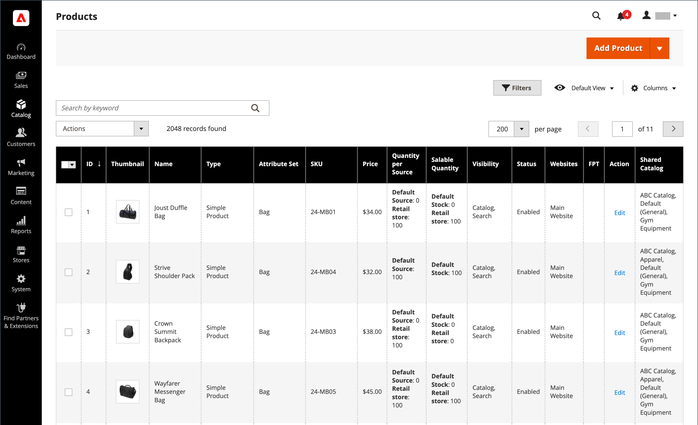

# Products list

All products in the catalog are accessible from the _[!UICONTROL Products]_ page in the Admin, where you can create new products and edit existing ones. For a multi-site installation, each website can offer a different selection of products for sale from the same catalog.

The _[!UICONTROL Products]_ list includes all products in the catalog, indicates the websites where they are available, and if they are currently enabled for sale. In B2B for Adobe Commerce installations with [shared catalogs](../b2b/catalog-shared.md) enabled, the grid includes a column that indicates which products have alternate discount pricing in a shared catalog.

You can browse through the list page by page, or search for specific products. Use the standard [controls](https://docs.magento.com/user-guide/stores/admin-grid-controls.html) to sort and filter the list, and apply [actions](https://docs.magento.com/user-guide/stores/admin-actions-control.html) to selected products.

<!-- zoom -->

## Page controls

|Control|Description|
|--- |--- |
|[!UICONTROL Add Product]|Initiates the process to create a new simple product. To choose a specific product type, click the down arrow. Options: [[!UICONTROL Simple Product]](product-create-simple.md) / [[!UICONTROL Configurable Product]](product-create-configurable.md) / [[!UICONTROL Grouped Product]](product-create-grouped.md) / [[!UICONTROL Virtual Product]](product-create-virtual.md) / [[!UICONTROL Bundle Product]](product-create-bundle.md) / [[!UICONTROL Downloadable Product]](product-create-downloadable.md) / [[!UICONTROL Gift Card]](product-gift-card-create.md)|
|[!UICONTROL Export Full Catalog]|([MCOM Connector](https://docs.magento.com/user-guide/mcom.html) required) Manually request a [full catalog export](https://docs.magento.com/user-guide/catalog/export-full-catalog.html) from Adobe Commerce. Outgoing messages will be exported to a .csv file in batches.|
|[!UICONTROL Actions]|Lists all actions that can be applied to selected products in the list. To apply an action to a product or group of products, select the checkbox in the first column of each product. Options: `Delete` / `Change Status` / `Update Attributes` / `Assign Inventory Source` / `Unassign Inventory Source` / `Transfer Inventory To Source`|
|[!UICONTROL Filters]|Initiates a catalog search based on the current filters.|
|[!UICONTROL Default View]|Indicates the current grid column layout. If there are saved grid column views, you can choose another.|
|[!UICONTROL Columns]|Lists all actions that can be applied to selected products in the list. To apply an action to a product or group of products, select the checkbox in the first column of each product.|
|[!UICONTROL Search by keyword]|The search box, in the top-left corner, is used to find products by keyword.|
|[!UICONTROL Edit]|Opens the product in edit mode. You can accomplish the same thing by clicking anywhere on the row.|

## Default columns

|Column|Description|
|--- |--- |
|(Checkbox)|Selects multiple records to be subject to an action. The checkbox in the first column of each selected record is marked. Options:  **[!UICONTROL Select All]** - Selects all records found that match the current filter settings.  **[!UICONTROL Select All on This Page]** - Selects only the records found on the current page that match the filter settings.|
|[!UICONTROL ID]|A unique, sequential number that is assigned when a new product is saved for the first time.|
|[!UICONTROL Thumbnail]|Displays a thumbnail of the main product image.|
|[!UICONTROL Name]|The product name.|
|[!UICONTROL Type]|The product type.|
|[!UICONTROL Attribute Set]|The name of the attribute set that is used as a template for the product.|
|[!UICONTROL SKU]|The unique Stock Keeping Unit that is assigned to the product.|
|[!UICONTROL Price]|The unit price of the product.|
|[!UICONTROL Quantity]|The quantity that is currently in stock.|
|[!UICONTROL Salable Quantity]|The sum of all available units of this product.|
|[!UICONTROL Visibility]|Indicates where the product is visible in the catalog. Options: Not Visible Individually / Catalog / Search / Catalog, Search|
|[!UICONTROL Status]|Indicates the current status of the product. Options: Enabled and Disabled|
|[!UICONTROL Websites]|Indicates the website(s) where the product is available.|
|[!UICONTROL Action]|Opens the product in Edit mode.|
|[!UICONTROL Shared Catalog]| (Available with [B2B for Adobe Commerce](./b2b/../introduction.md) only) Indicates the shared catalogs that contain custom pricing for the product.|

## Other columns

|Column|Description|
|--- |--- |
|[!UICONTROL Short Description]|Short description of the product.|
|[!UICONTROL Special Price From Date]|The first date of the special price promotion.|
|[!UICONTROL Special Price To Date]|The last date of the special price promotion.|
|[!UICONTROL Cost]|The actual cost of the item.|
|[!UICONTROL Manufacturer]|The manufacturer of the product.|
|[!UICONTROL Meta Keywords]|Meta keywords for the product.|
|[!UICONTROL Color]|The product color.|
|[!UICONTROL Set Product as New from Date]|The first date of the set product as a new promotion.|
|[!UICONTROL Set Product as New to Date]|The last date of the set product as a new promotion.|
|[!UICONTROL Active From / To]|The product start and end date.|
|[!UICONTROL Layout]|The product layout.|
|[!UICONTROL Minimum Advertised Price]|The minimum advertised price of the product.|
|[!UICONTROL Allow Gift Message]|The gift message to customers who purchase a gift card.|
|[!UICONTROL Special Price]|Special price for the product.|
|[!UICONTROL Weight]|The product weight.|
|[!UICONTROL Meta Title]|Meta title for the product.|
|[!UICONTROL Meta Description]|The product meta description.|
|[!UICONTROL Country of Manufacture]|The country of manufacture.|
|[!UICONTROL New Theme]|Applied custom theme to the product.|
|[!UICONTROL URL Key]|The URL Key of the product.|
|[!UICONTROL Tax Class]|The product tax class.|
|[!UICONTROL Allow Gift Message]|Displays the availability of the _include a gift message_ option for the product.|
