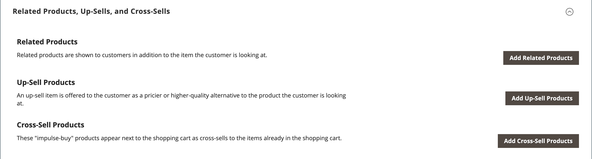
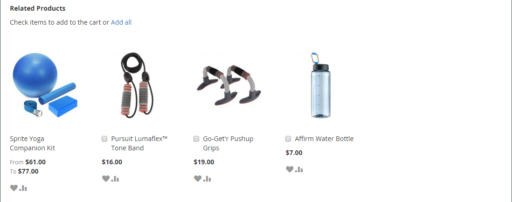
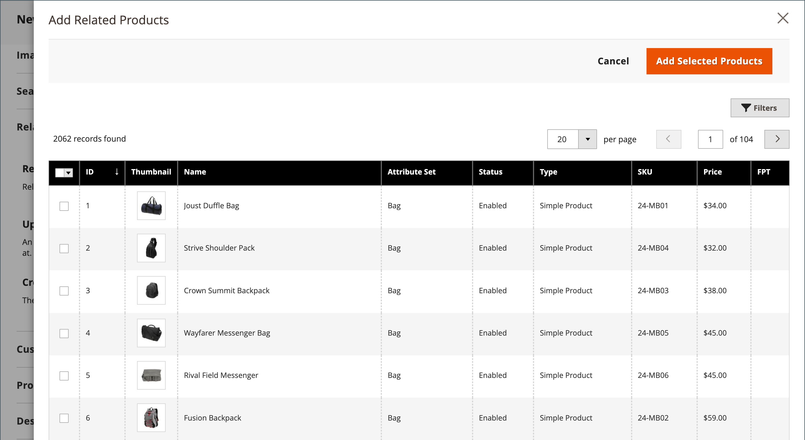
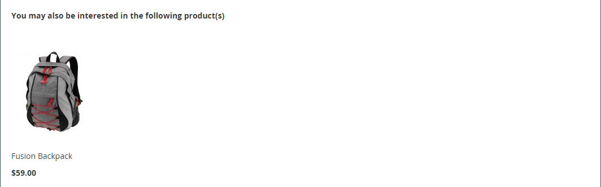
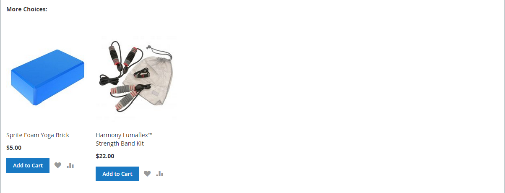
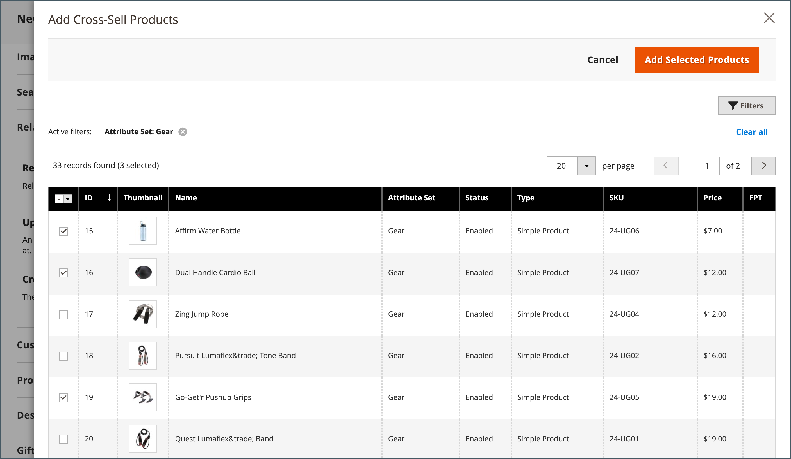

# Product settings - [!UICONTROL Related Products, Up-Sells, and Cross-Sells]

Use the _[!UICONTROL Related Products, Up-Sells, and Cross-Sells]_ section to set up simple promotional blocks that present a selection of additional products that might be of interest to the customer. For more information, see [Product Relationships](https://docs.magento.com/user-guide/marketing/product-relationships.html).

<!-- zoom -->

Every block consists of a list of products which belong to a specific option.

|Field|Description|
|--- |--- |
|[!UICONTROL ID]|A unique numeric identifier that is assigned to product entity.|
|[!UICONTROL Thumbnail]|Product thumbnail image.|
|[!UICONTROL Name]|The name of the product.|
|[!UICONTROL Status]|Indicates the product status. Options: `Enabled` / `Disabled`. Disabled products are not displayed in the blocks on the frontend.|
|[!UICONTROL Attribute Set]|The name of the attribute set that is used as a template for the product.|
|[!UICONTROL SKU]|The unique Stock Keeping Unit that is assigned to the product.|
|[!UICONTROL Price]|The unit price of the product.|
|[!UICONTROL Action]|Options: `Remove`. Removes a product from the block.|

{style="table-layout:auto"}

## Related Products

Related products are meant to be purchased in addition to the item the customer is viewing. The customer can place the item in the shopping cart by simply clicking the checkbox. The placement of the _Related Products_ block varies according to defined theme and page layout. In the example below, the _Related Products_ block appears at the bottom of the _Product View_ page. With a two-column layout, the _Related Products_ block often appears in the right sidebar.

<!-- zoom -->

To set up related products:

1. Open the product in edit mode.

1. Scroll down and expand  the **[!UICONTROL Related Products, Up-Sells, and Cross-Sells]** section.

1. Click **[!UICONTROL Add Related Products]**.

   <!-- zoom -->

1. Use the [filter controls](../getting-started/admin-grid-controls.md) to find the products that you want.

1. In the list, select the checkbox of any product you want to feature as a related product.

   <!-- zoom -->

1. When complete, click **[!UICONTROL Add Selected Products]**.

## Up-sells

Up-sell products are items that your customer might prefer instead of the product currently considered. An item offered as an up sell might be of a higher quality, more popular, or have better profit margin. Up-sell products appear on the product page under a heading such as _You may also be interested in the following products_.

<!-- zoom -->

To select up-sell products:

1. Open the product in edit mode.

1. Scroll down and expand  the **[!UICONTROL Related Products, Up-Sells, and Cross-Sells]** section.

1. Click **[!UICONTROL Add Up-Sell Products]**.

   <!-- zoom -->

1. Use the [filter controls](../getting-started/admin-grid-controls.md) to find the products that you want.

1. In the list, select the checkbox of any product you want to feature as an up-sell product.

   <!-- zoom -->

1. When complete, click **[!UICONTROL Add Selected Products]**.

## Cross-sells

Cross-sell items are similar to impulse purchases positioned next to the cash register in the checkout line. Products offered as a cross-sell appear on the shopping cart page, just before the customer begins the checkout process.

>[!NOTE]
>
>To show or hide cross-sell items per store view, see the [Checkout > Shopping Cart](https://docs.magento.com/user-guide/configuration/sales/checkout.html) option called _[!UICONTROL Show Cross-sell Items]_ in the Shopping Cart. You may want to hide cross-sells during specific sales or for A/B testing in a store view.

<!-- zoom -->

To select cross-sell products:

1. Open the product in edit mode.

1. Scroll down and expand  the **[!UICONTROL Related Products, Up-Sells, and Cross-Sells]** section.

1. Click **[!UICONTROL Add Cross-Sell Products]**.

   <!-- zoom -->

1. Use the [filter controls](../getting-started/admin-grid-controls.md) to find the products that you want.

1. In the list, select the checkbox of any product you want to feature as a cross-sell product.

   <!-- zoom -->

1. When complete, click **[!UICONTROL Add Selected Products]**.
