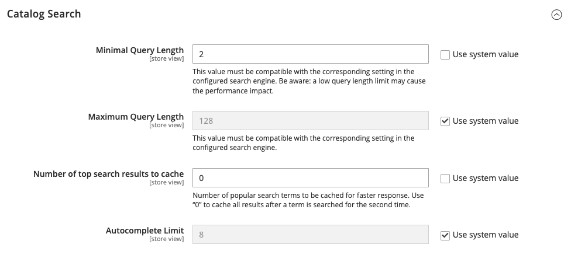

# Configure catalog search

There are two variations of the Catalog Search configuration. The first method describes the available settings when [Live Search](https://experienceleague.adobe.com/docs/commerce-merchant-services/live-search/overview.html) is installed. The second method describes the configuration settings for native Adobe Commerce with [Elasticsearch][1]{:target="_blank"}.

## Method 1: Adobe Commerce with [!DNL Live Search]

1. On the _Admin_ sidebar, go to **[!UICONTROL Stores]** > _[!UICONTROL Settings]_ > **[!UICONTROL Configuration]**.

1. In the left panel, expand **[!UICONTROL Catalog]** and choose **[!UICONTROL Catalog]** underneath.

1. Expand  the **[!UICONTROL Catalog Search]** section.

   {width="600" zoomable="yes"}
   
   For a detailed list of these options, see [Adobe Commerce with Live Search](../configuration-reference/catalog/catalog.md#adobe-commerce-with-live-search) in the _Configuration Reference_.

1. To limit the length and word count of search query text, set a value for **[!UICONTROL Minimal Query Length]** and **[!UICONTROL Maximum Query Length]**.

1. To limit the amount of popular search results to cache for faster responses, set an amount for **[!UICONTROL Number of top search results to cache]**.

   The default value is `100`. Entering a value of `0` caches all search terms and results when entered a second time.

1. To change the maximum number of lines that are available for returned results in the [storefront pop over](https://experienceleague.adobe.com/docs/commerce-merchant-services/live-search/live-search-storefront/quick-tour.html), enter a different **[!UICONTROL Autocomplete Limit]** value.

   Restricting the number of lines improves the performance of searches and reduces the size of the returned list. The default value is `8` lines.

## Method 2: Commerce with Elasticsearch

>[!IMPORTANT]
>
>Due to the [!DNL Elasticsearch 7] end-of-support announcement for August 2023, it is recommended that all Adobe Commerce customers migrate to the OpenSearch 2.x search engine. For information about migrating your search engine during product upgrade, see [Migrating to OpenSearch](https://experienceleague.adobe.com/docs/commerce-operations/upgrade-guide/prepare/opensearch-migration.html) in the _Upgrade Guide_.

### Step 1: Configure general search options

>[!NOTE]
>
>With ElasticSearch, there is no out-of-the-box support for search by the suffix. For example, search by SKU may not return the expected result if the keyword contains only the end part of the SKU.

1. On the _Admin_ sidebar, go to **[!UICONTROL Stores]** > _[!UICONTROL Settings]_ > **[!UICONTROL Configuration]**.

1. In the left panel, expand **[!UICONTROL Catalog]** and choose **[!UICONTROL Catalog]** underneath.

1. Expand  the **[!UICONTROL Catalog Search]** section.

   {width="600" zoomable="yes"}
   
   For more information about these options, see [Adobe Commerce with Elasticsearch](../configuration-reference/catalog/catalog.md#adobe-commerce-with-elasticsearch) in the _Configuration Reference_.

1. To limit the length and word count of search query text, set a value for **[!UICONTROL Minimal Query Length]** and **[!UICONTROL Maximum Query Length]**.

   >[!IMPORTANT]
   >
   >The value set for this minimum and maximum range must be compatible with the corresponding range set in your Elasticsearch search engine configuration. For example, if you set these values to `2` and `300` in Commerce, update the corresponding values in your search engine.

1. To limit the amount of popular search results to cache for faster responses, set an amount for **[!UICONTROL Number of top search results to cache]**.

   The default value is `100`. Entering a value of `0` caches all search terms and results when entered a second time.

1. If you want to enable or disable the Product EAV indexer, set the **[!UICONTROL Enable EAV Indexer]**.

   This feature improves indexation speed and restricts the indexer from use by third-party extensions.

1. To limit the maximum number of search results to display for search autocomplete, set an amount for **[!UICONTROL Autocomplete Limit]**.

   Restricting this amount increases performance of searches and reduces the displayed list size. The default value is `8`.

### Step 2: Configure the Elasticsearch connection

>[!IMPORTANT]
>
>The **[!UICONTROL Search Engine]**, **[!UICONTROL Elasticsearch Server Hostname]**, **[!UICONTROL Elasticsearch Server Port]**, **[!UICONTROL Elasticsearch Index Prefix]**, **[!UICONTROL Enable Elasticsearch HTTP Auth]**, and **[!UICONTROL Elasticsearch Server Timeout]** fields were configured when Commerce was installed or upgraded. These values should be changed only when upgrading or modifying Elasticsearch.

1. For **[!UICONTROL Search Engine]**, accept the default value `Elasticsearch 7`.

   Elasticsearch 7.6.x is required for all Commerce installations.

1. For **[!UICONTROL Elasticsearch Server Hostname]**, accept the default value that was configured when Commerce was installed.

   In this example, the default value is `elasticsearch.internal`.

1. For **[!UICONTROL Elasticsearch Server Port]**, accept the default value that was configured when Commerce was installed.

   In this example, the default value is `9200`.

1. For **[!UICONTROL Elasticsearch Index Prefix]**, enter a prefix to identify the Elasticsearch index.

   The default value is `magento2`.

1. To use HTTP authentication to prompt for a username and password to access Elasticsearch Server, set **[!UICONTROL Enable Elasticsearch HTTP Auth]** to `Yes`.

1. For **[!UICONTROL Elasticsearch Server Timeout]**, enter the number of seconds before the system times out.

   The default value is `15`.

1. To verify the configuration, click **[!UICONTROL Test Connection]**.

### Step 3: Configure suggestions and recommendations

>[!NOTE]
>
>Search suggestions and recommendations can impact server performance.

1. To offer recommendations, set **[!UICONTROL Enable Search Recommendations]** to `Yes` and do the following:

   - For **[!UICONTROL Search Recommendation Count]**, enter the number of recommendations to offer.

   - To show the number of results found for each recommendation, set **[!UICONTROL Show Results Count for Each Recommendation]** to `Yes`.

1. Set **[!UICONTROL Enable Search Suggestions]** to `Yes` and do the following:

   - For **[!UICONTROL Search Suggestions Count]**, enter the number of search suggestions to offer.

   - To show the number of results found for each suggestion, set **[!UICONTROL Show Results for Each Suggestion]** to `Yes`.

### Step 4: Configure minimum terms to match

To control the minimum number of terms from your query that the search results should match for return, specify a value for **[!UICONTROL Minimum Terms to Match]**. Specifying this value ensures optimal results relevancy for shoppers. For a list of accepted values, see [minimum_should_match parameter](https://www.elastic.co/guide/en/elasticsearch/reference/current/query-dsl-minimum-should-match.html) in the Elasticsearch documentation.

When complete, click **[!UICONTROL Save Config]**.

[1]: https://experienceleague.adobe.com/docs/commerce-operations/installation-guide/prerequisites/search-engine/overview.html
[2]: https://experienceleague.adobe.com/docs/commerce-operations/configuration-guide/search/overview-search.html
