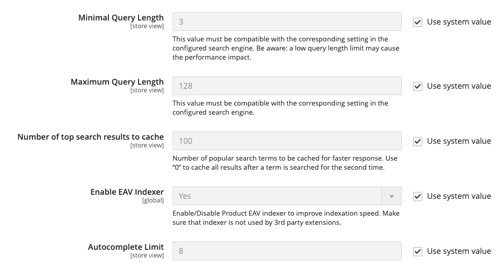
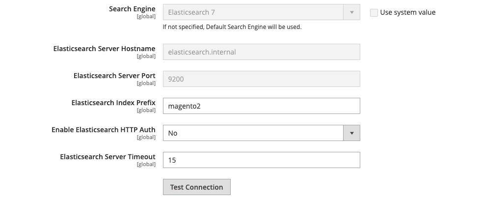
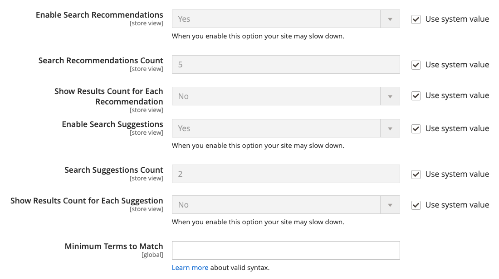

# Configure catalog search

There are two variations of the Catalog Search configuration: The first method describes the available settings when [Live Search](https://experienceleague.adobe.com/docs/commerce-merchant-services/live-search/overview.html) is installed, and the second method describes the configuration settings for native Adobe Commerce with [Elasticsearch][1]{:target="_blank"}.

## Method 1: Adobe Commerce with Live Search

1. On the _Admin_ sidebar, go to **Stores** > _Settings_ > **Configuration**.

1. In the left panel, expand **Catalog** and choose **Catalog** underneath.

1. Expand  the _Catalog Search_ section.

   <!-- zoom -->
   
   See also [Catalog Search for Live Search](search-configuration.md#method-1-adobe-commerce-with-live-search)

1. To limit the length and word count of search query text, set a value for **Minimal Query Length** and **Maximum Query Length**.

1. To limit the amount of popular search results to cache for faster responses, set an amount for **Number of top search results to cache**.

   The default value is `100`. Entering a value of `0` caches all search terms and results when entered a second time.

1. To change the maximum number of lines that are available for returned results in the [storefront popover](https://experienceleague.adobe.com/docs/commerce-merchant-services/live-search/live-search-storefront/quick-tour.html), enter a different **Autocomplete Limit** value.

   Restricting the number of lines improves the performance of searches and reduces the size of the returned list. The default value is 8 lines.

## Method 2: Adobe Commerce with Elasticsearch

### Step 1: Configure general search options

>[!NOTE]
>
>With ElasticSearch, there is no out-of-the-box support for search by the suffix. For example, search by SKU may not return the expected result if the keyword contains only the end part of the SKU.

1. On the _Admin_ sidebar, go to **Stores** > _Settings_ > **Configuration**.

1. In the left panel, expand **Catalog** and choose **Catalog** underneath.

1. Expand  the _Catalog Search_ section.

   <!-- zoom -->
   
   See also [_Elasticsearch Settings_](https://docs.magento.com/user-guide/configuration/catalog/catalog.html)

1. To limit the length and word count of search query text, set a value for **Minimal Query Length** and **Maximum Query Length**.

   >[!IMPORTANT]
   >
   >The value set for this minimum and maximum range must be compatible with the corresponding range set in your Elasticsearch search engine configuration. For example, if you set these values to `2` and `300` in Commerce, update the corresponding values in your search engine.

1. To limit the amount of popular search results to cache for faster responses, set an amount for **Number of top search results to cache**.

   The default value is `100`. Entering a value of `0` caches all search terms and results when entered a second time.

1. If you want to enable or disable the Product EAV indexer, set the **Enable EAV Indexer**.

   This feature improves indexation speed and restricts the indexer from use by third-party extensions.

1. To limit the maximum number of search results to display for search autocomplete, set an amount for **Autocomplete Limit**.

   Restricting this amount increases performance of searches and reduces the displayed list size. The default value is `8`.

### Step 2: Configure the Elasticsearch connection

>[!NOTE]
>
>The **Search Engine**, **Elasticsearch Server Hostname**, **Elasticsearch Server Port**, **Elasticsearch Index Prefix**, **Enable Elasticsearch HTTP Auth**, and **Elasticsearch Server Timeout** fields were configured when Commerce was installed or upgraded. These values should only be changed when upgrading or modifying Elasticsearch.

<!-- zoom -->

See also [_Elasticsearch Connection Settings_](https://docs.magento.com/user-guide/configuration/catalog/catalog.html)

1. For **Search Engine**, accept the default value `Elasticsearch 7`.

   Elasticsearch 7.6.x is required for all Commerce installations.

1. For **Elasticsearch Server Hostname**, accept the default value that was configured when Commerce was installed.

   In this example, the default value is `elasticsearch.internal`.

1. For **Elasticsearch Server Port**, accept the default value that was configured when Commerce was installed.

   In this example, the default value is `9200`.

1. For **Elasticsearch Index Prefix**, enter a prefix to identify the Elasticsearch index.

   The default value is `magento2`.

1. To use HTTP authentication to prompt for a username and password to access Elasticsearch Server, set **Enable Elasticsearch HTTP Auth** to `Yes`.

1. For **Elasticsearch Server Timeout**, enter the number of seconds before the system times out.

   The default value is `15`.

1. To verify the configuration, click **Test Connection**.

### Step 3: Configure suggestions and recommendations

>[!NOTE]
>
>Search suggestions and recommendations can impact server performance.

1. To offer recommendations, set **Enable Search Recommendations** to `Yes` and do the following:

   - For **Search Recommendation Count**, enter the number of recommendations to offer.

   - To show the number of results found for each recommendation, set **Show Results Count for Each Recommendation** to `Yes`.

1. Set **Enable Search Suggestions** to `Yes` and do the following:

   <!-- zoom -->
   
   See also [_Elasticsearch Suggestion and Recommendation Settings_](https://docs.magento.com/user-guide/configuration/catalog/catalog.html)

   - For **Search Suggestions Count**, enter the number of search suggestions to offer.

   - To show the number of results found for each suggestion, set **Show Results for Each Suggestion** to `Yes`.

### Step 4: Configure Minimum Terms to Match

To control the minimum number of terms from your query that the search results should match in order to be returned, specify a value for **Minimum Terms to Match**. This ensures optimal results relevancy for shoppers. For a list of accepted values, see [minimum_should_match parameter](https://www.elastic.co/guide/en/elasticsearch/reference/current/query-dsl-minimum-should-match.html) in the Elasticsearch documentation.

When complete, click **Save Config**.

[1]: https://devdocs.magento.com/guides/v2.4/install-gde/prereq/elasticsearch.html
[2]: https://experienceleague.adobe.com/docs/commerce-operations/configuration-guide/search/overview-search.html
