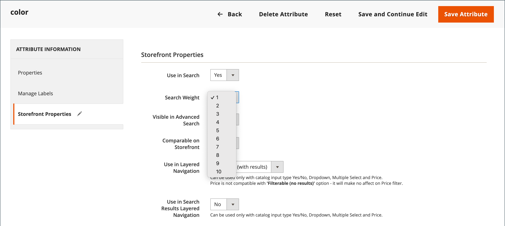

# Search results

>[!NOTE]
>
>This page describes standard search functionality that might differ from [Live Search](https://experienceleague.adobe.com/docs/commerce/live-search/overview.html).

The _Search Results_ list includes all products that match the search criteria entered in the Quick Search box or the Advanced Search form. Every product list in the catalog has essentially the same controls. The only difference is that one is the result of a search query, and the other difference is the result of [navigation](navigation.md).

The results can be formatted as either a grid or list and sorted by a selection of attributes. Pagination controls appear if there are more products than fit on the page. Use these controls to move from one page to the next. The number of records per page is determined by the Catalog Frontend configuration. For more information, see [Product Listings](navigation-product-listings.md).

With **ElasticSearch**:

- There is no out-of-the-box support for search by the suffix. For example, search by SKU may not return the expected result if the keyword contains only the end part of the SKU.
- There is out-of-the-box support for search by prefix (partial keyword search) for `name` and `sku` product attributes only. All other product attributes are searched by the whole keyword, with the exact matching.
- Search results for `name` and `sku` product attributes are based on the relevance, not exact matching. The most relevant matches, such as an exactly matched _Product Name_ or _SKU_, are listed first. To search for an exact match, the customer can use double quotes in the search query. For example, a `WSH12-32-Red` search query may return several products, sorted by the relevance. But a `"WSH12-32-Red"` search query returns only one product with the **_exactly_** matched `sku`.

{width="700" zoomable="yes"}

>[!IMPORTANT]
>
>Due to the Elasticsearch 7 end-of-support announcement for August 2023, it is recommended that all Adobe Commerce customers migrate to the OpenSearch 2.x search engine. For information about migrating your search engine during product upgrade, see [Migrating to OpenSearch](https://experienceleague.adobe.com/docs/commerce-operations/upgrade-guide/prepare/opensearch-migration.html) in the _Upgrade Guide_.

## Keyword mapping to extend search results

This technique uses an attribute to create a keyword-based association between two products so that a search for either product returns results for both products. You can use keyword mapping to promote a product in search results where it otherwise would not appear.

{width="700" zoomable="yes"}

The following example uses keyword mapping based on SKU. When either SKU is entered in the search box, both products appear in the results. The SKUs of the following configurable products are mapped, rather than the SKUs of product variations:

- Montana Wind Jacket (MJ03)
- Chaz Kangaroo Hoodie (MH01)

### Step 1: Create an attribute

1. In the _[!UICONTROL Products]_ list, open the `Montana Wind Jacket` (MJ03) in edit mode.
1. In the upper-right corner, click **[!UICONTROL Add Attribute]**.
1. On the _Select Attribute_ page, click **[!UICONTROL Create New Attribute]**.
1. Complete the attribute properties as follows:

   **[!UICONTROL Attribute Properties]**

   - [!UICONTROL Attribute Label]  - `Search Keywords`
   - [!UICONTROL Catalog Input Type for Store Owner] - `Text Field`

   **[!UICONTROL Advanced Attribute Properties]**

   - [!UICONTROL Add to Column Options] - `Yes` (default)
   - [!UICONTROL Use in Filter Options] - `Yes` (default)

   **[!UICONTROL Storefront Properties]**

   - [!UICONTROL Use in Search] - `Yes`
   - [!UICONTROL Visible on Catalog Pages in the Storefront] - `No`
   - [!UICONTROL Used in Product Listings] - `No`

1. When complete, click **[!UICONTROL Save Attribute]**.

   The attribute is added to the attribute set for the product.

### Step 2: Map the first product

1. On the product settings page, scroll down and expand the _[!UICONTROL Attributes]_ section.
1. In the **[!UICONTROL Search Keywords]** field, enter the SKU `MH01` that is to be mapped to this product.

   You can enter multiple SKUs separated by a space in the Search Keywords field. In this example, only one is entered.

   {width="600" zoomable="yes"}

1. When complete, click **[!UICONTROL Save]**.
1. Go to **[!UICONTROL System]** > _[!UICONTROL Tools]_ > **[!UICONTROL Cache Management]** and refresh the **[!UICONTROL Page Cache]**.

### Step 3: Map the second product

1. In the _[!UICONTROL Products]_ list, open the `Chaz Kangaroo Hoodie` (MH01) in edit mode.
1. Scroll down and expand the **[!UICONTROL Attributes]** section.
1. In the **[!UICONTROL Search Keywords]** field, enter the SKU for the other product, `MJ03`.
1. Click **[!UICONTROL Save]**.
1. Go to **[!UICONTROL System]** > _[!UICONTROL Tools]_ > **[!UICONTROL Cache Management]** and refresh the **[!UICONTROL Page Cache]**.

### Step 4: Test it in the storefront

1. Go to the storefront and enter `MJ03` in the _Quick Search_ box.
1. Verify that both products are returned in the search results list.

## Weighted Search

Product attributes that are enabled for catalog search can be assigned a weight to give them a higher value in search results. Attributes with a greater weight are returned before attributes with a lower weight. For example, if there are two attributes in the system, _color_ with a search weight of 3 and _description_ with a search weight of 1. A search for the word _red_ returns a list of products with a color attribute value of `red` at the top of the search results and returns products with descriptions that contain the word _red_ at the bottom of the search results. In this example, the `color` attribute has a greater defined weight than the `description` attribute.

>[!IMPORTANT]
>
>Sorting by relevance is affected by **_multiple_** criteria and relationships between them **_at the same time_**. [!UICONTROL Search Weight] is only one of those criteria. This means that sometimes attributes with lower search weight may still have more relevance than attributes with higher search weight. Other criteria may include number of matches in any given attribute, position of found search term, and overall text structure before and after a search term.

**_To set the search weight properties of an attribute:_**

1. On the _Admin_ sidebar, go to **[!UICONTROL Stores]** > _[!UICONTROL Attributes]_ > **[!UICONTROL Product]**.

1. Find the attribute in the list and open in edit mode.

1. In the left panel, choose **[!UICONTROL Storefront Properties]** and do the following:

   - To include the attribute in search queries, set **[!UICONTROL Use in Search]** to `Yes`.

   - To establish the search value of the attribute, set **[!UICONTROL Search Weight]** to a number from 1 to 10, where `10` has the highest priority. If no value is entered, all attributes default to a search weight of `1`.

   {width="600" zoomable="yes"}

1. When complete, click **[!UICONTROL Save Attribute]**.
