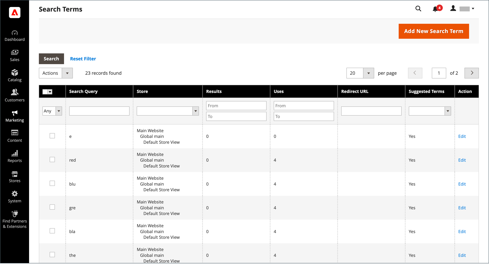
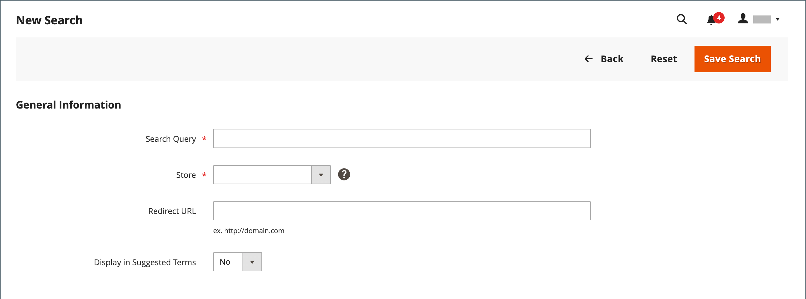
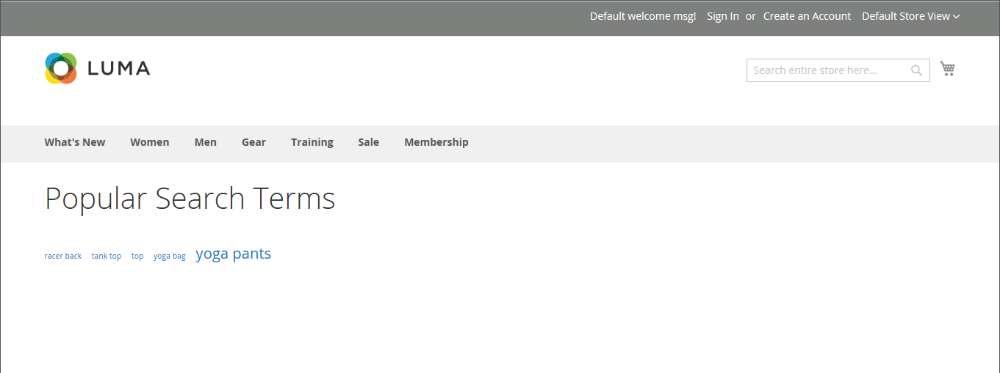
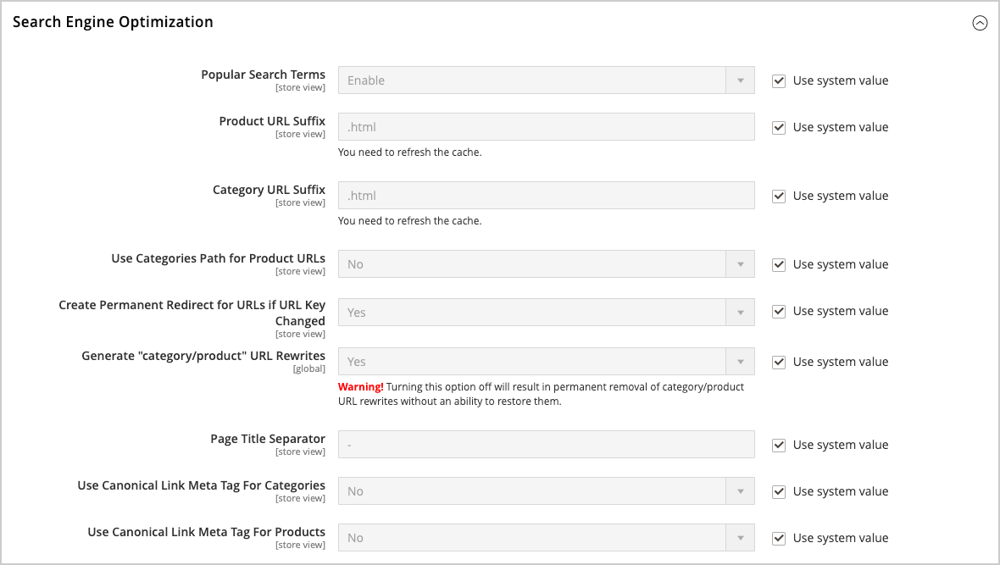
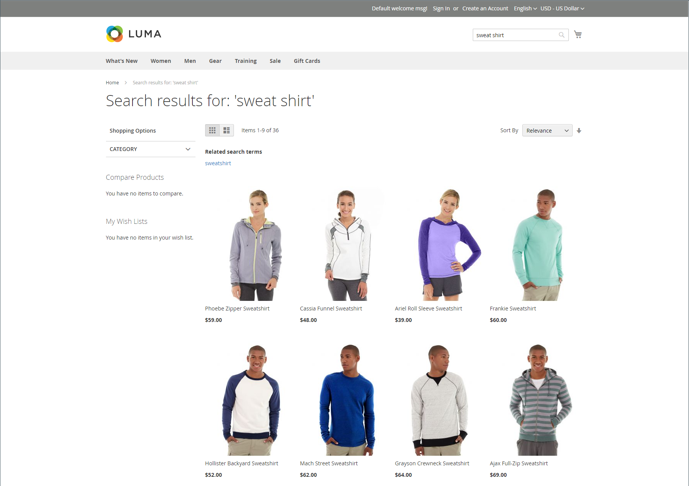
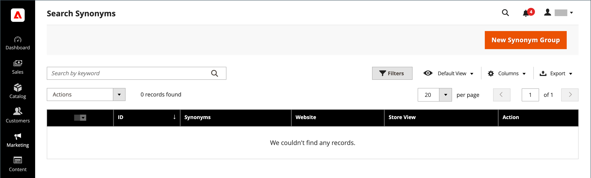
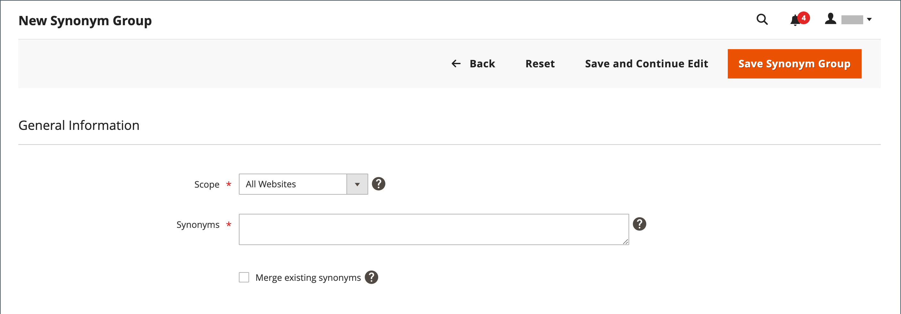
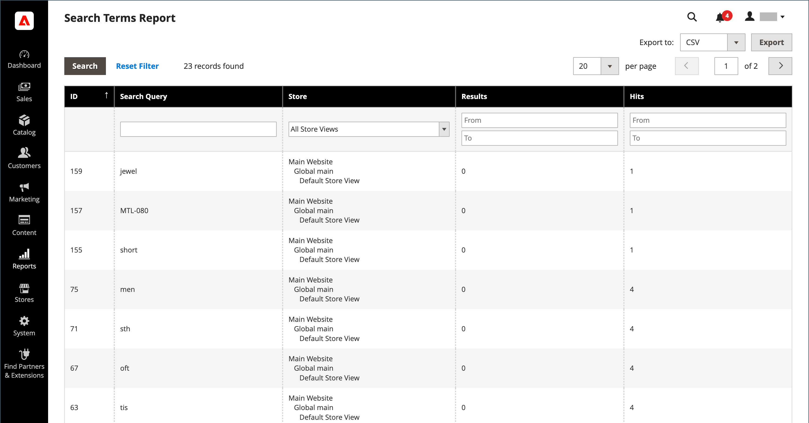

# Manage search terms

>[!NOTE]
>
>The _Search Terms_ functionality described in this page does not apply to Adobe Commerce stores that use [Live Search](https://experienceleague.adobe.com/docs/commerce-merchant-services/live-search/overview.html).

The [landing page](../content-design/pages.md) for a search term can be a content page, a category page, a product detail page, or even a page on a different site.

Use search terms to capture common misspellings and redirect them to the appropriate page. For example, if you sell wrought iron patio furniture, you know that many people misspell the term as _rod iron_, or even _rot iron_. You can enter each misspelled word as a search term, and make them synonyms for _wrought iron_. Even though the word is misspelled, the search is directed to the page for wrought iron.

You can also learn what your customers are looking for by examining the search terms they use to find products in your store. If enough people look for a product that is not in your catalog, it could indicate a sales opportunity. Meanwhile, rather than have them leave them empty handed, you can redirect them to another product in your catalog.

## Add search terms

As you learn new words that people use to search in your store, you can add them to your search terms list to direct people to the most closely matching products in your catalog.

<!-- zoom -->

|Column|Description|
|--- |--- |
|[!UICONTROL Search Query]|The query used to perform the search.|
|[!UICONTROL Store]|The store where the search query was applied.|
|[!UICONTROL Results]|Number of results found by query.|
|[!UICONTROL Uses]|Number of uses.|
|[!UICONTROL Redirect URL]|URL of the target page where user was redirected after performing the search.|
|[!UICONTROL Suggested Terms]|Determines if the query result displays suggested terms.|
|[!UICONTROL Actions]|Opens the product in edit mode.|

{style="table-layout:auto"}

### Add a search term

1. On the _Admin_ sidebar, go to **[!UICONTROL Marketing]** > _[!UICONTROL SEO & Search]_ > **[!UICONTROL Search Terms]**.

1. Click **[!UICONTROL Add New Search Term]** and do the following:

   <!-- zoom -->

   - Under _[!UICONTROL General Information]_ in the **[!UICONTROL Search Query]** box, enter the word or phrase that you want to add as a new search term.

   - If your store is available in multiple languages, choose the applicable **[!UICONTROL Store]** view.

   - To redirect the search results to another page in your store, or to another website, enter the full URL of the target page in the **[!UICONTROL Redirect URL]** field.

   - If you want this term to be available for use as a suggestion whenever a search returns no results, set **[!UICONTROL Display in Suggested Terms]** to `Yes`.

1. When complete, click **[!UICONTROL Save Search]**.

## Edit a search term

1. In the _[!UICONTROL Search Terms]_ grid, click the row of any record to open the search term in edit mode.

1. Make the necessary changes.

1. When complete, click **[!UICONTROL Save Search]**.

## Delete a search term

There are two methods for deleting a search term -- from the grid and on the edit page.

**Method 1:** In the _[!UICONTROL Search Terms]_ grid

1. In the list, select the checkbox of the term to be deleted.

1. In the upper-left corner of the list, set **[!UICONTROL Actions]** to `Delete`.

1. When complete, click **[!UICONTROL Submit]**.

**Method 2:** On the _[!UICONTROL Edit a Search Term]_ page

1. On the _Admin_ sidebar, go to **[!UICONTROL Marketing]** > _[!UICONTROL SEO & Search]_ > **[!UICONTROL Search Terms]**.

1. Find the search term to be deleted and open it in edit mode.

1. Click **[!UICONTROL Delete Search]**.

1. To confirm the action, click **[!UICONTROL OK]**.

## Popular search terms

The _Search Terms_ link in the footer of your store displays the search terms used by visitors to your store, ranked by popularity. Search terms appear in a _tag cloud_ format, where the size of the text indicates the popularity of the term.

By default, Popular Search Terms is enabled as a search engine optimization tool, but has no direct connection to the catalog search process. Because the Search Terms page is indexed by search engines, any terms on the page can help improve your search engine ranking and the visibility of your store. The URL of the Popular Search Terms page is: `mystore.com/search/term/popular/`

<!-- zoom -->

To configure popular search terms:

1. On the _Admin_ sidebar, go to **[!UICONTROL Stores]** > _[!UICONTROL Settings]_ > **[!UICONTROL Configuration]**.

1. In the left panel, expand **[!UICONTROL Catalog]** and choose **[!UICONTROL Catalog]** underneath.

1. Expand  the **[!UICONTROL Search Engine Optimization]** section.

   <!-- zoom -->

   For more information about these options, see [Search Engine Optimization](https://docs.magento.com/user-guide/configuration/catalog/catalog.html#search-engine-optimization) in the _Configuration Reference_.

1. Set **[!UICONTROL Popular Search Terms]** as needed.

   If needed, clear the **[!UICONTROL Use system value]** checkbox to change this setting.

1. When complete, click **[!UICONTROL Save Config]**.

>[!NOTE]
>
>You can further configure the caching of popular [catalog searches](search-configuration.md).

## Search synonyms

One way to improve the effectiveness of [catalog search](search-configuration.md) is to include different terms that people may use to describe the same item. You do not want to lose a sale just because someone is looking for a _sofa_, and your product is listed as a _couch_. You can capture a broader range of search terms by entering _sofa_, _davenport_, and _loveseat_ as synonyms for _couch_, and direct them to the same landing page.

Adobe Commerce supports two different synonym management solutions:

- Live Search [Synonyms](https://experienceleague.adobe.com/docs/commerce-merchant-services/live-search/live-search-admin/synonyms/synonyms.html) feature is available for Adobe Commerce installations with Live Search installed.
- The standard Search Synonyms feature (described in this page) is available out-of-the-box for all Adobe Commerce installations.

>[!NOTE]
>
>The standard Search Synonyms feature out-of-the-box supports `name` and `sku` product attributes **_only_**.

<!-- zoom -->

### Create a synonym group

1. On the _Admin_ sidebar, go to **[!UICONTROL Marketing]** > _[!UICONTROL SEO & Search]_ > **[!UICONTROL Search Synonyms]**.

   The _[!UICONTROL Search Synonyms]_ grid appears. If this is the first time you have used search synonyms, the grid is empty.

   <!-- zoom -->

1. Click **[!UICONTROL New Synonym Group]** and do the following:

   <!-- zoom -->

   - Set **[!UICONTROL Scope]** to the store views where the synonyms apply.

   - Enter each synonym in the group, separated by comma. Choose words that people might use as search criteria. For example:

      - `sweatshirt, sweat shirt, hoodie, fleece`
      - `cell phone, mobile phone, smart phone`
      - `couch, sofa, davenport`
      - `wrought iron, rot iron, rod iron`

   - To merge these synonyms into a group with others that have the same scope, select the **[!UICONTROL Merge existing synonyms]** checkbox.

1. When complete, click **[!UICONTROL Save Synonym Group]**.

   <!-- zoom -->

### Edit a synonym group

1. In the _[!UICONTROL Search Synonyms]_ grid, click the row of any record to open the synonym group in edit mode.

1. Make the necessary changes.

1. When complete, click **[!UICONTROL Save Synonym Group]**.

### Delete a synonym group

There are two methods for deleting a synonym group---from the grid and on the edit page.

**Method 1:** In the Search Synonyms grid

1. In the _[!UICONTROL Search Synonyms]_ grid, select the checkbox of the group to be deleted.

1. In the upper-left corner of the list, set **[!UICONTROL Actions]** to `Delete`.

1. When complete, click **[!UICONTROL Submit]**.

**Method 2:** On the Edit a Synonym Group page

1. In the Search Synonyms grid, click the row of any record to open the synonym group in edit mode.

1. Click **[!UICONTROL Delete Synonym Group]**.

1. When prompted, confirm the removal of the group.

## Search Terms report

The Search Terms report shows the number of results for each term, and the number of times (hits) the term was used. The report data can be filtered by term, store, results, and hits, and exported for further analysis.

### View the report

1. On the _Admin_ sidebar, go to **[!UICONTROL Reports]** > _[!UICONTROL Marketing]_ > **[!UICONTROL Search Terms]**.

1. Use the controls to filter the report as needed.

   <!-- zoom -->

## Export the report

1. For **[!UICONTROL Export to]**, choose an export format:

   - `CSV` - A comma-separated value file containing plain text data
   - `Excel XML` - An XML-based, spreadsheet data format

1. Click **[!UICONTROL Export]**.

   The generated file is automatically saved to your designated folder for downloads.

### Report columns

|Column|Description|
|--- |--- |
|[!UICONTROL ID]|Unique, numeric ID generated for the search term entry|
|[!UICONTROL Search Query]|The query used to perform the search|
|[!UICONTROL Store]|The store where the search query was applied|
|[!UICONTROL Results]|Number of results|
|[!UICONTROL Hits]|Number of uses|

{style="table-layout:auto"}
