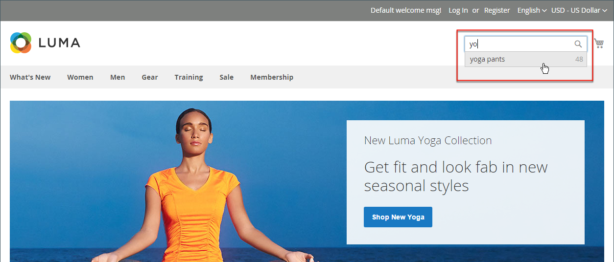
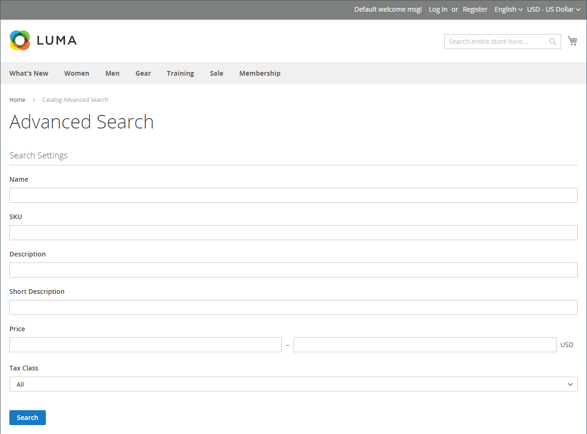
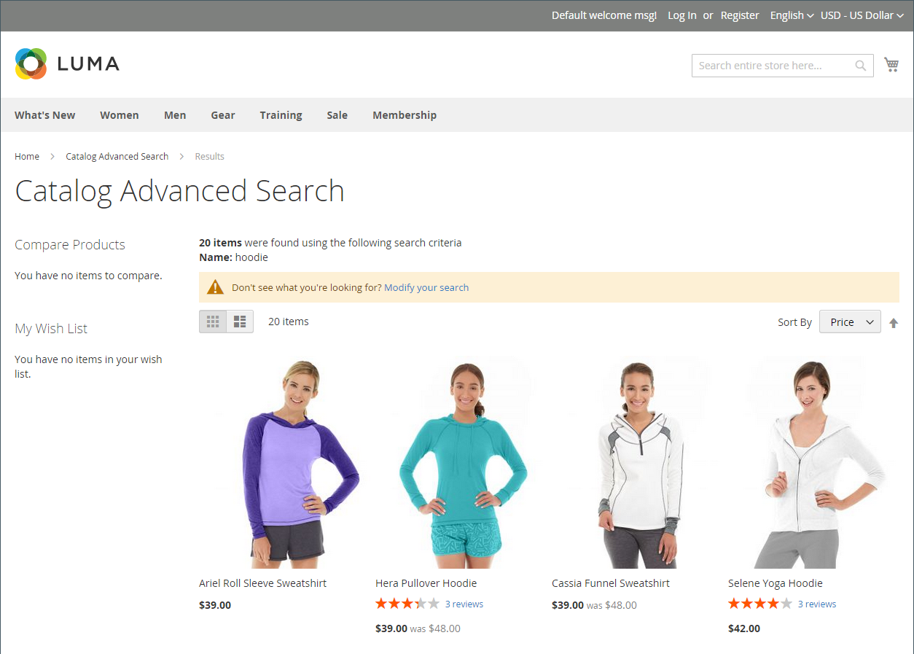
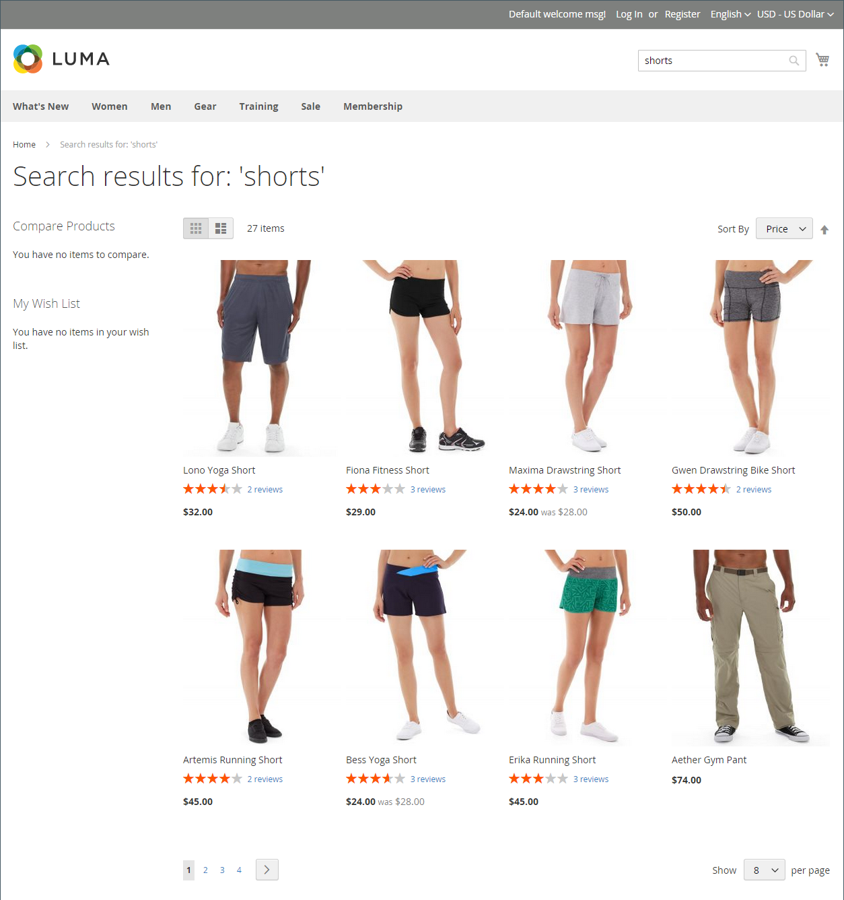
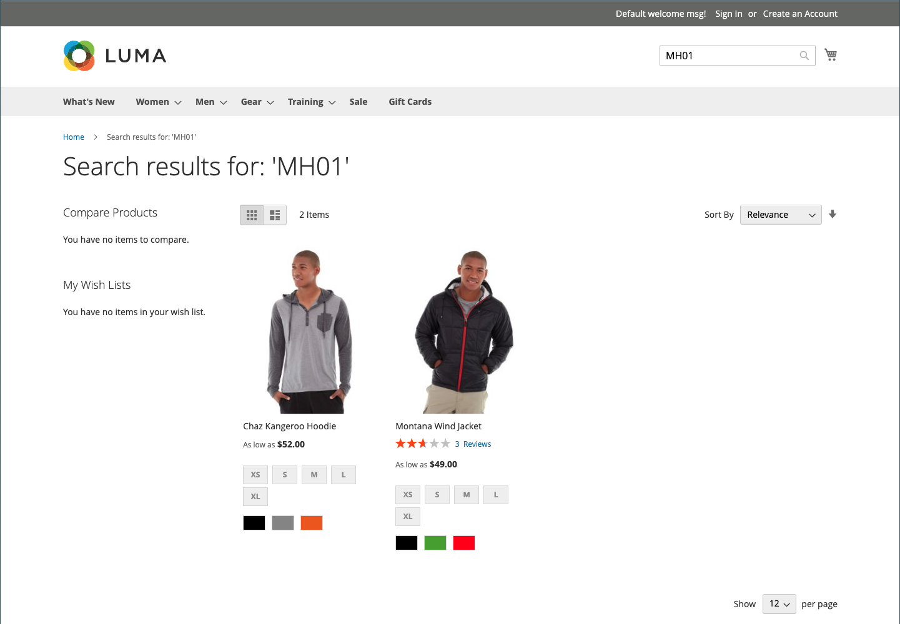
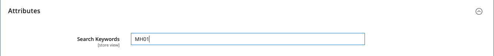

# Catalog Search Overview

>[!TIP]
>
>[Live Search](https://experienceleague.adobe.com/docs/commerce-merchant-services/live-search/overview.html) delivers a lightning fast, super-relevant, and intuitive search experience and is available for Adobe Commerce at no additional charge. This section describes the standard search functionality that might differ from Live Search.

Research shows that people who use search are more likely to make a purchase than those who rely on navigation alone. In fact, according to some studies, people who use search are nearly twice as likely to make a purchase.

The following sections describe how customers search for products in your catalog, and how you can configure catalog search.

## Quick Search

>[!NOTE]
>
>When [Live Search](https://experienceleague.adobe.com/docs/commerce-merchant-services/live-search/live-search-storefront/quick-tour.html) is installed, the search box returns "search as you type" results in a popover.

The Search box in the header of the store helps visitors find products in your catalog. The search text can be the full or partial product name or any other word or phrase that describes the product. The search terms that people use to find products can be managed from the Admin.

1. For **[!UICONTROL Search]**, the customer enters the first few letters of what they want to find.

   Any matches in the catalog appear below, with the number of results found.

1. The customer presses the Enter key or clicks a result in the list of matching products.

   <!-- zoom -->

## Advanced Search

>[!NOTE]
>
>The advanced form search functionality described here does not apply to [Live Search](https://experienceleague.adobe.com/docs/commerce-merchant-services/live-search/overview.html).

Advanced Search lets shoppers search the catalog based on values entered into a form. Because the form contains multiple fields, a single search can include several parameters. The result is a list of all products in the catalog that match the criteria. A link to Advanced Search is in the footer of your store.

<!-- zoom -->

Each field in the form corresponds to an attribute from your product catalog. To add a field, set the frontend properties of the attribute to `Include in Advanced Search`. As a best practice, include only the fields that customers are most likely to use to find a product, because having too many will slow down the search.

1. In the footer of the store, the customer clicks **[!UICONTROL Advanced Search]**.

1. In the _Advanced Search_ form, adds full or partial values in as many fields as necessary.

1. Clicks **[!UICONTROL Search]** to display the results.

   <!-- zoom -->

1. If they do not see what they are looking for in the search results, the customer clicks **[!UICONTROL Modify your search]** and tries another combination of criteria.

## Search Results

>[!NOTE]
>
>This page describes standard search functionality that might differ from [Live Search](https://experienceleague.adobe.com/docs/commerce-merchant-services/live-search/overview.html).

The _Search Results_ list includes all products that match the search criteria entered in the Quick Search box or the Advanced Search form. Every product list in the catalog has essentially the same controls. The only difference is that one is the result of a search query, and the other difference is the result of [navigation](navigation.md).

The results can be formatted as either a grid or list and sorted by a selection of attributes. Pagination controls appear if there are more products than fit on the page. Use these controls to move from one page to the next. The number of records per page is determined by the Catalog Frontend configuration. For more information, see [Product Listings](navigation-product-listings.md).

With **ElasticSearch**:

- There is no out-of-the-box support for search by the suffix. For example, search by SKU may not return the expected result if the keyword contains only the end part of the SKU.
- There is out-of-the-box support for search by prefix (partial keyword search) for `name` and `sku` product attributes only. All other product attributes are searched by the whole keyword, with the exact matching.
- Search results for `name` and `sku` product attributes are based on the relevance, not exact matching. The most relevant matches, such as an exactly matched _Product Name_ or _SKU_, are listed first. To search for an exact match, the customer can use double quotes in the search query. For example, a `WSH12-32-Red` search query may return several products, sorted by the relevance. But a `"WSH12-32-Red"` search query returns only one product with the **_exactly_** matched `sku`.

<!-- zoom -->

### Keyword mapping to extend search results

This technique uses an attribute to create a keyword-based association between two products so that a search for either product returns results for both products. You can use keyword mapping to promote a product in search results where it otherwise would not appear.

<!-- zoom -->

The following example uses keyword mapping based on SKU. When either SKU is entered in the search box, both products appear in the results. The SKUs of the following configurable products are mapped, rather than the SKUs of product variations:

- Montana Wind Jacket (MJ03)
- Chaz Kangaroo Hoodie (MH01)

#### Step 1: Create a new attribute

1. In the _[!UICONTROL Products]_ list, open the `Montana Wind Jacket` (MJ03) in edit mode.
1. In the upper-right corner, click **[!UICONTROL Add Attribute]**.
1. On the _Select Attribute_ page, click **[!UICONTROL Create New Attribute]**.
1. Complete the attribute properties as follows:

   **Attribute Properties**

   - [!UICONTROL Attribute Label] - `Search Keywords`
   - [!UICONTROL Catalog Input Type for Store Owner] - `Text Field`

   **Advanced Attribute Properties**

   - [!UICONTROL Add to Column Options] -  `Yes` (default)
   - [!UICONTROL Use in Filter Options] -  `Yes` (default)

   **Storefront Properties**

   - [!UICONTROL Use in Search] - `Yes`
   - [!UICONTROL Visible on Catalog Pages in the Storefront] - `No`
   - [!UICONTROL Used in Product Listings] - `No`

1. When complete, click **[!UICONTROL Save Attribute]**.

   The attribute is added to the attribute set for the product.

#### Step 2: Map the first product

1. On the product settings page, scroll down and expand the _[!UICONTROL Attributes]_ section.
1. In the **[!UICONTROL Search Keywords]** field, enter the SKU `MH01` that is to be mapped to this product.

   You can enter multiple SKUs separated by a space in the Search Keywords field. In this example, only one is entered.

   <!-- zoom -->

1. When complete, click **[!UICONTROL Save]**.

1. Go to **[!UICONTROL System]** > _[!UICONTROL Tools]_ > **[!UICONTROL Cache Management]** and refresh the **[!UICONTROL Page Cache]**.

#### Step 3: Map the second product

1. In the _[!UICONTROL Products]_ list, open the `Chaz Kangaroo Hoodie` (MH01) in edit mode.

1. Scroll down and expand the **[!UICONTROL Attributes]** section.

1. In the **[!UICONTROL Search Keywords]** field, enter the SKU for the other product, `MJ03`.

1. click **[!UICONTROL Save]**.

1. Go to **[!UICONTROL System]** > _[!UICONTROL Tools]_ > **[!UICONTROL Cache Management]** and refresh the **[!UICONTROL Page Cache]**.

#### Step 4: Test it in the storefront

1. Go to the storefront and enter `MJ03` in the _[!UICONTROL Quick Search]_ box.
1. Verify that both products are returned in the search results list.
