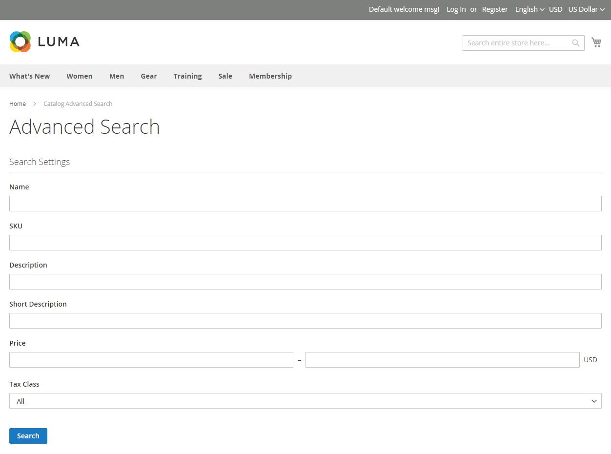
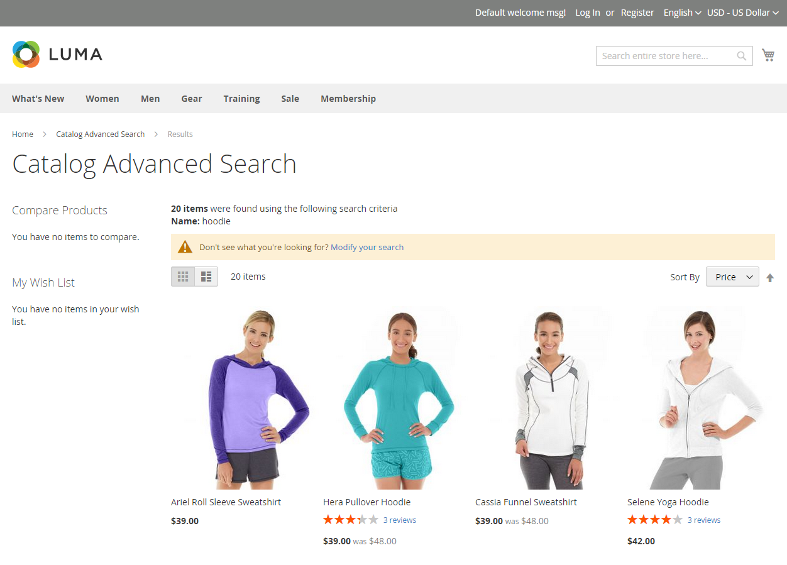

# Catalog search overview

>[!TIP]
>
>[[!DNL Live Search]](https://experienceleague.adobe.com/docs/commerce/live-search/overview.html) delivers a fast, super-relevant, and intuitive search experience and is available for Adobe Commerce at no additional charge. This section describes the standard search functionality that might differ from [!DNL Live Search].

Research shows that people who use search are more likely to make a purchase than customers who rely on navigation alone. In fact, according to some studies, people who use search are nearly twice as likely to make a purchase.

The following sections describe the basic catalog search capabilities. For information about how you can configure and customize the native catalog search capabilities, see:

- [Configure catalog search](search-configuration.md)
- [Search results](search-results.md)
- [Manage search terms](search-terms.md)

>[!NOTE]
>
>The native search functionality in Commerce provides exact match search results. While [!DNL Live Search], an optional module available for installation and enablement within Adobe Commerce, is implemented differently and the result is not limited to the exact search string. For example, where you have ten products labeled numerically for _Omega_: A search for `Omega 1` results in a single match for _Omega 1_ with the native search capability. But the same search string powered by Live Search results in a match for multiple items, _Omega 1_ and _Omega 10_.

## Quick Search

>[!NOTE]
>
>When [[!DNL Live Search]](https://experienceleague.adobe.com/en/docs/commerce/live-search/overview) is installed and the [[!DNL Storefront Popover]](https://experienceleague.adobe.com/en/docs/commerce/live-search/live-search-storefront/storefront-popover) widget is enabled, the search box returns "search as you type" results in a pop over.

The search box in the header of the store helps visitors find products in your catalog. The search text can be the full or partial product name or any other word or phrase that describes the product. The search terms that people use to find products can be managed from the Admin.

1. For **[!UICONTROL Search]**, the customer enters the first few letters of what they want to find.

   Any matches in the catalog appear below, with the number of results found.

1. The customer presses the Enter key or clicks a result in the list of matching products.

   {width="700" zoomable="yes"}

## Advanced Search

>[!NOTE]
>
>The advanced form search functionality described here does not apply to [[!DNL Live Search]](https://experienceleague.adobe.com/docs/commerce/live-search/overview.html).

Advanced Search lets shoppers search the catalog based on values entered into a form. Because the form contains multiple fields, a single search can include several parameters. The result is a list of all products in the catalog that match the criteria. A link to Advanced Search is in the footer of your store.

{width="700" zoomable="yes"}

Each field in the form corresponds to an attribute from your product catalog. To add a field, set the frontend properties of the attribute to `Include in Advanced Search`. As a best practice, include only the fields that customers are most likely to use to find a product, because having too many slows down the search.

1. In the footer of the store, the customer clicks **[!UICONTROL Advanced Search]**.

1. In the _Advanced Search_ form, adds full or partial values in as many fields as necessary.

1. Clicks **[!UICONTROL Search]** to display the results.

   {width="700" zoomable="yes"}

1. If they do not see what they are looking for in the search results, the customer clicks **[!UICONTROL Modify your search]** and tries another combination of criteria.
