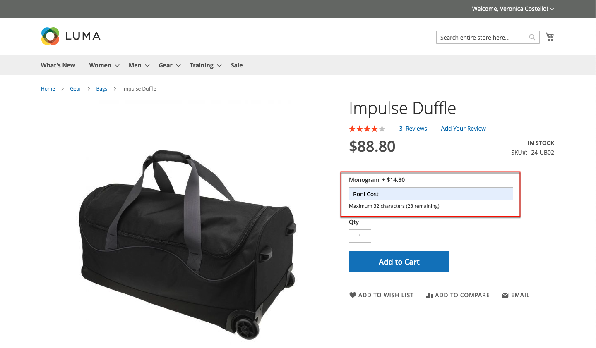
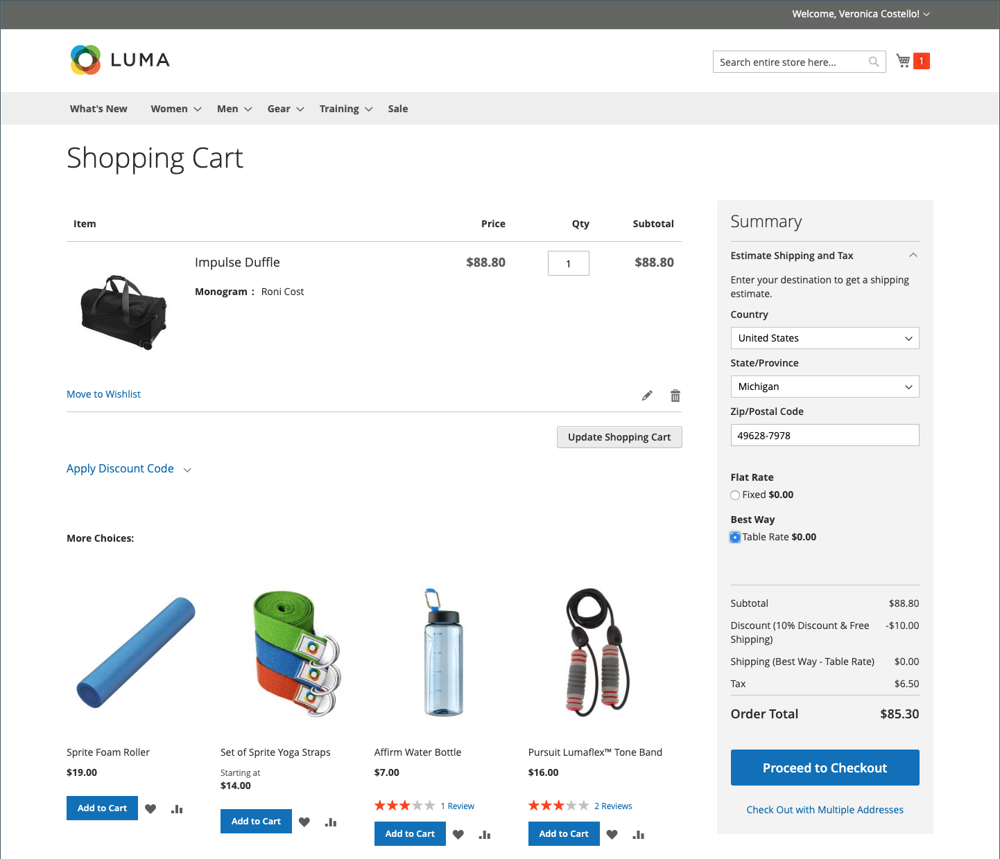
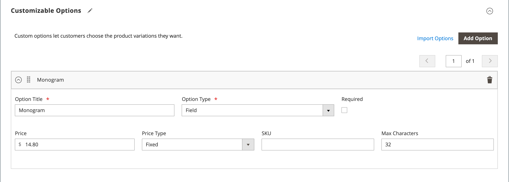

# Product settings - [!UICONTROL Customizable Options]

Adding customizable options to a product is an easy way to offer a selection of options with text, selection, and date input types. Customizable options are a good solution if your inventory needs are simple. However, because they are based on variations of a single SKU, they cannot be used to manage stock or as the basis of price rule conditions. If you have multiple products with the same options, you can set up one product and import the options to the other products.

When a customer purchases a product with a customizable option, a description of each selected option appears below the product description, and any associated markup (or markdown) is automatically applied to the price of the item.

{width="700" zoomable="yes"}

If a cart price rule is triggered by the purchase, the initial calculation applies first to the product price and secondarily to the line item price with any adjustment for applicable customizable options. In the following example, the customer purchases a duffle bag for $74.00, plus a customizable option for a monogram. A markup of $14.80 is applied to the base product price, and the adjusted price is shown as $88.80. In this case, the purchase of the duffle bag triggers a cart price rule based on the product SKU and applies a discount to the purchase, plus free shipping. Although the cart price rule is not triggered by the customizable option, it applies the discount to the cart contents, which includes the markup for the customizable option.

{width="700" zoomable="yes"}

>[!NOTE]
>
>A catalog price rule discount is not applied to the fixed price customizable options.

## Create customizable options

1. Open the product in edit mode.

1. Scroll down and expand  the _[!UICONTROL Customizable Options]_ section.

1. Click **[!UICONTROL Add Option]**.

   {width="600" zoomable="yes"}

1. Complete the new option settings:

   - For **[!UICONTROL Option Title]**, enter a name for the option.

   - Set the **[!UICONTROL Option Type]** for the type of data entry.

   - If the option is not required to purchase the product, deselect the **[!UICONTROL Required]** checkbox.

1. Complete the fields according to the data entry type:

   - For **[!UICONTROL Title]**, enter a name for this option.

   - (Optional) For **[!UICONTROL Price]**, enter any markup or markdown from the base product price that applies to this option.

   - Set **[!UICONTROL Price Type]** to one of the following:

      - `Fixed` - The price of the variation differs from the price of the base product by a fixed monetary amount, such as $1.
      - `Percentage` - The price of the variation differs from the price of the base product by a percentage, such as 10%.

   - (Optional) Enter a **[!UICONTROL SKU]** for the option. The option SKU is a suffix that is added to the product SKU.

   - If the _[!UICONTROL Option Type]_ is `File`, set the parameters for the file. For **[!UICONTROL Compatible File Extensions]**, enter the valid extensions as comma-separated values (such as `png, jpg, gif`). For **[!UICONTROL Maximum Image Size]**, enter the maximum image size in pixels. If it is a text entry, enter the maximum value for **[!UICONTROL Maximum Characters]**.

   {width="600" zoomable="yes"}

1. (Optional) If you want to add another customizable option, click **[!UICONTROL Add Option]**.

   - Complete the settings as before.

   - To change the order of the options, click the _[!UICONTROL Order]_  icon and drag the option to a new position in the list.

   Repeat this step for each option to be added.

1. When complete, click **[!UICONTROL Save]**.

## Import customizable options

1. In the _Customizable Options_ section, click **[!UICONTROL Import Options]**.

1. All products with customizable options appear in the grid.

1. In the list, select the checkbox of the product with the options that you want to import.

1. Click **[!UICONTROL Import]**.

1. When complete, you can continue to add more custom options or click **[!UICONTROL Save and Close]**.

## Input types

| Type                | Description   |
|---------------------|---------------|
| [!UICONTROL Text]   | An input line or text box where the customer can enter the required information. Options: **[!UICONTROL Field]** - A  single-line input field for text. **[!UICONTROL Area]** - A multiple-line input field. This type does not support advanced formatting like HTML. Use Max Characters to limit the length of text that can be entered and ensure correct representation of the entered text in the Admin. |
| [!UICONTROL File]   | Allows the customer to upload a file. |
| [!UICONTROL Select] | Allows the customer to select a single option or multiple options, depending on input type used. Options: **[!UICONTROL Drop-down]** - A drop-down list of options that allows only one selection. **[!UICONTROL Radio Buttons]** - A set of options that allows only one selection. **[!UICONTROL Checkbox]** - A checkbox is a variation of a yes/no option. If the product has more than one checkbox, multiple selections can be made. **[!UICONTROL Multiple Select]** - A drop-down list box of options that accepts multiple selections. To choose multiple options, hold down the Ctrl (PC) or Command (Mac) key and click each option. |
| [!UICONTROL Date]   | Allows the customer to enter a date or time or choose the value from a calendar. Options:  **[!UICONTROL Date]** - An input field for a date value. The date can be typed directly into the field or selected from a list or calendar. The input method and format is determined by the [date and time options](attributes-input-types.md#date-and-time-options) configuration. **[!UICONTROL Date & Time]** - An input field for a date and time value. **[!UICONTROL Time]** - An input field for a time value. |

{style="table-layout:auto"}
