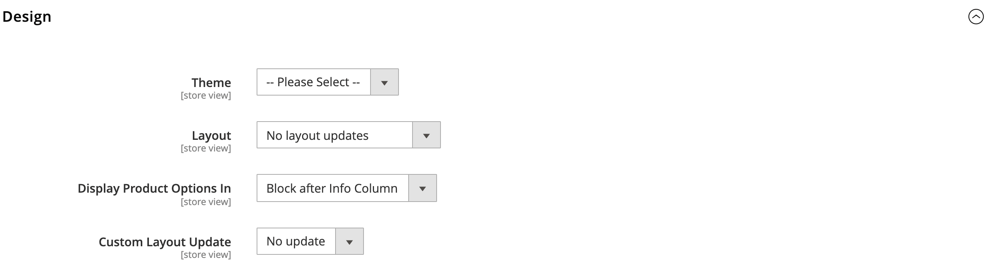

# Product settings - [!UICONTROL Design]

The _[!UICONTROL Design]_ settings allow a different theme to be applied to the product page, change the column layout, determine where product options appear, and enter custom XML code.

{width="600" zoomable="yes"}

>[!NOTE]
>
>When the same product is assigned to several categories with different design settings for each category, it is recommended to set **[!UICONTROL Use Categories Path for Product URLs]** = `Yes` in the [Search Engine Optimization configuration options](../configuration-reference/catalog/catalog.md#search-engine-optimization). To access this setting, go to  **[!UICONTROL Stores]** > _[!UICONTROL Settings]_ > **[!UICONTROL Configuration]**, expand **[!UICONTROL Catalog]** and choose **[!UICONTROL Catalog]** underneath in the left panel, and then expand the **[!UICONTROL Search Engine Optimization]** section on the page.

|Field|[Scope](../getting-started/websites-stores-views.md#scope-settings)|Description|
|---|---|----|
|[!UICONTROL Theme]|Store View| (Adobe Commerce only) Gives you the ability to apply a different theme to the product. Options: (All available themes)|
|[!UICONTROL Layout]|Store View|Gives you the ability to apply a different [layout](../content-design/page-layout.md) to the product page. Options:  **[!UICONTROL No layout updates]** - By default, layout updates are not available for the product page.  **[!UICONTROL Empty]** - Allows you to define your own layout, such as a 4-column page. (Requires an understanding of XML.)  **[!UICONTROL 1 column]** - Applies a one-column layout to the product page.  **[!UICONTROL 2 columns with left bar]** - Applies a two-column layout with a left sidebar to the product page.  **[!UICONTROL 2 columns with right bar]** - Applies a two-column layout with a right sidebar to the product page.  **[!UICONTROL 3 columns]** - Applies a three-column layout to the product page.  **[!UICONTROL Page -- Full Width]** - (Requires [[!DNL Page Builder]](../page-builder/introduction.md)) Applies the full-width layout for CMS pages to the product page.  **[!UICONTROL Category -- Full Width]** - (Requires [!DNL Page Builder]) Applies the full-width layout for category pages to the product page.  **[!UICONTROL Product -- Full Width]** - (Requires [!UICONTROL Page Builder]) Applies the full-width layout for product pages to the product page.|
|[!UICONTROL Display Product Options In]|Store View|Determines where the product options appear on the product page. Options: `Product Info Column` / `Block after Info Column`|
|[!UICONTROL Custom Layout Update]|Store View|Used to access options to update a custom layout on the product page.|

{style="table-layout:auto"}

