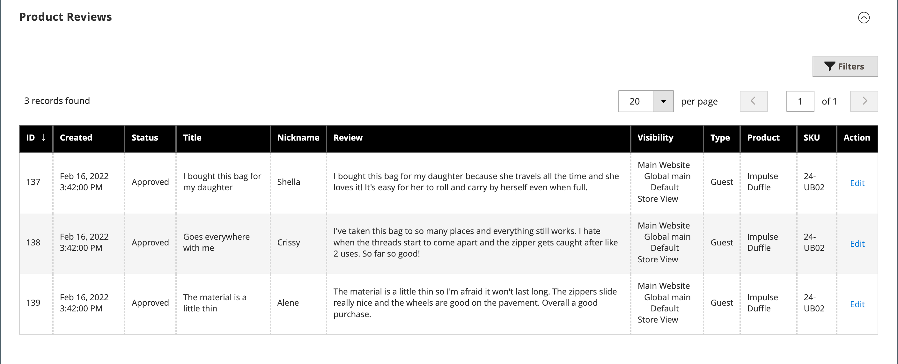

# Product settings - [!UICONTROL Product Reviews]

The _[!UICONTROL Product Reviews]_ section lists all reviews that customers have submitted about the product. This section appears with the other product information only after a new product is saved for the first time. For more information, see [Product Reviews](../merchandising-promotions/product-reviews.md).

<!-- zoom -->

## Field reference

|Field|Description|
|--- |--- |
|[!UICONTROL ID]|Unique, numeric ID generated for the product review entry|
|[!UICONTROL Created]|Date of publication of the review|
|[!UICONTROL Status]|Review status (`Pending`, `Approved`, or `Not Approved`)|
|[!UICONTROL Title]|Review title|
|[!UICONTROL Nickname]|The nickname of the user who left the review|
|[!UICONTROL Review]|Customer review on the current product|
|[!UICONTROL Visibility]|Visibility in store reviews|
|[!UICONTROL Type]|Type of user who left the review (`Guest` or `Customer`)|
|[!UICONTROL Product]|Reviewed product name|
|[!UICONTROL SKU]|The unique Stock Keeping Unit that is assigned to the product|
|[!UICONTROL Action]|Opens the product in edit mode|

{style="table-layout:auto"}

## Moderate reviews for a specific product

1. On the _Admin_ sidebar, go to **[!UICONTROL Catalog]** > **[!UICONTROL Products]**.

1. Locate the product and open it in edit mode.

1. Scroll to the _[!UICONTROL Product Reviews]_ section.

1. Click **[!UICONTROL Edit]** for a product review with `Pending` status to view and edit the details.

1. Set status for review:

   - To approve a pending review, select `Approved`.
   - To reject a review, select `Not Approved`.
   - You can change the review status back to `Pending` at any time.

1. When complete, click **[!UICONTROL Save Review]**.

Reviews with the `Pending` and `Not Approved` statuses are not displayed on the storefront.
