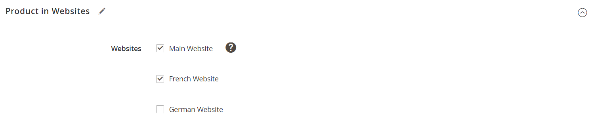

# Product settings - [!UICONTROL Product in Websites]

The _[!UICONTROL Product in Websites]_ section identifies each website where the product is available, according to the [store hierarchy](../stores-purchase/stores.md).

{width="550"}

**_To copy a product to a different website:_**

1. Open the product in edit mode.

1. Scroll down and expand  the _[!UICONTROL Product in Websites]_ section.

   {width="600" zoomable="yes"}

1. Select the checkbox of the website where you want to place the copied product.

   For a single website installation, the website checkbox is selected by default.

1. Choose the **[!UICONTROL Store View]** where you want to make a copy of the existing product.

1. Click **[!UICONTROL Save]** and do the following:

   - When you return to the product record, set the **[!UICONTROL Store View]** chooser to the store view to which the product was copied. When prompted to confirm scope switching, click **[!UICONTROL OK]**.

   - Enter the **[!UICONTROL Price]** of the product for this store view.

   Because the scope of the base currency is set to `website`, it is possible to sell the product for a different price in each website.

1. When complete, click **[!UICONTROL Save]**.
