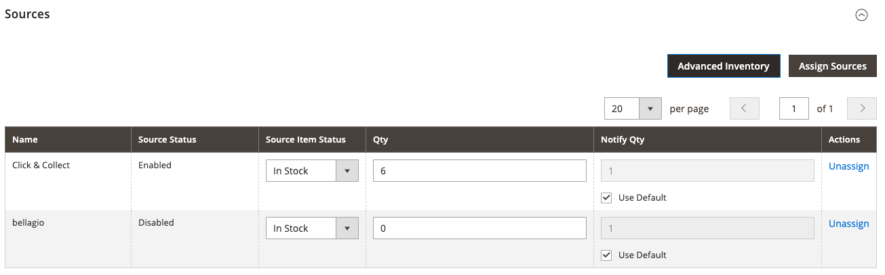

# Product settings - [!UICONTROL Sources]

The _[!UICONTROL Sources]_ section of the product settings lists the sources from which the product can be distributed. It is used to assign and unassign sources as well as manage the quantity and availability of the product. This section is displayed only if there is more than one source defined for your store. For more information about sources, see [Manage sources](../inventory-management/sources-manage.md).

## Assign a source for a product

1. Click **[!UICONTROL Assign Source]**.

1. Select the checkbox for the required sources.

1. Click **[!UICONTROL Done]**.

1. Select **[!UICONTROL Source Item Status]** and enter the **[!UICONTROL Qty]** and **[!UICONTROL Notify Qty]** values as needed.

1. Click **[!UICONTROL Save]** to save the changes.

{width="600" zoomable="yes"}

## Field reference

|Field|Description|
|--- |--- |
|[!UICONTROL Name]|The unique name for a source.|
|[!UICONTROL Source Status]|Determines if the product is enabled or disabled in the catalog.|
|[!UICONTROL Source Item Status]|Determines the current availability of the product. Options: **[!UICONTROL In Stock]** - Makes the product available for purchase. **[!UICONTROL Out of Stock]** - Unless backorders are activated, prevents the product from being available for purchase and removes the listing from the catalog.|
|[!UICONTROL Qty]|On-hand stock amounts for each source.|
|[!UICONTROL Notify Qty]|An amount for the _Notify for Quantity_ for this specific source if `Notify Quantity Use Default` is not selected.|
|[!UICONTROL Notify Qty Use Default]|Indicates to use the default setting for _Notify for Quantity_ in the product Advanced Inventory or global setting in the store configuration. For more information about advanced inventory settings for your product, see [Configure advanced product options](../inventory-management/product-options.md).|
|[!UICONTROL Actions]|For an assigned source, click **[!UICONTROL Unassign]** to make the source not available for the product. For an unassigned source, click **[!UICONTROL Assign Sources]** to make a source available for the product. For more information about [!UICONTROL Assign Sources] options, see [Assigning Sources per Product](../inventory-management/sources-assign-per-product.md).|

{style="table-layout:auto"}

