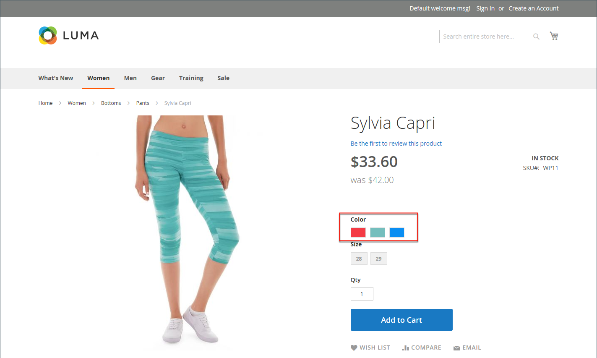
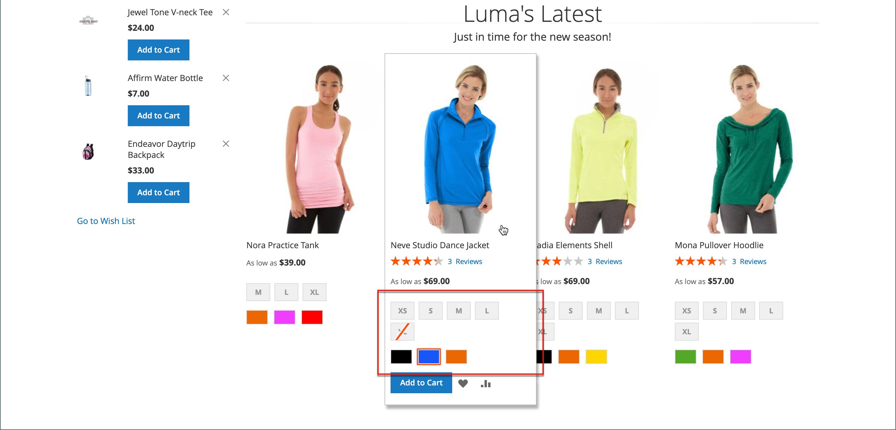
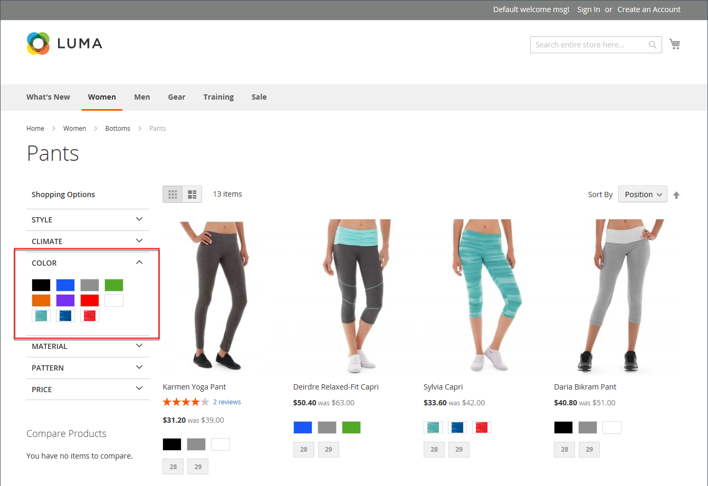
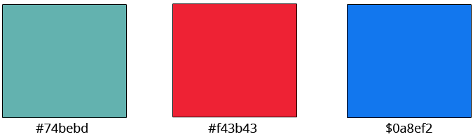
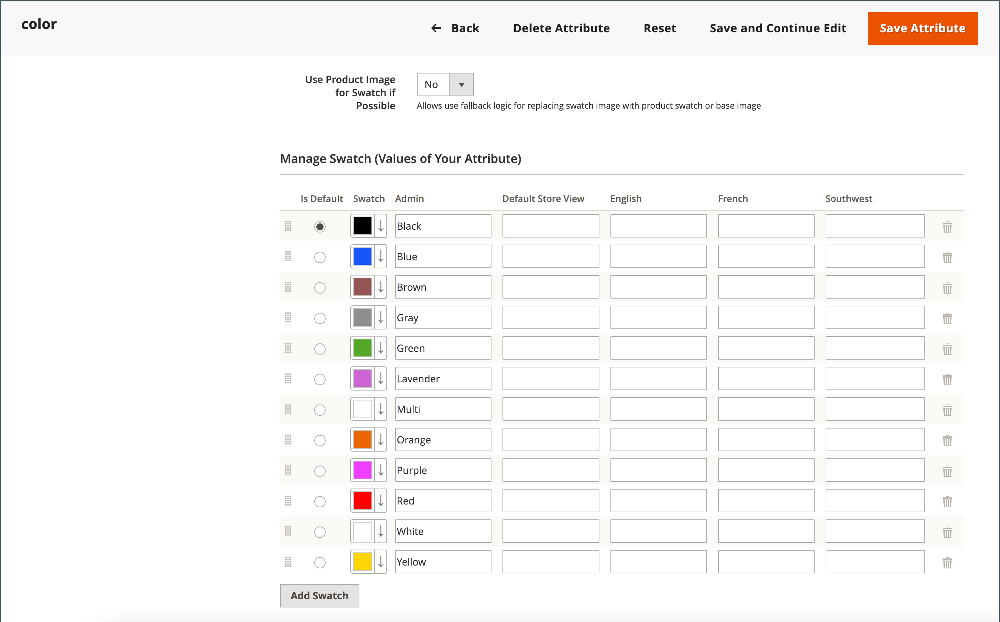
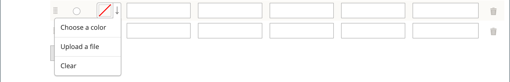
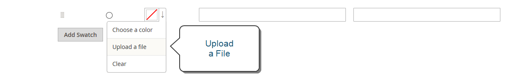
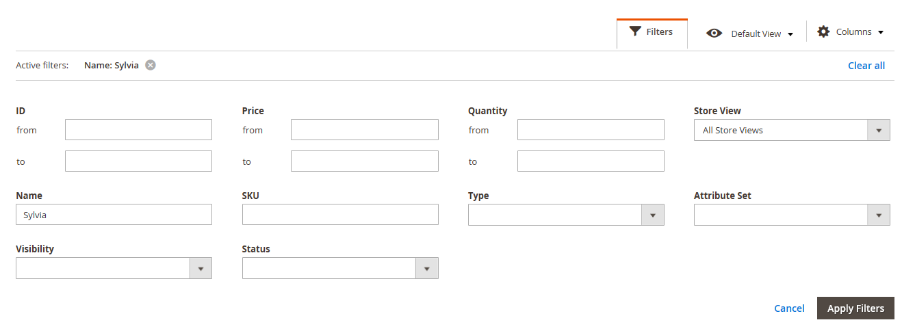
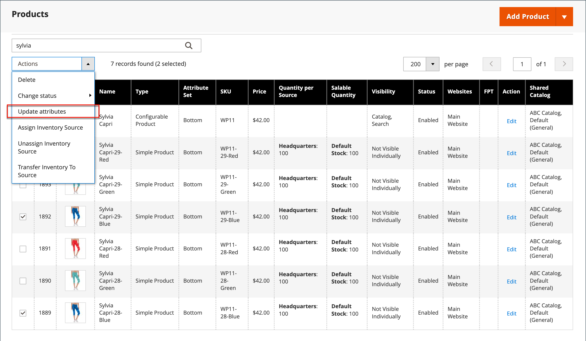

# Product swatches

Customers have high expectations for choosing a color, and it is crucial that product descriptions accurately represent each available color, pattern, or texture. For example, the pants in the following example are not available in red, green, and blue. Rather, they are available only in specific shades of red, green, and blue, which are probably unique to this product.

<!-- zoom -->

For [configurable products](product-create-configurable.md), color can be indicated by a visual swatch, text swatch, or input control. Swatches can be used on the product page, in product listings, and in [layered navigation](navigation-layered.md). On the product page, swatches are synchronized to display the corresponding product image when the swatch is selected. When the customer selects the swatch, the corresponding value appears in the input field and the swatch is outlined as the current selection.

>[!NOTE]
>
>Swatch attributes can be configured to not display corresponding simple product images when the swatch is selected by setting the _[!UICONTROL Update Product Preview Image]_ option value to `No` on the [!UICONTROL Attribute Edit] page in the Admin.

## Text-based swatches

If an image isn't available for a swatch, the attribute value appears as text. A text-based swatch is like a button with a text label, and behaves in the same way as a swatch with an image. When text-based swatches are used to show the available sizes, any size that is not available is crossed out.

<!-- zoom -->

## Swatches in layered navigation

Swatches can also be used in layered navigation, if the Use in **Layered Navigation** property of the color attribute is set to `Yes`. The following example shows both text-based and color image swatches in layered navigation.

<!-- zoom -->

## Create swatches for products

Swatches can be defined as a component of the `color` attribute or set up locally for a specific product and uploaded as [product images](product-image.md#upload-an-image).

In the earlier examples, the "Sylvia Capri" pants are available in specific values of `red`, `green`, and `blue`. Because the swatches were taken from the product image, each is a true representation of the color. The `color` attribute is used to manage the information for all product colors and swatches.

### Step 1: Create the swatches

Use either of the following methods to create swatches for your products.

#### Method 1: Add a color swatch

1. To capture the true color of a product, open the image in a photo editor and use the eye dropper tool to identify the exact color and take note of the equivalent hexadecimal value.

   <!-- zoom -->

1. On the _Admin_ sidebar, go to **[!UICONTROL Stores]** > _[!UICONTROL Attributes]_ > **[!UICONTROL Product]**.

1. In the grid, open the _color_ attribute in edit mode.

1. Verify that **Catalog Input Type for Store Owner** is set to `Visual Swatch`.

1. If you prefer to not display corresponding simple product images when the swatch is selected on the product display page, set the "Update Product Preview Image" option value to "No".

1. Under _Manage Swatch_ (values of your attribute), click **Add Swatch** and do the following:

   <!-- zoom -->

   - In the _Swatch_ column, click the new swatch and select **Choose a color** from the menu.

      <!-- zoom -->

   - In the color picker, place your cursor in the **#** field, press the **Backspace** key to delete the current value, and enter the six-character hexadecimal value of the new color.

      <!-- zoom -->

   - To save the swatch, click the **Color Wheel** (  ) icon in the lower-right corner of the color picker.

   - In the _Admin_ column, enter a label to describe the color to the store administrator.

      If applicable, you can also enter the translation of the color for each language supported. In the following example, we include the SKU for reference in the _Admin_ label because the colors are used only for a specific product. You can include a space or underscore in the label, but not a hyphen.

   - In the _Is Default_ column, select the swatch that is to be the default option.

   - To change the order of the swatches, simply drag each swatch into position.

      <!-- zoom -->

1. When complete, click **[!UICONTROL Save Attribute]** and refresh the cache when prompted.

1. Open each product in edit mode and update the **Color** attribute with the correct swatch.

   To update multiple products at the same time, follow the steps below.

#### Method 2: Upload a swatch image

1. To capture an image for a swatch, open the product image in a photo editor and save a square area of the image that depicts the color, pattern, or texture.

   If needed, you can repeat this for each variation of the product.

   The size and dimensions of the swatch is determined by the theme. Generally, saving an image as a square helps to preserve the aspect ratio of a pattern.

   <!-- zoom -->

1. On the _Admin_ sidebar, go to **[!UICONTROL Stores]** > _[!UICONTROL Attributes]_ > **[!UICONTROL Product]**.

1. In the grid, open the **[!UICONTROL color]** attribute in edit mode.

1. Verify that **[!UICONTROL Catalog Input Type for Store Owner]** is set to `Visual Swatch`.

1. If you prefer to not display corresponding simple product images when the swatch is selected on the product display page, set **[!UICONTROL Update Product Preview Image]** to `No`.

1. Under _[!UICONTROL Manage Swatch]_ (values of your attribute), click **[!UICONTROL Add Swatch]** and do the following:

   - In the _[!UICONTROL Swatch]_ column, click the new swatch to display the menu and choose **[!UICONTROL Upload a file]**.

      <!-- zoom -->

   - Navigate to the swatch file that you prepared and choose the file to upload.

   - Repeat these steps for each swatch image.

   - Enter the labels for the Admin and storefront.

      In this example, we include the SKU in the admin label for reference because these colors are used only for a specific product. You can include a space or underscore in the label, but cannot include a hyphen.

      <!-- zoom -->

1. When complete, click **[!UICONTROL Save Attribute]** and refresh the cache when prompted.

1. Open each product in edit mode and update the **[!UICONTROL Color]** attribute with the correct swatch.

   To update multiple products at the same time, follow the steps below.

### Step 2: Update the products

1. On the _Admin_ sidebar, go to **[!UICONTROL Catalog]** > **[!UICONTROL Products]**.

1. Use the **[!UICONTROL Filter]** to display the list by Name or SKU and include only the applicable products.

   The following example filters the list on a partial product name.

   <!-- zoom -->

1. In the grid, select the checkbox of each product to which the swatch applies.

1. Set **[!UICONTROL Actions]** to `Update Attributes`.

   In this example, all blue capri pants are selected.

   <!-- zoom -->

1. Scroll down to the **[!UICONTROL Color]** attribute and select the **[!UICONTROL Change]** checkbox.

   <!-- zoom -->

1. Choose the swatch that applies to the selected products and click **[!UICONTROL Save]**.

1. When prompted, refresh the cache.

   <!-- zoom -->

## Add swatches to a simple product

1. On the _Admin_ sidebar, go to **[!UICONTROL Catalog]** > **[!UICONTROL Products]**.

1. Open a product in edit mode, check the product status (should be enabled).

1. Click **[!UICONTROL Create Configurations]** button (under the `Configurations` tab).

1. In the pop-up window, choose the Color attribute and **[!UICONTROL Next]**.

1. Select color swatches from the attribute that you want to include in this product.

1. In the progress bar, click **[!UICONTROL Next]**.

1. [Configure the images, price, and quantity](product-create-configurable.md#step-3-configure-the-images-price-and-quantity).

   On this step, set the images, pricing, and quantity of each configuration. The available options are the same for each, and you can choose only one. You can apply the same setting to all SKUs, apply a unique setting to each SKU, or skip the settings for now.

1. When configuration for images, price, and quantity are complete, click **[!UICONTROL Next]** in the upper-right corner.

   The current product variations appear at the bottom of the Configuration section. If you are satisfied with the configurations, click **[!UICONTROL Generate Products]**.
