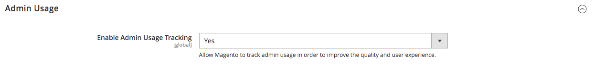

# Advanced > Admin

{{config}}

## [!UICONTROL Admin User Emails]

<!-- zoom -->

For more information about changing these settings, see [Forgotten password and reset email](../../systems/permissions-users-all.md#forgotten-password-and-reset-emails).

| Field                                       | [Scope](../../getting-started/websites-stores-views.md#scope-settings) | Description                                                                                                                                                                                                    |
|---------------------------------------------|------------------------------------------------------------------------|----------------------------------------------------------------------------------------------------------------------------------------------------------------------------------------------------------------|
| [!UICONTROL Forgot Password Email Template] | Global                                                                 | Identifies the email template that is used for the message that is sent when an Admin user forgets their password. Default template: `Forgot Admin Password`                                                   |
| [!UICONTROL Forgot and Reset Email Sender]  | Global                                                                 | Identifies the store contact that appears as the sender of the _Forgot Password_ email. Default sender: `General Contact` Other sender options: `Sales Representative`, `Customer Support`, `Custom Email` |
| [!UICONTROL User Notification Template]     | Global                                                                 | Determines the email template that is used as the default for Admin notifications. Default template: `User Notification`                                                                                       |

{style="table-layout:auto"}

## [!UICONTROL Startup Page]

<!-- zoom -->

For more information about changing these settings, see [Change the startup page](../../getting-started/admin-dashboard.md#change-the-startup-page) in the _Getting Started Guide_.

| Field                     | [Scope](../../getting-started/websites-stores-views.md#scope-settings) | Description                                                      |
|---------------------------|------------------------------------------------------------------------|------------------------------------------------------------------|
| [!UICONTROL Startup Page] | Global                                                                 | Determines the Admin landing page that appears after you log in. |

{style="table-layout:auto"}

### [!UICONTROL Startup Page] options

| Area                                                    |                                                                                                                                                                                                                                                                                                                                                                           | Option                                                                                                                                                                                                                                                                                                                                                                                                                                                                                                                                                                                      |
|---------------------------------------------------------|---------------------------------------------------------------------------------------------------------------------------------------------------------------------------------------------------------------------------------------------------------------------------------------------------------------------------------------------------------------------------|---------------------------------------------------------------------------------------------------------------------------------------------------------------------------------------------------------------------------------------------------------------------------------------------------------------------------------------------------------------------------------------------------------------------------------------------------------------------------------------------------------------------------------------------------------------------------------------------|
| [`Dashboard`](../../getting-started/admin-dashboard.md) |                                                                                                                                                                                                                                                                                                                                                                           |                                                                                                                                                                                                                                                                                                                                                                                                                                                                                                                                                                                             |
| `Sales`                                                 | `Operations`                                                                                                                                                                                                                                                                                                                                                              | [`Quotes`](../../b2b/quotes.md)   [`Orders`](../../stores-purchase/orders.md) [`Invoices`](../../stores-purchase/invoices.md) [`Shipments`](../../stores-purchase/shipments.md) [`Credit Memos`](../../stores-purchase/credit-memos.md) [`Billing Agreements`](../../stores-purchase/paypal-billing-agreements.md) [`Returns`](../../stores-purchase/returns.md)   [`Transactions`](../../stores-purchase/transactions.md) `Braintree Virtual Terminal` |
| `Catalog`                                               | [`Inventory`](../../inventory-management/introduction.md)                                                                                                                                                                                                                                                                                                                 | [`Products`](../../catalog/products-list.md) [`Categories`](../../catalog/categories.md) [`Shared Catalog`](../../b2b/catalog-shared-create.md)                                                                                                                                                                                                                                                                                                                                                                                      |
| `Customers`                                             | [`All Customers`](../../customers/customers-all.md) [`Now Online`](../../customers/now-online.md) [`Customer Groups`](../../customers/customer-groups.md) [`Segments`](../../customers/customer-segments.md)   [`Companies`](../../b2b/account-companies.md) |                                                                                                                                                                                                                                                                                                                                                                                                                                                                                                                                                                                             |
| `Marketing`                                             | `Promotions`                                                                                                                                                                                                                                                                                                                                                              | [`Catalog Price Rule`](../../merchandising-promotions/price-rules-catalog.md)  [`Cart Price Rules`](../../merchandising-promotions/price-rules-cart.md))  [`Related Products Rules`](../../merchandising-promotions/product-related-rules.md)   [`Gift Card Accounts`](../../stores-purchase/product-gift-card-accounts.md)                                                                                                                                                         |
|                                                         | [`Private Sales`](../../merchandising-promotions/events-private-sales.md)                                                                                                                                                                                                                                                   | [`Events`](../../merchandising-promotions/event-configure.md)  [`Invitations`](../../merchandising-promotions/invitations.md)                                                                                                                                                                                                                                                                                                                                                                                                                                                           |
|                                                         | `Communications`                                                                                                                                                                                                                                                                                                                                                          | [`Email Templates`](../../systems/email-templates.md)  [`Newsletter Template`](../../merchandising-promotions/newsletter-template.md)  [`Newsletter Queue`](../../merchandising-promotions/newsletter-queue.md)  [`Newsletter Subscribers`](../../merchandising-promotions/newsletter-subscribers.md)  [`Email Reminders`](../../merchandising-promotions/email-reminder-rules.md)                                                                                                                                            |
|                                                         | `SEO & Search`                                                                                                                                                                                                                                                                                                                                                            | [`Search Terms`](../../catalog/search-terms.md)  [`Search Synonyms`](../../catalog/search-terms.md#search-synonyms)  [`URL Rewrites`](../../merchandising-promotions/url-rewrite.md)  [`Site Map`](../../merchandising-promotions/sitemap-xml.md)                                                                                                                                                                                                                                                                                 |
|                                                         | [`User Content`](../../catalog/settings-advanced-product-reviews.md)                                                                                                                                                                                                                                                                                                      | [`All Reviews`](../../catalog/settings-advanced-product-reviews.md)  [`Pending Reviews`](../../merchandising-promotions/product-reviews-moderate.md)                                                                                                                                                                                                                                                                                                                                                                                                                                |
| `Content`                                               | `Elements`                                                                                                                                                                                                                                                                                                                                                                | [`Pages`](../../content-design/pages.md) [`Hierarchy`](../../content-design/page-hierarchy.md)  [`Blocks`](../../content-design/blocks.md) [`Dynamic Blocks`](../../content-design/dynamic-blocks.md)  [`Widgets`](../../content-design/widgets.md) [`Media Gallery`](../../content-design/media-storage.md)                                                                                                                                                                |
|                                                         | `Design`                                                                                                                                                                                                                                                                                                                                                                  | [`Configuration`](../../content-design/configuration.md) [`Themes`](../../content-design/themes.md) [`Schedule`](../../content-design/schedule.md)                                                                                                                                                                                                                                                                                                                                                                                                                                  |
|                                                         | `Content Staging`                                                                                                                                                                                                                                                                                                      | [Dashboard](../../content-design/content-staging.md)                                                                                                                                                                                                                                                                                                                                                                                                                                                                                                                                        |
| `Reports`                                               | [`Marketing`](../../getting-started/marketing-reports.md)                                                                                                                                                                                                                                                                                                                 | `Products in Cart` `Search Terms` `Abandoned Carts` `Newsletter Problem Reports`                                                                                                                                                                                                                                                                                                                                                                                                                                                                                             |
|                                                         | [`Reviews`](../../getting-started/review-reports.md)                                                                                                                                                                                                                                                                                                                      | `By Customer`  `By Products`                                                                                                                                                                                                                                                                                                                                                                                                                                                                                                                                                        |
|                                                         | [`Sales`](../../getting-started/sales-reports.md)                                                                                                                                                                                                                                                                                                                         | `Orders` `Tax` `Invoiced` `Shipping` `Refunds` `Coupons` `PayPal Settlement` `Braintree Settlement`                                                                                                                                                                                                                                                                                                                                                                                                                                                             |
|                                                         | `System Insights`                                                                                                                                                                                                                                                                                                                                                         | [`Site-Wide Analysis Tool`](https://experienceleague.adobe.com/docs/commerce-operations/tools/site-wide-analysis-tool/access.html)                                                                                                                                                                                                                                                                                                                                                                                                            |
|                                                         | [`Customers`](../../getting-started/customer-reports.md)                                                                                                                                                                                                                                                                                                                  | `Order Total` `Order Count` `New` `Wish Lists` `Segments`                                                                                                                                                                                                                                                                                                                                                                                                                                                                                                               |
|                                                         | [`Products`](../../getting-started/product-reports.md)                                                                                                                                                                                                                                                                                                                    | `Views` `Bestsellers` `Low Stock` `Ordered` `Downloads`                                                                                                                                                                                                                                                                                                                                                                                                                                                                                                                     |
|                                                         | [`Private Sales`](../../getting-started/private-sales-reports.md)                                                                                                                                                                                                                                                           | `Invitations` `Invited Customers` `Conversions`                                                                                                                                                                                                                                                                                                                                                                                                                                                                                                                                     |
|                                                         | `Statistics`                                                                                                                                                                                                                                                                                                                                                              | [`Refresh Statistics`](../../getting-started/sales-reports.md#refresh-statistics)                                                                                                                                                                                                                                                                                                                                                                                                                                                                                                           |
|                                                         | [`Business Intelligence`](../../getting-started/business-intelligence.md)                                                                                                                                                                                                                                                                                                 | `Advanced Reporting` `BI Essentials`                                                                                                                                                                                                                                                                                                                                                                                                                                                                                                                                                |
|                                                         | `Customer Engagement`                                                                                                                                                                                                                                                                                                                                                     | `Dashboard` `Importer Status` `Automation Enrollment` `Campaign Sends` `SMS Sends` `Cron Tasks` `Log Viewer` `Abandoned Carts`                                                                                                                                                                                                                                                                                                                                                                                                                                  |
| `Stores`                                                | `Settings`                                                                                                                                                                                                                                                                                                                                                                | [`All Stores`](../../stores-purchase/stores.md) [`Configuration`](../../configuration-reference/guide-overview.md) [`Terms and Conditions`](../../stores-purchase/terms-and-conditions.md) [`Order Status`](../../stores-purchase/order-status.md)                                                                                                                                                                                                                                                                                                                              |
|                                                         | [`Inventory`](../../inventory-management/introduction.md)                                                                                                                                                                                                                                                                                                                 | [`Sources`](../../inventory-management/sources-stocks.md#sources) [`Stocks`](../../inventory-management/sources-stocks.md#stocks)                                                                                                                                                                                                                                                                                                                                                                                                                                                       |
|                                                         | [`Taxes`](../../stores-purchase/taxes.md)                                                                                                                                                                                                                                                                                                                                 | [`Tax Rules`](../../stores-purchase/tax-rules.md) [`Tax Zones and Rates`](../../stores-purchase/tax-zones-rates.md)                                                                                                                                                                                                                                                                                                                                                                                                                                                                     |
|                                                         | [`Currency`](../../stores-purchase/currency.md)                                                                                                                                                                                                                                                                                                                           | [`Currency Rates`](../../stores-purchase/currency-configuration.md) [`Currency Symbols`](../../stores-purchase/currency-configuration.md#step-5-customize-currency-symbols-optional)                                                                                                                                                                                                                                                                                                                                                                                                    |
|                                                         | `Attributes`                                                                                                                                                                                                                                                                                                                                                              | [`Customer`](../../systems/data-attributes-customer.md) [`Customer Address`](../../systems/data-attributes-customer.md#customer-addresses) [`Product`](../../systems/data-attributes-product.md) [`Attribute Set`](../../catalog/attribute-sets.md) [`Returns`](../../stores-purchase/attributes-returns.md) [`Ratings`](../../merchandising-promotions/product-reviews.md#create-custom-ratings)                                                                                                                                                                       |
|                                                         | `Other Settings`                                                                                                                                                                                                                                                                                                                                                          | [`Reward Exchange Rates`](../../merchandising-promotions/reward-exchange-rates.md) [`Gift Wrapping`](../../stores-purchase/cart-configuration.md#gift-wrap) [`Gift Registry`](../../merchandising-promotions/gift-registry-create.md)                                                                                                                                                                                                                                                                                                                                               |
| `System`                                                | [`Data Transfer`](../../systems/data-transfer.md)                                                                                                                                                                                                                                                                                                                         | [`Import`](../../systems/data-import.md) [`Export`](../../systems/data-export.md) [`Import/Export Tax Rates`](../../systems/data-transfer-tax-rates.md) [`Import History`](../../systems/data-import.md#import-history) [`Scheduled Import/Export`](../../systems/data-scheduled-import-export.md)                                                                                                                                                                                                                                                                          |
|                                                         | `Extensions`                                                                                                                                                                                                                                                                                                                                                              | [`Integrations`](../../systems/integrations.md)                                                                                                                                                                                                                                                                                                                                                                                                                                                                                                                                             |
|                                                         | `Tools`                                                                                                                                                                                                                                                                                                                                                                   | [`Cache Management`](../../systems/cache-management.md) [`Index Management`](../../systems/index-management.md)                                                                                                                                                                                                                                                                                                                                                                                                                                                                         |
|                                                         | `Support`                                                                                                                                                                                                                                                                                                                                                                 | [`Data Collector`](../../systems/support.md#data-collector) [`System Report`](../../systems/support.md#system-reports)                                                                                                                                                                                                                                                                                                                                                                                                                                                                  |
|                                                         | `Permissions`                                                                                                                                                                                                                                                                                                                                                             | [`All Users`](../../systems/permissions-users-all.md) [`Locked Users`](../../systems/permissions-users-all.md#locked-users) [`User Roles`](../../systems/permissions-user-roles.md)                                                                                                                                                                                                                                                                                                                                                                                                 |
|                                                         | `Action Log`                                                                                                                                                                                                                                                                                                                | [`Report`](../../systems/action-log.md) [`Archive`](../../systems/action-log-archive.md) [`Bulk Actions`](../../systems/action-log-bulk-actions.md)                                                                                                                                                                                                                                                                                                                                                                                                                                 |
|                                                         | `Other Settings`                                                                                                                                                                                                                                                                                                                                                          | [`Notifications`](../../systems/notifications.md) [`Custom Variables`](../../systems/variables-custom.md) [`Manage Encryption Key`](../../systems/encryption-key.md)                                                                                                                                                                                                                                                                                                                                                                                                                |
| `Find Partners & Extensions`                            |                                                                                                                                                                                                                                                                                                                                                                           |                                                                                                                                                                                                                                                                                                                                                                                                                                                                                                                                                                                             |

{style="table-layout:auto"}

<!-- Feature still in development 
## [!UICONTROL Unified Experience]

The [!UICONTROL Unified Experience] option is available in Adobe Commerce deployments that have the Commerce Admin Unified Experience extension loaded. This extension enables integration with Experience Cloud to streamline cross-application workflows between Commerce and other Experience Cloud solutions. See [Adobe Experience Cloud Integration for Commerce Admin](../../getting-started/admin-unified-experience-integration-overview.md).

| Field        | [Scope](../../getting-started/websites-stores-views.md#scope-settings) | Description                                                                                                                                                                                                                                                                                                                                                                    |
|--------------|------------------------------------------------------------------------|--------------------------------------------------------------------------------------------------------------------------------------------------------------------------------------------------------------------------------------------------------------------------------------------------------------------------------------------------------------------------------|
| Enable       | Global                                                                 | Determines if the Commerce instance uses the Experience Cloud integration. Before enabling this feature, review the [requirements and configuration instructions](../../getting-started/admin-unified-experience-integration-overview.md). Options: Yes/No.                                                                                                                    |
| Project Name | Global                                                                 | Identifies the instance in the Experience Cloud Commerce Projects workspace when the Unified Experience is enabled. The name can contain only alphanumeric characters and spaces. Defaults to the [cloud environment name](https://experienceleague.adobe.com/docs/commerce-cloud-service/user-guide/architecture/pro-architecture.html?lang=en#pro-environment-architecture). |

{style="table-layout:auto"}

-->

## [!UICONTROL Admin Base URL]

<!-- zoom -->

For more information about setting these options, see [Configure the base URL](../../stores-purchase/store-urls.md#configure-the-base-url) in the _Stores and Purchase Experience Guide_.

| Field                              | [Scope](../../getting-started/websites-stores-views.md#scope-settings) | Description                                                                                                                                                                                                                       |
|------------------------------------|------------------------------------------------------------------------|-----------------------------------------------------------------------------------------------------------------------------------------------------------------------------------------------------------------------------------|
| [!UICONTROL Use Custom Admin URL]  | Global                                                                 | Determines if a custom URL is used to access the Admin. Options: `Yes` / `No`                                                                                                                                                     |
| [!UICONTROL Custom Admin URL]      | Global                                                                 | Specifies a custom URL to access the Admin. By default, the Admin URL is the same as the base URL. **Important:** The Admin URL must be in the same Commerce installation, and have the same document root as the storefront. |
| [!UICONTROL Use Custom Admin Path] | Global                                                                 | Determines if a custom path is used to access the Admin. The default path is `admin`. Options: `Yes` / `No`                                                                                                                       |
| [!UICONTROL Custom Admin Path]     | Global                                                                 | Changes the name of the default Admin path to something hard to guess. Enter the custom path name in lowercase characters. For example: `aardvark`                                                                                |

{style="table-layout:auto"}

## [!UICONTROL Security]

<!-- zoom -->

For more information about setting these options, see [Configure Admin security](../../systems/security-admin.md) in the _Admin Systems Guide_.

| Field                                                  | [Scope](../../getting-started/websites-stores-views.md#scope-settings) | Description                                                                                                                                                                                                                                                                                                                                                                                                                                                                                                                                                                                            |
|--------------------------------------------------------|------------------------------------------------------------------------|--------------------------------------------------------------------------------------------------------------------------------------------------------------------------------------------------------------------------------------------------------------------------------------------------------------------------------------------------------------------------------------------------------------------------------------------------------------------------------------------------------------------------------------------------------------------------------------------------------|
| [!UICONTROL Admin Account Sharing]                     | Store View                                                             | Determines if an Admin user can be logged in to the same account simultaneously from different devices. Options:  **`Yes`** - Allows multiple active sessions from the same Admin account.  **`No`** - Allows only one active session per Admin account.                                                                                                                                                                                                                                                                                                                                       |
| [!UICONTROL Password Reset Protection Type]            | Store View                                                             | Determines the method that is used to manage password reset requests. Options:  **`By IP and Email`** - The password can be reset online after a response is received from the notification is sent to the email address associated with the Admin account.  **`By IP`** - The password can be reset online without additional confirmation.  **`By Email`** - The password can be reset only by responding by email to the notification that is sent to the email address associated with the Admin account.  **`None`** - The password can be reset only by the store administrator. |
| [!UICONTROL Recovery Link Expiration Period (hours)]   | Global                                                                 | Determines the number of hours a password recovery link remains valid.                                                                                                                                                                                                                                                                                                                                                                                                                                                                                                                                 |
| [!UICONTROL Max Number of Password Reset Requests]     | Store View                                                             | Determines the maximum number of password requests that can be submitted per hour.                                                                                                                                                                                                                                                                                                                                                                                                                                                                                                                     |
| [!UICONTROL Min Time Between Password Reset Requests]  | Store View                                                             | Determines the minimum number of minutes between password reset requests.                                                                                                                                                                                                                                                                                                                                                                                                                                                                                                                              |
| [!UICONTROL Add Secret Key to URLs]                    | Global                                                                 | When enabled, appends a secret key to the Admin URL as a precaution against exploits. Options: `Yes` / `No`                                                                                                                                                                                                                                                                                                                                                                                                                                                                                            |
| [!UICONTROL Login Is Case Sensitive]                   | Global                                                                 | Determines if login credentials entered by a user must match the case of the ones stored. Options: `Yes` / `No`                                                                                                                                                                                                                                                                                                                                                                                                                                                                                        |
| [!UICONTROL Admin Session Lifetime (seconds)]          | Global                                                                 | Determines the length of an Admin session in seconds.                                                                                                                                                                                                                                                                                                                                                                                                                                                                                                                                                  |
| [!UICONTROL Maximum Login Failures to Lockout Account] | Global                                                                 | Determines the number of times Admin users can try to log in before their accounts are locked. If the field is empty, no minimum is set. Default value: `6`                                                                                                                                                                                                                                                                                                                                                                                                                                            |
| [!UICONTROL Lockout Time (minutes)]                    | Global                                                                 | Determines the number of minutes an Admin account is locked before the user can try to log in again. Default value: `30`                                                                                                                                                                                                                                                                                                                                                                                                                                                                               |
| [!UICONTROL Password Lifetime (days)]                  | Global                                                                 | Determines the number of days before an Admin password expires. If the field is empty, no lifetime is set. Default value: `90`                                                                                                                                                                                                                                                                                                                                                                                                                                                                         |
| [!UICONTROL Password Change]                           | Global                                                                 | Determines if Admin users are required to change their passwords. Options:  **`Forced`** - Requires that Admin users change their passwords after the account is set up.  **`Recommended`** - Recommends that Admin users change their passwords after the account is set up.                                                                                                                                                                                                                                                                                                                  |

{style="table-layout:auto"}

## [!UICONTROL Dashboard]

<!-- zoom -->

For more information about setting these options, see [Admin dashboard](../../getting-started/admin-dashboard.md) in the _Getting Started Guide_.

| Field                      | [Scope](../../getting-started/websites-stores-views.md#scope-settings) | Description                                                                                           |
|----------------------------|------------------------------------------------------------------------|-------------------------------------------------------------------------------------------------------|
| [!UICONTROL Enable Charts] | Global                                                                 | Determines if the dashboard includes a chart generated from current sales data. Options: `Yes` / `No` |

{style="table-layout:auto"}

## [!UICONTROL Admin Grids]

<!-- zoom -->

For more information about setting these options, see [Limit product display](../../catalog/products-list.md#limit-product-display) in the _Catalog Management Guide_.

>[!NOTE]
>
>To improve performance for large catalogs, it is recommended that you limit the number of products displayed in the grid.

| Field                                         | [Scope](../../getting-started/websites-stores-views.md#scope-settings) | Description                                                                                                                         |
|-----------------------------------------------|------------------------------------------------------------------------|-------------------------------------------------------------------------------------------------------------------------------------|
| [!UICONTROL Limit Number of Products in Grid] | Global                                                                 | Determines if the number of products displayed the grid is limited to the _[!UICONTROL Records Limit]_ value. Options: `Yes` / `No` |
| [!UICONTROL Records Limit]                    | Global                                                                 | Sets the number limit of products in the product grid. The default minimum value is `20000`.                                        |

## [!UICONTROL CAPTCHA]

<!-- zoom -->

For more information about setting these options, see [CAPTCHA](../../systems/security-captcha.md) in the _Admin Systems Guide_.

| Field                                                 | [Scope](../../getting-started/websites-stores-views.md#scope-settings) | Description                                                                                                                                                                                                                                                                                                                                                                                                                                                                                                                                                                                                                                                                                                                                                                                     |
|-------------------------------------------------------|------------------------------------------------------------------------|-------------------------------------------------------------------------------------------------------------------------------------------------------------------------------------------------------------------------------------------------------------------------------------------------------------------------------------------------------------------------------------------------------------------------------------------------------------------------------------------------------------------------------------------------------------------------------------------------------------------------------------------------------------------------------------------------------------------------------------------------------------------------------------------------|
| [!UICONTROL Enable CAPTCHA in Admin]                  | Global                                                                 | Enables CAPTCHA for the Admin login. Options: `Yes` / `No`                                                                                                                                                                                                                                                                                                                                                                                                                                                                                                                                                                                                                                                                                                                                      |
| [!UICONTROL Font]                                     | Global                                                                 | Determines the font that is used to display the CAPTCHA. To add your own font, put the font file in the same directory as your Commerce instance, and add the declaration to the config.xml file at `app/code/Magento/Captcha/etc` Default font:` LinLibertine`                                                                                                                                                                                                                                                                                                                                                                                                                                                                                                                                 |
| [!UICONTROL Forms]                                    | Global                                                                 | Determines the forms where CAPTCHA is used. Options: `Admin Login` / `Admin Forgot Password`                                                                                                                                                                                                                                                                                                                                                                                                                                                                                                                                                                                                                                                                                                    |
| [!UICONTROL Displaying Mode]                          | Global                                                                 | Determines when the CAPTCHA appears. Options:  **`Always`** - CAPTCHA is always required to log in.  **`After number of attempts to login`** - Displays the [!UICONTROL Number of Unsuccessful Attempts to Login] field. Enter the number of login attempts allowed. A value of 0 (zero) is similar to setting Displaying Mode to Always. This option does not cover the Forgot Password and Create User forms. If CAPTCHA is enabled and set to appear, it is always included on the form. **Note**: To track the number of unsuccessful login attempts, each attempt to log in under one email address and from one IP-address is counted. The maximum number of login attempts allowed from the same IP-address is 1,000. This limitation applies only when CAPTCHA is enabled. |
| [!UICONTROL Number of Unsuccessful Attempts to Login] | Global                                                                 | Determines the number of times a person can try to login before the account is locked. To track the number of unsuccessful login attempts, the system tracks the attempts from one email address from a single IP-address. The maximum number of attempts allowed from the same IP address is 1,000. This limitation applies only if CAPTCHA is enabled.                                                                                                                                                                                                                                                                                                                                                                                                                                        |
| [!UICONTROL CAPTCHA Timeout (minutes)]                | Global                                                                 | Determines the lifetime of the current CAPTCHA. When the CAPTCHA expires, the user must reload the page.                                                                                                                                                                                                                                                                                                                                                                                                                                                                                                                                                                                                                                                                                        |
| [!UICONTROL Number of Symbols]                        | Global                                                                 | Determines the number of symbols that are used in the CAPTCHA. The maximum allowed value is `8`. You can also specify a range, for example, `5-8`.                                                                                                                                                                                                                                                                                                                                                                                                                                                                                                                                                                                                                                              |
| [!UICONTROL Symbols Used in CAPTCHA]                  | Global                                                                 | Determines which symbols are used in the CAPTCHA. Only letters (a-z and A-Z) and numbers (0-9) are allowed. The default set of symbols suggested in the field excludes similar-looking symbols like i, l, or 1. Displaying these symbols in CAPTCHA decreases the chances that a user recognizes CAPTCHA correctly.                                                                                                                                                                                                                                                                                                                                                                                                                                                                             |
| [!UICONTROL Case Sensitive]                           | Global                                                                 | Determines if the characters used in the CAPTCHA are case-sensitive. Options: `Yes` / `No`                                                                                                                                                                                                                                                                                                                                                                                                                                                                                                                                                                                                                                                                                                      |

{style="table-layout:auto"}

## [!UICONTROL Admin Actions Logging]

{{ee-feature}}

<!-- zoom -->

For more information about setting these options, see [Action log archive](../../systems/action-log-archive.md) in the _Admin Systems Guide_.

| Field                       | [Scope](../../getting-started/websites-stores-views.md#scope-settings) | Description                                                                                                                                                                                                                                                                                                                                                                                                                                                                                                                                                                                                                                                                                                                                                                                                                                                                                                                                                                                                                                                                                                                                                                                                                                                                                                                                                                                                                                                                                                                                                                                                                                                                                                                                                                                   |
|-----------------------------|------------------------------------------------------------------------|-----------------------------------------------------------------------------------------------------------------------------------------------------------------------------------------------------------------------------------------------------------------------------------------------------------------------------------------------------------------------------------------------------------------------------------------------------------------------------------------------------------------------------------------------------------------------------------------------------------------------------------------------------------------------------------------------------------------------------------------------------------------------------------------------------------------------------------------------------------------------------------------------------------------------------------------------------------------------------------------------------------------------------------------------------------------------------------------------------------------------------------------------------------------------------------------------------------------------------------------------------------------------------------------------------------------------------------------------------------------------------------------------------------------------------------------------------------------------------------------------------------------------------------------------------------------------------------------------------------------------------------------------------------------------------------------------------------------------------------------------------------------------------------------------|
| [!UICONTROL Enable Actions] | Global                                                                 | Enables action logging for each of the selected actions:  `Admin My Account`  `Admin Permission Roles`  `Admin Permission Users`  `Admin Sign In`  `CMS Blocks`  `CMS Hierarchy`  `CMS Pages`  `Cache Management`  `Cart Price Rules`  `Catalog Attributes`  `Catalog Categories`  `Catalog Events`  `Catalog Price Rules`  `Catalog Product Tax Classes`  `Catalog Product Templates`  `Catalog Products`  `Catalog Ratings`  `Catalog Reviews`  `Catalog Search`  `Checkout Terms and Conditions`  `Companies`  `Company Credit`  `Custom Variables`  `Customer Groups`  `Customer Invitations`  `Customer Tax Classes`  `Customers`  `Design Configuration`  `Gift Card Accounts`  `Gift Registry Entity`  `Gift Registry Type`  `Index Management`  `Login as a Customer`  `Manage Currency Rates`  `Manage Customer Address Attributes`  `Manage Customer Attributes`  `Manage Design`  `Manage Dynamic Blocks`  `Manage Segments`  `Manage Store Views`  `Manage Stores`  `Manage Websites`  `Negotiable Quotes`  `Newsletter Queue`  `Newsletter Subscribers`  `Newsletter Templates`  `PayPal Settlement Reports`  `Reports`   `Reward Points Rates`  `Rule-Based Product Relations`  `Sales Archive`  `Sales Credit Memos`  `Sales Invoices`  `Sales Order Status`  `Sales Orders`  `Sales Shipments`  `Shared Catalog`  `Shopping Cart Management`  `Store Credit`  `System Backups`  `System Configuration`  `Tax Rates`  `Tax Rules`  `Transactional Emails`  `URLRewrites`  `Widget`  `XML Sitemap` |

{style="table-layout:auto"}

## [!UICONTROL Admin Usage]

<!-- zoom -->

For more information about setting these options, see [Usage data collection](../../getting-started/admin.md#usage-data-collection) in the _Getting Started Guide_.

| Field                                    | Scope  | Description                                                                                                                                                                                                                                                                                                                                                                                                                                                                                                                                                                                                  |
|------------------------------------------|--------|--------------------------------------------------------------------------------------------------------------------------------------------------------------------------------------------------------------------------------------------------------------------------------------------------------------------------------------------------------------------------------------------------------------------------------------------------------------------------------------------------------------------------------------------------------------------------------------------------------------|
| [!UICONTROL Enable Admin Usage Tracking] | Global | Grants permission for Adobe to collect Admin usage data to improve the experience of using the _Admin_, and related products and services. Allowing data collection also enables _In-Product Guidance_ which is designed to bring interactive content such as help, tool tips, walk-through guides, onboarding information, feature announcements, and more to the _Admin_. Individual administrators are not identified in usage data. Options: **`Yes`** - Allows data collection and enables _In-Product Guidance_. **`No`** - Does not allow data collection nor enable _In-Product Guidance_. |

{style="table-layout:auto"}
