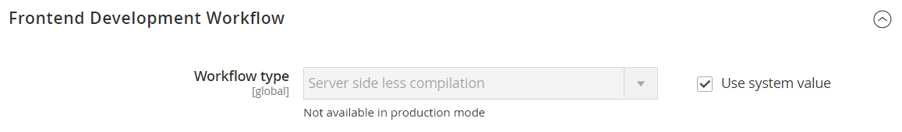
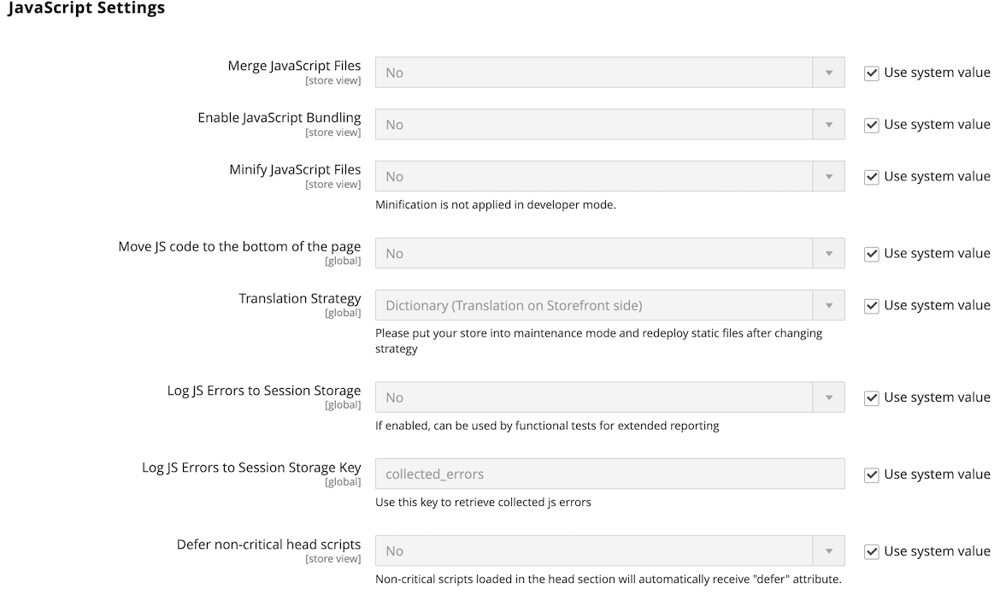
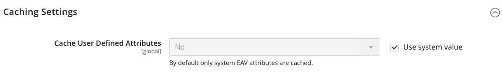

# Advanced > Developer

{{config}}

>[!NOTE]
>
>These configuration settings are available in [developer mode](https://docs.magento.com/user-guide/magento/installation-modes.html) only.

## Frontend Development Workflow

<!-- zoom -->

<!-- [Frontend Development Workflow](https://docs.magento.com/user-guide/system/frontend-development-workflow.html) -->

|Field|[Scope](../../getting-started/websites-stores-views.md#scope-settings)|Description|
|--- |--- |--- |
|Workflow Type|Global|Determines if Less compilation takes place on the client or server side during development. Options:  **Client side less compilation** - Compilation takes place in the browser using the native less.js library.  **Server side less compilation** - Compilation takes place on the server using the Less PHP library. This is the default mode for production.|

## Developer Client Restrictions

<!-- zoom -->

<!-- [Developer Client Restrictions](https://docs.magento.com/user-guide/system/developer-client-restrictions.html) -->

|Field|[Scope](../../getting-started/websites-stores-views.md#scope-settings)|Description|
|--- |--- |--- |
|Allow IPs (comma separated)|Store View|Creates an allowlist of IP addresses that  can use developer tools on a live site, without interfering with customers in the store. Any changes to the site when using a developer tool such  as Inline Translation, are visible only from the IP addresses on the allowlist.|

## Template Settings

<!-- zoom -->

<!-- [Template Settings](https://docs.magento.com/user-guide/system/file-optimization.html) -->

|Field|[Scope](../../getting-started/websites-stores-views.md#scope-settings)|Description|
|--- |--- |--- |
|Allow Symlinks|Store View|Enabling [symbolic links](https://en.wikipedia.org/wiki/Symbolic_link) can expose your site to security risks and is not recommended for a production store.|
|Minify Html|Store View|Determines if the HTML for store templates is minimized. Options: `Yes` / `No`|

## Debug

<!-- zoom -->

<!-- [Debug](https://docs.magento.com/user-guide/system/template-path-hints.html) -->

|Field|[Scope](../../getting-started/websites-stores-views.md#scope-settings)|Description|
|--- |--- |--- |
|Enable Template Path Hints for Storefront|Store View|Adds notation to storefront that indicates the path to each template that is used on the page. Options: `Yes` / `No`|
|Enable Template Path Hints for Admin|Global|Adds notation to the Admin that indicates the path to each template that is used on the page. Options: `Yes` / `No`|
|Add Block Class Type to Hints|Store View|Includes the names of blocks in the template path hints. Options: `Yes` / `No`|

## Translate Inline

<!-- zoom -->

<!-- [*Translate Inline*](https://docs.magento.com/user-guide/system/translate-inline.html) -->

|Field|[Scope](../../getting-started/websites-stores-views.md#scope-settings)|Description|
|--- |--- |--- |
|Enable for Storefront|Store View|Activates the Inline Translator for the storefront. The interface text can be edited for each store view. To use the Inline Translator without interfering with the live store, add your IP address to the Developer Client Restrictions allowlist.|
|Enable for Admin|Global|Activates the Inline Translator for the Admin. Unlike the storefront, the Admin cannot be translated into multiple languages. However, the field labels and other text in the interface can be changed.|

## JavaScript Settings

<!-- zoom -->

<!-- [JavaScript Settings](https://docs.magento.com/user-guide/system/file-optimization.html) -->

|Field|[Scope](../../getting-started/websites-stores-views.md#scope-settings)|Description|
|--- |--- |--- |
|Merge JavaScript Files|Store View|Merges multiple JavaScript files into a single file to improve page load time.|
|Enable JavaScript Bundling|Store View|Determines if multiple JavaScript files can be bundled into one file. Options: `Yes` / `No`|
|Minify JavaScript Files|Store View|Removes unnecessary characters, spaces, and indentation to reduce the size of the code.|
|Move JS code to the bottom of the page|Global|If enabled, moves the JS code to the bottom of the page. Options: `Yes` / `No`|
|Translation Strategy|Global|Determines the translation methodology that is used by the system. Options:  **Dictionary** - Translation on storefront side.  **Embedded** - Translation on Admin side.|
|Log JS Errors to Session Storage|Global|If enabled, can be used by functional tests for reporting. Options: `Yes` / `No`|
|Log JS Errors to Session Storage Key|Global|Identifies the key that is used to retrieve collected js errors.|

## CSS Settings

<!-- zoom -->

<!-- [CSS Settings](https://docs.magento.com/user-guide/system/file-optimization.html) -->

|Field|[Scope](../../getting-started/websites-stores-views.md#scope-settings)|Description|
|--- |--- |--- |
|Merge CSS Files|Store View|Merges multiple CSS files into a single file to improve page load time. Options: `Yes` / `No`|
|Minify CSS Files|Store View|Removes unnecessary characters, spaces, and indentation to reduce the size of the code. Options: `Yes` / `No`|
|Use CSS critical path|Global|The _CSS critical path_ delivers minified critical CSS inline in `<head>` and defers all non-critical styles that are loaded asynchronously. Options: `Yes` / `No`|

## Image Processing Settings

<!-- zoom -->

|Field|[Scope](../../getting-started/websites-stores-views.md#scope-settings)|Description|
|--- |--- |--- |
|Image Adapter|Global|Specifies the adapter that is used to render images. After changing the adapter setting, flush the Catalog Images cache. Options: `PHP GD2` / `ImageMagick`|

## Caching Settings

<!-- zoom -->

|Field|[Scope](../../getting-started/websites-stores-views.md#scope-settings)|Description|
|--- |--- |--- |
Cache User Defined Attributes | Global | When enabled, caches user-defined and system Entity Attribute Value (EAV) attributes. This option may increase performance but also requires additional space for caching. Options: `Yes` / `No`

## Static Files Settings

<!-- zoom -->

|Field|[Scope](../../getting-started/websites-stores-views.md#scope-settings)|Description|
|--- |--- |--- |
|Sign Static Files|Global|When enabled, adds a digital signature to the URL of static files to make it possible for browsers to detect when a newer version of the file is available. If a file's signature differs from what is stored in the browser's cache, then the newer version of the file is used. Static files that can be signed include JavaScript, CSS, images, and fonts. Options: `Yes` / `No`|

## Grid Settings

<!-- zoom -->

<!-- Grid Settings](https://docs.magento.com/user-guide/sales/order-grid-layout.html) -->

|Field|[Scope](../../getting-started/websites-stores-views.md#scope-settings)|Description|
|--- |--- |--- |
|Asynchronous Indexing|Global|Determines when order processing system entities, such as orders, invoices, shipments, and credit memos, are added to the grid and reindexed. Asynchronous Indexing can be used to avoid locks on data during save operations, and to reduce processing time. Options:  **Disable** - (Default) Order-related entities are added to the grid at various times. as they are saved.  **Enable** - Order-related entities are added to the grid only during a scheduled cron job. Cron should be configured to run once every minute.|
