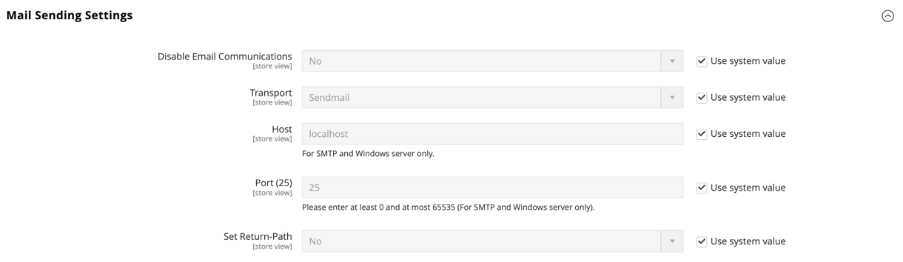
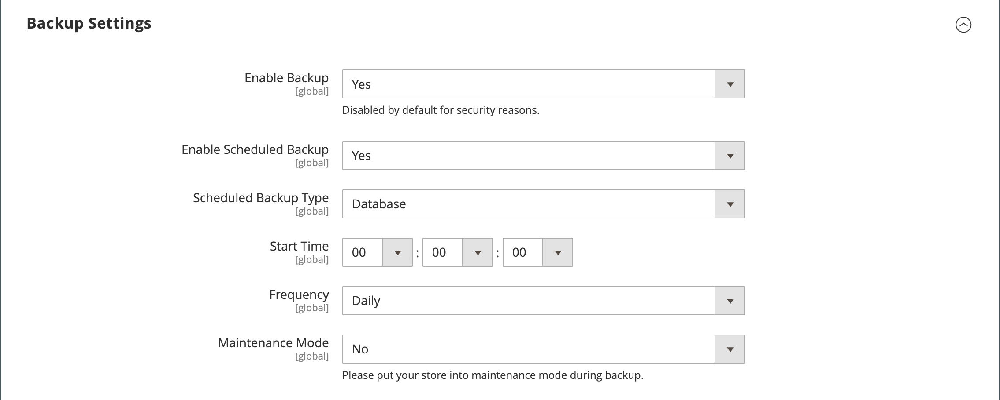
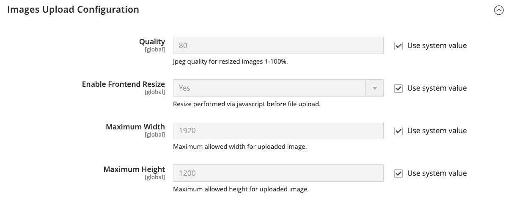

# [!UICONTROL Advanced] > [!UICONTROL System]

{{config}}

## [!UICONTROL Cron (Scheduled Tasks)]

<!-- zoom -->

For more information about changing these configuration settings, see [Cron (scheduled tasks)](../../systems/cron.md).

### [!UICONTROL index]

<!-- zoom -->

|Field|[Scope](../../getting-started/websites-stores-views.md#scope-settings)|Description|
|--- |--- |--- |
|[!UICONTROL Generate Schedules Every]|Global|Determines the frequency in minutes, that schedules are generated.|
|[!UICONTROL Schedule Ahead for]|Global|Determines the number of minutes in advance that schedules are generated.|
|[!UICONTROL Missed if Not Run Within]|Global|Determines the number of minutes before a cron job that hasn't yet executed is marked as missed.|
|[!UICONTROL History Cleanup Every]|Global|Determines the number of minutes that pass before the cron history is cleaned.|
|[!UICONTROL Success History Lifetime]|Global|Determines the number of minutes that the record of successfully completed cron jobs is kept in the database.|
|[!UICONTROL Failure History Lifetime]|Global|Determines the number of minutes that the record of failed cron jobs is kept in the database.|
|[!UICONTROL Use Separate Process]|Global|Determines if cron jobs are executed in parallel as separate processes. Options: `Yes` / `No`|

{:style="table-layout:auto"}

### [!UICONTROL default]

<!-- zoom -->

|Field|[Scope](../../getting-started/websites-stores-views.md#scope-settings)|Description|
|--- |--- |--- |
|[!UICONTROL Generate Schedules Every]|Global|Determines the frequency in minutes, that schedules are generated.|
|[!UICONTROL Schedule Ahead for]|Global|Determines the number of minutes in advance that schedules are generated.|
|[!UICONTROL Missed if Not Run Within]|Global|Determines the number of minutes before a cron job that hasn't yet executed is marked as missed.|
|[!UICONTROL History Cleanup Every]|Global|Determines the number of minutes that pass before the cron history is cleaned.|
|[!UICONTROL Success History Lifetime]|Global|Determines the number of minutes that the record of successfully completed cron jobs is kept in the database.|
|[!UICONTROL Failure History Lifetime]|Global|Determines the number of minutes that the record of failed cron jobs is kept in the database.|
|[!UICONTROL Use Separate Process]|Global|Determines if cron jobs are executed in parallel as separate processes. Options: `Yes` / `No`|

{:style="table-layout:auto"}

## [!UICONTROL MySQL Message Queue Cleanup]

{{ee-feature}}

<!-- zoom -->

|Field|[Scope](../../getting-started/websites-stores-views.md#scope-settings)|Description|
|--- |--- |--- |
|[!UICONTROL Successful Messages Lifetime]|Global|Determines the lifetime of successful messages in minutes. Enter zero to skip the cleanup. Default: `10080` (7 days)|
|[!UICONTROL New Messages Lifetime]|Global|Determines the lifetime of new messages in minutes. Enter zero to skip the cleanup. Default: `10080` (7 days)|
|[!UICONTROL Failed Messages Lifetime]|Global|Determines the lifetime of failed messages in minutes. Enter zero to skip the cleanup. Default: `10080` (7 days)|
|[!UICONTROL Retry Messages in Progress After]|Global|Determines how long the system waits for a message in progress before retrying. Default: `1440` (24 hours)|

{:style="table-layout:auto"}

## [!UICONTROL Mail Sending Settings]

<!-- zoom -->

<!-- [Mail Sending Settings](https://docs.magento.com/user-guide/system/email-communications.html) -->

>[!IMPORTANT]
>
>**Security Notice** We recommend that all merchants immediately set their mail sending configuration to protect against a recently identified potential remote code execution exploit. Until this issue is resolved, we highly recommend that you avoid using [!DNL Sendmail] for email communications. In the [!UICONTROL Mail Sending Settings], make sure that [!UICONTROL Set Return Path] is set to `No`.

|Field|[Scope](../../getting-started/websites-stores-views.md#scope-settings)|Description|
|--- |--- |--- |
|[!UICONTROL Disable Email Communications]|Store View|Determines if email communications are activated for the store. Options: `Yes` / `No`|
|[!UICONTROL Host]|Store View|(For Windows server only) Determines the name that is used to refer to the host. Default value: `localhost`|
|[!UICONTROL Port (25)]|Store View|(For Windows server only) Identifies the port used for email communications. Default value: `25`|
|[!UICONTROL Set Return-Path]|Store View|Determines if a routing address is used for returned emails. Options: `No` / `Yes` / `Specified`|
|[!UICONTROL Return-Path Email]|Global|Specifies the routing email address for returned emails.|

{:style="table-layout:auto"}

## [!UICONTROL Currency]

<!-- zoom -->

<!-- [Currency](https://docs.magento.com/user-guide/stores/currency.html) -->

|Field|[Scope](../../getting-started/websites-stores-views.md#scope-settings)|Description|
|--- |--- |--- |
|[!UICONTROL Installed Currencies]|Global|Indicates the currencies that are currently available to the Commerce installation. Options include all available currencies, with installed currencies selected.|

{:style="table-layout:auto"}

## [!UICONTROL Security]

<!-- zoom -->

<!-- [Security](https://docs.magento.com/user-guide/stores/security-session-management.html) -->

|Field|[Scope](../../getting-started/websites-stores-views.md#scope-settings)|Description|
|--- |--- |--- |
|[!UICONTROL Max Session Size in Admin]|Global|Limit the maximum session size in bytes. Use `0` to disable.|
|[!UICONTROL Max Session Size in Storefront]|Global|Limit the maximum session size in bytes. Use `0` to disable.|

{:style="table-layout:auto"}

## [!UICONTROL Notifications]

<!-- zoom -->

<!-- [Notifications](https://docs.magento.com/user-guide/stores/admin-message-inbox.html) -->

|Field|[Scope](../../getting-started/websites-stores-views.md#scope-settings)|Description|
|--- |--- |--- |
|[!UICONTROL Use HTTPS to Get Feed]|Global|Determines if Admin notifications are delivered over a secure channel. Options: `Yes` / `No`|
|Update Frequency|Global|Determines the frequency of Admin message updates. Options: `1 Hour` / `2 Hours` / `6 Hours` / `12 Hours` / `24 Hours`|
|[!UICONTROL Last Update]|Global|Indicates the date and time of the last message update.|

{:style="table-layout:auto"}

## [!UICONTROL Scheduled Backup Settings]

<!-- zoom -->

<!-- [Scheduled Backup Settings](https://docs.magento.com/user-guide/system/backups.html) -->

{{$include /help/_includes/backups-note.md}}

|Field|[Scope](../../getting-started/websites-stores-views.md#scope-settings)|Description|
|--- |--- |--- |
|[!UICONTROL Enable Scheduled Backup]|Global|Determines if the Commerce instance is automatically backed up on a regular schedule. Options: `Yes` / `No`|
|[!UICONTROL Backup Type]|Global|Determines the elements of the Commerce instance that are included in the backup. Options: `Database` / `Database and Media` / `System` / `System (excluding Media)`|
|[!UICONTROL Start Time]|Global|Specifies the hour, minute, and second that the scheduled backup begins.|
|[!UICONTROL Frequency]|Global|Determines how often the scheduled backup takes place. Options: `Daily` / `Weekly` / `Monthly`|
|[!UICONTROL Maintenance Mode]|Global|Determines if the store is put in maintenance mode during the scheduled backup. Options: `Yes` / `No`|

{:style="table-layout:auto"}

## [!UICONTROL Admin Actions Log Archiving]

{{ee-feature}}

<!-- zoom -->

<!-- [Admin Actions Log Archiving](https://docs.magento.com/user-guide/system/action-log-archive.html) -->

|Field|[Scope](../../getting-started/websites-stores-views.md#scope-settings)|Description|
|--- |--- |--- |
|[!UICONTROL Log Entry Lifetime, Days]|Store View|Determines the number of days that admin actions are kept in the Admin Actions archive. Default: `60`|
|[!UICONTROL Log Archiving Frequency]|Store View|Determines how often the Admin Actions logs are archived. Options: `Daily` / `Weekly` / `Monthly`|

{:style="table-layout:auto"}

## [!UICONTROL Full Page Cache]

<!-- zoom -->

<!-- [Full Page Cache](https://docs.magento.com/user-guide/system/cache-full-page.html) -->

<!-- zoom -->

<!-- [Varnish Configuration](https://docs.magento.com/user-guide/system/cache-full-page.html) -->

|Field|[Scope](../../getting-started/websites-stores-views.md#scope-settings)|Description|
|--- |--- |--- |
|[!UICONTROL Caching Application]|Global|Determines the application that is used to manage the full-page cache. Options:  **`Built-in Application`** - Not recommended for the production environment.  **`Varnish Caching`** - Recommended for the production environment.|
|[!UICONTROL TTL for public content]|Global|Determines the lifetime of the public content cache in seconds. Default value: `120`|
|**[!UICONTROL Varnish Configuration]**|||
|[!UICONTROL Access list]|Global|Specifies the IP addresses that can purge the Varnish configuration to generate a config file. Separate multiple entries with a comma. Default value: `localhost`|
|[!UICONTROL Backend host]|Global|Specifies the backend host that generates config files. Default value: `localhost`|
|[!UICONTROL Backend port]|Global|Specifies the backend port that is used to generate config files. Default value: `8080`|
|[!UICONTROL Grace period]|Global|Specifies the grace period in seconds for generating a config file. Default value: `300`|
|**[!UICONTROL Export Configuration]**|||
|[!UICONTROL Export VCL for Varnish 4]|Global|Exports the `varnish.vcl` file for version 4.|
|[!UICONTROL Export VCL for Varnish 5]|Global|Exports the `varnish.vcl` file for version 5.|
|[!UICONTROL Export VCL for Varnish 6]|Global|Exports the `varnish.vcl` file for version 6.|

{:style="table-layout:auto"}

## [!UICONTROL Storage Configuration for Media]

<!-- zoom -->

<!-- [Storage Configuration for Media - File System](https://docs.magento.com/user-guide/cms/media-storage.html) -->

|Field|[Scope](../../getting-started/websites-stores-views.md#scope-settings)|Description|
|--- |--- |--- |
|[!UICONTROL Media Storage]|Global|Determines the method used to store media files. Default setting: `File System`|
|[!UICONTROL Environment Update Time]|Global|Determines the frequency of the media file environment updates in seconds. Default value: `3600`|

{:style="table-layout:auto"}

<!-- zoom -->

<!-- [Storage Configuration for Media - Database](https://docs.magento.com/user-guide/cms/media-storage.html) -->

>[!IMPORTANT]
>
>The database media storage method has been deprecated as of Adobe Commerce and Magento Open Source 2.4.3.

|Field|[Scope](../../getting-started/websites-stores-views.md#scope-settings)|Description|
|--- |--- |--- |
|[!UICONTROL Media Storage]|Global|Specifies database as the method used to store media files.|
|[!UICONTROL Select Media Database]|Global|Identifies the name of the database used for media storage. Default setting: `default_setup`|
|[!UICONTROL Synchronize]||Synchronizes the transfer of all media to the specified database location.|
|Environment Update Time|Global|Determines the frequency of the media file environment updates in seconds. Default value: `3600`|

{:style="table-layout:auto"}

## [!UICONTROL Bulk Actions]

{{ee-feature}}

<!-- zoom -->

<!-- [Bulk Actions](https://docs.magento.com/user-guide/system/action-log-bulk-actions.html) -->

|Field|[Scope](../../getting-started/websites-stores-views.md#scope-settings)|Description|
|--- |--- |--- |
|[!UICONTROL Days Saved in Log]|Global|Determines the number of days that bulk actions are kept in the _Bulk Actions Log_ archive. Default: `60`|

{:style="table-layout:auto"}

## [!UICONTROL Scheduled Import/Export File History Cleaning]

{{ee-feature}}

<!-- zoom -->

<!-- [Scheduled Import/Export File History Cleaning](https://docs.magento.com/user-guide/system/data-scheduled-import-export.html) -->

|Field|[Scope](../../getting-started/websites-stores-views.md#scope-settings)|Description|
|--- |--- |--- |
|[!UICONTROL Save File, Days]|Global|Determines the number of days that import/export history files are saved.|
|[!UICONTROL Enable Scheduled File History Cleaning]|Global|Enables the scheduled file cleanup of import/export files. Options: `Yes` / `No`|
|[!UICONTROL Clean Now]||Overrides the scheduled cleanup, and immediately cleans the import/export history files.|
|[!UICONTROL Start Time]|Global|Specifies the hour, minute, and second of the import/export history file cleanup.|
|[!UICONTROL Frequency]|Global|Determines how often the import/export history files are cleaned. Options: `Daily` / `Weekly` / `Monthly`|
|[!UICONTROL Error Email Recipient]|Global|The email address of the person who is to receive notification if an error occurs while the import/export file history is cleaned. Separate multiple addresses with a comma.|
|[!UICONTROL Error Email Sender]|Global|Identifies the store contact that appears as the sender of the notification. Default sender: `General Contact`|
|[!UICONTROL Error Email Template]|Global|Identifies the email template that is used for the import/export file cleaning-error notification. Default template: `File History Clean Failed`|

{:style="table-layout:auto"}

## [!UICONTROL Image Upload Configuration]

<!-- zoom -->

<!-- [Image Upload Configuration](https://docs.magento.com/user-guide/system/action-log-bulk-actions.html) -->

|Field|[Scope](../../getting-started/websites-stores-views.md#scope-settings)|Description|
|--- |--- |--- |
|[!UICONTROL Quality]|Global|Determines the JPG quality for the resized image. Lower quality reduces the file size. We recommend 80-90% to help reduce file size with high quality. Default: `80`|
|[!UICONTROL Enable Frontend Resize]|Global|Enable this setting to allow Commerce to resize large, oversized images you may upload for the _Product Details_ page. Commerce resizes the image files using JavaScript before uploading the file. When the image is resized, it keeps the exact proportions to meet and not exceed the largest size for Maximum Width or Maximum Height. Default: `Yes`|
|[!UICONTROL Maximum Width]|Global|Determines the maximum pixel width for the image. When the image is resized, it does not exceed this width. Default: `1920`|
|[!UICONTROL Maximum Height]|Global|Determines the maximum pixel height for the image. When the image is resized, it does not exceed this height. Default: `1200`|

{:style="table-layout:auto"}

## [!UICONTROL Media Gallery]

<!-- zoom -->

|Field|[Scope](../../getting-started/websites-stores-views.md#scope-settings)|Description|
|--- |--- |--- |
|[!UICONTROL Enable Old Media Gallery]|Global|Enables or disables the old Media Gallery.|

{:style="table-layout:auto"}

## [!UICONTROL Media Gallery Image Optimization]

<!-- zoom -->

|Field|[Scope](../../getting-started/websites-stores-views.md#scope-settings)|Description|
|--- |--- |--- |
|[!UICONTROL Enable Image Optimization]|Global|Determines if images are resized to decrease the file size of the images inserted to the content. Original images are preserved in the Media Gallery.|
|[!UICONTROL Maximum Width]|Global|The maximum width (in pixels) for images inserted from Media Gallery into the content.|
|[!UICONTROL Maximum Height]|Global|The maximum height (in pixels) for images inserted from Media Gallery into the content.|

{:style="table-layout:auto"}

## [!UICONTROL Adobe Stock Integration]

<!-- zoom -->

|Field|[Scope](../../getting-started/websites-stores-views.md#scope-settings)|Description|
|--- |--- |--- |
|[!UICONTROL Enabled Adobe Stock]|Global|Enables or disables the Adobe Stock Integration.|
|[!UICONTROL API Key (Client ID)]|Global|An API key is required to connect your store to the Adobe Stock service. For more information about generating this key and configuring this integration, see [Adobe Stock Integration](https://docs.magento.com/user-guide/cms/adobe-stock.html).|
|[!UICONTROL Client Secret]|Global|The Client Secret for your Adobe Stock integration is required. For more information about retrieving this secret and configuring this integration, see [Adobe Stock Integration](https://docs.magento.com/user-guide/cms/adobe-stock.html).|
|[!UICONTROL Test Connection]||Runs a test to verify that the API key is valid for use with the Adobe Stock service.|

{:style="table-layout:auto"}
