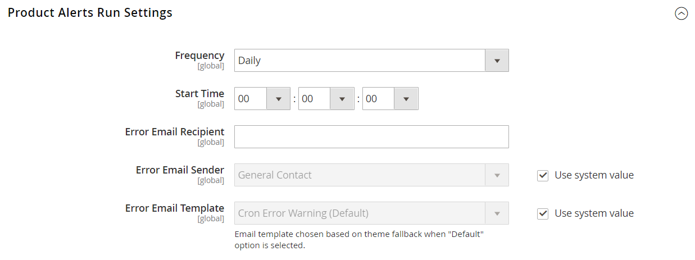

# [!UICONTROL Catalog] > [!UICONTROL Catalog]

{{config}}

## [!UICONTROL Product Fields Auto-Generation]

<!-- zoom -->

<!-- [Product Fields Auto-Generation](https://docs.magento.com/user-guide/catalog/product-fields-autogenerated.html) -->

|Field|[Scope](../../getting-started/websites-stores-views.md#scope-settings)|Description|
|--- |--- |--- |
|[!UICONTROL Mask for SKU]|Global|Determines the default value of the SKU field based on placeholder values from other fields and any additional text that is entered. Default placeholder:  Product Name - `{{name}}`|
|[!UICONTROL Mask for Meta Title]|Global|Determines the default value of the Meta Title field based on placeholder values from other fields and any additional text that is entered. Default placeholder:  Product Name - `{{name}}`|
|[!UICONTROL Mask for Meta Keywords]|Global|Determines the default value of the _Meta Keywords_ field based on placeholder values from other fields and any additional text that is entered. Default placeholder:  Product Name - `{{name}}`|
|[!UICONTROL Mask for Meta Description]|Global|Determines the default value of the Meta Description field based on placeholder values from other fields and any additional text that is entered. Default placeholder:  Product Name - `{{name}}`  Description - `{{description}}`|

{style="table-layout:auto"}

## [!UICONTROL Product Reviews]

<!-- zoom -->

<!-- [Product Reviews](https://docs.magento.com/user-guide/marketing/product-reviews.html) -->

|Field|[Scope](../../getting-started/websites-stores-views.md#scope-settings)|Description|
|--- |--- |--- |
|[!UICONTROL Enabled]|Store View|Enables product reviews. Options: `Yes` / `No`|
|[!UICONTROL Allow Guests to Write Reviews]|Website|Determines if customers must open an account with your store to be able to write product reviews.|

{style="table-layout:auto"}

## [!UICONTROL Storefront]

<!-- zoom -->

<!-- [Storefront](https://docs.magento.com/user-guide/catalog/navigation-product-listings.html) -->

|Field|[Scope](../../getting-started/websites-stores-views.md#scope-settings)|Description|
|--- |--- |--- |
|[!UICONTROL List Mode]|Store View|Determines the format of the search results list. Options:  **`Grid Only`** - Formats the list as a grid of rows and columns. Each product appears in a single cell of the grid.  **`List Only`** - Formats the list with each product on a separate row.  **`Grid (default / List)`** - By default, products appear in Grid view and can be toggled to List view.  **`List (default / Grid)`** - By default, products appear in List View and can be toggled to Grid view.|
|[!UICONTROL Products per Page on Grid Allowed Values]|Store View|Determines the number of products displayed in Grid View. To provide a selection of options, enter multiple values separated by commas.|
|[!UICONTROL Products per Page on Grid Default Value]|Store View|Determines the number of products displayed per page by default in grid view.|
|[!UICONTROL Products per Page on List Allowed Values]|Store View|Determines the number of products displayed in List View. To provide a selection of options, enter multiple values separated by commas.|
|[!UICONTROL Products per Page on List Default Value]|Store View|Determines the number of products displayed per page by default, in list view.|
|Product Listing Sort by|Store View|Determines the sort order of the search results list. The selection of options is determined by the Display Settings of the category and the available attributes that are set to be `Used for Sorting in Product Listing`. The default is set to `Use All Available Attributes` and typically includes Best Value, Name, Price. This setting does not apply to the [!DNL Live Search] [Product Listing Page Widget](https://experienceleague.adobe.com/en/docs/commerce-merchant-services/live-search/live-search-storefront/plp-styling).|
|[!UICONTROL Allow All Products per Page]|Store View|If set to `Yes`, includes the `ALL` option in the "Show per Page" control.|
|[!UICONTROL Remember Category Pagination]|Global|If set to `Yes`, the current category pagination values are saved as customers browse from one category to another in [product listings](../../catalog/navigation-product-listings.md). Saving the value uses more cache storage and can affect the way pages are indexed by search engines. Options: `Yes` / `No` (default)|
|[!UICONTROL Use Flat Catalog Category]|Global|Enables the [flat category structure](../../catalog/catalog-flat.md) (not recommended). Options: `Yes` / `No`|
|[!UICONTROL Use Flat Catalog Product]|Global|Enables the flat product structure. (not recommended) Options: `Yes` / `No`|
|[!UICONTROL Swatches per Product]|Store View|Determines the number of swatches available for each product. Default: `16`|
|[!UICONTROL Show Swatches in Product List]|Store View|Determines if the swatches appear in the Product List. Options: `Yes` / `No`|
|[!UICONTROL Show Swatch Tooltip]|Store View|Determines if the swatch tooltip appears. Options: `Yes` / `No`|

{style="table-layout:auto"}

## [!UICONTROL Product Alerts]

<!-- zoom -->

<!-- [Product Alerts](https://docs.magento.com/user-guide/catalog/inventory-product-alerts.html) -->

|Field|[Scope](../../getting-started/websites-stores-views.md#scope-settings)|Description|
|--- |--- |--- |
|[!UICONTROL Allow Alerts When Product Price Changes]|Store View|Determines if email alerts are available for product price changes. Options: `Yes` / `No`|
|[!UICONTROL Price Alert Email Template]|Store View|Identifies the template that is used for product price change email alerts. Default template: `Product price alert`|
|[!UICONTROL Allow Alert When Product Comes Back in Stock]|Website|Determines if customers can choose to receive an alert when the product comes back in stock. Options: `Yes` / `No`|
|[!UICONTROL Stock Alert Email Template]|Store View|Identifies the template that is used for stock alert email notifications. Default template: `Product stock alert`|
|[!UICONTROL Alert Email Sender]|Store View|Determines the store contact that appears as the sender of the product alert email message. Options: `General Contact` / `Sales Representative` / `Customer Support` / `Custom Email`|

{style="table-layout:auto"}

## [!UICONTROL Product Alerts Run Settings]

<!-- zoom -->

<!-- [Product Alerts Run Settings](https://docs.magento.com/user-guide/catalog/inventory-product-alert-run-settings.html) -->

|Field|[Scope](../../getting-started/websites-stores-views.md#scope-settings)|Description|
|--- |--- |--- |
|[!UICONTROL Frequency]|Global|Choose how often product alerts are sent out. Options: `Daily` / `Weekly` / `Monthly`|
|[!UICONTROL Start Time]|Global|Choose what time of day the product alert process starts. This time should be after any price or inventory updates are performed.|
|[!UICONTROL Error Email Recipient]|Global|Identify the email address of the person (normally a store administrator) who should receive an email notification when there is an error in the product alert process.|
|[!UICONTROL Error Email Sender]|Global|Select the role that the email is `from`.|
|[!UICONTROL Error Email Template]|Global|Select the email template to use for product alert error notifications.|

{style="table-layout:auto"}

## [!UICONTROL Product Image Placeholders]

<!-- zoom -->

<!-- [Product Image Placeholders](https://docs.magento.com/user-guide/catalog/product-image-placeholders.html) -->

|Field|[Scope](../../getting-started/websites-stores-views.md#scope-settings)|Description|
|--- |--- |--- |
|[!UICONTROL Base Image]|Store View|Identifies the placeholder file chosen for the base image.|
|[!UICONTROL Small Image]|Store View|Identifies the placeholder file chosen for the small image.|
|[!UICONTROL Swatch]|Store View|Identifies the placeholder file chosen for the swatch.|
|[!UICONTROL Thumbnail]|Store View|Identifies the placeholder file chosen for the thumbnail.|
|[!UICONTROL Choose File]||Navigates to the file and uploads it as the placeholder image for the type.|

{style="table-layout:auto"}

## [!UICONTROL Recently Viewed/Compared Products]

<!-- zoom -->

<!-- Recently Viewed/Compared Products](https://docs.magento.com/user-guide/marketing/products-viewed-compared.html) -->

|Field|[Scope](../../getting-started/websites-stores-views.md#scope-settings)|Description|
|--- |--- |--- |
|[!UICONTROL Synchronize widget products with backend storage]|Global|Determines the sync of product widget information, such as product ID, with the database. This allows the reuse of information on other devices.|
|[!UICONTROL Show for Current]|Website|Limits the products shown to the current website. Options: `Website` / `Store` / `Store View`|
|[!UICONTROL Default Recently Viewed Products Count]|Store View|Determines the maximum number of recently viewed products that appear in the list.|
|[!UICONTROL Default Recently Compared Products Count]|Store View|Determines the maximum number of recently compared products that appear in the list.|
|[!UICONTROL Lifetime of products in Recently Viewed Widget]|Global|Determines how long, in seconds, viewed products are displayed in the recently viewed list.|
|[!UICONTROL Lifetime of products in Recently Compared Widget]|Global|Determines how long, in seconds, compared products are displayed in the recently compared list.|

{style="table-layout:auto"}

## [!UICONTROL Product Video]

<!-- zoom -->

<!-- [Product Videos](https://docs.magento.com/user-guide/catalog/product-video.html) -->

|Field|[Scope](../../getting-started/websites-stores-views.md#scope-settings)|Description|
|--- |--- |--- |
|[!UICONTROL YouTube API key]|Store View|Specifies the API key that is required to connect to the YouTube server.|
|[!UICONTROL Autostart base video]|Store View|To auto-start the video after the page loads, set to `Yes`.|
|[!UICONTROL Show related video]|Store View|To display related videos, set to `Yes`.|
|[!UICONTROL Auto restart video]|Store View|To enable auto replay video, set to `Yes`.|

{style="table-layout:auto"}

## [!UICONTROL Price]

<!-- zoom -->

<!--Price](https://docs.magento.com/user-guide/catalog/catalog-price-scope.html) -->

|Field|[Scope](../../getting-started/websites-stores-views.md#scope-settings)|Description|
|--- |--- |--- |
|[!UICONTROL Catalog Price Scope]|Global|Determines the scope of the base currency. Options: `Global` / `Website`|
|[!UICONTROL Default Product Price]|Global| (Adobe Commerce only) Defines the default product price, if applicable.|

{style="table-layout:auto"}

## [!UICONTROL Layered Navigation]

>[!NOTE]
>
>The standard search configuration described in this section differs for [Live Search](https://experienceleague.adobe.com/docs/commerce-merchant-services/live-search/overview.html).

<!-- [Layered Navigation - Automatic (equalize price ranges)](https://docs.magento.com/user-guide/catalog/navigation-layered-configuration.html) -->

<!-- zoom -->

<!-- zoom -->

<!-- zoom -->

|Field|[Scope](../../getting-started/websites-stores-views.md#scope-settings)|Description|
|--- |--- |--- |
|[!UICONTROL Display Product Count]|Store View|Determines if the product count appears after each attribute, price range, and category. Options: `Yes` / `No`|
|[!UICONTROL Price Navigation Step Calculation]|Store View|Determines the method used to determine the [price navigation step](../../catalog/navigation-layered.md#configure-price-navigation)). Options:  `Automatic (equalize price ranges)` - Bases the calculation on the price range of products in the group.  `Automatic (equalize product counts)` - Bases the calculation on the number of products in the group. Establishes a threshold for the minimum number of products in the group, to prevent them from being divided into smaller groups.  `Manual` - Uses the division limit that you enter for price intervals.|
|[!UICONTROL Default Price Navigation Step]|Store View|Determines the number of products that are included in each step.|
|[!UICONTROL Maximum Number of Price Intervals]|Store View|Establishes a limit for the number of price intervals that appear in layered navigation.|

{style="table-layout:auto"}

## [!UICONTROL Category Permissions]

{{ee-feature}}

<!-- zoom -->

<!-- [Category Permissions](https://docs.magento.com/user-guide/catalog/category-permissions.html) -->

|Field|[Scope](../../getting-started/websites-stores-views.md#scope-settings)|Description|
|--- |--- |--- |
|[!UICONTROL Enable]|Global|Activates category restrictions. By default, using this feature restricts all categories. Options: `Yes` / `No`|
|[!UICONTROL Allow Browsing Category]|Website|Determines who is allowed to browse through categories. Options:  `Yes, for Everyone` - Allows all visitors and customers to the browse the category.  `Yes, for Specified Customer Groups` - Allows only members of selected customer groups to browse the category.  `No, Redirect to Landing Page` - Denies access to the category and redirects to the selected page.|
|[!UICONTROL Display Product Prices]|Website|Controls the display of product prices for the category. Options:  `Yes, for Everyone` - Allows everyone to see the price of products in the category.  `Yes, for Specified Customer Groups` - Allows only members of selected customer groups to see the price of products in the category.  `No` - Turns off the display of product prices for the category.|
|[!UICONTROL Allow Adding to Cart]|Website|Determines who can purchase products from the category. Options:  `Yes, for Everyone` - Allows everyone to place products from the category into their shopping carts.  `Yes, for Specified Customer Groups` - Allows only members of selected customer groups to place products from the category into their shopping carts.  `No` - Does not allow anyone to place products from the category into their shopping carts.|
|[!UICONTROL Disallow Catalog Search by]|Website|Identifies the customer groups that are not allowed to search for products in the category.|

{style="table-layout:auto"}

## [!UICONTROL Search Engine Optimization]

<!-- zoom -->

<!-- [Search Engine Optimization](https://docs.magento.com/user-guide/catalog/product-search-engine-optimization.html) -->

|Field|[Scope](../../getting-started/websites-stores-views.md#scope-settings)| Description                                                                                                                                                                                                                                                                                                                                                                                              |
|--- |--- |----------------------------------------------------------------------------------------------------------------------------------------------------------------------------------------------------------------------------------------------------------------------------------------------------------------------------------------------------------------------------------------------------------|
|[!UICONTROL Popular Search Terms]|Store View| Determines if _Popular Search Terms_ is implemented in the store. This setting does not apply to stores that use [Live Search](https://experienceleague.adobe.com/docs/commerce-merchant-services/live-search/overview.html). Options: `Enable` / `Disable`                                                                                                                                              |
|[!UICONTROL Product URL Suffix]|Store View| Determines if a suffix, such as html or htm, is applied to product URLs. If used, do not include a period before the suffix, because it is applied automatically.                                                                                                                                                                                                                                        |
|[!UICONTROL Category URL Suffix]|Store View| Determines if a suffix, such as html or htm, is applied to category URLs. If used, do not include a period before the suffix, because it is applied automatically.                                                                                                                                                                                                                                       |
|[!UICONTROL Use Categories Path for Product URLs]|Store View| Determines if category paths are included in product URLs. Doing so can cause multiple URLs to point to the same page, which might impact search rank. To learn more, see [Canonical meta tag](../../merchandising-promotions/meta-data.md#canonical-meta-tag).                                                                                                                                          |
|[!UICONTROL Create Permanent Redirect for URLs if URL Key Changed]|Store View| Determines if a permanent redirect is created automatically whenever a URL key changes. When implemented, the Create Custom Redirect for old URL checkbox below the product URL Key field is selected by default. Options: `Yes` / `No`                                                                                                                                                                  |
|[!UICONTROL Generate "category/product" URL Rewrites]|Global| Determines if Adobe Commerce generates data and saves it into rewrite tables when a user saves a category that contains many assigned products. Options: `Yes` / `No`   **_Important:_** Saving this generated data into a URL rewrites table can degrade performance. See [Automatic Product Redirects](../../merchandising-promotions/url-redirect-product-automatic.md) for more information. |
|[!UICONTROL Apply transliteration for product URL]|Store View| Determines if transliteration is applied when creating or updating product URLs. Options: `Yes` / `No`. Default is set to `Yes`.   For certain use cases, you should disable transliteration. For example, if you operate an online store in Chinese, SEO best practices recommend that product URLs match the product name. Setting the option to `No` allows Chinese characters to be used in product URLs instead of an ASCII equivalent.    |
|[!UICONTROL Page Title Separator]|Store View| Identifies the character that separates the category name and subcategory in the browser title bar.                                                                                                                                                                                                                                                                                                      |
|[!UICONTROL Use Canonical Link Meta Tag for Categories]|Store View| If there are multiple URLs that point to the same category page, this option uses a canonical meta tag to identify the category URL that search engines should index. The URL includes a full name to the category using the meta tag. This reduces duplicate content and improves SEO. Options: `Yes` / `No`                                                                                            |
|[!UICONTROL Use Canonical Link Meta Tag for Products]|Store View| If there are multiple URLs that point to the same product page, this option uses a canonical meta tag to identify the product URL that search engines should index. The URL includes a full name to the product using the meta tag. This reduces duplicate content and improves SEO. Options: `Yes` / `No`                                                                                               |

{style="table-layout:auto"}

## [!UICONTROL Category Top Navigation]

<!-- zoom -->

<!-- Category Top Navigation](https://docs.magento.com/user-guide/catalog/navigation-top.html) -->

|Field|[Scope](../../getting-started/websites-stores-views.md#scope-settings)|Description|
|--- |--- |--- |
|[!UICONTROL Maximal Depth]|Global|Determines the number of subcategory levels in the top navigation. The default value of `0` places no limit on the number of levels.|

{style="table-layout:auto"}

## [!UICONTROL Catalog Search]

There are three variations of the Catalog Search configuration: The settings that are available when [[!DNL Live Search]](https://experienceleague.adobe.com/docs/commerce-merchant-services/live-search/overview.html) is installed, and those that are available for native Adobe Commerce. Follow the instructions for your installation.

### Adobe Commerce with [!DNL Live Search]

When Live Search is installed, Catalog Search includes the following configuration settings:

<!-- zoom -->

<!-- [Catalog Search for Live Search](https://docs.magento.com/user-guide/catalog/search-configuration.html) -->

|Field|[Scope](../../getting-started/websites-stores-views.md#scope-settings)|Description|
|--- |--- |--- |
|[!UICONTROL Minimal Query Length]|Store View|The minimum number of characters allowed in a catalog search. The value set for this option must be compatible with the corresponding range set in your Elasticsearch search engine configurations. For example, if you set this value to `2` in Adobe Commerce, update the value in your search engine.|
|[!UICONTROL Maximum Query Length]|Store View|The maximum number of characters allowed in a catalog search. The value set for this option must be compatible with the corresponding range set in your Elasticsearch search engine configurations. For example, if you set this value to 300 in Adobe Commerce, update the value in your search engine.|
|[!UICONTROL Number of top search results to cache]|Store View|The number of popular search terms and results to cache for faster responses. Entering a value of `0` caches all search terms and results when entered a second time. Default value: `100`|
|[!UICONTROL Autocomplete Limit]|Store View|Determines the maximum number of lines available in the [storefront popover] page. The default value can be changed when Live Search is installed, and updated later by changing this configuration setting. Default value: `8`|

{style="table-layout:auto"}

### Adobe Commerce with native search

Native Adobe Commerce with OpenSearch or Elasticsearch includes the following configuration settings:

>[!IMPORTANT]
>
>- Due to the Elasticsearch 7 end-of-support announcement for August 2023, Adobe recommends that all Adobe Commerce customers migrate to the OpenSearch 2.x search engine. For information about migrating your search engine during an upgrade, see [Migrating to OpenSearch](https://experienceleague.adobe.com/docs/commerce-operations/upgrade-guide/prepare/opensearch-migration.html) in the _Upgrade Guide_.
>- In versions 2.4.4 and 2.4.3-p2, all fields labeled Elasticsearch also apply to OpenSearch. When support for Elasticsearch 8.x was introduced in version 2.4.6, new labels were created to distinguish between Elasticsearch and OpenSearch configurations. However, the configuration options for both are the same.

{width="600" zoomable="yes"}

|Field|[Scope](../../getting-started/websites-stores-views.md#scope-settings)|Description|
|--- |--- |--- |
|[!UICONTROL Minimal Query Length]|Store View|The minimum number of characters allowed in a catalog search. The value set for this option must be compatible with the corresponding range set in your OpenSearch or Elasticsearch configuration. For example, if you set this value to `2` in Adobe Commerce, you must also update the value in your search engine configuration. Default value: `3`|
|[!UICONTROL Maximum Query Length]|Store View|The maximum number of characters allowed in a catalog search. The value set for this option must be compatible with the corresponding range set in your OpenSearch sor Elasticsearch configuration. For example, if you set this value to `300` in Adobe Commerce, you must update the value in your search engine configuration. Default value: `128`|
|[!UICONTROL Number of top search results to cache]|Store View|The number of popular search terms and results to cache for faster responses. Entering a value of `0` caches all search terms and results when entered a second time. Default value: `100`|
|[!UICONTROL Enable EAV Indexer]|Global|Determines whether to enable or disable the Product EAV indexer. This feature improves indexation speed and restricts the indexer from use by third-party extensions. Default option: `Yes` for enabled|
|[!UICONTROL Autocomplete Limit]|Store View|The maximum number of search queries to display below the search field for search autocomplete. Restricting this amount increases performance of searches and reduces the displayed list size. Default value: `8`|
|Search Engine|Global|Identifies the search engine required to process requests for catalog data. The search engine configuration options are the same for both OpenSearch and Elasticsearch. Options: `OpenSearch` or `Elasticsearch`|
|[!UICONTROL OpenSearch Server Hostname]|Global|Specifies the name of the OpenSearch or Elasticsearch host server.|
|[!UICONTROL OpenSearch Server Port]|Global|Specifies the number of the server port used by OpenSearch or Elasticsearch. Default value: `9200`|
|[!UICONTROL OpenSearch Index Prefix]|Global|Assigns a prefix to identify the OpenSearch or Elasticsearch index. Default value: `magento2`|
|[!UICONTROL Enable OpenSearch HTTP Auth]|Global|If enabled, uses HTTP authentication to prompt for a username and password before accessing the OpenSearch or Elasticsearch server. Options: `Yes` / `No`|
|[!UICONTROL OpenSearch HTTP Username]|Global|When _Enable Elasticsearch HTTP Auth_ is set to `Yes`, specifies the username for OpenSearch or Elasticsearch HTTP authentication.|
|[!UICONTROL OpenSearch HTTP Password]|Global|When _Enable Elasticsearch HTTP Auth_ is set to `Yes`, specifies the password for OpenSearch or Elasticsearch HTTP authentication.|
|[!UICONTROL OpenSearch Server Timeout]|Global|Determines the number of seconds before a request to the OpenSearch or Elasticsearch server times out. Default value: `15`|
|[!UICONTROL Test Connection]||Validates the OpenSearch or Elasticsearch connection.|
|[!UICONTROL Enable Search Recommendations]|Store View|Determines if search recommendations are offered when a search returns no results and appear under the `Related search terms` section on the search results page. Options: `Yes` / `No`  When set to Yes, additional options display for _[!UICONTROL Search Recommendations Count]_ and _[!UICONTROL Shows Results Count for Each Recommendation]_.|
|[!UICONTROL Search Recommendations Count]|Store View|Specifies the number of  search terms offered as recommendations. By default, no more than five are shown.|
|[!UICONTROL Show Results Count for Each Recommendation]|Store View|When set to `Yes`, the number of products found for the proposed search recommendation is shown in the brackets. Options: `Yes` / `No`|
|[!UICONTROL Enable Search Suggestions]|Store View|Determines if search suggestions appear for common misspellings. When enabled, search suggestions are offered for any request that returns no results and appear under the `Did you mean` section on the **Search results** page. Search suggestions can impact the performance of search. When set to `Yes`, additional options display for Enable Search Recommendations and associated fields. Options: `Yes` / `No`|
|[!UICONTROL Search Suggestions Count]|Store View|Determines the number of search suggestions that are offered. For example: `2`|
|[!UICONTROL Show Results Count for Each Suggestion]|Store View|Determines if the number of search results is shown for each suggestion. Depending on theme, the number usually appears in brackets after the suggestion. Options: `Yes` / `No`|
|[!UICONTROL Minimum Terms to Match]|Store View|Specifies a value that corresponds to the number of terms from your query that the search results should match in order to be returned. This ensures optimal results relevancy for shoppers. Percent values correlate to a number, and if needed, rounded down and used as the minimum number of terms to match in your query. The value can be a negative or positive integer, negative or positive percent, a combination of the two, or multiple combinations. To learn more, see [minimum_should_match parameter](https://opensearch.org/docs/latest/query-dsl/minimum-should-match/) in the OpenSearch documentation.|

## [!UICONTROL Downloadable Product Options]

<!-- zoom -->

<!-- [Downloadable Product Options](https://docs.magento.com/user-guide/catalog/product-download-options.html) -->

|Field|[Scope](../../getting-started/websites-stores-views.md#scope-settings)|Description|
|--- |--- |--- |
|[!UICONTROL Order Item Status to Enable Downloads]|Website|Determines the status that an order must have before downloads become available. Options: `Pending` / `Invoiced`|
|[!UICONTROL Default Maximum Number of Downloads]|Website|Determines the default number of downloads available to a customer.|
|[!UICONTROL Shareable]|Website|Determines if customers must log in to their accounts to access the download link. Options:  **Yes** - Allows the link to be sent by email, which can then be shared with others.  **No** - Requires customers to log in to their accounts to access the download link.|
|[!UICONTROL Default Sample Title]|Store View|The default title for all sample files.|
|[!UICONTROL Default Link Title]|Store View|The default link for all downloadable titles.|
|[!UICONTROL Opens Links in New Window]|Website|Determines if the download link opens in a new browser window. Options: `Yes` / `No`|
|[!UICONTROL Use Content Disposition]|Store View|Determines how the link to the downloadable content is delivered, as an email attachment or as an inline link in a browser window. Options:  **`Attachment`** - The download link is delivered as an email attachment.  **`Inline`** - The download link is delivered as an inline link on a web page.|
|[!UICONTROL Disable Guest Checkout if Cart Contains Downloadable Items]|Website|Determines if guests who are purchase downloadable products must register for an account and log in to complete the checkout process. Options:  **`Yes`** - If the cart contains downloadable products, the guest has to either register for an account, or login to an existing account to complete the purchase.  **`No`** - The download link is delivered as an inline link in the body of the email message.    _**Note:**_ Guest checkout is only available for download products if Sharable is set to `Yes`.|

{style="table-layout:auto"}

## [!UICONTROL Date & Time Custom Options]

<!-- zoom -->

<!-- Date & Time Custom Options](https://docs.magento.com/user-guide/stores/attribute-date-time-options.html) -->

|Field|[Scope](../../getting-started/websites-stores-views.md#scope-settings)|Description|
|--- |--- |--- |
|[!UICONTROL Use JavaScript Calendar]|Store View|Determines if the JavaScript calendar is used as an input control for date fields. Options: `Yes` / `No`  If set to `No`, a separate dropdown appears for each part of the date field.|
|[!UICONTROL Date Fields Order]|Store View|Establishes the order of the three date fields. Options: `Day` / `Month` / `Year`|
|[!UICONTROL Time Format]|Store View|Sets the time format to either a  12 or 24-hour clock. Options: `12h AM/PM` / `24h`|
|[!UICONTROL Year Range]|Store View|Defines the beginning and ending range of years that appear in the _Year_ field. The value must be entered in YYYY format.|

{style="table-layout:auto"}

## [!UICONTROL Catalog Events]

{{ee-feature}}

<!-- zoom -->

<!-- [Catalog Events](https://docs.magento.com/user-guide/marketing/events-private-sales.html) -->

|Field|[Scope](../../getting-started/websites-stores-views.md#scope-settings)|Description|
|--- |--- |--- |
|[!UICONTROL Enable Catalog Events Functionality]|Website|Determines whether the Events module is enabled.|
|[!UICONTROL Enable Catalog Event Widget on Frontend]|Store View|Determines if the Event Widget is available in the storefront. This is a static block with information about events in your site.|
|[!UICONTROL Number of Events to be Displayed in the Event Slider Widget]|Store View|Determines the number of events that appear in the event slider widget on the category pages. To override, use the `limit="x"` variable.|
|[!UICONTROL Events to Scroll per Click in Event Slider Widget]|Store View|Determines the number of events that appear in the event slider widget on CMS pages, such as the home page. To override, use the `scroll="x"` variable.|

{style="table-layout:auto"}

## [!UICONTROL Rule-Based Product Relations]

{{ee-feature}}

<!-- zoom -->

<!-- [Rule-Based Product Relations](https://docs.magento.com/user-guide/marketing/product-related-rules.html) -->

|Field|[Scope](../../getting-started/websites-stores-views.md#scope-settings)|Description|
|--- |--- |--- |
|[!UICONTROL Maximum Number of Products in Related Products List]|Global|Determines the maximum number of products that can appear in the _Related Products_ list.|
|[!UICONTROL Show Related Products]|Global|Determines which list of related products appears in the store. It can be either the list that is selected manually in the Product Information, the list that is generated in response to a product relationship rule, or a combination of the two. Options: `Both Selected and Rule-Based` / `Selected Only` / `Rule-Based Only`|
|[!UICONTROL Rotation Mode for Products in Related Products List]|Global|Determines the order in which products in the _Related Products_ list appear. Options: `Do not rotate` / `Shuffle`|
|[!UICONTROL Maximum Number of Products in Cross-Sell Product List]|Global|Determines the maximum number of products that can appear in the cross-sell list.|
|[!UICONTROL Show Cross-Sell Products]|Global|Determines which list of cross-sell products appears in the store. It can be either the list that is selected manually in the Product Information, the list that is generated in response to a product relationship rule, or a combination of the two. Options: `Both Selected and Rule-Based` / `Selected Only` / `Rule-Based Only`|
|[!UICONTROL Rotation Mode for Products in Cross-Sell Products List]|Global|Determines the order in which products in the Cross-Sell Products list appear. Options: Do not rotate / Shuffle|
|[!UICONTROL Maximum Number of Products in Upsell Product List]|Global|Determines the maximum number of products that can appear in the _Up-sell Products_ list.|
|[!UICONTROL Show Upsell Products]|Global|Determines which list of up-sell products appears in the store. It can be either the list that is selected manually in the Product Information, the list that is generated in response to a product relationship rule, or a combination of the two. Options: `Both Selected and Rule-Based` / `Selected Only` / `Rule-Based Only`|
|[!UICONTROL Rotation Mode for Products in Upsell Product List]|Global|Determines the order in which products in the Upsell Product list appear. Options: `Do not rotate` / `Shuffle`|

{style="table-layout:auto"}
