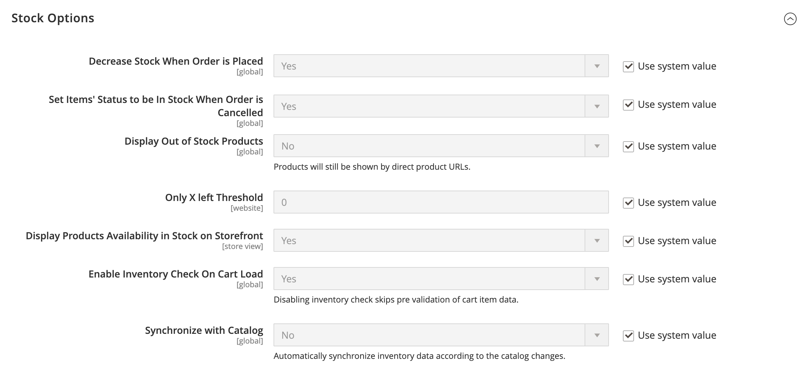
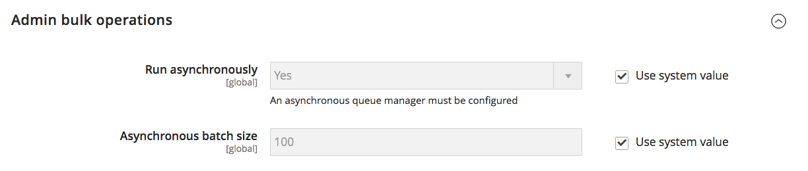

# [!UICONTROL Catalog] > [!UICONTROL Inventory]

{{config}}

>[!NOTE]
>
>[!DNL Inventory Management] for Adobe Commerce and Magento Open Source gives you the tools to manage your product inventory. Merchants with a single store to multiple warehouses, stores, pickup locations, drop shippers, and more can use these features to maintain quantities for sales and handle shipments to complete orders. For more information about these features and how you can use them to manage stock in multiple locations, see the [_[!DNL Inventory Management] User Guide_](https://experienceleague.adobe.com/docs/commerce-admin/inventory/introduction.html).

## [!UICONTROL Stock Options]

<!-- zoom -->

<!-- [Stock Options](https://docs.magento.com/user-guide/catalog/inventory-options-global.html) -->

|Field|[Scope](../../getting-started/websites-stores-views.md#scope-settings)|Description|
|--- |--- |--- |
|[!UICONTROL Decrease Stock When Order is Placed]|Global|If set to `Yes`, decreases the quantity in stock when the order is placed. With _Manage Stock_ enabled, reservations are entered for the ordered products and quantities. Options: `Yes` / `No`|
|[!UICONTROL Set Items' Status to be in Stock When Order is Cancelled]|Store View|If set to `Yes`, returns item to stock when order is canceled. With _Manage Stock_ enabled, the reservation is cleared for the canceled products and quantities. Options: `Yes` / `No`|
|[!UICONTROL Display Out of Stock Products]|Global|If set to `Yes`, displays products that are out of stock. If product alerts are also enabled, customers can sign up to be notified when the product becomes available. Options: `Yes` / `No`|
|[!UICONTROL Only X left Threshold]|Website|Establishes the threshold for the `Only x left` message. For example, if set to 3, the message appears when there are three or fewer of an item in stock. The message does not appear if the value is set to `0`.|
|[!UICONTROL Display products availability in Stock on Storefront]|Store View|If set to `Yes`, displays an `In Stock` or `Out of Stock` message on the product page. Options: `Yes` / `No`|
|[!UICONTROL Enable Inventory Check On Cart Load]|Global|Determines if an inventory check is performed when loading a product in the cart. Disabling this inventory check can improve performance for checkout steps, especially when there are many items in the cart. However, if you skip pre-validation, customers could see _out of stock_ errors later in the checkout process. Options: `Yes` / `No`|
|[!UICONTROL Synchronize with Catalog]|Global|When set to `Yes`, inventory data is adjusted according to the catalog changes (such as product removals, product SKU changes, and product type changes) and keeps consistency between inventory and catalog. Options: `Yes` / `No`|

{:style="table-layout:auto"}

## [!UICONTROL Product Stock Options]

<!-- zoom -->

<!-- [Product Stock Options](https://docs.magento.com/user-guide/catalog/inventory-options-global.html) -->

|Field|[Scope](../../getting-started/websites-stores-views.md#scope-settings)| Description                                                                                                                                                                                                                                                                                                                                                                                                                                                                                                                                                                                                                                                                                                                                                                      |
|--- |--- |----------------------------------------------------------------------------------------------------------------------------------------------------------------------------------------------------------------------------------------------------------------------------------------------------------------------------------------------------------------------------------------------------------------------------------------------------------------------------------------------------------------------------------------------------------------------------------------------------------------------------------------------------------------------------------------------------------------------------------------------------------------------------------|
|[!UICONTROL Manage Stock]|Global| Determines if you use full inventory control to manage the items in your catalog. Options:  **Yes** - Activates full inventory control to track the number of items currently in stock.  **No** - Does not track the number of items currently in stock.                                                                                                                                                                                                                                                                                                                                                                                                                                                                                                                 |
|[!UICONTROL Backorders]|Global| Determines how your store manages backorders. A backorder does not change the processing status of the order. Funds are still authorized or captured immediately when the order is placed, regardless of whether the product is in stock. When the product becomes available, it is shipped. Options:  **No Backorders** - Does not accept backorders when product is out of stock.  **Allow Qty Below 0** - Accepts backorders when the quantity falls below zero.  **Allow Qty Below 0 and Notify Customer** - Accepts backorders when the quantity falls below zero, but notifies customers that orders can still be placed.                                                                                                                                      |
|[!UICONTROL Use deferred Stock update]|Global|  (Adobe Commerce only) Determines whether to defer stock update if backorders are allowed (the _Back orders_ option is set to anything besides the `No backorders` default value). It works for a single product or an entire website, and uses the _Job Queue_ mechanism to allow the inventory quantity indicators to update asynchronously after the orders are placed. This option also works with [Asynchronous order placement](https://experienceleague.adobe.com/docs/commerce-operations/performance-best-practices/high-throughput-order-processing.html#asynchronous-order-placement) in combination with [Inventory Management](../../inventory-management/introduction.md). |
|Maximum Qty Allowed in Shopping Cart|Global| Determines the maximum number of a product that can be purchased in a single order. By default, the maximum quantity is set to 10,000.                                                                                                                                                                                                                                                                                                                                                                                                                                                                                                                                                                                                                                           |
|[!UICONTROL Out-of-Stock Threshold]|Global| Determines the stock level at which a product is considered to be out of stock. Options:  **Positive amount** - With _Backorders_ disabled, enter a positive amount. With Backorders enabled, this amount is ignored.  **Zero** - With _Backorders_ enabled, entering `0` allows for infinite backorders.  **Negative amount** - With _Backorders_ enabled, we recommend entering a negative amount. The amount is added to the Salable Quantity. For example, enter -50 to allow orders up to this amount.                                                                                                                                                                                                                                                          |
|[!UICONTROL Minimum Qty Allowed in Shopping Cart]|Global| Determines the minimum amount of an item that is available for purchase according to customer group. By default, the minimum quantity is set to 1. Click **[!UICONTROL Add Minimum Qty]** to enter a different value for a specific customer group.                                                                                                                                                                                                                                                                                                                                                                                                                                                                                                                              |
|[!UICONTROL Notify for Quantity Below]|Global| Determines the stock level at which notification is sent  that the inventory has fallen  below the threshold.                                                                                                                                                                                                                                                                                                                                                                                                                                                                                                                                                                                                                                                                    |
|[!UICONTROL Enable Qty Increments]|Global| Determines if items can be sold in quantity increments. Options: `Yes` / `No`                                                                                                                                                                                                                                                                                                                                                                                                                                                                                                                                                                                                                                                                                                    |
|[!UICONTROL Qty Increments]|Global| Establishes the number of products that make up a quantity increment.                                                                                                                                                                                                                                                                                                                                                                                                                                                                                                                                                                                                                                                                                                            |
|[!UICONTROL Automatically Return Credit Memo Item to Stock]|Global| Determines if items included on credit memos are automatically returned to inventory. Options: `Yes` / `No`                                                                                                                                                                                                                                                                                                                                                                                                                                                                                                                                                                                                                                                                      |

{:style="table-layout:auto"}

## [!UICONTROL Admin Bulk Operations]

<!-- zoom -->

<!-- [Admin Bulk Operations](https://docs.magento.com/user-guide/catalog/inventory-options-global.html) -->

>[!NOTE]
>
>To configure and support **asynchronous queue managers**, you must use the command line. This may require developer assistance. See [Start message queue consumers](https://experienceleague.adobe.com/docs/commerce-operations/configuration-guide/cli/start-message-queues.html) in the _Configuration Guide_.

|Field|[Scope](../../getting-started/websites-stores-views.md#scope-settings)|Description|
|--- |--- |--- |
|[!UICONTROL Run asynchronously]|Global|Determines if you run bulk operations asynchronously for mass product actions including [bulk](../../inventory-management/bulk-assignment.md) assign sources, unassign sources, and [transfer inventory to source](../../inventory-management/inventory-transfer.md). It collects bulk actions up to the _[!UICONTROL Asynchronous batch size]_, then runs those actions. This feature is disabled by default. We recommend reviewing your performance with bulk actions before enabling. Options:  **`Yes`** - Runs all bulk operations for [!DNL Inventory Management] asynchronously. To enable, you must configure an asynchronous queue manager.  **`No`** - Default. Does not run bulk operations asynchronously.|
|[!UICONTROL Asynchronous batch size]|Global|Set **[!UICONTROL Run asynchronously]** to `Yes` to enter a value for _[!UICONTROL Asynchronous batch size]_ field.  The default batch size is 100. When bulk processes reach this amount, they are executed.|

{:style="table-layout:auto"}

## [!UICONTROL Inventory Indexer Settings]

|Field|[Scope](../../getting-started/websites-stores-views.md#scope-settings)|Description|
|--- |--- |--- |
|[!UICONTROL Stock/Source reindex strategy]|Global|Determines the strategy used for stock/source reindexing. Options: `Synchronous` / `Asynchronous` (an asynchronous queue manager must be configured for async mode)|

{:style="table-layout:auto"}

## [!UICONTROL Distance Provider for Distance Based SSA]

<!-- zoom -->

<!-- [Distance Providers for Distance Based SSA](https://docs.magento.com/user-guide/catalog/inventory-configure-distance-priority.html) -->

|Field|[Scope](../../getting-started/websites-stores-views.md#scope-settings)|Description|
|--- |--- |--- |
|[!UICONTROL Provider]|Global|Determines the provider to use for the Distance Priority Source Selection Algorithm. This feature is enabled by default. Options:  **`Google MAP`** - Uses Google services to calculate the distance and time between the shipping destination address and source locations (address and GPS coordinates). This option requires a Google API key and may incur charges through Google.  **`Offline Calculation`** - Calculates the distance using an embedded database to determine the closest source to the shipping destination address. To use this option, you might require developer assistance to initially download the database location content for all countries you ship to using a command line.|

{:style="table-layout:auto"}

## [!UICONTROL Google Distance Provider]

<!-- zoom -->

<!-- [Google Distance Provider](https://docs.magento.com/user-guide/catalog/inventory-configure-distance-priority.html) -->

|Field|[Scope](../../getting-started/websites-stores-views.md#scope-settings)|Description|
|--- |--- |--- |
|[!UICONTROL Google API key]|Global|Enter the Google API key for the Google MAP provider. The key is from the [!DNL Google Maps Platform] and should have [!DNL Geocoding API] and [!DNL Distance Matrix API] enabled. For details, see [Configure the Distance Priority Algorithm](../../inventory-management/distance-priority-algorithm.md#configure-the-distance-priority-algorithm) in the _Inventory Management Guide_.|
|[!UICONTROL Computation mode]|Global|Determines the directions and paths to calculate the distance from the shipping address and all sources assigned to the stock. By default, calculations use the driving mode. Options:  **`Driving`** - Default setting, requests standard driving directions using the road network.  **`Walking`** - Requests walking directions using pedestrian paths and sidewalks (where available).  **`Bicycling`** - Requests bicycling directions using bicycle paths and preferred streets (currently only available in the US and some Canadian cities).|
|[!UICONTROL Value]|Global|Indicates what to calculate and return for the distance and time for the source locations to the shipping destination address. The Distance Priority Algorithm recommends the source with the shortest distance or time to the shipping destination address, which delivers faster and possibly cheaper to fulfill shipments. Options:  **`Distance`** - Returns the distance between points in metrics (kilometers and meters) or imperial (miles and feet).  **`Time to Destination`** - Returns the time required to travel from the source locations to the shipping address in hours and minutes.|

{:style="table-layout:auto"}
