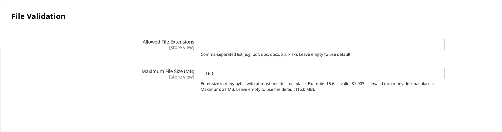

# [!UICONTROL Catalog] > [!UICONTROL Product File Attributes]

{{config}}

## [!UICONTROL Configure Allowed File Types and Size]

|Field|[Scope](../../getting-started/websites-stores-views.md#scope-settings)|Description|
|--- |--- |--- |
|[!UICONTROL Allowed File Extensions]|Global|A comma-separated list of permitted file types, such as `pdf,doc,docx,txt`. Leave blank to use the default allowed file types: pdf, doc, docx, xls, xlsx, ppt, pptx, txt, csv, zip.|
|[!UICONTROL Maximum File Size]|Global|The maximum allowed file size in MB, such as `20.0`. The default limit is 16 MB. The maximum allowed file size is 31 MB.|

{style="table-layout:auto"}
