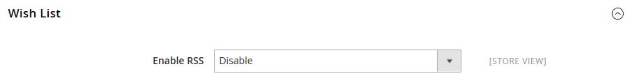

# Catalog > RSS Feeds

{{config}}

## Rss Config

<!-- zoom -->

<!-- Rss Config](https://docs.magento.com/user-guide/marketing/rss-feed.html) -->

|Field|[Scope](../../getting-started/websites-stores-views.md#scope-settings)|Description|
|--- |--- |--- |
|Enable RSS|Store View|Enables customers to receive RSS feeds from the store.|

## Wish List

<!-- zoom -->

<!-- Wish List](https://docs.magento.com/user-guide/marketing/wishlists.html) -->

|Field|[Scope](../../getting-started/websites-stores-views.md#scope-settings)|Description|
|--- |--- |--- |
|Enable RSS|Store View|When enabled, an RSS feed link appears at the top of wish list pages. The wish list sharing page includes a checkbox that the customer can select to link to the feed from shared wish lists.|

## Catalog

<!-- zoom -->

<!-- Catalog](https://docs.magento.com/user-guide/catalog/catalog-menu.html) -->

|Field|[Scope](../../getting-started/websites-stores-views.md#scope-settings)|Description|
|--- |--- |--- |
|New Products|Store View|When enabled, publishes notification of new products added to the store catalog.|
|Special Products|Store View|When enabled, publishes notification of any products with special pricing.|
|Coupons/Discounts|Store View|When enabled, publishes notification of any coupons or discounts.|
|Top Level Category|Store View|Publishes notification of any change to the top-level category structure of your catalog, which is reflected in the main menu.|

## Order

<!-- zoom -->

<!-- Order](https://docs.magento.com/user-guide/sales/order-status-notification.html) -->

|Field|[Scope](../../getting-started/websites-stores-views.md#scope-settings)|Description|
|--- |--- |--- |
|Customer Order Status Notification|Store View|Gives customers the ability to track their order status by RSS feed. When enabled, an RSS feed link appears on the order|
