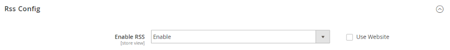
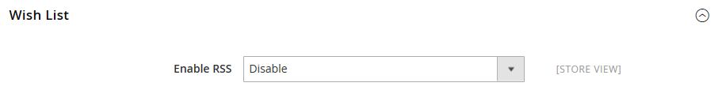

# [!UICONTROL Catalog] > [!UICONTROL RSS Feeds]

{{config}}

## [!UICONTROL Rss Config]

<!-- zoom -->

<!-- [Rss Config](https://experienceleague.adobe.com/en/docs/commerce-admin/marketing/communications/social-rss) -->

|Field|[Scope](../../getting-started/websites-stores-views.md#scope-settings)|Description|
|--- |--- |--- |
|[!UICONTROL Enable RSS]|Store View|Enables customers to receive RSS feeds from the store.|

{style="table-layout:auto"}

For details on how to use RSS feeds after they are enabled, see [Social media and RSS feeds](../../merchandising-promotions/social-rss.md). 

## [!UICONTROL Wish List]

<!-- zoom -->

<!-- [Wish List](https://experienceleague.adobe.com/en/docs/commerce-admin/stores-sales/shopper-tools/wish-lists/wishlists) -->

|Field|[Scope](../../getting-started/websites-stores-views.md#scope-settings)|Description|
|--- |--- |--- |
|[!UICONTROL Enable RSS]|Store View|When enabled, an RSS feed link appears at the top of wish list pages. The wish list sharing page includes a checkbox that the customer can select to link to the feed from shared wish lists.|

{style="table-layout:auto"}

## [!UICONTROL Catalog]

<!-- zoom -->

<!-- [Catalog](https://experienceleague.adobe.com/en/docs/commerce-admin/catalog/catalog-menu) -->

|Field|[Scope](../../getting-started/websites-stores-views.md#scope-settings)|Description|
|--- |--- |--- |
|[!UICONTROL New Products]|Store View|When enabled, publishes notification of new products added to the store catalog.|
|[!UICONTROL Special Products]|Store View|When enabled, publishes notification of any products with special pricing.|
|[!UICONTROL Coupons/Discounts]|Store View|When enabled, publishes notification of any coupons or discounts.|
|[!UICONTROL Top Level Category]|Store View|Publishes notification of any change to the top-level category structure of your catalog, which is reflected in the main menu.|

{style="table-layout:auto"}

## [!UICONTROL Order]

<!-- zoom -->

<!-- [Order](https://experienceleague.adobe.com/en/docs/commerce-admin/stores-sales/order-management/orders/order-status#notification) -->

|Field|[Scope](../../getting-started/websites-stores-views.md#scope-settings)|Description|
|--- |--- |--- |
|[!UICONTROL Customer Order Status Notification]|Store View|Gives customers the ability to track their order status by RSS feed. When enabled, an RSS feed link appears on the order|

{style="table-layout:auto"}
