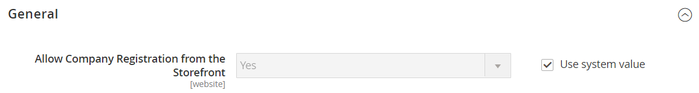

# [!UICONTROL Customers] > [!UICONTROL Company Configuration]

{{b2b-feature}}

{{config}}

>[!TIP]
>
>With the installation and enablement of B2B for Adobe Commerce, the buying experience can be personalized with company-specific features. B2B for Adobe Commerce is an integrated solution that supports both B2B and B2C models. For more information about the B2B features, see the [B2B for Adobe Commerce User Guide](https://experienceleague.adobe.com/docs/commerce-admin/b2b/introduction.html).

>[!NOTE]
>
>Access to these configuration options for B2B features are controlled by the [role resources](../../systems/permissions-user-roles.md#role-resources). These role resources must be set for the user role assigned to the Admin user.

## [!UICONTROL General]

<!-- zoom -->

|Field|[Scope](../../getting-started/websites-stores-views.md#scope-settings)|Description|
|--- |--- |--- |
|[!UICONTROL Allow Company Registration from the Storefront]|Website|Determines if visitors to your store have the choice to [register](../../customers/customer-sign-in.md) for a company account or an individual account. Options: `Yes` / `No`|

{:style="table-layout:auto"}

## [!UICONTROL Email Options - Company Registration]

<!-- zoom -->

<!-- [Email Options - Company Registration](https://docs.magento.com/user-guide/customers/to.com/user-guide/customers/customer-sign-in.html) -->

|Field|[Scope](../../getting-started/websites-stores-views.md#scope-settings)|Description|
|--- |--- |--- |
|[!UICONTROL Company Registration Email Recipient]|Store View|The [store contact](https://docs.magento.com/user-guide/stores/store-email-addresses.html) that is notified when a company registration request is submitted from the storefront. Options: `General Contact` / `Sales Representative` / `Customer Support` / `Custom Email 1` / `Custom Email 2`|
|[!UICONTROL Send Company Registration Email Copy To]|Store View|The email address of each person who is to receive a copy of the registration notification. Separate multiple email addresses with a comma.|
|[!UICONTROL Send Email Copy Method]|Store View|The email method that is used to send the copy of the registration email. Options: `Bcc` / `Separate Email`|
|[!UICONTROL Default Company Registration Email]|Store View|The email template that is used by default for the company registration notification. Default template: `Company Registration Request`|

{:style="table-layout:auto"}

## [!UICONTROL Customer-Related Emails]

<!-- zoom -->

<!-- [Customer-Related Emails](https://docs.magento.com/user-guide/marketing/email-company-configuration.html) -->

|Field|[Scope](../../getting-started/websites-stores-views.md#scope-settings)|Description|
|--- |--- |--- |
|[!UICONTROL Default 'Sales Rep Assigned' Email]|Store View|The email template that is used by default when a sales representative is assigned to a company account. This email is sent to the sales representative and to the company administrator. Default template: `Sales Representative Assigned to Company`|
|[!UICONTROL Default 'Assign Company to Customer' Email]|Store View|The email template that is used by default when an individual customer account is assigned to a company account. This email is sent to the customer only. Default template: `Assign Company to Customer`|
|[!UICONTROL Default 'Assign Company Admin' Email]|Store View|The email template that is used when a company administrator is assigned to a company. This email is sent to the sales representative and to the company administrator. Default template: `Assign Company Admin`|
|[!UICONTROL Default 'Company Admin Inactive' Email]|Store View|The email template that is used by default when the status of the person who serves as the company administrator is changed to "Inactive". The system sends email notification of the change to the new and former company administrators. Default template: `Company Admin Set Inactive`|
|[!UICONTROL Default 'Company Admin Changed to Member' Email]|Store View|The email template that is used by default when the former company administrator becomes a company member. The email is sent to the company member only. Default template: `Company Admin Changed to Member`|
|[!UICONTROL Default 'Customer Status Active' Email]|Store View|The email template that is used by default when the status of a customer becomes active. This email is sent to the customer only. Default template: `Customer Status Active`|
|[!UICONTROL Default 'Customer Status Inactive' Email]|Store View|The email template that is used by default when the status of a customer becomes inactive. This email is sent to the customer only. Default template: `Customer Status Inactive`|

{:style="table-layout:auto"}

## [!UICONTROL Company Status Change]

<!-- zoom -->

<!-- [Company Status Change](https://docs.magento.com/user-guide/customers/to.com/user-guide/customers/account-company-manage.html) -->

|Field|[Scope](../../getting-started/websites-stores-views.md#scope-settings)|Description|
|--- |--- |--- |
|[!UICONTROL Company Status Change Email Recipient]|Store View|The [store contact](https://docs.magento.com/user-guide/stores/store-email-addresses.html) that is notified whenever the status of a company changes. Options: `General Contact` / `Sales Representative` / `Customer Support` / `Custom Email 1` / `Custom Email 2`|
|[!UICONTROL Send Company Status Change Email Copy To]|Store View|The email address of each person who is to receive a copy of the company status change notification. Separate multiple email addresses with a comma.|
|[!UICONTROL Send Email Copy Method]|Store View|The email method that is used to send the copy of the status change notification. Options: `Bcc` / `Separate Email`|
|[!UICONTROL Default "Company Status Change to Active 1' Email]|Store View|The email template that is used when the status of a company changes from _Pending Approval_ to _Active_. Default template: `Company Status Active 1`|
|[!UICONTROL Default 'Company Status Change to Active 2' Email]|Store View|The email template that is used by default when the status of a company changes from _Rejected_ or _Blocked_ to _Active_. Default template: `Company Status Active 2`|
|[!UICONTROL Default 'Company Status Change to Rejected' Email]|Store View|The email template that is used by default when the status of a company changes to _Rejected_. Default template: `Company Status Rejected`|
|[!UICONTROL Default 'Company Status Change to Blocked' Email]|Store View|The email template that is used by default when the status of a company changes to _Blocked_. Default template: `Company Status Blocked`|
|[!UICONTROL Default 'Company Status Change to Pending Approval' Email]|Store View|The email template that is used by default when the status of a company changes to _Pending Approval_. Default template: `Company Status Pending Approval`|

{:style="table-layout:auto"}

## [!UICONTROL Company Credit]

<!-- zoom -->

<!-- [Company Credit](https://docs.magento.com/user-guide/customers/to.com/user-guide/customers/account-dashboard-company-credit.html) -->

|Field|[Scope](../../getting-started/websites-stores-views.md#scope-settings)|Description|
|--- |--- |--- |
|[!UICONTROL Company Credit Change Email Sender]|Store View|The [store contact](https://docs.magento.com/user-guide/stores/store-email-addresses.html) that is notified whenever there is a change to a company's credit. Options: `General Contact` / `Sales Representative` / Customer Support / Custom Email 1 / Custom Email 2|
|[!UICONTROL Send Company Credit Change Email Copy To]|Store View|The email address of each person who is to receive a copy of the company credit change notification. Separate multiple email addresses with a comma.|
|[!UICONTROL Send Email Copy Method]|Store View|The email method that is used to send the copy of the credit change notification. Options: `Bcc` / `Separate Email`|
|[!UICONTROL Allocated Email Template]|Store View|The email template that is used by default when company credit is allocated. This email is sent to the company administrator. Default template: `Credit Limit Allocated`|
|[!UICONTROL Updated Email Template]|Store View|The email template that is used by default when a company's credit limit is updated. This email is sent to the company administrator. Default template: `Credit Limit Updated`|
|[!UICONTROL Reimbursed Email Template]|Store View|The email template that is used by default when a [reimbursement](https://docs.magento.com/user-guide/customers/credit-company-reimburse.html) is made to company's credit. This email is sent to the company administrator. Default template: `Credit Reimbursed`|
|[!UICONTROL Refunded Email Template]|Store View|The email template that is used by default when an amount from an order is refunded to company credit. This email is sent to the company administrator. Default template: `Order Refunded to Company Credit`|
|[!UICONTROL Reverted Email Template]|Store View|The email template that is used by default when an order is reverted to company credit. This email is sent to the company administrator. Default template: `Order Reverted to Company Credit`|

{:style="table-layout:auto"}
