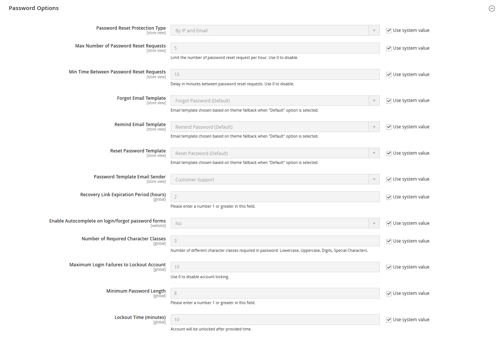
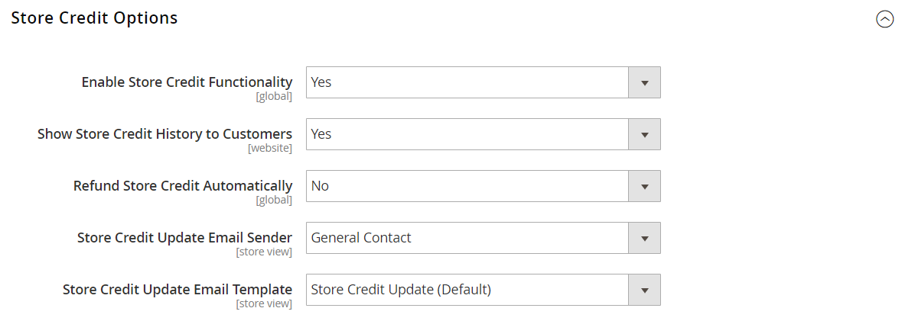

# [!UICONTROL Customers]  > [!UICONTROL Customer Configuration]

{{config}}

## [!UICONTROL Account Sharing Options]

<!-- zoom -->

<!-- [Account Sharing Options](https://docs.magento.com/user-guide/customers/account-scope.html) -->

|Field|[Scope](../../getting-started/websites-stores-views.md#scope-settings)|Description|
|--- |--- |--- |
|[!UICONTROL Share Customer Accounts]|Global|Determines the scope of customer accounts in the store hierarchy. Options:  **`Global`** - Customer account information is shared with every website and store in the Commerce installation.  **`Per Website`** - Customer account information is limited to the website where the account was created.|

{:style="table-layout:auto"}

## [!UICONTROL Online Customers Options]

<!-- zoom -->

<!-- [Online Customers Options](https://docs.magento.com/user-guide/customers/now-online.html) -->

|Field|[Scope](../../getting-started/websites-stores-views.md#scope-settings)|Description|
|--- |--- |--- |
|[!UICONTROL Online Minutes Interval]|Global|Determines the length of time that a customer's online activity is accessible from the Admin. Leave empty for a default interval of 15 minutes.|
|[!UICONTROL Customer Data Lifetime]|Global|Determines the number of minutes before unsaved data that is entered by the customer expires. By default, unsaved data expires after 60 minutes.|

{:style="table-layout:auto"}

## [!UICONTROL Create New Account Options]

<!-- zoom -->

<!-- zoom -->

<!-- [Create New Account Options (VAT Fields)](https://docs.magento.com/user-guide/customers/customer-account-configuration.html) -->

|Field|[Scope](../../getting-started/websites-stores-views.md#scope-settings)|Description|
|--- |--- |--- |
|[!UICONTROL Enable Automatic Assignment to Customer Group]|Store View|Determines if customers are automatically assigned to the default customer group. To show VAT number in the store, set Show VAT Number in the storefront, select `Yes`. Options:  **`Yes`** - The system does not automatically validate customer VAT IDs nor does it change customer groups.  **`No`** - The system behavior is as usual, and the default customer group can be set in the Default Group field.|
|[!UICONTROL Default Group]|Store View|Identifies the initial customer group assigned when an account is created.|
|[!UICONTROL Default Value for Disable Automatic Group Changes Based on VAT ID]|Global|(Available only if current configuration scope is set to `Default Group`.) Choose whether the automatic change of customer group based on VAT ID is enabled or disabled by default. The setting can be overridden on the product level. The setting influences the system behavior in the following situations:   - The VAT ID of the customer's default address or the whole default address changes.   - Customer group change was emulated during the checkout for a registered customer who had no previously saved address or for a customer, who registered during the checkout.  If the automatic group change is enabled, then in the first case the customer group changes automatically, and in the second case the temporarily emulated customer group is assigned to customer. If the automatic group change is disabled, the customer group that is assigned never changes, unless an administrator changes it manually.|
|[!UICONTROL Show VAT Number on Storefront]|Website|Determines if the VAT number is visible to customers in the store. Options: `Yes` / `No`   Affects regular non-B2B customer accounts only. Company accounts have their own separate VAT Number field.|
|[!UICONTROL Default Email Domain]|Store View|Identifies the default email domain for the store. For example: `mystore.com`|
|[!UICONTROL Default Welcome Email]|Store View|Identifies the email template used for the default _Welcome_ email.|
|[!UICONTROL Default Welcome Email Without Password]|Store View|An alternate Welcome email template that is used for new customer accounts created by the Administrator that don't yet have a password assigned.|
|[!UICONTROL Email Sender]|Store View|Identifies the store contact that appears as the sender of the Welcome email.|
|[!UICONTROL Require Emails Confirmation]|Website|Determines if a request to create an account requires confirmation from the customer. Options: `Yes` / `No`|
|[!UICONTROL Confirmation Link Email]|Store View|Identifies the email template that is used for the confirmation email. Default template: `New account confirmation key`|
|[!UICONTROL Welcome Email]|Store View|Identifies the email template that is used for the Welcome message that is sent after the account is confirmed.|
|[!UICONTROL Generate Human-Friendly Customer ID]|Global|Determines if the field that is used to enter and store the VAT ID number is visible from the storefront. Options: `Yes` / `No`|

{:style="table-layout:auto"}

## [!UICONTROL Password Options]

<!-- zoom -->

<!-- [Password Options](https://docs.magento.com/user-guide/customers/password-options.html) -->

|Field|[Scope](../../getting-started/websites-stores-views.md#scope-settings)|Description|
|--- |--- |--- |
|[!UICONTROL Password Reset Protection Type]|Store View|Determines the method used to reset a Customer password. Options:  **`By IP and Email`** - The password can be reset online after a response is received from a reset notification that is sent to the email address associated with the Admin account.  **`By IP`** - The password can be reset online.  **`By Email`** - The password can be reset by responding to an email notification that is sent to the email address associated with the Admin account.  **`None`** - The password can be reset only by the store administrator. |
|[!UICONTROL Max Number of Password Reset Requests]|Store View|Limits the number of password reset requests per hour. For unlimited requests, enter zero (0).|
|[!UICONTROL Min Time Between Password Reset Requests]|Store View|Determines the number of minutes between password reset requests. For no delay between requests, enter zero (0).|
|[!UICONTROL Forgot Email Template]|Store View|Identifies the email template that is used when customers forget their passwords. Default template: `Forgot Password`|
|[!UICONTROL Remind Email Template]|Store View|Identifies the email template that is used when customers receive a password reminder, or hint. Default template: `Remind Password`|
|[!UICONTROL Reset Password Template]|Store View|Determines the email template that is used when customers reset their passwords.|
|[!UICONTROL Password Template Email Sender]|Store View|Determines the store contact that appears as the sender of password-related emails.|
|[!UICONTROL Recovery Link Expiration Period (hours)]|Global|Specifies the number of hours before a password recovery link expires.|
|[!UICONTROL Enable Autocomplete on login/forgot password forms]|Website|Determines if autocomplete is enabled on login/forgot password forms. Options: `Yes` / `No`|
|[!UICONTROL Number of Required Character Classes]|Global|Determines the number of different character classes (lowercase, uppercase, numeric, and special characters) that must be included in a password.|
|[!UICONTROL Maximum Login Failures to Lockout Account]|Global|Determines the number failed login attempts until the Admin account is locked. For unlimited attempts, enter zero (`0`).|
|[!UICONTROL Minimum Password Length]|Global|Determines the minimum number of characters allowed in a password. The number must be greater than zero (`0`).|
|[!UICONTROL Lockout Time (minutes)]|Global|Determines the number of minutes an Admin account is locked after too many failed attempts to log in.|

{:style="table-layout:auto"}

## [!UICONTROL Account Information Options]

<!-- zoom -->

|Field|[Scope](../../getting-started/websites-stores-views.md#scope-settings)|Description|
|--- |--- |--- |
|[!UICONTROL Change Email Template]|Store View|Identifies the default email template that is used when a customer changes their email address.|
|[!UICONTROL Change Email and Password Template]|Store View|Identifies the default email template that is used when a customer changes their email address and password.|

{:style="table-layout:auto"}

## [!UICONTROL Name and Address Options]

### Magento Open Source options

{{ce-feature}}

<!-- zoom -->

<!-- [Name and Address Options - Open Source](https://docs.magento.com/user-guide/customers/name-address-options.html) -->

|Field|[Scope](../../getting-started/websites-stores-views.md#scope-settings)|Description|
|--- |--- |--- |
|[!UICONTROL Number of Lines in a Street Address]|Website|Determines the number of lines in the street address. The street address consists of from `1` to `4` lines. If the field is blank, the default street address of three (`3`) lines is used.|
|[!UICONTROL Show Prefix]|Website|Determines if the customer name includes a prefix at the beginning, such as Mr. and  Ms. Options: `No` / `Optional` / `Required`|
|[!UICONTROL Prefix Dropdown Options]|Website|Defines the list of prefix options. Separate values with a semicolon. Place a semicolon before the first value to display an empty value at the top of the list.|
|[!UICONTROL Show Middle Name (initial)]|Website|Determines if the middle initial is included as part of the customer name. If used, the middle initial is an optional field. Options: `Yes` / `No`|
|[!UICONTROL Show Suffix]|Website|Determines if the customer name includes a suffix at the end, such as Jr., Sr., and III. Options: `No` / `Optional` / `Required`|
|[!UICONTROL Suffix Dropdown Options]|Website|Defines the list of suffix options. Separate values with a semicolon. Place a semicolon before the first value to display an empty value at the top of the list.|
|[!UICONTROL Show Date of Birth]|Website|Determines if the customer date of birth is included in the name and address form. Options: `No` / `Optional` / `Required`    **_Important:_** In keeping with current security and privacy best practices, be sure that you are aware of any potential legal and security risks associated with the storage of customers' full date of birth (month, day, year) along with other personal identifiers. We recommend limiting the storage of customers' full birth dates and instead suggest using customer year of birth as an alternative.|
|[!UICONTROL Show Tax/VAT Number]|Website|Determines if the Tax or [VAT number](https://docs.magento.com/user-guide/tax/vat.html) is included in the name and address form. Options: `No` / `Optional` / `Required`|
|[!UICONTROL Show Gender]|Website|Determines if gender is included in the name and address form. Options: `No` / `Optional` / `Required`|
|[!UICONTROL Show Telephone]|Website|Determines if the customer's telephone number is included in the name and address form. Options: `No` / `Optional` / `Required`|
|[!UICONTROL Show Company]|Website|Determines if the customer's company is included in the name and address form. Options: `No` / `Optional` / `Required`|
|[!UICONTROL Show Fax]|Website|Determines if the customer's fax number is included in the name and address form. Options: `No` / `Optional` / `Required`|

{:style="table-layout:auto"}

### Adobe Commerce options

{{ee-feature}}

<!-- zoom -->

<!-- [Name and Address Options - Commerce](https://docs.magento.com/user-guide/customers/name-address-options.html) -->

|Field|[Scope](../../getting-started/websites-stores-views.md#scope-settings)|Description|
|--- |--- |--- |
|[!UICONTROL Prefix Dropdown Options]|Website|Defines the list of prefix options. Separate values with a semicolon. Place a semicolon before the first value to display an empty value at the top of the list.|
|[!UICONTROL Suffix Dropdown Options]|Website|Defines the list of suffix options. Separate values with a semicolon. Place a semicolon before the first value to display an empty value at the top of the list.|
|[!UICONTROL Show Telephone]|Website|Determines if the customer's telephone number is included in the name and address form. Options: `No` / `Optional` / `Required`|
|[!UICONTROL Show Company]|Website|Determines if the customer's company is included in the name and address form. Options: `No` / `Optional` / `Required`|
|[!UICONTROL Show Fax]|Website|Determines if the customer's fax number is included in the name and address form. Options: `No` / `Optional` / `Required`|

{:style="table-layout:auto"}

## [!UICONTROL Store Credit Options]

{{ee-feature}}

<!-- zoom -->

<!-- [Store Credit Options](https://docs.magento.com/user-guide/customers/credit-configure.html) -->

|Field|[Scope](../../getting-started/websites-stores-views.md#scope-settings)|Description|
|--- |--- |--- |
|[!UICONTROL Enable Store Credit Functionality]|Global|Determines if Store Credit is enabled. Disabling it removes Store Credit from customer accounts and from the Admin Manage Customers page. Options: `Yes` / `No`.|
|[!UICONTROL Show Store Credit History to Customers]|Website|Determines if the balance history is visible in customer accounts. Options: `Yes` / `No`.|
|[!UICONTROL Refund Store Credit Automatically]|Global|Determines if store refund is issued automatically. Options: `Yes` / `No`|
|[!UICONTROL Store Credit Update Email Sender]|Store View|Determines the store identity that appears as the sender of credit update notifications sent to customers.|
|[!UICONTROL Store Credit Update Email Template]|Store View|Determines the email template used for credit updates.|

{:style="table-layout:auto"}

## [!UICONTROL Login Options]

<!-- zoom -->

<!-- [Login Options](https://docs.magento.com/user-guide/customers/login-landing-page.html) -->

|Field|[Scope](../../getting-started/websites-stores-views.md#scope-settings)|Description|
|--- |--- |--- |
|[!UICONTROL Redirect Customer to Account Dashboard after Logging in]|Website|Determines what happens after customers log in to their accounts. To redirect customers to their account dashboard, select `Yes`. Options:  **`Yes`** - The account dashboard appears when customers log in to their accounts.  **`No`** - Customers can continue shopping after logging in to their accounts.|

{:style="table-layout:auto"}

## [!UICONTROL Address Templates]

<!-- zoom -->

<!-- [Address Templates](https://docs.magento.com/user-guide/customers/address-templates.html) -->

|Template|[Scope](../../getting-started/websites-stores-views.md#scope-settings)|Description|
|--- |--- |--- |
|[!UICONTROL Text]|Store View|The template is used for all addresses that are printed.|
|[!UICONTROL Text One Line]|Store View|This template defines the order of address entities in the customer's shopping cart address book list. Progress during checkout.|
|[!UICONTROL HTML]|Store View|This template defines the order of address fields located under the _Customer Addresses_ area in the Admin panel ([!UICONTROL Customers] > [!UICONTROL Manage Customers]). This also affects those on the _Add New Address_ page when a customer creates a billing or shipping address on their account page.|
|[!UICONTROL PDF]|Store View|The template defines the display of billing and shipping addresses in the printed invoices, shipments, and credit memos.|

{:style="table-layout:auto"}

## [!UICONTROL Customer Segments]

{{ee-feature}}

<!-- zoom -->

<!-- [Customer Segments](https://docs.magento.com/user-guide/marketing/customer-segments.html) -->

|Template|[Scope](../../getting-started/websites-stores-views.md#scope-settings)|Description|
|--- |--- |--- |
|[!UICONTROL Enable Customer Segment Functionality]|Global|Determines if customer segments can be used to create targeted promotions. Options: `Yes` / `No`|

{:style="table-layout:auto"}

## [!UICONTROL CAPTCHA]

<!-- zoom -->

<!-- [CAPTCHA](https://docs.magento.com/user-guide/stores/security-captcha.html) -->

|Field|[Scope](../../getting-started/websites-stores-views.md#scope-settings)|Description|
|--- |--- |--- |
|[!UICONTROL Enable CAPTCHA on Storefront]|Website|Enables CAPTCHA in the stores associated with the Commerce website. Options: `Yes` / `No`|
|[!UICONTROL Font]|Website|Determines the font that is used to display the CAPTCHA. To add your own font, put the font file in the same directory as your Commerce installation and add the declaration to the `config.xml` file at `app/code/Magento/Captcha/etc`.|
|[!UICONTROL Forms]|Website|Determines the forms where CAPTCHA is used. Options:  `Applying Coupon Code`  `Checkout/Placing Order` `Create user`  `Login`  `Forgot password`  `Contact Us`  `Change password`  `Share Wishlist Form`  `Send to Friend Form`  `Payflow Pro` (see [security patch](https://experienceleague.adobe.com/docs/commerce-knowledge-base/kb/troubleshooting/payments/paypal-payflow-pro-active-carding-activity.html))  `Add Gift Card Code`    `Create company`     _**Note:**_ The Create User, Forgot Password, and Payflow Pro forms are always enabled when selected.|
|[!UICONTROL Displaying Mode]|Website|Determines when the CAPTCHA appears. Options:  **`Always`** - CAPTCHA is always required to log in.  **`After number of attempts to login`** - This option applies only to the Admin Sign In form. When selected, the _[!UICONTROL Number of Unsuccessful Attempts to Login]_ field appears. Enter the number of login attempts that you want to allow. A value of `0` (zero) is similar to setting [!UICONTROL Displaying Mode] to `Always`. _**Note:**_ To track the number of unsuccessful login attempts, each attempt to log in under one email address and from one IP-address is counted. The maximum number of login attempts allowed from the same IP-address is 1,000. This limitation applies only when CAPTCHA is enabled.|
|[!UICONTROL Number of Unsuccessful Attempts to Login]|Website|Specifies the number of times a customer can try to log in before the account is locked.|
|[!UICONTROL CAPTCHA Timeout (minutes)]|Website|Determines the lifetime of the current CAPTCHA. When the CAPTCHA expires, the user must reload the page.|
|[!UICONTROL Number of Symbols]|Website|Determines the number of symbols that appear in the CAPTCHA, with a maximum of 8. You can also specify a range, for example, 5-8.|
|[!UICONTROL Symbols Used in CAPTCHA]|Website|Determines the letters (a-z and A-Z) and numbers (0-9) that appear in the CAPTCHA. Symbols that are hard to distinguish from other symbols, such as `i`, `l`, or `1`, are not included in the default set of CAPTCHA symbols.|
|[!UICONTROL Case Sensitive]|Website|Determines if CAPTCHA characters are case-sensitive. Options: `Yes` / `No`|

{:style="table-layout:auto"}
