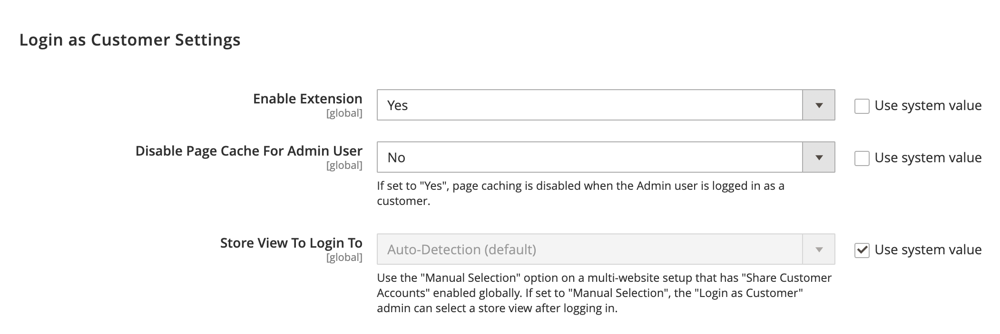

# [!UICONTROL Customers] > [!UICONTROL Login As Customer]

{{config}}

## General Options

<!-- zoom -->

<!-- [Login As Customer - General Options](https://docs.magento.com/user-guide/customers/login-as-customer.html#enable-the-feature) -->

| Option | [Scope](../../getting-started/websites-stores-views.md#scope-settings) | Description |
|-- | -- | -- |
| [!UICONTROL Enable Login as Customer] | Global | Determines if _Login as Customer_ is enabled in the global scope. Options: `Yes` / `No` |
| [!UICONTROL Disable Page Cache for Admin User] | Global | Determines if page cache for the admin user is disabled in the global scope. Options: `Yes` / `No` |
| [!UICONTROL Store View to Log in] | Global | `Auto-Detection (default)` uses the default store setting for that company user. Use `Manual Selection` if you want the _Admin_ user to select the store view when logging in as customer. |
| [!UICONTROL Title for Login as Customer opt-in checkbox] | Website | Adds a title for the `Login as customer` checkbox. |
| [!UICONTROL Login as Customer checkbox tooltip] | Website | Adds a tooltip for the `Log in as customer` checkbox. |

{style="table-layout:auto"}
