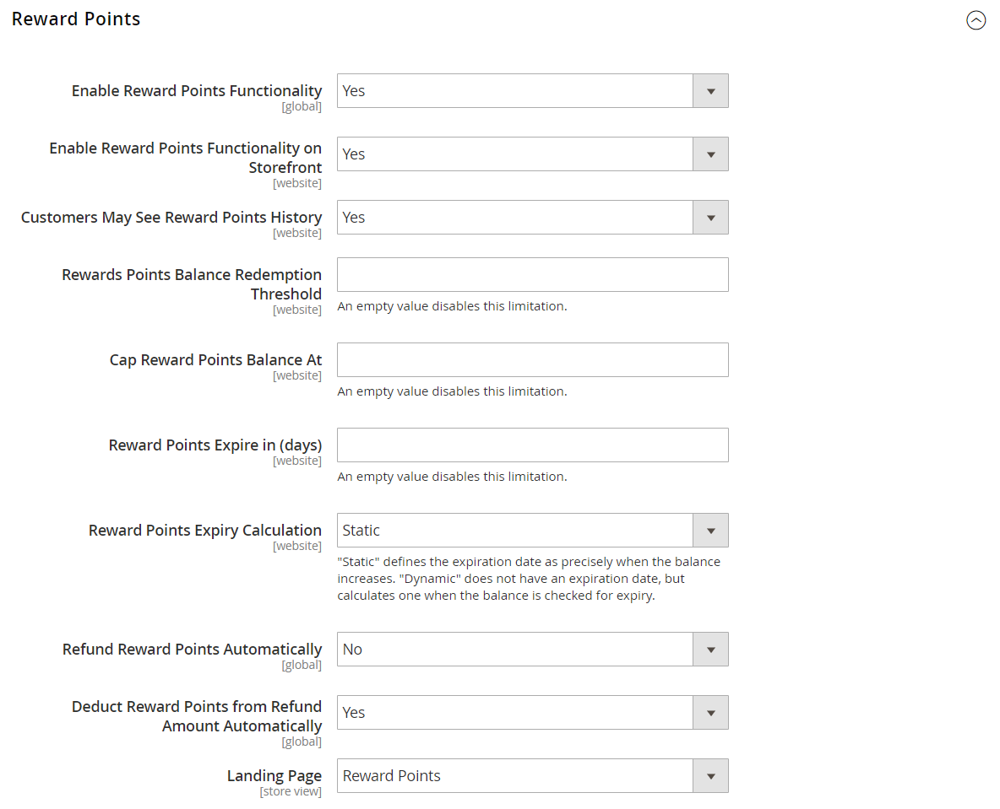

# [!UICONTROL Customers] > [!UICONTROL Reward Points]

{{ee-feature}}

{{config}}

## [!UICONTROL Reward Points]

<!-- zoom -->

<!-- [Reward Points](https://docs.magento.com/user-guide/marketing/reward-point-configure.html) -->

|Field|[Scope](../../getting-started/websites-stores-views.md#scope-settings)|Description|
|--- |--- |--- |
|[!UICONTROL Enable Reward Points Functionality]|Global|Activates or deactivates reward points. Options: `Yes` / `No`.|
|[!UICONTROL Enable Reward Points Functionality on Storefront]|Website|When enabled, customers can earn points through their activities, and redeem them at checkout. If disabled, only Admin users can assign and redeem points on behalf of customers. Options: `Yes` / `No`.|
|[!UICONTROL Customers May See Reward Points History]|Website|When enabled, customers can see a detailed history with each accrual, redemption, and expiration of Reward Points in their account dashboard. Options: `Yes` / `No`|
|[!UICONTROL Reward Points Balance Redemption Threshold]|Website|Requires customers to achieve a minimum point balance before they can redeem them for orders. Leave blank for no  minimum.|
|[!UICONTROL Cap Reward Points Balance At]|Website|Prevents customers from accruing more than this maximum points balance. Leave blank for no maximum.|
|[!UICONTROL Reward Points Expire in (days)]|Website|Indicates the lifetime of the reward points in days. Each batch of points earned during separate activities has a separate lifetime. Each batch in the Reward Points history indicates the number of days remaining before the points expire. The history can be viewed from the customer's account dashboard, if enabled, and from the Admin. Leave blank for no expiration.|
|[!UICONTROL Reward Points Expiry Calculation]|Website|Determines the method used to determine when reward points expire. Options:  **`Static`** - Determines the remaining lifetime of reward points based on the number of days set in the configuration. If the expiration limit  in the configuration changes, the expiration date of existing points does not change.  **`Dynamic`** - Calculates the number of days remaining whenever the reward point balance increases. If the expiration limit in the configuration changes, the expiration calculations for all existing points are updated accordingly.|
|[!UICONTROL Refund Reward Points Automatically]|Global|Determines if available reward points are refunded automatically. Options: `Yes` / `No`|
|[!UICONTROL Deduct Reward Points from Refund Amount Automatically]|Global|Determines if reward points are automatically deducted from the amount of a refund. Options: `Yes` / `No`.|
|[!UICONTROL Landing Page]|Store View|Specifies the CMS page that explains your reward points program. A link to the default Rewards page appears at the locations in your store where points can be earned.|

{:style="table-layout:auto"}

## [!UICONTROL Actions for Acquiring Reward Points by Customers]

<!-- zoom -->

<!-- [Actions for Acquiring Reward Points by Customers](https://docs.magento.com/user-guide/marketing/reward-point-configure.html) -->

|Field|[Scope](../../getting-started/websites-stores-views.md#scope-settings)|Description|
|--- |--- |--- |
|[!UICONTROL Purchase]|Website|Determines if a message appears in the shopping cart that shows the rewards points earned for the purchase and the customer's current reward point balance. Options: `Yes` / `No`|
|[!UICONTROL Registration]|Website|Specifies the number of points earned for opening a customer account.|
|[!UICONTROL Newsletter Signup]|Website|Specifies the number  of points earned by registered customers who subscribe to a newsletter. (Points are not available for subscriptions by guests.) If a customer unsubscribes, and then subscribes again, points are not earned for the second subscription.|
|[!UICONTROL Converting Invitation to Customer]|Website|Specifies the number of points earned by a customer who sends an invitation, when the recipient then opens a customer account.|
|[!UICONTROL Invitation to Customer Conversions Quantity Limit]|Website|Limits the number of invitation conversions that can be used to earn points for the customer who sends the invitation. Leave blank for no limit.|
|[!UICONTROL Converting Invitation to Order]|Website|Specifies the number of points earned by a customer who sends an invitation when the recipient places an initial order.|
|[!UICONTROL Invitation to Order Conversions Quantity Limit]|Website|Limits the number of order conversions that can earn points for the person who sends the invitation. If blank, there is no maximum limit.|
|[!UICONTROL Invitation Conversion to Order Reward]|Website|Indicates how often a customer can earn reward points when invitees make purchases. Options:  **`Each`** - The customer receives reward points for each invoiced order placed by the invitee. Reward points are given according to the exchange rates set for the required combination of a website and a customer group.  **`First`** - The customer receives reward points only for the first invoiced order placed by the invitees. If more than one invitee registers and places an order, only the amount of the first order is converted to reward points and granted to the customer.|
|[!UICONTROL Review Submission]|Website|Determines the number of points earned by a customer who submits a review that is approved for publication.|
|[!UICONTROL Rewarded Reviews Submission Quantity Limit]|Website|Limits the number of reviews that can be used to earn points per customer. Leave blank for no limit.|

{:style="table-layout:auto"}

## [!UICONTROL Email Notification Settings]

<!-- zoom -->

<!-- [Email Notification Settings](https://docs.magento.com/user-guide/marketing/reward-point-configure.html) -->

|Field|[Scope](../../getting-started/websites-stores-views.md#scope-settings)|Description|
|--- |--- |--- |
|[!UICONTROL Email Sender]|Store View|Determines the store contact that appears as the sender of the balance update and expiration notification emails.|
|[!UICONTROL Subscribe Customers by Default]|Global|Determines the default subscription status of customers for both balance update and expiration notifications emails.|
|[!UICONTROL Balance Update Email]|Store View|Determines the template used for the notification that is sent to customers whenever their point balance is updated. Default template: `Reward Points Balance Update`|
|[!UICONTROL Reward Points Expiry Warning Email]|Store View|Determines the template of the email that customers receive when the expiration warning limit has been reached for a batch of points. Default template: `Reward Points Expiry Warning`|
|[!UICONTROL Expiry Warning before (days)]|Global|Specifies the number of days before point expiration to send the notification. Leave blank to send no expiration notifications. Notification is not sent if the number of days entered is greater than the remaining lifetime of the points.|

{:style="table-layout:auto"}
