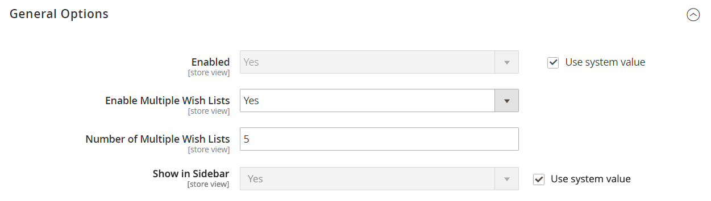
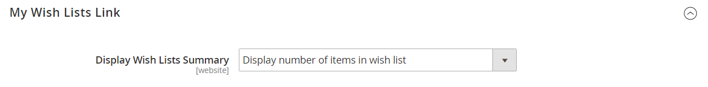

# [!UICONTROL Customers] > [!UICONTROL Wish List]

{{config}}

>[!NOTE]
>
>A wish list allows registered customers to create their own collections of products they want to buy in the future. Wish lists can be shared between customers.

## [!UICONTROL General Options]

<!-- zoom -->

<!--[General Options](https://experienceleague.adobe.com/en/docs/commerce-admin/stores-sales/shopper-tools/wish-lists/wishlist-configuration) -->

|Field|[Scope](../../getting-started/websites-stores-views.md#scope-settings)|Description|
|--- |--- |--- |
|[!UICONTROL Enabled]|Store View|Activates the wish list module for your store. Options: `Yes` / `No`|
|[!UICONTROL Show in Sidebar]|Store View|Specifies visibility of the wish lists in the sidebar.  Options: `Yes` / `No`|
|[!UICONTROL Enable Multiple Wish Lists]|Store View| (Adobe Commerce only) When set to `Yes`, allows customers to create and maintain multiple wish lists. Options: `Yes` / `No`|
|[!UICONTROL Number of Multiple Wish Lists]|Store View| (Adobe Commerce only) If multiple wish lists are enabled, determines the maximum number of wish lists customers can have associated with their account.|

{style="table-layout:auto"}

## [!UICONTROL Share Options]

<!-- zoom -->

<!-- [Share Options](https://experienceleague.adobe.com/en/docs/commerce-admin/stores-sales/shopper-tools/wish-lists/wishlist-configuration) -->

|Field|[Scope](../../getting-started/websites-stores-views.md#scope-settings)|Description|
|--- |--- |--- |
|[!UICONTROL Email Sender]|Store View|Determines the store contact that appears as the sender of the message sent when a wish list is shared. Default contact: `General Contact`|
|[!UICONTROL Email Template]|Store View|Determines the email template that is used for the message sent when a wish list is shared. Default template: `Share Wishlist`|
|[!UICONTROL Max Emails Allowed to be Sent]|Store View|Determines the maximum number of emails that can be sent in a batch. Setting a maximum limit can help reduce the load on the server. The maximum number allowed is 10,000. Default value: `10`|
|[!UICONTROL Email Text Length Limit]|Store View|Determines the maximum number of characters that can be included in the message. The maximum number allowed is 10,000. Default value: `255`|

{style="table-layout:auto"}

## [!UICONTROL My Wish List Link]

<!-- zoom -->

<!--[My Wish List Link](https://experienceleague.adobe.com/en/docs/commerce-admin/stores-sales/shopper-tools/wish-lists/wishlist-configuration) -->

|Field|[Scope](../../getting-started/websites-stores-views.md#scope-settings)|Description|
|--- |--- |--- |
|[!UICONTROL Display Wish List Summary]|Website|Configures the display of the Wish List Summary in the customer account dashboard. Options: `Display number of items in wish list` / `Display item quantities`|

{style="table-layout:auto"}
