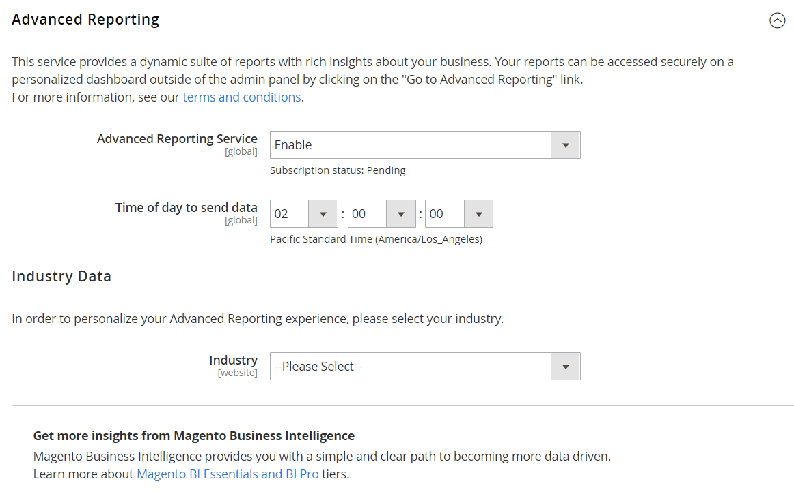

# [!UICONTROL General] > [!UICONTROL Advanced Reporting]

{{config}}

## [!UICONTROL Advanced Reporting]

_[!DNL Advanced Reporting]_ is a cloud-based service that is powered by [Adobe Commerce Intelligence](https://experienceleague.adobe.com/docs/commerce-business-intelligence/mbi/getting-started.html){:target="_blank"}. For more information, see [Advanced Reporting](https://experienceleague.adobe.com/docs/commerce-admin/start/reporting/business-intelligence.html#advanced-reporting){:target="_blank"} in the _Getting Started Guide_.

<!-- zoom -->

<!-- [Advanced Reporting](https://experienceleague.adobe.com/en/docs/commerce-admin/start/reporting/business-intelligence#advanced-reporting) -->

|Field|[Scope](../../getting-started/websites-stores-views.md#scope-settings)|Description|
|--- |--- |--- |
|[!UICONTROL Advanced Reporting Service]|Global|Enables the integration of [!DNL Advanced Reporting] for your Commerce installation.|
|[!UICONTROL Industry]|Website|Identifies your business industry to personalize [!DNL Advanced Reporting].|
|[!UICONTROL Time of day to send data]|Global|Determines the time each day when your store data is sent to [!DNL Advanced Reporting]. The time is based on a 24-hour clock, and includes the minute, hour, and second in your time zone.|

{style="table-layout:auto"}
