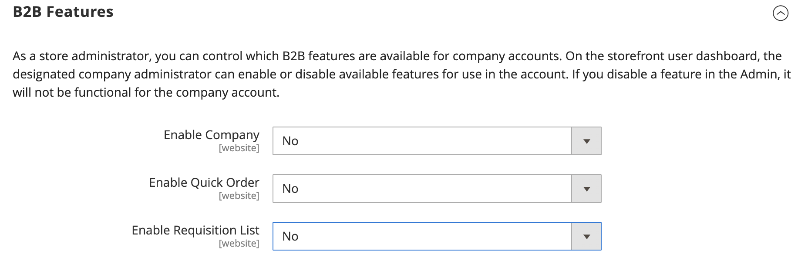
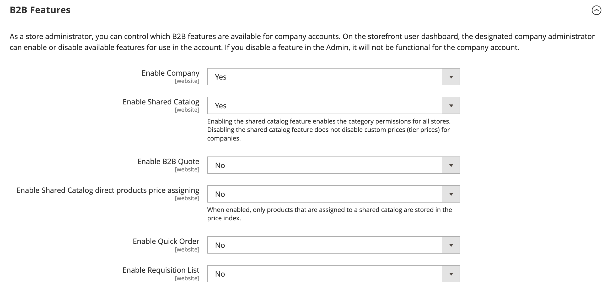

# General > B2B Features

{{b2b-feature}}

{{config}}

>[!TIP]
>
>With the installation and enablement of B2B for Adobe Commerce, the buying experience can be personalized with company-specific features. B2B for Adobe Commerce is an integrated solution that provides support for both B2B and B2C models. For more information about the B2B features, see the [_B2B for Adobe Commerce User Guide_](https://experienceleague.adobe.com/docs/commerce-admin/b2b/introduction.html).

## B2B Features

<!-- zoom -->

|Field|[Scope](../../getting-started/websites-stores-views.md#scope-settings)|Description|
|--- |--- |--- |
|[Enable Company](https://docs.magento.com/user-guide/customers/account-companies.html)|Website|When enabled, allows customers to manage their company assignment from their account dashboard. Options: `Yes` / `No`|
|[Enable Quick Order](https://docs.magento.com/user-guide/sales/quick-order.html)|Website|When enabled, allows customers and guests to quickly place orders based on SKU or product name. Options: `Yes` / `No`|
|[Enable Requisition List](https://docs.magento.com/user-guide/customers/account-dashboard-requisition-lists.html)|Website|When enabled, allows customer to create and manage requisition lists from their account dashboard.|

<!-- zoom -->

When companies are enabled, additional fields are available.

|Field|[Scope](../../getting-started/websites-stores-views.md#scope-settings)|Description|
|--- |--- |--- |
|[Enable Shared Catalog](https://docs.magento.com/user-guide/catalog/catalog-shared.html)|Website|When enabled, makes it possible to create curated catalogs with custom pricing that are available either globally, or limited to specific companies. Options: `Yes` / `No`|
|Enable Shared Catalog direct products price assigning|Website|When the _Enable Shared Catalog_ option is set to `Yes`, this option is available. When enabled, only products that are assigned to a shared catalog are stored in the price index. Products that are not assigned to the shared catalog are not displayed on the storefront. Options: `Yes` / `No`|
|[Enable B2B Quote](https://docs.magento.com/user-guide/customers/account-dashboard-quotes.html)|Website|When enabled, allows company buyers to submit a request for a quote from the shopping cart. Options: `Yes` / `No`|

### Default B2B Payment Methods

<!-- zoom -->

|Applicable Payment Methods|Global|Determines the selection of payment methods that are available to B2B buyers. Options: All Payment Methods / Specific Payment Methods|
|Payment Methods|Global|Specifies each payment method that is available to B2B buyers.|

### Default B2B Shipping Methods

<!-- zoom -->

|Applicable Shipping Methods|Global|Determines the selection of shipping methods that are available by default to B2B buyers. Options: All Shipping Methods / Specific Shipping Methods|
|Shipping Methods|Global|Specifies each shipping method that is available by default to B2B buyers.  **_Note:_** You can also limit the shipping methods for a specific [company account](https://docs.magento.com/user-guide/customers/account-company-create.html).|

## Order Approval Configuration

|Field|[Scope](../../getting-started/websites-stores-views.md#scope-settings)|Description|
|--- |--- |--- |
|[Enable Purchase Orders](../../stores-purchase/purchase-order.md)|Website|When enabled, allows companies to create purchase orders. Options: `Yes` / `No`|

<!-- zoom -->
