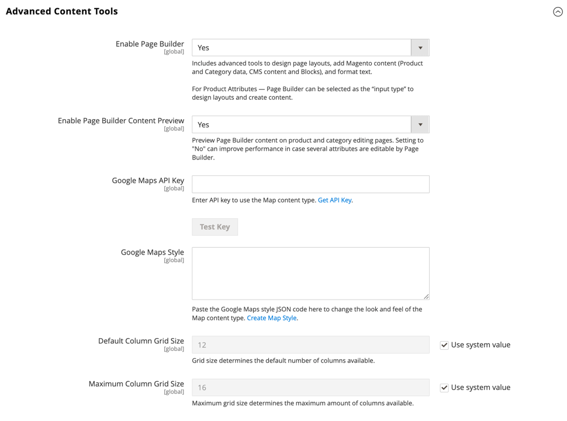

# [!UICONTROL General] > [!UICONTROL Content Management]

{{config}}

## [!UICONTROL WYSIWYG Options]

<!-- zoom -->

<!-- [WYSIWYG Options](https://docs.magento.com/user-guide/cms/editor.html) -->

|Field|[Scope](../../getting-started/websites-stores-views.md#scope-settings)|Description|
|--- |--- |--- |
|[!UICONTROL Enable WYSIWYG Editor]|Store View|Determines if the editor is enabled for the store. Options: Enabled by Default/Disabled by Default/Disabled Completely|
|[!UICONTROL WYSIWYG Editor]|Website|Determines the version of the TinyMCE editor that is used for the WYSIWYG editor. Options:  **`TinyMCE 5`** - (Default) Uses the TinyMCE version 5 as the default WYSIWYG editor.  _**Note:**_ An update to the TinyMCE 5.10 library in Adobe Commerce and Magento Open Source 2.4.5 resolves a vulnerability that allowed arbitrary JavaScript execution when updating an image or link using some types of URLs. TinyMCE 3 was deprecated in the 2.4.0 release and removed in the 2.4.3 release. TinyMCE 4 was removed in the 2.4.4 release.|
|[!UICONTROL Use Static URLs for Media Content in WYSIWYG]|Global|Determines if [static URLs](../../content-design/catalog-urls-dynamic-media.md) are used for media content that is referenced from the WYSIWYG editor. The setting applies to all places where the WYSIWYG editor is available, including products, categories, pages, and blocks. Options:  **`Yes`** - Uses static URLs for media content that is inserted with the WYSIWYG editor. Static URLs are absolute and break if the [base URL](../../stores-purchase/store-urls.md) of the store changes.  **`No`** (Default) - Uses dynamic URLs for media content that is inserted with the WYSIWYG editor, based on the  `{{media url="..."}}` directive. Dynamic URLs are relative and do not break if the base URL of the store changes.|

{style="table-layout:auto"}

## [!UICONTROL CMS Page Hierarchy]

{{ee-feature}}

<!-- zoom -->

<!--[CMS Page Hierarchy](https://docs.magento.com/user-guide/cms/page-hierarchy.html) -->

|Field|[Scope](../../getting-started/websites-stores-views.md#scope-settings)|Description|
|--- |--- |--- |
|[!UICONTROL Enable Hierarchy Functionality]|Global|Activates the use of page hierarchy for your content pages. Options: `Yes` / `No`|
|[!UICONTROL Enable Hierarchy Metadata]|Global|Gives you the ability to associate meta data with pages in the hierarchy. Options: `Yes` / `No`|
|[!UICONTROL Default Layout for Hierarchy Menu]|Global|Determines the default menu style. Options: `Content` / `Left Column` / `Right Column`|

{style="table-layout:auto"}

## [!UICONTROL Advanced Content Tools]

<!-- zoom -->

<!-- [Advanced Content Tools](https://docs.magento.com/user-guide/cms/page-builder-workspace.html) -->

|Field|[Scope](../../getting-started/websites-stores-views.md#scope-settings)|Description|
|--- |--- |--- |
|[!UICONTROL Enable Page Builder]|Global|Determines if the [!DNL Page Builder] advanced content tools are available. Options:  **`Yes`** - The [!DNL Page Builder] workspace appears in the Content section of pages, blocks, products, and categories.  **`No`** - The standard CMS editing tools appear in the _[!UICONTROL Content]_ section of pages, blocks, products, and categories.|
|[!UICONTROL Enable Page Builder Content Preview]|Global|Determines if the [!DNL Page Builder] content previews are enabled for products and categories. Options: `Yes` / `No`  **_Note:_** This is set to `Yes` by default, but turning off the preview can prevent any performance issues resulting from loading previews within a product or category form.|
|[!UICONTROL Google Maps API Key]|Global|The [!DNL Google Maps] API key from your Google account.|
|[!UICONTROL Test Key]||Validates the [!DNL Google Maps] API key.|
|[!UICONTROL Google Maps Style]|Global|Paste the [!DNL Google Maps] style JSON code here to change the look and feel of the Map content type.|
|[!UICONTROL Default Column Grid Size]|Global|Determines the default number of columns in the [!DNL Page Builder] grid.|
|[!UICONTROL Maximum Column Grid Size]|Global|Determines the maximum number of columns in the [!DNL Page Builder] grid.|

{style="table-layout:auto"}

>[!TIP]
>
>Page Builder makes it easy to create content-rich pages with custom layouts that enhance your visual storytelling and to drive customer engagement and loyalty. These features are designed to improve quality and reduce the time and expense of producing custom pages. For more information about these features and how you can use them to create engaging content for your Adobe Commerce or Magento Open Source store, see the [_Page Builder User Guide_](../../page-builder/guide-overview.md).
