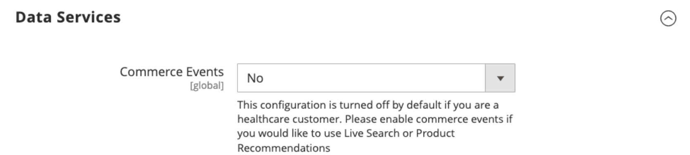

# [!UICONTROL General] > [!UICONTROL General]

{{config}}

## [!UICONTROL Country Options]

See [Country Options](../../getting-started/store-details.md#country-options) for more details about these configuration fields and options.

<!-- zoom -->

|Field|[Scope](../../getting-started/websites-stores-views.md#scope-settings)|Description|
|--- |--- |--- |
|[!UICONTROL Default Country]|Store View|The country where your store is located.|
|[!UICONTROL Allow Countries]|Website|The countries where you accept orders.|
|[!UICONTROL Zip/Postal Code is Optional for]|Global|Countries that do not require a ZIP or postal code in the shipping address.|
|[!UICONTROL European Union Countries]|Global|Countries that are members of the European Union.|
|[!UICONTROL Top Destinations]|Store View|The primary countries that you target for sales.|

{style="table-layout:auto"}

## [!UICONTROL State Options]

See [State Options](../../getting-started/store-details.md#state-options) for more details about these configuration fields and options.

<!-- zoom -->

|Field|[Scope](../../getting-started/websites-stores-views.md#scope-settings)|Description|
|--- |--- |--- |
|[!UICONTROL State is required for]|Global|The countries (where you conduct business) that require a region or state to be included in the postal address.|
|[!UICONTROL Allow to Choose State if It is Optional for Country]|Global|For countries where it is not required, determines if the _Region/State_ field is included in the postal address of the customer.   **`Yes`** - Includes the _Region/State_ field in the customer address, even if not required by the country.  **`No`** - Omits the Region/State field from the customer address if not required by the country.|

{style="table-layout:auto"}

## [!UICONTROL Locale Options]

See [Locale Options](../../getting-started/store-details.md#locale-options) for more details about these configuration fields and options.

<!-- zoom -->

|Field|[Scope](../../getting-started/websites-stores-views.md#scope-settings)|Description|
|--- |--- |--- |
|[!UICONTROL Timezone]|Website|The time zone of the primary market that is served by the website. Usually the timezone is the same as that used in the physical location of your business.|
|[!UICONTROL Locale]|Store View|The language, currency, and system of measurement that is used in the market served by the store view.|
|[!UICONTROL Weight Unit]|Store View|The unit of measurement that is typically used for shipments from the locale. Options: `lbs` / `kgs`|
|[!UICONTROL First Day of Week]|Store View|The day that is considered to be the first day of the week in the market served by the store view.|
|[!UICONTROL Weekend Days]|Store View|The days that fall on the weekend in the market served by the store view.|

{style="table-layout:auto"}

## [!UICONTROL Website Restrictions]

{{ee-feature}}

<!-- zoom -->

For more information about changing these settings, see [Access restrictions](../../merchandising-promotions/event-configure.md#access-restrictions) in the _Merchandising and Promotions Guide_.

|Field|[Scope](../../getting-started/websites-stores-views.md#scope-settings)|Description|
|--- |--- |--- |
|[!UICONTROL Access Restriction]|Website|Determines if the website is operating in restricted mode.   **`Yes`** - Website access is restricted in the manner set in the fields below. **`No`** - Restrictions are disabled and the following settings have no effect.|
|[!UICONTROL Restriction Mode]|Website|Determines the type of access restriction that applies to the website.   **`Website Closed`** - All access to the storefront is restricted, and storefront URLs are temporarily redirected to the landing page. This setting can be useful during site maintenance, or before launch.  **`Private Sales: Login Only`** - Only registered customers can log in to access the storefront. All storefront URLs are temporarily redirected to either the specified landing page or login form. Users cannot create an account in this mode. **`Private Sales: Login and Register`** - Users must log in to access the storefront. All storefront URLs are temporarily redirected to the login form until the user logs in. Users can register for an  account while the site is in this mode.|
|[!UICONTROL Startup Page]|Store View|When the website is in Private Sales mode, this setting determines the page that appears until the customer logs in.    **`To login form`** - Users are redirected to the log in form until they log in.  **`To landing page`** - Users are redirected to the static page specified below until they log in.   **_Important!_** Be sure to include a link to the login page from the specified landing page so that customers can log in to access the full site.|
|[!UICONTROL Landing Page]|Store View|Determines the first page that appears when the website is in Private Sales mode.|
|[!UICONTROL HTTP Response]|Website|Determines the HTTP response that is sent when the website is closed and a connection is attempted by a bot, crawler, or spider.   **`503 Service unavailable`** - The page is not available, but the spider should not update the index.  **`200 OK`** - The landing page is correct, and should be treated by the spider as the only page on the site.|
|[!UICONTROL Enable Autocomplete on login/forgot password forms]|Website|Determines if the fields on the _Login_ and _Forgot Password_ forms are filled automatically from previous entries. Options: `Yes` / `No`|

{style="table-layout:auto"}

## [!UICONTROL Store Information]

<!-- zoom -->

For more information about changing these settings, see [Store Information](../../getting-started/store-details.md) in the _Getting Started Guide_.

|Field|[Scope](../../getting-started/websites-stores-views.md#scope-settings)|Description|
|--- |--- |--- |
|[!UICONTROL Store Name]|Store View|The name of the store that is associated with the store view.|
|[!UICONTROL Store Phone Number]|Store View|The primary telephone number of the store (associated with the store view) is open for business. For example: Mon - Fri, 9-5, Sat 9-noon PST|
|Country|Website|The country of the business that operates the website.|
|[!UICONTROL Region/State]|Website|The region or state of the business that operates the website.|
|[!UICONTROL ZIP/Postal Code]|Website|The ZIP or postal code of the business that operates the website.|
|[!UICONTROL City]|Website|The city location of the business that operates the website.|
|[!UICONTROL Street Address]|Website|The street or mailing address of the business that operates the website.|
|[!UICONTROL Street Address Line 2|]Website|The second line of the business street address, if needed.|
|[!UICONTROL VAT Number]|Website|The Value Added Tax number of the business that owns the Commerce installation, if applicable.|
|[!UICONTROL Validate VAT Number]||Verifies the Value Added Tax identification number.|

{style="table-layout:auto"}

## [!UICONTROL Single-Store Mode]

<!-- zoom -->

For more information about changing these settings, see [Single-store mode](../../getting-started/websites-stores-views.md#single-store-mode) in the _Getting Started Guide_.

|Field|[Scope](../../getting-started/websites-stores-views.md#scope-settings)|Description|
|--- |--- |--- |
|[!UICONTROL Enable Single-Store Mode]|Global|When enabled for single-store installations, hides the configuration Scope box and related field labels Options: `Yes` / `No`  **_Note:_** Single-store mode is ignored for stores with more than one view.  Enabling single store mode will copy all catalog and product store specific data from default store view to all store view scope. It will only copy catalog and product data if the store have only one storeview. If store have one disabled storeview and one enabled storeview it won't copy catalog and product data.  Enabling single store mode ignores storeview-specific configuration settings for content-specific data. Instead, it uses configuration settings defined on the global level scope to ensure consistency between the Admin UI and storefront.|

{style="table-layout:auto"}

## [!UICONTROL Data Services]

<!-- zoom -->

|Field|[Scope](../../getting-started/websites-stores-views.md#scope-settings)|Description|
|--- |--- |--- |
|[!UICONTROL Commerce Events Enabled]|Global|This configuration is turned off by default if you are a healthcare customer and have installed the [Data Services HIPAA](https://experienceleague.adobe.com/en/docs/commerce-merchant-services/data-connection/hipaa-readiness.html#installation) extension. As a result, storefront event data that is used by Live Search and Product Recommendations is no longer captured. This is because storefront event data is generated client-side. To continue capturing and sending storefront event data for use by the [Live Search](https://experienceleague.adobe.com/en/docs/commerce-merchant-services/live-search/overview) and [Product Recommendations](https://experienceleague.adobe.com/en/docs/commerce-merchant-services/product-recommendations/guide-overview) services, set **Commerce Events Enabled** to `Yes`.|

{style="table-layout:auto"}
