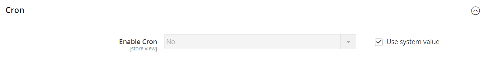

# [!UICONTROL General] > [!UICONTROL New Relic Reporting]

{{config}}

>[!NOTE]
>These configuration options do not apply to Adobe Commerce on Cloud Infrastructure. 
>
>If you are on the Pro plan, New Relic is already [preconfigured and enabled by default](https://experienceleague.adobe.com/docs/commerce-cloud-service/user-guide/monitor/new-relic/new-relic-service.html). If you are on the Starter plan, you must complete the [New Relic configuration steps](https://experienceleague.adobe.com/docs/commerce-cloud-service/user-guide/monitor/new-relic/account-management.html#configure-new-relic-for-starter-environment) that are part of the setup process.

## [!UICONTROL General]

<!-- zoom -->

<!-- [General](https://experienceleague.adobe.com/en/docs/commerce-admin/start/reporting/new-relic-reporting) -->

|Field|[Scope](../../getting-started/websites-stores-views.md#scope-settings)|Description|
|--- |--- |--- |
|[!UICONTROL Enable New Relic Integration]|Store View|Determines if your store can be used with [!DNL New Relic] Reporting. Options: `Yes` / `No`|
|[!UICONTROL New Relic API URL]|Store View|The URL where New Relic APIs are deployed. For example: `https://api.newrelic.com/deployments.xml`|
|Insights API URL|Store View|The URL where Insights APIs are deployed. Use the percent symbol (%) to represent your account ID. For example: `https://insights-collector.newrelic.com/v1/accounts/%s/events`|
|[!UICONTROL New Relic Account ID]|Store View|The account ID assigned to your [!DNL New Relic] account.|
|[!UICONTROL New Relic Application ID]|Store View|The application ID assigned to your [!DNL New Relic] account for the Commerce integration.|
|[!UICONTROL New Relic API Key]|Store View|The key that is assigned to you for gaining access to the [!DNL New Relic] API.|
|[!UICONTROL Insights API Key]|Store View|The key that is assigned to you for gaining access to Insights.|
|[!UICONTROL New Relic Application Name]|Store View|The name that you have assigned to your [!DNL New Relic] integration.|
|[!UICONTROL Send Adminhtml and Frontend as Separate Apps]|Store View|An option to send report data collected for the storefront and Admin as separate apps to New Relic. This option requires a name entered for the [!UICONTROL New Relic Application Name]. The feature appends the application name with an underscore to the collected app data. For example: `MyStore_Adminhtml`, `MyStore_frontend`|

{style="table-layout:auto"}

## [!UICONTROL Cron]

<!-- zoom -->

<!-- Cron](https://experienceleague.adobe.com/en/docs/commerce-admin/systems/tools/cron) -->

|Field|[Scope](../../getting-started/websites-stores-views.md#scope-settings)|Description|
|--- |--- |--- |
|[!UICONTROL Enable Cron]|Store View|Determines if [!DNL New Relic] reports can be run on schedule with [Cron](../../systems/cron.md). Options: `Yes` / `No`|

{style="table-layout:auto"}
