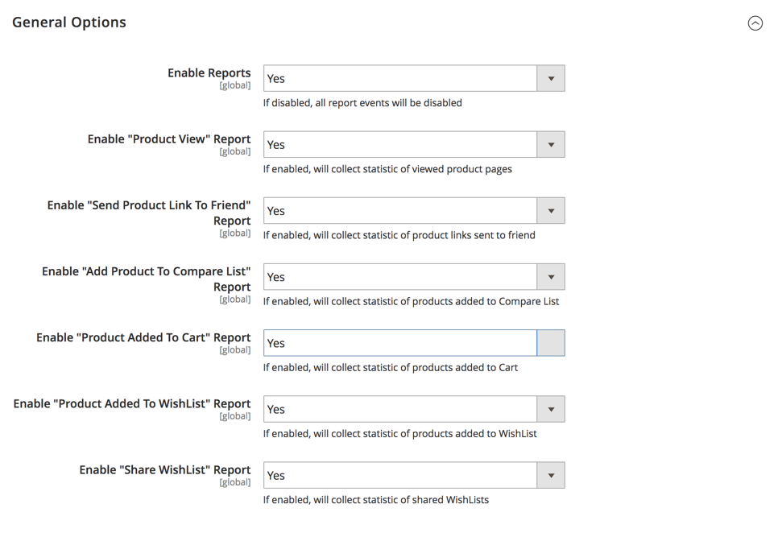

# [!UICONTROL General] > [!UICONTROL Reports]

{{config}}

## [!UICONTROL Dashboard]

<!-- zoom -->

<!-- [Dashboard](https://docs.magento.com/user-guide/stores/admin-dashboard.html) -->

|Field|[Scope](../../getting-started/websites-stores-views.md#scope-settings)|Description|
|--- |--- |--- |
|[!UICONTROL Year-to-Date Starts]|Global|Specifies the month and day upon which the year-to-date calculations are based.|
|[!UICONTROL Current Month Starts]|Global|Specifies the day of the month that is used in calculations to mark the beginning of the current month.|

{:style="table-layout:auto"}

## [!UICONTROL General Options]

<!-- zoom -->

>[!NOTE]
>
>If your business functions do not require reporting, we recommend that you disable the reports functionality to enhance store performance. However, some features, like dynamic customer segments, rely on report data to function properly.

|Field|[Scope](../../getting-started/websites-stores-views.md#scope-settings)|Description|
|--- |--- |--- |
|[!UICONTROL Enable Reports]|Global|Enables or disables report events.|
|[!UICONTROL Enable "Product View" Report]|Global|Enables or disables the collection of statistics of viewed product pages.|
|[!UICONTROL Enable "Send Product Link To Friend" Report]|Global|Enables or disables the collection of statistics of product links sent to friends.|
|[!UICONTROL Enable "Add Product To Compare List" Report]|Global|Enables or disables the collection of statistics of products added to Compare List.|
|[!UICONTROL Enable "Product Added To Cart" Report]|Global|Enables or disables the collection of statistics of products added to cart.|
|[!UICONTROL Enable "Product Added To Wishlist" Report]|Global|Enables or disables the collection of statistics of products added to wish list.|
|[!UICONTROL Enable "Share WishList" Report]|Global|Enables or disables the collection of statistics of shared wish lists.|

{:style="table-layout:auto"}
