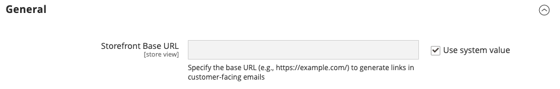
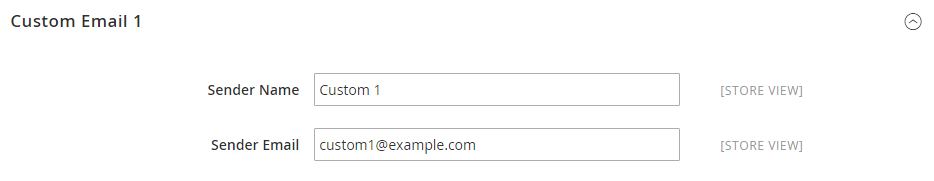

# [!UICONTROL General] > [!UICONTROL Store Email Addresses]

{{config}}

See [Store email addresses](../../getting-started/store-details.md#store-email-addresses) for detailed information about these configuration fields and options.

## [!UICONTROL General]

[!BADGE SaaS only]{type=Positive url="https://experienceleague.adobe.com/en/docs/commerce/user-guides/product-solutions" tooltip="Applies to Adobe Commerce as a Cloud Service projects only (Adobe-managed SaaS infrastructure)."}

<!-- zoom -->

|Field|[Scope](../../getting-started/websites-stores-views.md#scope-settings)|Description|
|--- |--- |--- |
|[!UICONTROL Storefront Base URL]|Store View|The base URL that will be used to construct links that are included in customer-facing emails. The URL must end with a forward slash. For example, `https://www.example.com/`.|

{style="table-layout:auto"}

## [!UICONTROL General Contact]

<!-- zoom -->

|Field|[Scope](../../getting-started/websites-stores-views.md#scope-settings)|Description|
|--- |--- |--- |
|[!UICONTROL Sender Name]|Store View|The name that appears as the sender of email sent by the `General Contact` identity.|
|[!UICONTROL Sender Email]|Store View|The email address that is associated with the `General Contact` identity. On Adobe Commerce as a Cloud Service, create a support ticket to change the email address.|

{style="table-layout:auto"}

## [!UICONTROL Sales Representative]

<!-- zoom -->

|Field|[Scope](../../getting-started/websites-stores-views.md#scope-settings)|Description|
|--- |--- |--- |
|[!UICONTROL Sender Name]|Store View|The name that appears as the sender of email sent by the `Sales Representative` identity.|
|[!UICONTROL Sender Email]|Store View|The email address that is associated with the `Sales Representative` identity.  On Adobe Commerce as a Cloud Service, create a support ticket to change the email address.|

{style="table-layout:auto"}

## [!UICONTROL Customer Support]

<!-- zoom -->

|Field|[Scope](../../getting-started/websites-stores-views.md#scope-settings)|Description|
|--- |--- |--- |
|[!UICONTROL Sender Name]|Store View|The name that appears as the sender of email sent by the `Customer Support` identity.|
|[!UICONTROL Sender Email]|Store View|The email address that is associated with the `Customer Support` identity.  On Adobe Commerce as a Cloud Service, create a support ticket to change the email address.|

{style="table-layout:auto"}

## Custom Email 1

<!-- zoom -->

|Field|[Scope](../../getting-started/websites-stores-views.md#scope-settings)|Description|
|--- |--- |--- |
|[!UICONTROL Sender Name]|Store View|The name that appears as the sender of email sent by the `Custom 1` identity.|
|[!UICONTROL Sender Email]|Store View|The email address that is associated with the `Custom 1` identity.  On Adobe Commerce as a Cloud Service, create a support ticket to change the email address.|

{style="table-layout:auto"}

## Custom Email 2

<!-- zoom -->

|Field|[Scope](../../getting-started/websites-stores-views.md#scope-settings)|Description|
|--- |--- |--- |
|[!UICONTROL Sender Name]|Store View|The name that appears as the sender of email sent by the `Custom 2` identity.|
|[!UICONTROL Sender Email]|Store View|The email address that is associated with the `Custom 2` identity.  On Adobe Commerce as a Cloud Service, create a support ticket to change the email address.|

{style="table-layout:auto"}
