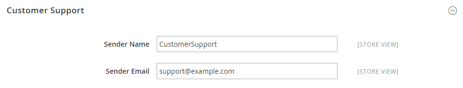

# [!UICONTROL General] > [!UICONTROL Store Email Addresses]

{{config}}

See [Store Email Addresses](https://docs.magento.com/user-guide/stores/store-email-addresses.html) for detailed information about these configuration fields and options.

## [!UICONTROL General Contact]

<!-- zoom -->

|Field|[Scope](../../getting-started/websites-stores-views.md#scope-settings)|Description|
|--- |--- |--- |
|[!UICONTROL Sender Name]|Store View|The name that appears as the sender of email sent by the `General Contact` identity.|
|[!UICONTROL Sender Email]|Store View|The email address that is associated with the `General Contact` identity.|

{:style="table-layout:auto"}

## [!UICONTROL Sales Representative]

<!-- zoom -->

|Field|[Scope](../../getting-started/websites-stores-views.md#scope-settings)|Description|
|--- |--- |--- |
|[!UICONTROL Sender Name]|Store View|The name that appears as the sender of email sent by the `Sales Representative` identity.|
|[!UICONTROL Sender Email]|Store View|The email address that is associated with the `Sales Representative` identity.|

{:style="table-layout:auto"}

## [!UICONTROL Customer Support]

<!-- zoom -->

|Field|[Scope](../../getting-started/websites-stores-views.md#scope-settings)|Description|
|--- |--- |--- |
|[!UICONTROL Sender Name]|Store View|The name that appears as the sender of email sent by the `Customer Support` identity.|
|[!UICONTROL Sender Email]|Store View|The email address that is associated with the `Customer Support` identity.|

{:style="table-layout:auto"}

## Custom Email 1

<!-- zoom -->

|Field|[Scope](../../getting-started/websites-stores-views.md#scope-settings)|Description|
|--- |--- |--- |
|[!UICONTROL Sender Name]|Store View|The name that appears as the sender of email sent by the `Custom 1` identity.|
|[!UICONTROL Sender Email]|Store View|The email address that is associated with the `Custom 1` identity.|

{:style="table-layout:auto"}

## Custom Email 2

<!-- zoom -->

|Field|[Scope](../../getting-started/websites-stores-views.md#scope-settings)|Description|
|--- |--- |--- |
|[!UICONTROL Sender Name]|Store View|The name that appears as the sender of email sent by the `Custom 2` identity.|
|[!UICONTROL Sender Email]|Store View|The email address that is associated with the `Custom 2` identity.|

{:style="table-layout:auto"}
