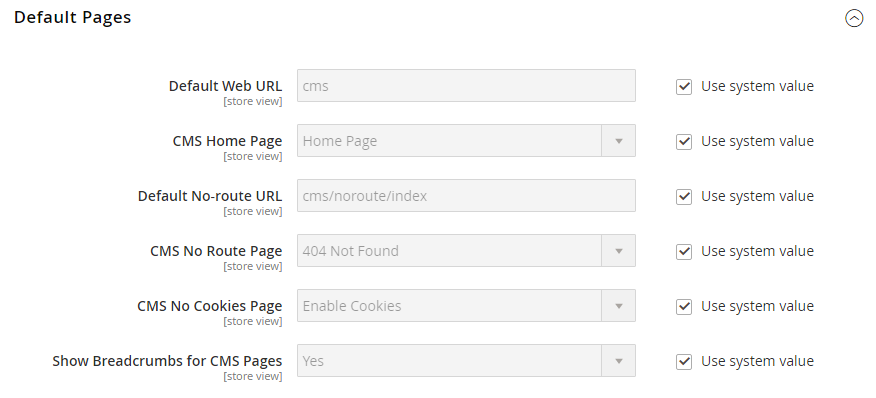

# [!UICONTROL General] > [!UICONTROL Web]

{{config}}

## [!UICONTROL URL Options]

<!-- zoom -->

<!-- [URL Options configuration settings](https://docs.magento.com/user-guide/stores/store-urls.html) -->

|  Field     |  Scope     |  Description     |
|  ---  |  ---  |  ---  |
|    [!UICONTROL Add Store Code to URLs]   |   Global    |  If Web Server Rewrites are enabled, inserts the Store Code of the current view in the URL. Options: `Yes` / `No`.  When this field is set to `Yes`, you must include store codes in your browser URLs to ensure that URL rewrites are mapped correctly and all pages are opened successfully. This avoids _404 Page Not Found_ errors. |
|    [!UICONTROL Auto-redirect to Base URL]   |    Store View   |   (For single-store setups) If there is a broken link on your site, redirects traffic to the base URL, rather than to a page with a "404 Page Not Found" message. Options:` No` / `Yes (302 Found)` / `Yes (301 Moved Permanently)`  **_Important:_** Do not use auto-redirect to base URL for multi-store setups.    |
|    [!UICONTROL Catalog media URL format]   |   Global   |  Defines the [URL format](../../catalog/catalog-urls.md) assigned to products and categories. Options: Unique hash per image variant (Legacy mode) defines converted filename as a unique hash value. Image optimization based on query parameters defines [image optimization](../../content-design/media-gallery-image-optimization.md) process depending on query parameters.     |

{:style="table-layout:auto"}

## [!UICONTROL Search Engine Optimization]

<!-- zoom -->

<!-- [Search Engine Optimization configuration settings](https://docs.magento.com/user-guide/marketing/url-rewrite.html) -->

|Field|[Scope](../../getting-started/websites-stores-views.md#scope-settings)|Description|
|--- |--- |--- |
|[!UICONTROL Use Web Server Rewrites]|Store View|PHP-based systems typically include a file called `index.php` in the root folder. By default, the file name appears in the URL just after the name of the root folder. When this is enabled, the system omits `index.php` from the URL. This usability best practice makes each URL more concise, and has no impact on performance or site rank. Options: `Yes` / `No`|

{:style="table-layout:auto"}

## [!UICONTROL Base URLs]

<!-- zoom -->

<!-- [Base URLS configuration settings](https://docs.magento.com/user-guide/stores/store-urls.html) -->

|Field|[Scope](../../getting-started/websites-stores-views.md#scope-settings)|Description|
|--- |--- |--- |
|[!UICONTROL Base URL]|Store View|The full address of the Commerce root folder that is not running over an encrypted (SSL) channel. The URL must end with a forward slash.|
|[!UICONTROL Base Link URL]|Store View|A markup tag that is used as a placeholder for the base URL.|
|[!UICONTROL Base URL for Static View Files]|Store View|A path that points to the  location of static files used by the theme, such as css, fonts, images, and JavaScript. A placeholder is used to represent the base URL. If your Commerce installation has multiple sites with the same folder structure, you can have a different folder for each site. Set the configuration scope to the correct site before entering the base URL for static view files. You can also specify a folder outside of your Commerce installation.|
|[!UICONTROL Base URL for User Media Files]|Store View|A path that points to the location of catalog images and other media files. A placeholder is used to represent the base URL. If your Commerce installation has multiple sites with the same folder structure, you can have a different media folder for each. This gives you the ability to back up and roll back  each media folder separately. You can also specify a media folder outside of your Commerce installation.|

{:style="table-layout:auto"}

## [!UICONTROL Base URLs (Secure)]

<!-- zoom -->

<!-- [Base URLs (Secure) configuration settings](https://docs.magento.com/user-guide/stores/store-urls.html) -->

|Field|[Scope](../../getting-started/websites-stores-views.md#scope-settings)|Description|
|--- |--- |--- |
|[!UICONTROL Secure Base URL]|Store View|The full address of the Commerce root folder that is delivered with encrypted  secure (SSL/TLS) protocol. The URL must end with a forward slash.|
|[!UICONTROL Secure Base Link URL]|Store View|A markup tag that is used as a placeholder for the base URL that runs over a secure channel.|
|[!UICONTROL Secure Base URL for Static View Files]|Store View|A markup tag that points to the location of static files such as CSS, fonts, images, and JavaScript that are used by the theme. The files can be on either an unsecure or secure channel. If your Commerce installation has multiple sites with the same folder structure, you can have a different  folder for each site. Set the configuration scope to the correct site before entering the base URL for static view files. You can also specify a folder outside of your Commerce installation.|
|[!UICONTROL Secure Base URL for User Media Files]|Store View|A path that points to the location of  catalog images and other media files. The files can be on either an unsecure or secure channel. A placeholder is used to represent the base URL. If your Commerce installation has multiple sites with the same folder structure, you can have a different media folder for each. This gives you the ability to back up and roll back each media folder separately. You can also specify a media folder outside of your Commerce installation.|
|[!UICONTROL Use Secure URLs on Storefront]|Store View|If your domain has a security certificate, you can choose to run the storefront, with or without SSL encryption. Options: **`Yes`** - Store URLs begin with `https` to indicate that the page is delivered with encrypted, secure protocol.  **`No`** - Store URLs begin with `http` to indicate that the page is delivered without secure protocol.|
|[!UICONTROL Use Secure URLs in Admin]|Global|If your domain has a security certificate, you can choose to run the store Admin, with or without SSL encryption. Options:  **`Yes`** - Admin URLs begin with `https` to indicate that the page is delivered with encrypted, secure protocol. **`No`** - Admin URLs begin with `http` to indicate that the page is delivered without secure protocol.  When secure URLs are enabled for both the store and Admin, two additional fields appear to enable and configure `HSTS`.|
|[!UICONTROL Enable HTTP Strict Transport Security (HSTS)]|Store View|When enabled, [`HSTS`][1] provides a measure of security against "man in the middle" attacks, and prevents users from overriding the "invalid certificate" message. Options: `Yes` / `No`|
|[!UICONTROL Upgrade Insecure Requests]|Store View| When enabled, converts unsecure (`HTTP`) requests received from the browser to the secure (`HTTPS`) protocol. Options: `Yes` / `No`|
|[!UICONTROL Offloader Header]|Global|Specifies the `offloader_header` value in your server configuration to identify the protocol between the client and load balancer. Most Commerce installations use the default value, `X-Forwarded-Proto` (XFP) to identify the protocol as either `HTTP` or `HTTPS`.|

{:style="table-layout:auto"}

## [!UICONTROL Default Pages]

<!-- zoom -->

<!-- [Default Pages configuration settings](https://docs.magento.com/user-guide/cms/pages-default.html) -->

|Field|[Scope](../../getting-started/websites-stores-views.md#scope-settings)|Description|
|--- |--- |--- |
|[!UICONTROL Default Web URL]|Store View|Indicates the landing page that is associated with the base URL. This is set by default to "cms" to indicate a page from the Commerce content management system (CMS). You can also use a different type of landing page, such as a blog. For example, if a blog is installed on the server at `magento/blog`, you can enter the name of the "blog" folder as a relative path to the selection of pages.|
|[!UICONTROL CMS Home Page]|Store View|To choose the home page for the store, simply select the CMS page from the list. By default, the CMS Home Page lists the entire selection of CMS pages that are available for your store.|
|[!UICONTROL Default No-route URL]|Store View|Contains the URL of the default page that you want to appear when a `404 Page not Found` error occurs. The default value is `cms/noroute/index`.|
|[!UICONTROL CMS No Route Page]|Store View|Identifies a specific CMS page that you want to appear when a 404 Page Not Found error occurs. The default page is 404 Not Found.|
|[!UICONTROL CMS No Cookies Page]|Store View|Identifies a specific CMS page that appears when cookies are not enabled for the browser. The page explains why cookies are used, and how to enable them for each browser. The default page is Enable Cookies.|
|[!UICONTROL Show Breadcrumbs for CMS Pages]|Store View|Determines if a breadcrumb trail appears on all CMS pages in the catalog. Options: `Yes` / `No`|

{:style="table-layout:auto"}

## [!UICONTROL Default Layouts]

<!-- zoom -->

<!--[Default Layouts](https://docs.magento.com/user-guide/design/page-layout.html) -->

|Field|[Scope](../../getting-started/websites-stores-views.md#scope-settings)|Description|
|--- |--- |--- |
|[!UICONTROL Default Product Layout]|Global|Determines the [layout](../../content-design/page-layout.md) that is used by default for product pages. Options:  **`No layout updates`** - By default, layout updates are not available for product pages.  **`Empty`** - By default, uses a blank layout for product pages.  **`1 column`** - By default, uses a single column layout for product pages.  **`2 columns with left bar`** - By default, uses a two-column layout with the sidebar on the left for product pages.  **`2 columns with right bar`** - By default, uses a two-column layout with the sidebar on the right for product pages.  **`3 columns`** - By default, uses a three-column layout with sidebars on the left and right for product pages. **`Page -- Full Width`** - (Requires [!DNL Page Builder]) By default, uses the Page -- Full Width  layout for product pages.  **`Category - Full Width`** - (Requires [!DNL Page Builder]) By default, uses the Category - Full Width layout for product pages.  **`Product - Full Width`** - (Requires [!DNL Page Builder]) By default, uses the Product - Full Width  layout for product pages.|
|[!UICONTROL Default Category Layout]|Global|Determines the [layout](../../content-design/page-layout.md) that is used by default for category pages. Options:  **`No layout updates`** - By default, layout updates are not available for category pages.  **`Empty`** - By default, uses a blank layout for category pages.  **`1 column`** - By default, uses a single column layout for category pages.  **`2 columns with left bar`** - By default, uses a two-column layout with the sidebar on the left for category pages.  **`2 columns with right bar`** - By default, uses a two-column layout with the sidebar on the right for category pages.  **`3 columns`** - By default, uses a three-column layout with sidebars on the left and right for category pages. **`Page - Full Width`** - (Requires [!DNL Page Builder]) By default, uses the Page - Full Width  layout for category pages.  **`Category - Full Width`** - (Requires [!DNL Page Builder]) By default, uses the Category - Full Width layout for category pages.  **`Product - Full Width`** - (Requires [!DNL Page Builder]) By default, uses the Product - Full Width layout for category pages.|
|Default Page Layout|Global|Determines the [layout](../../content-design/page-layout.md) that is used by default for CMS pages. Options:  **`No layout updates`** - By default, layout updates are not available for CMS pages.  **`Empty`** - By default, uses a blank layout for CMS pages.  **`1 column`** - By default, uses a single column layout for CMS pages.  **`2 columns with left bar`** - By default, uses a two-column layout with the sidebar on the left for CMS pages. **`2 columns with right bar`** - By default, uses a two-column layout with the sidebar on the right for CMS pages.  **`3 columns`** - By default, uses a three-column layout with sidebars on the left and right for CMS pages. **`Page - Full Width`** - (Requires [!UICONTROL Page Builder]) By default, uses the Page - Full Width  layout for CMS pages.  **`Category - Full Width`** - (Requires [!UICONTROL Page Builder]) By default, uses the Category - Full Width layout for CMS pages.  **`Product - Full Width`** - (Requires [!DNL Page Builder]) By default, uses the Product - Full Width  layout for CMS pages.|

{:style="table-layout:auto"}

## [!UICONTROL Default Cookie Settings]

<!-- zoom -->

<!-- [Default Cookie configuration settings](https://docs.magento.com/user-guide/stores/compliance-cookie-law.html) -->

|Field|[Scope](../../getting-started/websites-stores-views.md#scope-settings)|Description|
|--- |--- |--- |
|[!UICONTROL Cookie Lifetime]|Store View|Determines how long a cookie can exist before it is automatically deleted. Default value is 3600 seconds (1 hour)|
|[!UICONTROL Cookie Path]|Store View|Specifies the folders on the server where Commerce cookies can be used. To make Commerce cookies available everywhere in the installation, set the Cookie Path to a single forward slash: `/`. This value can contain only the cookie path, and **_cannot_** contain any other cookie parameters.|
|[!UICONTROL Cookie Domain]|Store View|Determines if Commerce cookies are available to subdomains. For example, to support `mysubdomain`.domain.com, enter the name of your domain with a period at the beginning, like `.domain.com`. This value can contain only the cookie domain, and **_cannot_** contain any other cookie parameters.|
|[!UICONTROL Use HTTP Only]|Store View|Determines if Commerce Cookies can be used only over an unsecure channel (http), or can also be used over an encrypted channel (https). Options: `Yes` / `No`|
|[!UICONTROL Cookie Restriction Mode]|Website|Determines if cookie restriction mode is enabled. Options: `Yes` / `No`|

{:style="table-layout:auto"}

## [!UICONTROL Session Validation Settings]

<!-- zoom -->

<!-- [Session Validation configuration settings](https://docs.magento.com/user-guide/stores/security-session-validation.html) -->

|Field|[Scope](../../getting-started/websites-stores-views.md#scope-settings)|Description|
|--- |--- |--- |
|[!UICONTROL Validate REMOTE_ADDR]|Global|Verifies that the IP Address of a request matches `$_SESSION` data. The session terminates if a different IP address is detected. Options: `Yes` / `No`|
|[!UICONTROL Validate HTTP_VIA]|Global|Verifies incoming proxy data and checks that the proxy address of a request matches `$_SESSION` data. The session terminates if a different proxy address is detected. Options: `Yes` / `No`|
|[!UICONTROL Validate HTTP_x_FORWARDED_FOR]|Global|Verifies outgoing proxy data and checks that the forwarded-for address of a request matches  `$_SESSION` data. The session terminates if a different forwarded-for address is detected. Options: `Yes` / `No`|
|[!UICONTROL Validate HTTP_USER_AGENT]|Global|`USER_AGENT` refers to the browser or device that is used to access the website. It verifies that the name and version of the browser, and operating system, matches `$_SESSION` data. The session terminates if a different user agent is detected from one request to another in the same session. Options: `Yes` / `No`|

{:style="table-layout:auto"}

## [!UICONTROL Browser Capabilities Detection]

<!-- zoom -->

<!-- [Browser Capabilities Detection configuration settings](https://docs.magento.com/user-guide/stores/security-browser-capabilities-detection.html) -->

|Field|[Scope](../../getting-started/websites-stores-views.md#scope-settings)|Description|
|--- |--- |--- |
|[!UICONTROL Redirect to CMS-page if Cookies are Disabled]|Store View|If cookies are disabled by the browser, it automatically redirects to the CMS No Cookies Page. Options: `Yes` / `No`|
|[!UICONTROL Show Notice if JavaScript is Disabled]|Store View|If JavaScript is disabled by the browser, it displays a notice that prompts the user to enable JavaScript Options: `Yes` / `No` (disables)|
|[!UICONTROL Show Notice if Local Storage is Disabled]|Store View|Displays a message if the local cache is disabled. Options: `Yes` / `No`|

{:style="table-layout:auto"}

[1]: https://cheatsheetseries.owasp.org/cheatsheets/HTTP_Strict_Transport_Security_Cheat_Sheet.html
