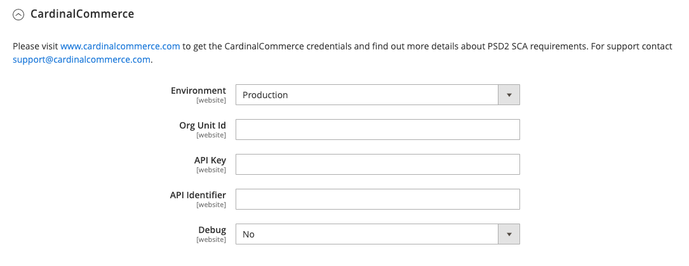

# [!UICONTROL Sales] > [!UICONTROL 3D Secure]

[!DNL 3-D Secure] was developed by [!DNL Visa] to promote secure online transactions. Examples of [!DNL 3-D Secure] solutions created by card networks are verified by [!DNL Visa], [!DNL Mastercard SecureCode], [!DNL American Express SafeKey], and [!DNL CardinalCommerce Consumer Authentication]. [!DNL CardinalCommerce] is a global leader in digital transaction authentication, and a wholly owned subsidiary of [!DNL Visa].

[!DNL 3-D Secure] version 2.0 supports numerous enhancements, including advanced authentication methods and authentication flow, and improved data sharing between merchant and issuer.

>[!NOTE]
>
>The [Braintree](../../stores-purchase/braintree.md) payment gateway also supports [!DNL 3-D Secure] verification.

{{config}}

## [!UICONTROL CardinalCommerce]

<!-- zoom -->

|Field|[Scope](../../getting-started/websites-stores-views.md#scope-settings)|Description|
|--- |--- |--- |
|[!UICONTROL Environment]|Website|Indicates the operating mode of your [!DNL CardinalCommerce] account. If you are running in a test environment, choose 'Sandbox'. Options: Sandbox / Production (Default) |
|[!UICONTROL Org Unit ID]|Website|The Org Unit ID from your [!DNL CardinalCommerce] merchant account.|
|[!UICONTROL API Key]|Website|The API Key from your [!DNL CardinalCommerce] merchant account.|
|[!UICONTROL API Identifier]|Website|The API Identifier from your [!DNL CardinalCommerce] merchant account.|
|[!UICONTROL Debug]|Website|Options: `Yes` / `No`|

{style="table-layout:auto"}
