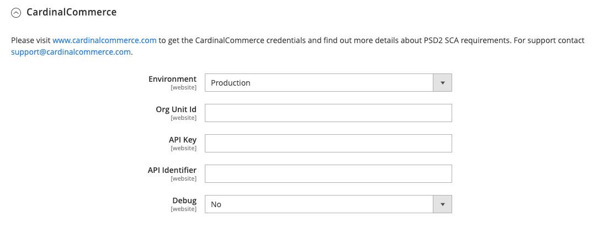

# Sales > 3D Secure

3-D Secure was developed by Visa to promote secure online transactions. Examples of 3-D Secure solutions created by card networks are verified by Visa, Mastercard SecureCode, American Express SafeKey, and CardinalCommerce Consumer Authentication. CardinalCommerce is a global leader in digital transaction authentication, and a wholly owned subsidiary of Visa.

3-D Secure version 2.0 supports numerous enhancements, including advanced authentication methods and authentication flow, and improved data sharing between merchant and issuer.

{{config}}

>[!NOTE]
>
>The [Braintree](../../stores-purchase/braintree.html) payment gateway also supports 3-D Secure verification.

## CardinalCommerce

<!-- zoom -->

|Field|[Scope](../../getting-started/websites-stores-views.md#scope-settings)|Description|
|--- |--- |--- |
|Environment|Website|Indicates the operating mode of your CardinalCommerce account. If you are running in a test environment, choose 'Sandbox'. Options: Sandbox / Production (Default) |
|Org Unit ID|Website|The Org Unit ID from your CardinalCommerce merchant account.|
|API Key|Website|The API Key from your CardinalCommerce merchant account.|
|API Identifier|Website|The API Identifier from your CardinalCommerce merchant account.|
|Debug|Website|Options: `Yes` / `No`|
