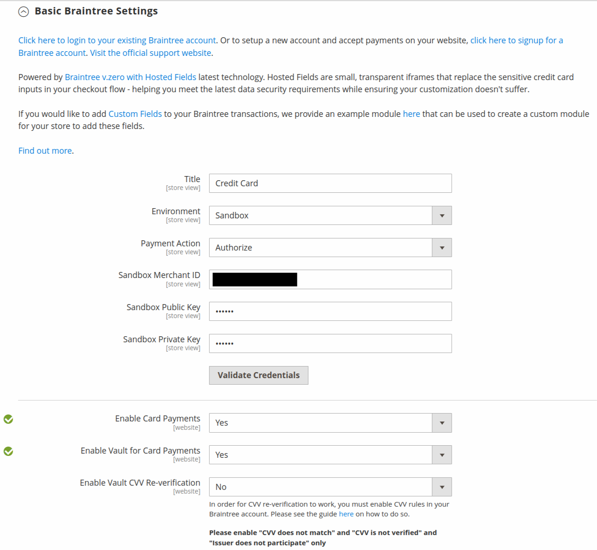
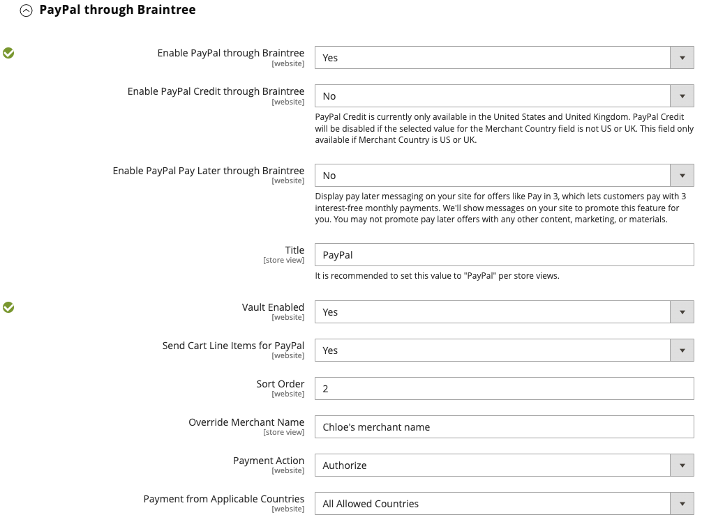
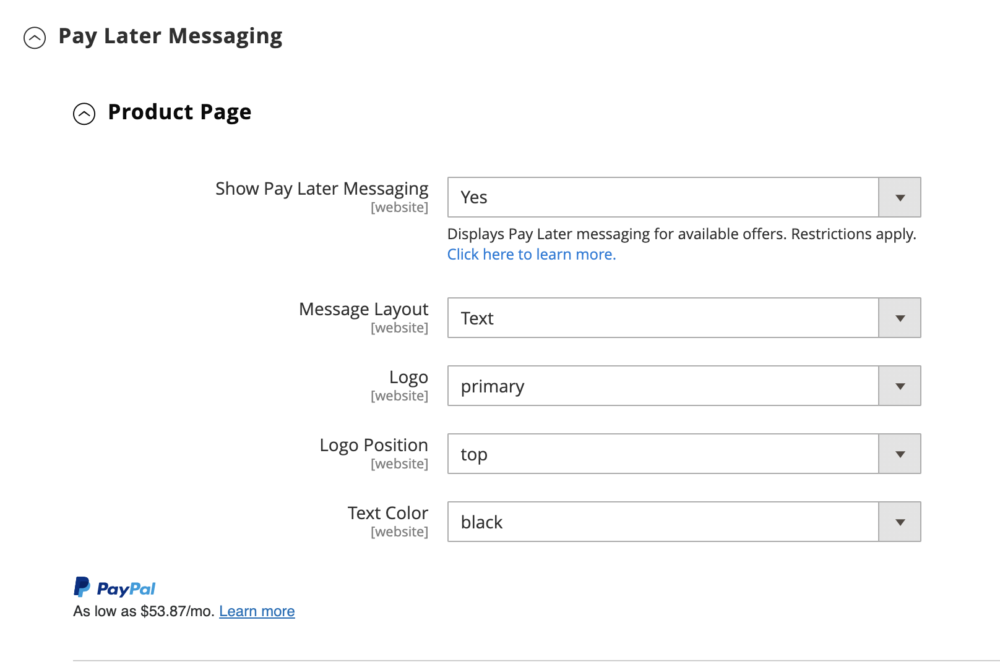
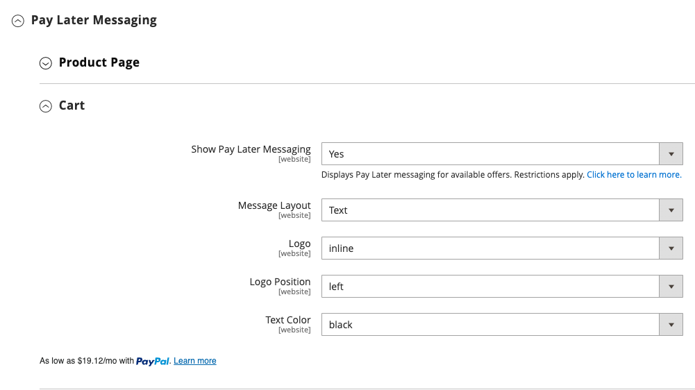

# [!UICONTROL Sales] > [!UICONTROL Payment Methods] > [!UICONTROL Braintree]

>[!IMPORTANT]
>
>**Commerce 2.4 Migration:** 
>For versions of Adobe Commerce and Magento Open Source earlier than 2.4.0, it was recommended that merchants install and configure the official Braintree payment integration extension from the [Commerce Marketplace](https://marketplace.magento.com/catalogsearch/result/?q=braintree) to replace the core integration. As of 2.4.0, the extension is now included in the core release.
>  
>When migrating to Commerce 2.4, merchants need to uninstall the extension distributed on the Marketplace (`paypal/module-braintree` or `gene/module-braintree`) and update any code customizations to use the `PayPal_Braintree` namespace instead of `Magento_Braintree`. Configuration settings from the bundled extension for Commerce and the extension distributed on the Commerce Marketplace are persisted. Payments placed with those versions of the extension are captured, voided, or refunded as normal.
>  
>If you are upgrading to Commerce 2.4.0 and do not use the recommended Commerce Marketplace extension in your previous 2.3.x version, the multi address feature does not work with the 2.4.0 version of Braintree. When a shopper selects _deliver to multiple addresses_ , the Braintree payment method does not appear. The Commerce Marketplace extension previously recommended for 2.3.x has this multiple address issue.

{{config}}

## [!UICONTROL Basic Braintree Settings]

<!-- zoom -->

|Field|[Scope](../../getting-started/websites-stores-views.md#scope-settings)|Description|
|--- |--- |--- |
|[!UICONTROL Title]|Store View|Default value: `Credit Card` (Braintree)|
|[!UICONTROL Environment]|Store View|Options: `Sandbox` / `Production`|
|[!UICONTROL Payment Action]|Store View|Determines the action taken by Braintree when a payment is processed. Options:  **`Authorize`** - Funds on the customer's credit card are authorized, but not transferred from the account. An order is created in your store Admin. You can later capture the sale and create an invoice.  **`Intent Sale`** (previously `Authorize and Capture` in earlier releases) - Funds on the customer's credit card are authorized and captured by Braintree, and an order and invoice are created in your store Admin.|
|[!UICONTROL Sandbox Merchant ID]|Store View|This is the unique identifier for your entire sandbox gateway account. Also known as the _public ID_ or _production ID_, your merchant ID is different for your production and sandbox gateways. This field appears when the _[!UICONTROL Environment]_ field is set to `Sandbox`.|
|[!UICONTROL Sandbox Public Key]|Store View|This is your user-specific, public identifier that restricts access to encrypted data. Each user associated with your Sandbox Braintree gateway has their own sandbox public key. This field appears when the _[!UICONTROL Environment]_ field is set to `Sandbox`.|
|[!UICONTROL Sandbox Private Key]|Store View|This is your user-specific, private identifier that restricts access to encrypted data. Each user associated with your Sandbox Braintree gateway has their own private key for the sandbox. This field appears when the _[!UICONTROL Environment]_ field is set to `Sandbox`.|
|[!UICONTROL Merchant ID]|Store View|This is the unique identifier for your entire gateway account, including the multiple merchant accounts that may be in your gateway. Also known as the _public ID_ or _production ID_, your merchant ID is different for your production and sandbox gateways. This field appears when the _[!UICONTROL Environment]_ field is set to `Production`.|
|[!UICONTROL Public Key]|Store View|This is your user-specific, public identifier that restricts access to encrypted data. Each user associated with your Braintree gateway has their own public key. This field appears when the _[!UICONTROL Environment]_ field is set to `Production`.|
|[!UICONTROL Private Key]|Store View|This is your user-specific, private identifier that restricts access to encrypted data. Each user associated with your Braintree gateway has their own private key. This field appears when the _[!UICONTROL Environment]_ field is set to `Production`.|
|[!UICONTROL Enable Card Payments]|Website|Determines if the Braintree credit card payment method is available to your customers as a payment method. Options: `Yes` / `No`|
|[!UICONTROL Enable Vault for Card Payments]|Website|When enabled, provides secure storage for customer payment information, so customers don't have to re-enter their credit card information for each purchase. Options: `Yes` / `No`|
|[!UICONTROL Enable Vault CVV Reverification]|Website|When enabled, validation is done for the CVV rules setup in your Braintree Account. Options: `Yes` / `No`|

{style="table-layout:auto"}

## [!UICONTROL Advanced Braintree Settings]

{width="550" zoomable="yes"}

|Field|[Scope](../../getting-started/websites-stores-views.md#scope-settings)|Description|
|--- |--- |--- |
|[!UICONTROL Vault Title]|Website|A descriptive title for your reference that identifies the vault where your customer card information is stored.|
|[!UICONTROL Merchant Account ID]|Website|The Merchant Account ID that is to be associated with Braintree transactions from this website. If left blank, the default merchant account from your Braintree account is used.|
|[!UICONTROL Enable Checkout Express Payments]|Website|Provides a faster checkout experience with Express Payment options at the beginning of the checkout process, including PayPal, PayLater, Apple Pay, and Google Pay. Options: `Yes` / `No`|
|[!UICONTROL Skip Fraud Checks on Admin Orders]|Website|Prevents the transaction from being sent for evaluation as part of [!DNL Advanced Fraud Tools] checks, on orders placed through the admin only when it set to `Yes`. Options: `Yes` / `No`|
|[!UICONTROL Bypass Fraud Protection Threshold]|Website|`Advanced Fraud Protection` checks are bypassed when the threshold value is met or exceeded. Leaving this field blank disables this option.|
|[!UICONTROL Debug]|Website|Determines if communications between the Braintree system and your store are recorded in a log file. Options: `Yes` / `No`|
|[!UICONTROL CVV Verification]|Website|Determines if customers are required to provide the three-digit security code from the back of a credit card. Options: `Yes` / `No`|
|[!UICONTROL Send Card Line Items]|Website|Send the cart line items for all the payment methods. Options: `Yes` / `No`|
|[!UICONTROL Credit Card Types]|Website|Specifies each credit card that you accept as payment through  Braintree. Press and hold `Ctrl` (or `Command` on Mac) to select a combination of cards. Options: `American Express` / `Visa` / `MasterCard` / `Discover` / `JCB` / `Diners` / `Maestro International`|
|[!UICONTROL Sort Order]|Website|Determines the order that Braintree is listed with other payment methods during checkout.|

## [!UICONTROL Braintree Webhooks Settings]

<!-- zoom -->

|Field|[Scope](../../getting-started/websites-stores-views.md#scope-settings)|Description|
|--- |--- |--- |
|[!UICONTROL Enable Webhook]|Website|To enable the webhook functionality for fraud protection, ACH payments, local payment methods, and disputes. Options: `Yes` / `No`|
|[!UICONTROL Fraud Protection URL]|Website|Add this URL into your Braintree Account as the [!UICONTROL Webhook Destination URL]. **This URL must be secure and publicly accessible.**|
|[!UICONTROL Fraud Protection Approve Order Status]|Website|When fraud protection is approved by Braintree, the selected order status is assigned to the Commerce order. This status is used to update the status of the order where the ACH payment method is used and when it moves to `SETTLED` in Braintree.|
|[!UICONTROL Fraud Protection Reject Order Status]|Website|When fraud protection is rejected by Braintree, the selected order status is assigned to the Commerce order. This status is used to update the status of the order where the ACH payment method is used and when `SETTLEMENT` is `DECLINED` in Braintree.|

{style="table-layout:auto"}

## [!UICONTROL Country Specific Settings]

<!-- zoom -->

|Field|[Scope](../../getting-started/websites-stores-views.md#scope-settings)|Description|
|--- |--- |--- |
|[!UICONTROL Payment from Applicable Countries]|Website|Determines if you accept payments processed by Braintree from all countries, or only specific countries. Options: `All Allowed Countries` / `Specific Countries`|
|[!UICONTROL Payment from Specific Countries]|Website|If applicable, identifies the specific countries from which you accept payments processed by Braintree.|
|[!UICONTROL Country Specific Credit Card Types]|Website|Identifies the credit cards that are accepted per country for payments processed by Braintree. A record is saved for each country. Options:  **`Country`** - Choose the country.  **`Allowed Card Types`** - Select each credit card that is accepted from the country as payment through Braintree.  **`Add`** - Add a line to allow credit cards for a different country.  **`Action`** - Deletes the record of allowed credit cards  for the country.|

{style="table-layout:auto"}

## [!UICONTROL ACH through Braintree]

<!-- zoom -->

|Field|[Scope](../../getting-started/websites-stores-views.md#scope-settings)|Description|
|--- |--- |--- |
|[!UICONTROL Enabled ACH Direct Debit]|Website|Determines if [!DNL ACH Direct Debit] is included as a payment method through Braintree. Options: `Yes` / `No`|
|[!UICONTROL Enable Vault for ACH Direct Debit]|Website|Customers can vault/store their single-use ACH Direct Debit payment method for future use. Once the payment details are vaulted, the customer can use the ACH Direct Debit payment method without re-entering data or re-authenticating their payment information. Options: `Yes` / `No`|
|[!UICONTROL Sort Order]|Website|Determines the order that [!DNL ACH Direct Debit] is listed with other payment methods during checkout.|

{style="table-layout:auto"}

## [!UICONTROL Apple Pay through Braintree]

<!-- zoom -->

|Field|[Scope](../../getting-started/websites-stores-views.md#scope-settings)|Description|
|--- |--- |--- |
|[!UICONTROL Enable ApplePay through Braintree]|Website|Determines if Apple Pay is included as a payment method through Braintree. Options: `Yes` / `No`    The domain must be [verified in Braintree Account first](https://developer.paypal.com/braintree/docs/guides/apple-pay/configuration/javascript/v3).|
|[!UICONTROL Enable Vault for ApplePay]|Website|Customers can vault/store their Apple Pay payment method for future use. Once the payment details are vaulted, the customer can use Apple Pay without re-entering data or re-authenticating their payment information. Options: `Yes` / `No`|
|[!UICONTROL Payment Action]|Website|Determines the action taken by Braintree when a payment is processed. Options:  **`Authorize`** - Funds on the customer's card are authorized, but not transferred from the customer's account. An order is created in your store Admin. You can later capture the sale and create an invoice.  **`Intent Sale`** - Funds on the customer's card are authorized and captured by Braintree, and an order and invoice are created in your store Admin. **_Note:_** This was `Authorize and Capture` in 2.3.x and earlier releases.|
|[!UICONTROL Merchant Name]|Store View|Label that is displayed to customers in the ApplePay popup.|
|[!UICONTROL Sort Order]|Website|Determines the order that Apple Pay is listed with other payment methods during checkout.|

{style="table-layout:auto"}

## [!UICONTROL Local Payment Methods]

<!-- zoom -->

|Field|[Scope](../../getting-started/websites-stores-views.md#scope-settings)|Description|
|--- |--- |--- |
|[!UICONTROL Enabled Local Payment Methods]|Website|Determines if Local Payment Method is included as a payment method through Braintree. Options: `Yes` / `No`|
|[!UICONTROL Title]|Website|Label that appears on the checkout payment method section. Default value: `Local Payments`|
|[!UICONTROL Fallback Button Text]|Website|Enter the text to use for the button that appears on the fallback Braintree page that takes customers back to the website. Default value: `Complete Checkout`|
|[!UICONTROL Redirect on Fail]|Website|Specifies the URL where customers should be redirected when local payment method transactions are cancelled, fail, or encounter errors. It should be the checkout payment page (for example, `https://www.domain.com/checkout#payment`).|
|[!UICONTROL Allowed Payment Method]|Website|Select the local Payment method to be enabled. Options: `Bancontact` / `EPS` / `iDeal` / `MyBank` / `P24` / `SEPA/ELV Direct Debit`|
|[!UICONTROL Sort Order]|Website|Determines the order that Local Payment Method is listed with other payment methods during checkout.|

{style="table-layout:auto"}

>[!NOTE]
>
>The bundled Braintree extension does not support all the local payment methods listed in the [Braintree developer documentation](https://developer.paypal.com/braintree/docs/guides/local-payment-methods/overview). Other local payment methods are under development to be supported in future releases.

## [!UICONTROL GooglePay through Braintree]

<!-- zoom -->

|Field|[Scope](../../getting-started/websites-stores-views.md#scope-settings)|Description|
|--- |--- |--- |
|[!UICONTROL Enabled GooglePay through Braintree]|Website|Determines if [!DNL Google Pay] payment is included as a payment method through Braintree. Options: `Yes` / `No`|
|[!UICONTROL Enable Vault for GooglePay]|Website|Customers can vault/store their Google Pay payment method for future use. Once the payment details are vaulted, the customer can use Google Pay without re-entering data or re-authenticating their payment information. Options: `Yes` / `No`|
|[!UICONTROL Payment Action]|Website|Determines the action taken by Braintree when a payment is processed. Options:  **`Authorize`** - Funds on the customer's card are authorized, but not transferred from the customer's account. An order is created in your store Admin. You can later capture the sale and create an invoice.  **`Intent Sale`** - Funds on the customer's card are authorized and captured by Braintree, and an order and invoice are created in your store Admin. **_Note:_** This was `Authorize and Capture` in 2.3.x and earlier releases.|
|[!UICONTROL Button Color]|Website|Determines the color of the [!DNL Google Pay] button. Options: `White` / `Black`|
|[!UICONTROL Merchant ID]|Store View|ID provided by Google must be entered here.|
|[!UICONTROL Accepted Cards]|Website|Select the type of cards that a customer can use to place order using [!DNL Google Pay].|
|[!UICONTROL Sort Order]|Website|Determines the order that Google Pay is listed with other payment methods during checkout.|

{style="table-layout:auto"}

## [!UICONTROL Venmo through Braintree]

<!-- zoom -->

|Field|[Scope](../../getting-started/websites-stores-views.md#scope-settings)|Description|
|--- |--- |--- |
|[!UICONTROL Enable Venmo through Braintree]|Website|Determines if [!DNL Venmo] is included as a payment method through Braintree. Options: `Yes` / `No`|
|[!UICONTROL Enable Vault for Venmo]|Website|Customers can vault/store their Venmo payment method for future use. Once the payment details are vaulted, the customer can use the Venmo payment method without re-entering data or re-authenticating their payment information. Options: `Yes` / `No`|
|[!UICONTROL Payment Action]|Website|Determines the action taken by Braintree when a payment is processed. Options:  **`Authorize`** - Funds on the customer's card are authorized, but not transferred from the customer's account. An order is created in your store Admin. You can later capture the sale and create an invoice.  **`Intent Sale`** - Funds on the customer's card are authorized and captured by Braintree, and an order and invoice are created in your store Admin. **_Note:_** This was  _Authorize and Capture_ in 2.3.x and earlier releases.|
|[!UICONTROL Sort Order]|Website|Determines the order that Venmo is listed with other payment methods during checkout.|

{style="table-layout:auto"}

## [!UICONTROL PayPal through Braintree]

{width="550" zoomable="yes"}
{width="550" zoomable="yes"}

|Field|[Scope](../../getting-started/websites-stores-views.md#scope-settings)|Description|
|--- |--- |--- |
|[!UICONTROL Enable PayPal through Braintree]|Website|Determines if PayPal is included as a payment method through Braintree. Options: `Yes` / `No`|
|[!UICONTROL Enable PayPal Credit through Braintree] |Website|Determines if PayPal Credit is included as a payment method through Braintree. Options: `Yes` / `No`. This field gets visible when `Enable PayPal through Braintree` is set to `Yes`|
|[!UICONTROL Enable PayPal PayLater through Braintree] |Website|Determines if PayPal PayLater is included as a payment method through Braintree. Options: `Yes` / `No`. This field gets visible when `Enable PayPal through Braintree` is set to `Yes`|
|[!UICONTROL Title]|Store View|The label that identifies PayPal through Braintree to customers during checkout. Default value: `PayPal`|
|[!UICONTROL Vault Enabled]|Website|When enabled, provides secure storage for customer payment information, so customers don't have to re enter their PayPal information for each purchase. Options: `Yes` / `No`|
|[!UICONTROL Send Cart Line Items for PayPal]|Website|Send the line items (order items) to PayPal along with Gift Cards, Gift Wrapping for items, Gift Wrapping for order, Store Credit, Shipping, and Tax as line items. Options: `Yes` / `No`|
|[!UICONTROL Sort Order]|Website|A number that determines the order in which PayPal through Braintree is listed with other payment methods during checkout.|
|[!UICONTROL Override Merchant Name]|Store View|An alternate name that can be used to identify the merchant for each store view.|
|[!UICONTROL Payment Action]|Website| Determines the action taken by PayPal through Braintree when a payment is processed. Options:  **`Authorize`** - Funds on the customer's card are authorized, but not transferred from the customer's account. An order is created in your store Admin. You can later capture the sale and create an invoice.  **`Authorize and Capture`** - Funds on the customer's card are authorized and captured by PayPal through Braintree, and an order and invoice are created in your store Admin.|
|[!UICONTROL Payment from Applicable Countries]|Website|Determines if you accept payments processed by PayPal through Braintree from all countries, or only specific countries. Options: `All Allowed Countries` / `Specific Countries`|
|[!UICONTROL Payment from Specific Countries]|Website|If applicable, identifies the specific countries from which you accept payments processed by Braintree.|
|[!UICONTROL Require Customer's Billing Address]| Website|Determines if the customer's billing address is required to submit an order. Options: `Yes` / `No`|
|[!UICONTROL Skip Order Review Step]|Website|Determines if customers are to be redirected to the review page before completing payment. Options: `Yes` / `No`|
|[!UICONTROL Debug]|Website|Determines if communications between the PayPal through Braintree system and your store are recorded in a log file. Options: `Yes` / `No`|
|[!UICONTROL Display on Shopping Cart]|Website|Determines if the PayPal button appears in the [mini cart](../../stores-purchase/cart-configuration.md#mini-cart) and on the [shopping cart](../../stores-purchase/cart.md) page. Options: `Yes` / `No`|
|[!UICONTROL Send Package Tracking]|Website|Package tracking information will be sent to PayPal for PayPal transactions/orders only. Please enable the 'Send Cart Line Items for PayPal' configuration field in order for the 'Package Tracking' feature to work correctly. Options: `Yes` / `No`|
|[!UICONTROL Use PayPal's "Notify Payer" functionality]|Website|Once this is set to Yes, Buyer or Payer will be notified by PayPal for package tracking updates. Options: `Yes` / `No`|

{style="table-layout:auto"}

>[!NOTE]
>
>Either **[!DNL PayPal Credit]** or **[!DNL PayPal PayLater]** can be enabled. Both methods cannot be enabled at the same.

### [!UICONTROL Styling]

<!-- zoom -->

|Field|[Scope](../../getting-started/websites-stores-views.md#scope-settings)|Description|
|--- |--- |--- |
|[!UICONTROL Location]|Website|Determines where PayPal buttons and messages are rendered on the storefront. Options: `Mini-Cart and Cart Page` / `Checkout Page` / `Product Page`|

{style="table-layout:auto"}

**[!UICONTROL Mini-Cart and Cart Page]**

The option and settings in this section vary according to the setting in the _[!UICONTROL Location]_ field.

|Field|[Scope](../../getting-started/websites-stores-views.md#scope-settings)|Description|
|--- |--- |--- |
|[!UICONTROL PayPal Button Type]|Website|Sets the button to one of three types: `PayPal Button` / `PayPal Pay Later Button` / `PayPal Credit Button`|

**[!UICONTROL PayPal Button]**

The options and settings in this section vary according to the button type selected in the _[!UICONTROL PayPal Button Type]_ field.

|Field|[Scope](../../getting-started/websites-stores-views.md#scope-settings)|Description|
|--- |--- |--- |
|[!UICONTROL Show PayPal Button]|Website|Determines the location of the PayPal button on the selected location. Options: `Yes` / `No`|
|[!UICONTROL Button Label]|Website|Determines the label for the PayPal button. Options: `Paypal` / `Checkout` / `Buy Now` / `Pay`|
|[!UICONTROL Color]|Website|Determines the color of the PayPal button. Options: `Blue` / `Black` / `Gold` / `Silver`|
|[!UICONTROL Shape]|Website|Determines the shape of the PayPal button. Options: `Pill` / `Rectangle`|
|[!UICONTROL Size(Deprecated)]|Website|Determines the size of the PayPal button. Options: `Medium` / `Large` / `Responsive`|

{style="table-layout:auto"}

>[!NOTE]
>
>The **[!DNL Size(Deprecated)]** configuration field is deprecated and not being used to style the PayPal buttons.

When these options are set, you can see the preview of the PayPal buttons and PayLater messages. There are controls that you can use to apply the settings or reset the values:

|Field|[Scope](../../getting-started/websites-stores-views.md#scope-settings)|Description|
|--- |--- |--- |
|[!UICONTROL Apply]|Website|Stores the selected styling settings for buttons and PayLater messaging and applies them to the current location and current button type.|
|[!UICONTROL Apply to All Buttons]|Website|Stores the selected styling settings for buttons and PayLater messaging values and applies them to all button types and locations.|
|[!UICONTROL Reset to Recommended Defaults]|Website|Returns the styling settings to the recommended default values for buttons and PayLater messaging and applies them to all button types and locations.|

{style="table-layout:auto"}

## [!UICONTROL Pay Later Messaging]

**[!UICONTROL Product Page]**

<!-- zoom -->

|Field|[Scope](../../getting-started/websites-stores-views.md#scope-settings)| Description                                                                                                                                                                                                                              |
|--- |--- |------------------------------------------------------------------------------------------------------------------------------------------------------------------------------------------------------------------------------------------|
|[!UICONTROL Show PayLater Messaging]|Website| Enables PayLater messaging at the selected location. Options: `Yes` / `No`. Displays Pay Later messaging for available offers. Restrictions apply. [Click here to learn more.](https://developer.paypal.com/studio/checkout/pay-later/us)|
|[!UICONTROL Message Layout]|Website| Determines the PayLater message layout. Options: `Text` / `Flex`                                                                                                                                                                         |
|[!UICONTROL Logo]|Website| Determines the logo type used for the Pay Later message. Options: `Inline` / `Primary` / `Alternative` / `None`                                                                                                                              |
|[!UICONTROL Logo Position]|Website| Determines the logo position for the Pay Later message. Options: `Left` / `Right` / `Top`                                                                                                                                                    |
|[!UICONTROL Text Color]|Website| Determines the text color of the Pay Later message. Options: `Black` / `White` / `Monochrome` / `Grayscale`                                                                                                                                  |

{style="table-layout:auto"}

**[!UICONTROL Cart]**

<!-- zoom -->

|Field|[Scope](../../getting-started/websites-stores-views.md#scope-settings)| Description                                                                                                                                                                                                                              |
|--- |--- |------------------------------------------------------------------------------------------------------------------------------------------------------------------------------------------------------------------------------------------|
|[!UICONTROL Show PayLater Messaging]|Website| Enables PayLater messaging at the selected location. Options: `Yes` / `No`. Displays Pay Later messaging for available offers. Restrictions apply. [Click here to learn more.](https://developer.paypal.com/studio/checkout/pay-later/us)|
|[!UICONTROL Message Layout]|Website| Determines the PayLater message layout. Options: `Text` / `Flex`                                                                                                                                                                         |
|[!UICONTROL Logo]|Website| Determines the logo type used for the Pay Later message.. Options: `Inline` / `Primary` / `Alternative` / `None`                                                                                                                             |
|[!UICONTROL Logo Position]|Website| Determines the logo position for the Pay Later message. Options: `Left` / `Right` / `Top`                                                                                                                                                    |
|[!UICONTROL Text Color]|Website| Determines the text color of the Pay Later message. Options: `Black` / `White` / `Monochrome` / `Grayscale`                                                                                                                                  |

{style="table-layout:auto"}

**[!UICONTROL Checkout]**

<!-- zoom -->

| Field                                |[Scope](../../getting-started/websites-stores-views.md#scope-settings)| Description                                                                                                                                                                                                                               |
|--------------------------------------|--- |-------------------------------------------------------------------------------------------------------------------------------------------------------------------------------------------------------------------------------------------|
| [!UICONTROL Show PayLater Messaging] |Website| Enables PayLater messaging at the selected location. Options: `Yes` / `No`. Displays Pay Later messaging for available offers. Restrictions apply. [Click here to learn more.](https://developer.paypal.com/studio/checkout/pay-later/us) |
| [!UICONTROL Text Align] |Website| Determines the PayLater message layout. Options: `Left` / `Center` / `Right`                                                                                                                                                              |
| [!UICONTROL Text Color] |Website| Determines the text color of the Pay Later message. Options: `Black` / `White`                                                                                                                                                            |

{style="table-layout:auto"}

## 3d Secure Verification Settings

<!-- zoom -->

|Field|[Scope](../../getting-started/websites-stores-views.md#scope-settings)|Description|
|--- |--- |--- |
|[!UICONTROL 3D Secure Verification]|Website|Determines if a transaction must pass an extra verification process when the customer is enrolled in a program such as _Verified by VISA_. Options: `Yes` / `No`|
|[!UICONTROL Always request 3DS]|Website|Challenge the 3D Secure request always for all the transactions. Options: `Yes` / `No`|
|[!UICONTROL Threshold Amount]|Website|Determines the maximum order amount that is authorized for processing on a single order. Braintree declines authorization if the order amount exceeds this threshold amount.|
|[!UICONTROL Verify for Applicable Countries]|Website|Determines the countries where payment must be verified. Options: `All Allowed Countries` / `Specific Countries`|
|[!UICONTROL Verify for Specific Countries]|Website|If applicable, identifies the specific countries from which payment by Braintree must be verified.|

{style="table-layout:auto"}

## [!UICONTROL Dynamic Descriptors]

<!-- zoom -->

|Field|[Scope](../../getting-started/websites-stores-views.md#scope-settings)|Description|
|--- |--- |--- |
|[!UICONTROL Name]|Store View|There are two parts to the Name descriptor, which are separated by an asterisk (*). The first part of the descriptor identifies the company or DBA and the second part identifies the product. For example: `company*myproduct`    The length of the Company and Product parts of the descriptor can be allocated in the following ways, for a combined length of up to 22 characters:  **`Option 1`** - Company must be three characters / Product can be up to 18 characters  **`Option 2`** - Company must be seven characters / Product can be up to 14 characters  **`Option 3`** - Company must be 12 characters / Product can be up to nine characters|
|[!UICONTROL Phone]|Store View|The Phone descriptor must be ten to 14 characters in length, and can include only numbers, dashes, parentheses, and periods. For example: `9999999999` `(999) 999-9999` `999.999.9999`|
|[!UICONTROL URL]|Store View|The URL descriptor represents your domain name, and can be up to 13 characters long. For example: `company.com`|

{style="table-layout:auto"}
