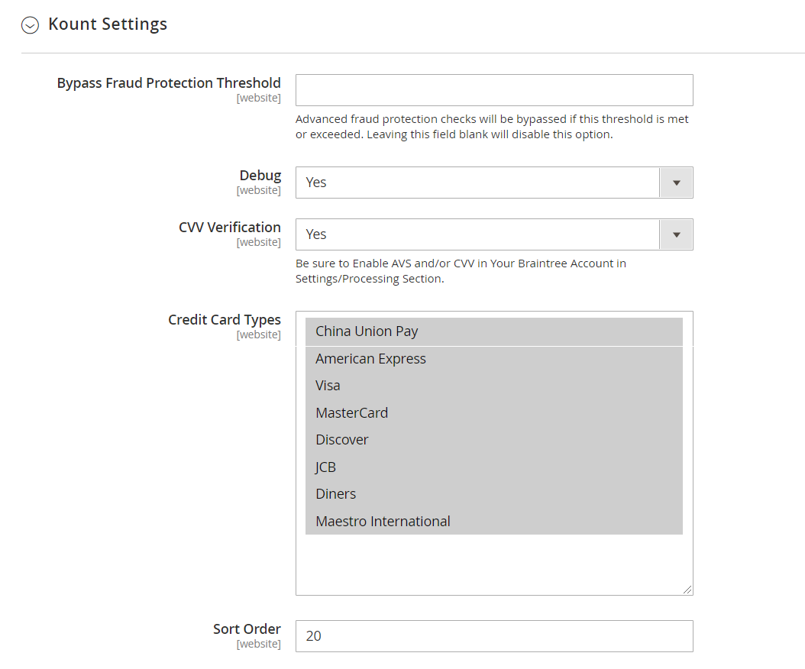
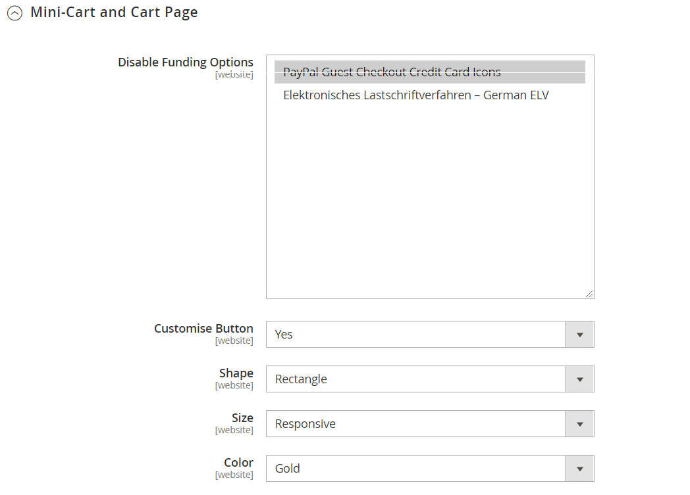
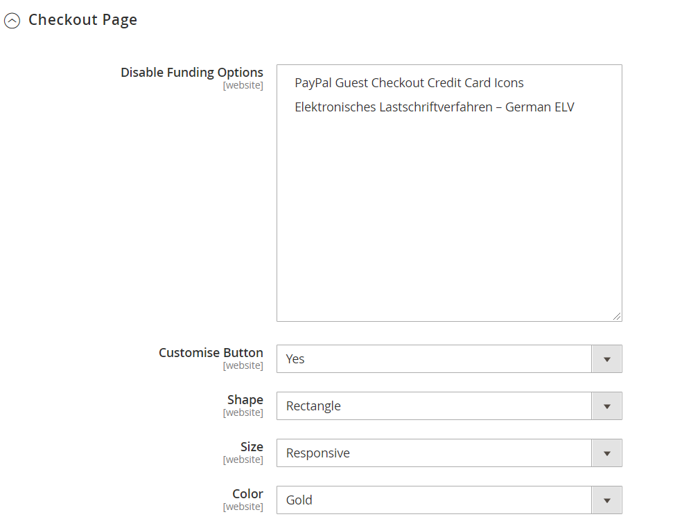
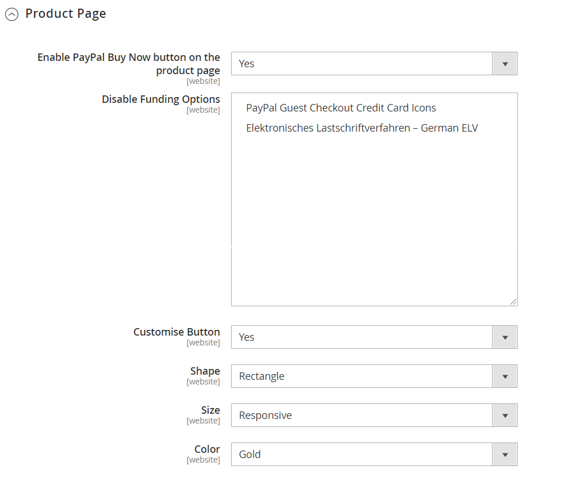

# Sales > Payment Methods > Braintree

>[!IMPORTANT]
>
>**Commerce 2.4 Migration:** 
For versions of Adobe Commerce and Magento Open Source earlier than 2.4.0, it was recommended that merchants install and configure the official Braintree payment integration extension from the [Commerce Marketplace](https://marketplace.magento.com/catalogsearch/result/?q=braintree) to replace the core integration. As of 2.4.0, the extension is now included in the core release.  
When migrating to Commerce 2.4, merchants need to uninstall the extension distributed on the Marketplace (`paypal/module-braintree` or `gene/module-braintree`) and update any code customizations to use the `PayPal_Braintree` namespace instead of `Magento_Braintree`. Configuration settings from the Braintree Payments bundled extension for Commerce and the extension distributed on the Commerce Marketplace are persisted and payments placed with those versions of the extension are captured, voided, or refunded as normal.  
If you are upgrading to Commerce 2.4.0 and were not using the recommended Commerce Marketplace extension in your previous 2.3.x version, the multi address feature does not work with the 2.4.0 version of Braintree. When a shopper selects _deliver to multiple addresses_ , the Braintree payment method does not appear. The Commerce Marketplace Extension previously recommended for 2.3.x has this multiple address issue.

{{config}}

## Basic Braintree Settings

<!-- zoom -->

|Field|[Scope](../../getting-started/websites-stores-views.md#scope-settings)|Description|
|--- |--- |--- |
|Title|Store View|Default value: Credit Card (Braintree)|
|Environment|Store View|Options: Sandbox / Production|
|Payment Action|Store View|Determines the action taken by Braintree when a payment is processed. Options:  **Authorize** - Funds on the customer's credit card are authorized, but not transferred from the account. An order is created in your store Admin. You can later capture the sale and create an invoice.  **Intent Sale** (previously "Authorize and Capture" in earlier releases) - Funds on the customer's credit card are authorized and captured by Braintree, and an order and invoice are created in your store Admin.|
|Merchant ID|Website|This is the unique identifier for your entire gateway account, including the multiple merchant accounts that may be in your gateway. As known as the _public ID_ or _production ID_, your merchant ID is different for your production and sandbox gateways.|
|Public Key|Store View|This is your user-specific, public identifier that restricts access to encrypted data. Each user associated with your Braintree gateway has their own public key.|
|Private Key|Store View|This is your user-specific, private identifier that restricts access to encrypted data. Each user associated with your Braintree gateway has their own private key.|
|Enable this Solution|Website|Determines if Braintree is available to your customers as a payment method. Options: Yes / No|
|Enable PayPal through Braintree|Website|Determines if PayPal is included as a payment method through Braintree. Options: Yes / No|
|Enable PayPal Credit through Braintree|Website|Determines if PayPal Credit is included as a payment method through Braintree. Options: Yes / No|
|Enable Vault for Card Payments|Website|When enabled, provides secure storage for customer payment information, so customers don't have to reenter their credit card information for each purchase. Options: Yes / No.|
|Enable Vault CVV Re-verification|Website|When enabled, validation is done for the CVV rules setup in your Braintree Account. Options: Yes / No.|

## Advanced Braintree Settings

<!-- zoom -->

|Field|[Scope](../../getting-started/websites-stores-views.md#scope-settings)|Description|
|--- |--- |--- |
|Vault Title|Website|A descriptive title for your reference that identifies the vault where your customer card information is stored.|
|Merchant Account ID|Website|The Merchant ID that is to be associated with Braintree transactions from this website. If left blank, the default merchant account from your Braintree account is used.|
|Advanced Fraud Protection|Website|Determines if Braintree's Advanced Fraud Protection is applied to transactions. Options: Yes / No |
|Debug|Website|Determines if communications between the Braintree system and your store are recorded in a log file. Options: Yes / No|
|CVV Verification|Website|Determines if customers are required to provide the three-digit security code from the back of a credit card. Options: Yes / No|
|Credit Card Types|Website|Specifies each credit card that you accept as payment through  Braintree. Press and hold `Ctrl` (or `Command` on Mac) to select a combination of cards. Options: American Express / Visa / MasterCard / Discover / JCB / Diners / Maestro International|
|Sort Order|Website|Determines the order that Braintree is listed with other payment methods during checkout.|

### Kount

<!-- zoom -->

|Field|[Scope](../../getting-started/websites-stores-views.md#scope-settings)|Description|
|--- |--- |--- |
|Kount Configuration| | When the _Advanced Fraud Protection_ option is enabled, Kount configuration option appears.|
|Bypass Fraud Protection Threshold|Website|Advanced fraud protection checks are bypassed if this threshold is met or exceeded. Leaving this field blank disables this option.|
|ENS URL|Website|This is your unique URL that you need to add into your website in the [Kount AWC control panel](https://developer.paypal.com/braintree/articles/guides/fraud-tools/advanced/overview). This URL must be publicly accessible for the ENS to function correctly. You must add this ENS URL to the 'OPT-IN' website.|
|Merchant ID|Website|Kount ID must be entered here to integrate with the fraud protection platform. If necessary, contact Braintree to set up your [Kount](https://kount.com/) account. |
|Skip Fraud Checks on Admin Orders|Website|If enabled, orders placed through the Admin are prevented from being sent to Kount for evaluation. Options: Yes / No|
|ENS Allowed IPs|Website|The IPs that have access to the ENS endpoint must be entered here.|

## Country Specific Settings

<!-- zoom -->

|Field|[Scope](../../getting-started/websites-stores-views.md#scope-settings)|Description|
|--- |--- |--- |
|Payment from Applicable Countries|Website|Determines if you accept payments processed by Braintree from all countries, or only specific countries. Options: All Allowed Countries / Specific Countries|
|Payment from Specific Countries|Website|If applicable, identifies the specific countries from which you accept payments processed by Braintree.|
|Country Specific Credit Card Types|Website|Identifies the credit cards that are accepted per country for payments processed by Braintree. A record is saved for each country. Options:  **Country** - Choose the country.  **Allowed Card Types** - Select each credit card that is accepted from the country as payment through Braintree.  **Add** - Add a line to allow credit cards for a different country.  **Action** - Deletes the record of allowed credit cards  for the country.|

## ACH through Braintree

<!-- zoom -->

|Field|[Scope](../../getting-started/websites-stores-views.md#scope-settings)|Description|
|--- |--- |--- |
|Enabled ACH Direct Debit|Website|Determines if PayPal is included as a payment method through Braintree. Options: Yes / No|

## Apple Pay through Braintree

<!-- zoom -->

|Field|[Scope](../../getting-started/websites-stores-views.md#scope-settings)|Description|
|--- |--- |--- |
|Enabled ApplePay through Braintree|Website|Determines if ApplePay is included as a payment method through Braintree. Options: Yes / No    The Domain must be [verified in Braintree Account first](https://developer.paypal.com/braintree/docs/guides/apple-pay/configuration/javascript/v3).|
|Payment Action|Website|Determines the action taken by Braintree when a payment is processed. Options:  **Authorize** - Funds on the customer's card are authorized, but not transferred from the customer's account. An order is created in your store Admin. You can later capture the sale and create an invoice.  **Intent Sale** - Funds on the customer's card are authorized and captured by Braintree, and an order and invoice are created in your store Admin. **_Note:_** This was  _Authorize and Capture_ in 2.3.x and earlier releases.|
|Merchant Name|Store View|Label that is displayed to customers in the Apple Pay popup.|

## Local Payment Methods

<!-- zoom -->

|Field|[Scope](../../getting-started/websites-stores-views.md#scope-settings)|Description|
|--- |--- |--- |
|Enabled Local Payment Methods|Website|Determines if Local Payment Method is included as a payment method through Braintree. Options: Yes / No|
|Title|Website|Label that appears on the checkout Payment Method section. Default value: Local|
|Allowed Payment Method|Website|Select the local Payment method that needs to be enabled. Options: `Bancontact` / `EPS` / `giropay` / `iDeal` / `Klarna Pay Now` / `SOFORT` / `MyBank` / `P24` / `SEPA/ELV Direct Debit`|

## GooglePay through Braintree

<!-- zoom -->

|Field|[Scope](../../getting-started/websites-stores-views.md#scope-settings)|Description|
|--- |--- |--- |
|Enabled GooglePay through Braintree|Website|Determines if Google Pay payment is included as a payment method through Braintree. Options: Yes / No|
|Payment Action|Website|Determines the action taken by Braintree when a payment is processed. Options:  **Authorize** - Funds on the customer's card are authorized, but not transferred from the customer's account. An order is created in your store Admin. You can later capture the sale and create an invoice.  **Intent Sale** - Funds on the customer's card are authorized and captured by Braintree, and an order and invoice are created in your store Admin. **_Note:_** This was  _Authorize and Capture_ in 2.3.x and earlier releases.|
|Button Color|Website|Determines the color of the Google Pay button. Options: White / Black|
|Merchant ID|Store View|ID provided by Google must be entered here.|
|Accepted Cards|Website|Select the type of cards that a customer can use to place order using Google Pay.|

## Venmo through Braintree

<!-- zoom -->

|Field|[Scope](../../getting-started/websites-stores-views.md#scope-settings)|Description|
|--- |--- |--- |
|Enabled Venmo through Braintree|Website|Determines if Venmo is included as a payment method through Braintree. Options: Yes / No|
|Payment Action|Website|Determines the action taken by Braintree when a payment is processed. Options:  **Authorize** - Funds on the customer's card are authorized, but not transferred from the customer's account. An order is created in your store Admin. You can later capture the sale and create an invoice.  **Intent Sale** - Funds on the customer's card are authorized and captured by Braintree, and an order and invoice are created in your store Admin. **_Note:_** This was  _Authorize and Capture_ in 2.3.x and earlier releases.|

## PayPal through Braintree

<!-- zoom -->

|Field|[Scope](../../getting-started/websites-stores-views.md#scope-settings)|Description|
|--- |--- |--- |
|Title|Store View|The label that identifies PayPal through Braintree to customers during checkout. Default value: PayPal (Braintree)|
|Vault Enabled|Website|When enabled, provides secure storage for customer payment information, so customers don't have to re enter their PayPal information for each purchase. Options: Yes / No.|
|Sort Order|Website|A number that determines the order in which PayPal through Braintree is listed with other payment methods during checkout.|
|Override Merchant Name|Store View|An alternate name that can be used to identify the merchant for each store view.|
|Payment Action|Website|Determines the action taken by PayPal through Braintree when a payment is processed. Options:  **Authorize** - Funds on the customer's card are authorized, but not transferred from the customer's account. An order is created in your store Admin. You can later capture the sale and create an invoice.  **Authorize and Capture** - Funds on the customer's card are authorized and captured by PayPal through Braintree, and an order and invoice are created in your store Admin.|
|Payment from Applicable Countries|Website|Determines if you accept payments processed by PayPal through Braintree from all countries, or only specific countries. Options: All Allowed Countries, Specific Countries|
|Payment from Specific Countries|Website|If applicable, identifies the specific countries from which you accept payments processed by Braintree.|
|Require Customer's Billing Address|Website|Determines if the customer's billing address is required to submit an order. Options: Yes / No|
|Debug|Website|Determines if communications between the PayPal through Braintree system and your store are recorded in a log file. Options: Yes / No|
|Display on Shopping Cart|Website|Determines if the PayPal button appears in the [mini cart](https://docs.magento.com/user-guide/sales/mini-cart.html) and on the [shopping cart](https://docs.magento.com/user-guide/sales/cart.html) page. Options: Yes / No|

### Mini-Cart and Cart Page

<!-- zoom -->

|Field|[Scope](../../getting-started/websites-stores-views.md#scope-settings)|Description|
|--- |--- |--- |
|Disable Funding Option|Website|Disable certain funding options available on the PayPal Smart Button from displaying in this section.|
|Customise Button|Website|If enabled, an option to customize the shape and color of the PayPal button is available. Options: `Yes` / `No`|
|Shape|Website|Determines the shape of the PayPal button. Options: Pill / Rectangle|
|Size|Website|Determines the size of the PayPal button. Options: Medium / Large / Responsive|
|Color|Website|Determines the color of the PayPal button. Options: Blue / Black / Gold / Silver|

### Checkout Page

<!-- zoom -->

|Field|[Scope](../../getting-started/websites-stores-views.md#scope-settings)|Description|
|--- |--- |--- |
|Disable Funding Option|Website|Disable certain funding options available on the PayPal Smart Button from displaying in this section.|
|Customise Button|Website|If enabled, an option to customize the shape and color of the PayPal button is available. Options: Yes / No|
|Shape|Website|Determines the shape of the PayPal button. Options: Pill / Rectangle|
|Size|Website|Determines the size of the PayPal button. Options: Medium / Large / Responsive|
|Color|Website|Determines the color of the PayPal button. Options: Blue / Black / Gold / Silver|

### Product Page

<!-- zoom -->

|Field|[Scope](../../getting-started/websites-stores-views.md#scope-settings)|Description|
|--- |--- |--- |
|Enable PayPal Buy Now button on the product page|Website|If enabled, the PayPal button is available on the Product detail page. Options: Yes / No|
|Disable Funding Option|Website|Disable certain funding options available on the PayPal Smart Button from displaying in this section.|
|Customise Button|Website|If enabled, an option to customize the shape and color of the PayPal button is available. Options: Yes / No|
|Shape|Website|Determines the shape of the PayPal button. Options: Pill / Rectangle|
|Size|Website|Determines the size of the PayPal button. Options: Medium / Large / Responsive|
|Color|Website|Determines the color of the PayPal button. Options: Blue / Black / Gold / Silver|

## 3d Secure Verification Settings

<!-- zoom -->

|Field|[Scope](../../getting-started/websites-stores-views.md#scope-settings)|Description|
|--- |--- |--- |
|3D Secure Verification|Website|Determines if a transaction must pass an extra verification process when the customer is enrolled in a program such as "Verified by VISA". Options: Yes / No|
|Threshold Amount|Website|Determines the maximum order amount that is authorized for processing on a single order. Braintree declines authorization if the order amount exceeds the Threshold Amount.|
|Verify for Applicable Countries|Website|Determines the countries where payment must be verified. Options: All Allowed Countries / Specific Countries|
|Verify for Specific Countries|Website|If applicable, identifies the specific countries from which payment by Braintree must be verified.|

## Dynamic Descriptors

<!-- zoom -->

|Field|[Scope](../../getting-started/websites-stores-views.md#scope-settings)|Description|
|--- |--- |
|Name|Store View|There are two parts to the Name descriptor, which are separated by an asterisk (*). The first part of the descriptor identifies the company or DBA and the second part identifies the product. For example: `company*myproduct`    The length of the Company and Product parts of the descriptor can be allocated in the following ways, for a combined length of up to 22 characters:  **Option 1** - Company must be three characters / Product can be up to 18 characters  **Option 2** - Company must be seven characters / Product can be up to 14 characters  **Option 3** - Company must be 12 characters / Product can be up to nine characters|
|Phone|Store View|The Phone descriptor must be ten to 14 characters in length, and can include only numbers, dashes, parentheses, and periods. For example: `9999999999` `(999) 999-9999` `999.999.9999`|
|URL|Store View|The URL descriptor represents your domain name, and can be up to 13 characters long. For example: `company.com`|
