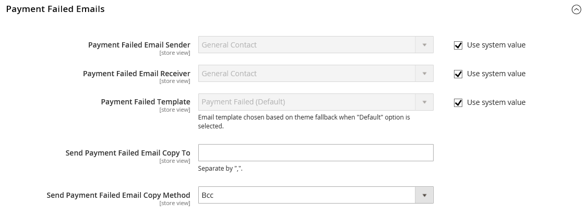

# [!UICONTROL Sales] > [!UICONTROL Checkout]

{{config}}

## [!UICONTROL Checkout Options]

<!-- zoom -->

<!--[Checkout Options](https://experienceleague.adobe.com/en/docs/commerce-admin/stores-sales/point-of-purchase/checkout/checkout-process#checkout-options) -->

| Field                                                            |[Scope](../../getting-started/websites-stores-views.md#scope-settings)| Description                                                                                                                                                                                                                                                                                                                                                                                                                                                          |
|------------------------------------------------------------------|--- |----------------------------------------------------------------------------------------------------------------------------------------------------------------------------------------------------------------------------------------------------------------------------------------------------------------------------------------------------------------------------------------------------------------------------------------------------------------------|
| [!UICONTROL Enable Guest Checkout Login]                         |Store View| Enable this setting to allow unauthenticated users (storefront and APIs) to query if an e-mail address is already associated with a customer account. This can be used to enhance the checkout workflow for guests by displaying a sign-in prompt if the entered email address already registered to a customer account, but comes at the cost of exposing information to unauthenticated users.  Options: `Yes` / `No`  |
| [!UICONTROL Enable Onepage Checkout]                             |Store View| Determines if [One-page checkout](../../stores-purchase/checkout-process.md#checkout-options) is the default checkout format. Options: `Yes` / `No`                                                                                                                                                                                                                                                                                                                  |
| [!UICONTROL Allow Guest Checkout]                                |Store View| Determines if guests can go through [checkout without registering](../../stores-purchase/checkout-guest.md) for an account with your store. Options: `Yes` / `No`                                                                                                                                                                                                                                                                                                    |
| [!UICONTROL Enable Terms and Conditions]                         |Store View| Determines if customers are required to agree to the [Terms and Conditions](../../stores-purchase/terms-and-conditions.md) of the sale before making a purchase. Options: `Yes` / `No`                                                                                                                                                                                                                                                                               |
| [!UICONTROL Display Billing Address On]                          |Store View| Determines the location of the Billing Address during checkout. Options: `Payment Method` / `Payment Page`                                                                                                                                                                                                                                                                                                                                                           |
| [!UICONTROL Maximum Number of Items to Display in Order Summary] |Store View| Determines the maximum number of items that can  appear in the _Order Summary_ during checkout. The default is `10`.                                                                                                                                                                                                                                                                                                                                                 |
| [!UICONTROL Enable Address Search]                               |Website|  (Adobe Commerce only) Determines if customers can use [address search](../../stores-purchase/checkout-address-search.md) functionality for Shipping, and Review & Payments steps. When this is enabled, use Number of Customer Addresses Limit to set the number of saved addresses required to activate this functionality during checkout. Options: `Yes` / `No`                                                    |
| Number of Customer Addresses Limit                               |Website|  (Adobe Commerce only) When address search is enabled, determines the number of saved addresses required to activate this functionality during checkout. When the customer's number of saved addresses meets or exceeds this number, only the default address is rendered on the _Shipping_ and _Review & Payments_ steps. The customer can use a search function to change the selected address. The default is `10`. |

{style="table-layout:auto"}

## [!UICONTROL Shopping Cart]

<!-- zoom -->

<!--[Shopping Cart](https://experienceleague.adobe.com/en/docs/commerce-admin/stores-sales/point-of-purchase/cart/cart-configuration) -->

|Field|[Scope](../../getting-started/websites-stores-views.md#scope-settings)|Description|
|--- |--- |--- |
|[!UICONTROL Quote Lifetime (days)]|Website|Determines the [lifetime of a quoted price](../../stores-purchase/cart-configuration.md#quote-lifetime), in days.|
|[!UICONTROL After Adding a Product Redirect to Shopping Cart]|Store View|Determines if the [shopping cart page appears](../../stores-purchase/cart-configuration.md#redirect-to-cart) immediately after a product is added to the cart. Options: `Yes` / `No`|
|[!UICONTROL Number of Items to Display Pager]|Store View|Determines the number of items in the shopping cart before the pager is triggered. Default value: `20`|
|[!UICONTROL Show Cross-sell Items in the Shopping Cart]|Store View|Indicates if [cross-sell items](../../catalog/related-products-up-sells-cross-sells.md#cross-sells) are displayed in the shopping cart, providing additional sale options to customers. Options: `Yes` (default) / `No`|
|[!UICONTROL Grouped Product Image]|Store View|Determines the [thumbnail](../../stores-purchase/cart-configuration.md#cart-thumbnails) image that appears for a [grouped product](../../catalog/product-create-grouped.md) in the shopping cart. Options: `Product Thumbnail Itself` / `Parent Product Thumbnail`|
|[!UICONTROL Configurable Product Image]|Store View|Determines the [thumbnail](../../stores-purchase/cart-configuration.md#cart-thumbnails) image that appears for a configurable product in the shopping cart. Options: `Product Thumbnail Itself` / `Parent Product Thumbnail`|
|[!UICONTROL Preview Quote Lifetime (minutes)]|Store View|Determines the maximum age of the quote in minutes when previewed from the shopping cart.|
|[!UICONTROL Enable Clear Shopping Cart]|Website|Determines if the shopping cart displays the option for users to clear the contents of the cart in a single action. Options: `Yes` / `No`|

{style="table-layout:auto"}

## [!UICONTROL My Cart Link]

<!-- zoom -->

<!-- [*My Cart Link*](https://experienceleague.adobe.com/en/docs/commerce-admin/stores-sales/point-of-purchase/cart/cart-configuration#mini-cart) -->

|Field|[Scope](../../getting-started/websites-stores-views.md#scope-settings)|Description|
|--- |--- |--- |
|[!UICONTROL Display Cart Summary]|Website|Determines the value that appears in parentheses after the My Cart link. Options: `Display number of items in cart` / `Display item quantities`|

{style="table-layout:auto"}

## Mini Cart

<!-- zoom -->

<!-- [*Mini Cart*](https://experienceleague.adobe.com/en/docs/commerce-admin/stores-sales/point-of-purchase/cart/cart-configuration#mini-cart) -->

|Field|[Scope](../../getting-started/websites-stores-views.md#scope-settings)|Description|
|--- |--- |--- |
|[!UICONTROL Display Mini Cart]|Store View|Determines if the mini cart appears on store pages when the cart icon in the header is clicked. The display of the mini cart depends upon the theme. Options: `Yes` / `No`|
|[!UICONTROL Number of Items to Display Scrollbar]|Store View|Determines the number of items that can appear in the mini cart before the scrollbar is triggered. Default: `5`|
|[!UICONTROL Maximum Number of Items to Display]|Store View|Determines the maximum number of items that can appear in the mini cart. Default: `10`|

{style="table-layout:auto"}

## [!UICONTROL Payment Failed Emails]

<!-- zoom -->

<!-- [*Payment Failed Emails*](https://experienceleague.adobe.com/en/docs/commerce-admin/stores-sales/point-of-purchase/checkout/checkout-payment-failed-emails) -->

|Field|[Scope](../../getting-started/websites-stores-views.md#scope-settings)|Description|
|--- |--- |--- |
|[!UICONTROL Payment Failed Email Receiver]|Store View|Identifies the store contact who receives Payment Failed emails. Default receiver: `General Contact`|
|[!UICONTROL Payment Failed Email Sender]|Store View|Identifies the store contact that appears as the message sender of Payment Failed emails. Default sender: `General Contact`|
|[!UICONTROL Payment Failed Template]|Store View|Identifies the template that is used for Payment Failed emails. Default template: `Payment Failed`|
|[!UICONTROL Send Payment Failed Copy To]|Store View|Provides the email address of anyone to receive a copy of a Payment Failed email. Separate multiple addresses with a comma.|
|[!UICONTROL Send Payment Failed Copy Method]|Store View|Indicates the email method used to send the copy. Options:  **`Bcc`** - Sends a blind courtesy copy by including the recipient in the header of the same email that is sent to the customer. The BCC recipient is not visible to the customer.  **`Separate Email`** - Sends the copy as a separate email.|

{style="table-layout:auto"}
